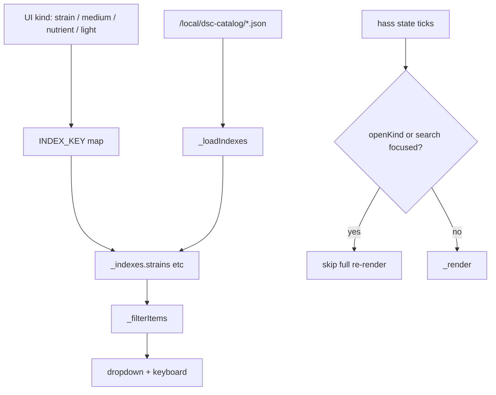

# Build a Plant — typeahead + encoding fix (`afda0ac`)

Operator / developer runbook for the search UX fix on master
`afda0ac` (2026-08-07): plural index-key map, ASCII labels, predictive
dropdowns with keyboard nav, and hass-update focus hold.

Complements the composition surface ops in open docs PR **#39**
([`LIVE-UI-BUILD-A-PLANT.md`](https://github.com/weddas/DSC-HUB/blob/cursor/engineering-documentation-d184/docs/qa/LIVE-UI-BUILD-A-PLANT.md)).
Prefer this page when catalogs are present but search still looks dead, or
when labels show mojibake (`·`, `—`, etc.).

| Surface | Role |
|---|---|
| Card SoT | `homeassistant/www/dsc-build-plant-card.js` |
| Indexes | `/local/dsc-catalog/dsc_*_search_index.json` (`kind` = plural) |
| Builder | `scripts/build_catalog_search_indexes.py` |
| Dashboard YAML | `homeassistant/dashboards/dsc-build-plant-dashboard.yaml` |
| Bundle | last segment of `DSC-HUB.js` / `dsc-system-map-card.js` (~941 KB) |

## Intent

Make catalog typeahead **usable** on `/dsc-build-plant/build` without
inventing climate/PPFD data. UI search kinds stay singular (`strain`);
catalog JSON keys stay plural (`strains`). User-visible strings stay
ASCII so HA resource / filesystem encoding cannot garble labels.



## Root causes (verified)

### 1. Singular kind vs plural index key

Ship (`09fac80`) stored indexes under plural keys but looked them up with
the singular UI kind:

| UI kind | Catalog / `_indexes` key | Pre-fix lookup |
|---|---|---|
| `strain` | `strains` | `_indexes["strain"]` → always `[]` |
| `medium` | `mediums` | empty |
| `nutrient` | `nutrients` | empty |
| `light` | `lights` | empty |

**Symptom:** Network tab shows `200` for `/local/dsc-catalog/*.json`,
catalog chip may report loaded items, typing ≥2 chars still returns **no
hits**. Easy to mis-diagnose as “indexes missing” (that pitfall remains
real — see triage below).

**Fix:** `INDEX_KEY` + `_indexFor(kind)` in `dsc-build-plant-card.js`.

### 2. Mojibake in card / dashboard strings

Fancy Unicode in Lit template / dashboard subtitle (`·` `—` `…` `≠` `°`
`µ`) arrived as mojibake under some HA/www encodings.

**Fix:** ASCII-only user-visible strings (`/` separators, `!=`, `C`,
`umol`). Header comment documents the rule.

### 3. Hass re-render wiped open search

`set hass` called `_render()` on every state tick, destroying focus and
the open dropdown while typing.

**Fix:** skip full render when `_openKind` is set or a search input is
focused; restore caret via `_focusRestore` after intentional paints.

## Behavior after `afda0ac`

| Feature | Contract |
|---|---|
| Index fetch | `cache: "no-cache"`; errors collected on `_indexStatus` |
| Catalog chip | Shows loading / ok+count / error filenames |
| Empty query | Top 12 items when dropdown opens |
| 1 char | Prefix / word-boundary filter, max 12 |
| ≥2 chars | Substring filter on name/brand/breeder, max 12 |
| Keyboard | ArrowUp/Down, Enter apply, Escape close |
| Delivery | Standalone `/local/dsc-build-plant-card.js` **and** bundled `DSC-HUB.js` (card registered first in concat) |

Index JSON shape (builder): `{ "kind": "strains"|"mediums"|…, "items": […] }`.
Do **not** rename builder `kind` to singular without updating `INDEX_KEY`.

## Triage

| Symptom | Likely cause | Fix |
|---|---|---|
| Empty hits; Network **404** on catalog | Indexes not staged | Sync **5.1.4+** / `ha-sync` / copy `www/dsc-catalog/` |
| Empty hits; Network **200** + items in JSON; old card | Pre-`afda0ac` singular lookup | HACS Redownload **or** Sync www refresh + **Ctrl+F5** |
| Empty hits; Network **200**; card has `INDEX_KEY` | Stale browser / dual resource | Hard-reload; unload duplicate `/local` + HACS resources |
| Labels show `·` / `—` / `×` | Pre-ASCII card or double-encoded file | Redeploy ASCII card (`afda0ac`+); hard-reload |
| Dropdown closes while typing | Pre-focus-hold card | Same redeploy |
| Custom element missing | Sync ≤5.1.3 Dash-only concat | Rebuild Sync **5.1.4+** (N-084) — see #39 |

```bash
# Confirm plural keys in a live index
python -c "import json; d=json.load(open('homeassistant/www/dsc-catalog/dsc_strains_search_index.json')); print(d.get('kind'), len(d.get('items') or []))"
```

## Bring-up / soak

- [ ] Card on HA is post-`afda0ac` (source or bundle includes `INDEX_KEY`)
- [ ] `/local/dsc-catalog/dsc_strains_search_index.json` returns `kind: "strains"`
- [ ] Ctrl+F5 `/dsc-build-plant/build`
- [ ] Catalog chip shows a non-zero item count (not only errors)
- [ ] Strain / medium / nutrient / light: open dropdown, ArrowDown, Enter picks
- [ ] Labels read clean ASCII (no mojibake)
- [ ] Focus stays in the search box across HA state updates while typing

FOLLOWUPS: **N-068** interactive browser verify (operator Ctrl+F5).
**N-069** (commit UX) closed by `afda0ac` + HACS dist sync `23cdd8e`.

## Related

- Composition ops (N-083 / N-084) — docs PR **#39** `LIVE-UI-BUILD-A-PLANT.md`
- FOLLOWUPS “Build a Plant search UX fix” — [`docs/FOLLOWUPS.md`](../FOLLOWUPS.md)
- HACS / concat — [`scripts/HACS-FRONTEND.md`](../../scripts/HACS-FRONTEND.md)
- Index builder — `scripts/build_catalog_search_indexes.py`
