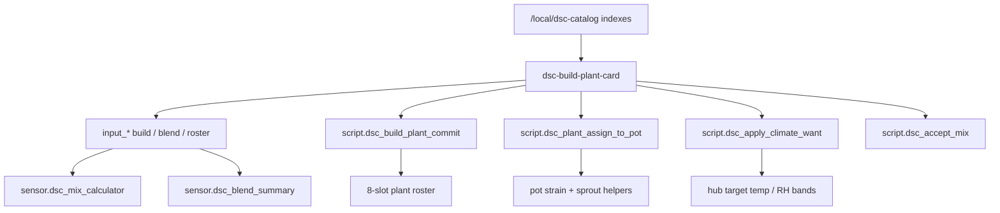

# Build a Plant — composition + full inclusion (N-083 / N-085 / N-086)

Operator / developer runbook for the **Build a Plant** composition card.
Shipped as a separate dashboard in `09fac80` (2026-08-07); **N-086** folds it
into the unified DSC-HUB product shell under **Plant → Compose**.

| Surface | Role |
|---|---|
| Dashboard URL | **`/dsc-hub-pro/plant-build`** (panel subview under Plant) |
| Plant hub | `/dsc-hub-pro/plant` — Compose + Catalog chips |
| Catalog Explorer | `/dsc-hub-pro/catalog` — browse / compare / Use in Build |
| Card | `custom:dsc-build-plant-card` |
| Package SoT | `homeassistant/packages/dsc_v4_build_plant.yaml` |
| Generator | `scripts/gen_dsc_v4_build_plant.py` (prefer editing this) |
| Search indexes | `/local/dsc-catalog/*.json` |
| Related packs | strain / nutrient / medium / light catalogs |
| Product shell | [`LIVE-UI-PRODUCT-SHELL.md`](LIVE-UI-PRODUCT-SHELL.md) |

Legacy `/dsc-build-plant/build` is a redirect stub (sidebar hidden). Strains /
Nutrient Science deep-link to Plant Compose. The Dash stays Ops cinema.

Data provenance, the assign bridge, and the browser-blocking acceptance gate
are defined in
[`BUILD-A-PLANT-DATA-PIPELINE.md`](BUILD-A-PLANT-DATA-PIPELINE.md).

## Intent

Compose a plant from catalog typeahead (strain · medium % blend · nutrients ·
light · optional climate Want), then **commit** into an 8-slot roster and/or
**assign** to a pot. Metric only. Does **not** invent catalog climate bands or
PPFD heatmaps.



## Architecture

### Dashboard + card

| Piece | Path |
|---|---|
| YAML dashboard | `homeassistant/dashboards/dsc-build-plant-dashboard.yaml` |
| Sidebar registration | `configuration.snippet.yaml` → `lovelace.dashboards.dsc-build-plant` |
| Lit card source | `homeassistant/www/dsc-build-plant-card.js` |
| HACS / `/local` bundle | last segment of `DSC-HUB.js` / `dsc-system-map-card.js` |
| Standalone resource | `/local/dsc-build-plant-card.js` (optional) |

Concat order (HACS + Sync + ha-sync):

`system-map` → `airflow` → `three.min` → `dsc-dash-fx` → `the-dash` → **`build-plant`**

Healthy bundle after Build a Plant: **~941 KB** (`dist/DSC-HUB.js`). Sync still
refuses `< 500000` (F-013).

### Package (`dsc_v4_build_plant.yaml`)

| Domain | Entities (selected) |
|---|---|
| Builder identity | `input_text.dsc_build_nickname` / `dsc_build_strain`, `input_datetime.dsc_build_sprout_date` |
| Soil blend | 3× `dsc_blend_component_*_name` + `dsc_blend_pct_*` + `dsc_blend_total_l` |
| Roster | 8 slots: nickname / strain / blend / recipe / sprout / pot / status |
| Climate apply target | `input_select.dsc_build_climate_pot` (`Fleet` \| `1`–`4`) |
| Assign pot | `input_select.dsc_build_assign_pot` (`none` \| `1`–`4`) |
| Mix glue | reads nutrient catalog slots → `sensor.dsc_mix_calculator` |
| Want sensors | `sensor.dsc_pot{N}_want_temp_*` / `want_rh_*` — **Custom** slots only when ≠0 |

**Scripts**

| Script | Behavior |
|---|---|
| `dsc_build_plant_commit` | Next empty roster slot ← builder fields; status `active` if pot assigned else `stock` |
| `dsc_plant_assign_to_pot` | Strain + sprout → pot HA helpers (+ pot entities when online, `continue_on_error`) |
| `dsc_apply_climate_want` | Midpoint temp + RH min/max → hub numbers when Want ≠0; notify skip otherwise |
| `dsc_accept_mix` | Existing nutrient Accept (burns stock; **no pumps**) |

### Search indexes

Built by `python scripts/build_catalog_search_indexes.py` →
`homeassistant/www/dsc-catalog/` + `dist/dsc-catalog/`.

Default path projects from research SQLite (`catalog_sqlite_projection.py`) when
`brain/data/dsc_brain.sqlite3` exists; `--from-dumps` skips SQLite.

| File | Cap | Live (`d4cdcab`, `built_at` 2026-08-10T07:51Z) | Contents |
|---|---|---|---|
| `dsc_strains_search_index.json` | **2500** | **2500** (`with_want=12`, `with_height=12`, `with_height_band=1`) | Slim name / type / breeder + cm height / ordinal band when corpus states them |
| `dsc_nutrients_search_index.json` | **1500** | **3** | Name / brand / optional dose (pack seeds) |
| `dsc_mediums_search_index.json` | **800** | **5** | Substrate names (pack seeds) |
| `dsc_lights_search_index.json` | **800** | **517** | Fixture names + stated W / map URL when present |

Card fetches `${CATALOG_BASE}/${file}` with `CATALOG_BASE = "/local/dsc-catalog"`.
Missing indexes → empty typeahead (no hard fail).

`with_height` = numeric cm only; `with_height_band` is separate (never invent cm from
Short/Med/Tall). Browse cap is curated YAML + `ORDER BY curated DESC, name` — densify
fills the corpus, not the 2500-name slice ranking. Full rebuild ops:
[`CATALOG-COLLATION-CONTRACT.md`](CATALOG-COLLATION-CONTRACT.md) § HA browse index rebuild.

### Delivery paths

| Path | Dashboard YAML | Bundle includes card | Catalog JSON |
|---|---|---|---|
| **HACS** Redownload | no (config snippet once) | yes (`dist/DSC-HUB.js`) | no — need Sync / ha-sync / manual |
| **ha-sync.sh** | yes | yes | yes |
| **Sync add-on 5.1.4+** | yes | yes | yes |
| Sync add-on **≤5.1.3** | **no** | **no** (concat stopped at Dash) | **no** |

**N-084:** Sync ≤5.1.3 would rebuild a Dash-only concat from www sources and
could demote a HACS-complete live bundle. Rebuild Sync **5.1.4+** after merge.

## Constraints

- Soil % valid only when `pct1+pct2+pct3 == 100` (`sensor.dsc_blend_summary` attr `valid`).
- Mix ml = `dose_ml_l × tank_L × (strength% / 100)`.
- Apply climate Want **no-ops** when custom temp/RH are **0** — no catalog invent.
- Catalog picker strains have **no** climate Want bands by design (N-055 custom only).
- Strain index is capped; full merged dump (~36k) is not in the browser payload.
- Vivosun stated W/PPE/point-PPFD/datasheets may exist; **keyword-labeled map image URLs still 0**.
- Metric only (°C, L, ml/L, µmol, %).
- Prefer editing `gen_dsc_v4_build_plant.py` then regenerate the package YAML.

## Bring-up checklist

- [ ] `configuration.snippet.yaml` merged — sidebar shows **Build a Plant**
- [ ] Package `dsc_v4_build_plant.yaml` present; Core restarted once for new helpers
- [ ] Sync **5.1.4+** rebuilt **or** HACS Redownload **plus** catalog copy under `/config/www/dsc-catalog/`
- [ ] Hard-refresh browser; open `/dsc-build-plant/build`
- [ ] Typeahead (≥2 chars) returns hits for strain / medium / nutrient / light
- [ ] Soil sliders: chip shows valid only at 100%
- [ ] Mix lines update when dose / tank L / strength change
- [ ] **Add to inventory** fills next empty roster slot + persistent notification
- [ ] **Assign to pot now** writes pot strain (requires Assign pot ≠ `none`)
- [ ] **Apply climate Want** with unset Custom Want → skip notification; with set Want → hub targets move
- [ ] Pro Home pot chips use `text.dsc_potN_plant_name`; assigned roster nickname/blend appears below them
- [ ] Root Zone shows assigned roster nickname, blend, and recipe per pot
- [ ] Nutrient Science shows `sensor.dsc_mix_calculator`, short-stock state, recipe packs, and `/dsc-build-plant/build` link
- [ ] Lighting shows fixture, active summary, and PPFD map entities

## N-085 POT3 browser suite

Run this suite against **POT3** because it exercises the known OOS/probe-fault
surface while proving plant identity remains independent of sensor health:

1. Open `/dsc-build-plant/build`; select a catalog strain, nickname, blend,
   recipe, and Assign pot **3**.
2. Commit + assign. Confirm the assign bridge writes
   `text.dsc_pot3_plant_name`, the canonical `select.dsc_pot3_strain` /
   `datetime.dsc_pot3_sprout_date`, and secondary underscore entities when
   available.
3. Open Pro Home and Root Zone. Confirm the POT3 chip/name and matching roster
   nickname/blend/recipe render even while POT3 telemetry remains OOS.
4. Return to Build a Plant and verify the roster slot is active with `pot: 3`.
5. Run Accept with one deliberately understocked enabled line. Confirm a
   **Mix short stock** notification, that line is unchanged, and covered lines
   burn normally.

The suite is blocked until the data-pipeline **MVP gate** passes: selectable
chemistry, at least one PPFD URL, and non-empty nutrient/medium indexes. It
also fails if the **assign bridge** cannot resolve the strain directly or via
a free Custom slot; never accept a silent partial assignment.

## Pitfalls

| Symptom | Likely cause | Fix |
|---|---|---|
| Custom element missing | Old Sync ≤5.1.3 www concat, or stale HACS | Rebuild Sync 5.1.4+ **or** HACS Redownload + hard-refresh |
| Typeahead empty | `/local/dsc-catalog/` missing | Sync/ha-sync catalog copy, or manual `www/dsc-catalog/*.json` |
| Height/band missing after densify | Stale HA www indexes, or name outside 2500 cap | Rebuild + Sync; check JSON `built_at` / `with_height` meta |
| Dashboard 404 | Snippet not merged / YAML not on HA | Merge snippet; ensure `dashboards/dsc-build-plant-dashboard.yaml` |
| Commit does nothing | All 8 roster slots occupied | Clear a slot status back to `empty` |
| Climate Apply “skipped” | Custom Want temp/RH still 0 | Set Custom slot climate Want, or leave alone (expected) |
| Assign silent | Assign pot = `none` or empty strain | Pick pot 1–4 + strain name |
| Strain not in picker after assign | Name not in pot `input_select` options | Use catalog picker seed / Custom slot on Pro Strains view |
| Bundle “too small” refused | Staging stub &lt; 500 KB | F-013 guard — check Sync log; fix concat inputs |

## Regenerate indexes / package

```bash
python scripts/gen_dsc_v4_build_plant.py
python scripts/build_catalog_search_indexes.py
./scripts/sync-hacs-dist.sh   # refresh dist/DSC-HUB.js + dist/dsc-catalog/
```

## Soak / acceptance

1. Commit one plant → roster occupied count +1; notification titled “Build a Plant · committed”.
2. Accept mix with known doses → stock decreases; calculator total matches `dose × L × strength`.
3. Custom Want temp/RH set → Apply writes `number.dsc_hub_target_temp` midpoint and RH min/max.
4. Hard-reload Pro Dash still works (Build a Plant must not break cinematic concat).

## Related

- FOLLOWUPS **N-083** / **N-084** — [`docs/FOLLOWUPS.md`](../FOLLOWUPS.md)
- N-085 data pipeline, assign bridge, and MVP gate — [`BUILD-A-PLANT-DATA-PIPELINE.md`](BUILD-A-PLANT-DATA-PIPELINE.md)
- HA layout — [`homeassistant/README.md`](../../homeassistant/README.md)
- HACS — [`scripts/HACS-FRONTEND.md`](../../scripts/HACS-FRONTEND.md)
- Sync — [`dsc-hub-sync/DOCS.md`](../../dsc-hub-sync/DOCS.md) · [`scripts/ADDON.md`](../../scripts/ADDON.md)
- Catalog research trail — FOLLOWUPS 2026-08-07 product landscape sections
