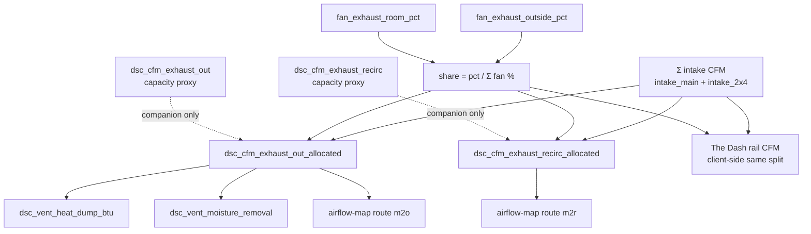
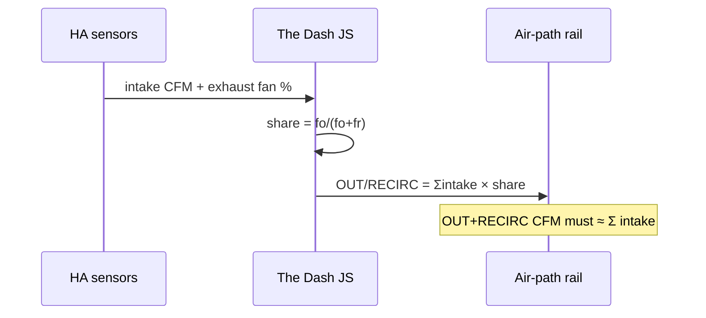

# Live UI — allocated CFM honesty + Dash depth/glTF (post-`9d9895b`)

Ops runbook for the **Pass 2 CFM honesty** and **Pass 1 Dash fidelity** work
shipped on master (`9d9895b`), with HACS `dist/` kept in lockstep by CI
(`0d06cab` `chore(hacs): sync dist/ from homeassistant/www`).

Does **not** re-document sensor-cal Push/SoT (draft PR #20), Sync cinematic
guards (draft PR #19), or The Dash shell/modules base (draft PR #17). This page
covers the **dual CFM model**, its consumers, and the depth-soft / offline glTF
accents that closed The Dash fidelity deferred items.

Verified against:

- `homeassistant/packages/dsc_v4_climate_physics.yaml` — capacity proxies + allocated
- `homeassistant/www/dsc-airflow-map-card.js` — route CFM entity ids
- `homeassistant/www/dsc-the-dash-card.js` — client mass-balance + glTF accents
- `homeassistant/www/vendor/dsc-dash-fx.js` — DepthTexture soft particles + `loadSimpleGltf`
- `homeassistant/dashboards/modules/view_climate.yaml` / `view_learning.yaml`
- `scripts/ha-sync.sh`, `dsc-hub-sync/…/dsc-hub-sync.sh`, `scripts/sync-hacs-dist.sh`

## Intent

| Sensor family | Formula | Honesty | Use for |
|---|---|---|---|
| `sensor.dsc_cfm_exhaust_out` / `_recirc` | `% × nameplate` or Learning **curve** (≥2 points) | `capacity_proxy_nameplate` or `measured_curve` | Capacity / fan sizing / Learning labels |
| `sensor.dsc_cfm_exhaust_out_allocated` / `_recirc_allocated` | `Σ intake × fan-% split` | `Sigma_intake_times_fan_pct_split` | Mass-balanced duct flow, vent BTU/moisture, AIRFLOW map |
| The Dash air-path rail | Same split math **in JS** from intake + fan % | Caption warns raw exhaust_* are proxies | Operator mass-balance view |

**Constraint model, not an anemometer.** Allocated CFM balances intake
throughput across OUT/RECIRC by commanded fan share. It does **not** invent
duct measurements. Leave Learning CFM curves empty until you measure.



## Package sensors (climate physics)

### Capacity proxies

`sensor.dsc_cfm_exhaust_out` / `sensor.dsc_cfm_exhaust_recirc`:

- Default: `pct / 100 × input_number.dsc_cfm_{out,recirc}_max`
- With ≥2 non-zero Learning points (`dsc_cal_cfm_*_{25,50,75,100}`): piecewise linear
- Attributes: `model: linear|curve`, `honesty: capacity_proxy_nameplate|measured_curve`

Until anemometer curves exist, these often read **~300+ CFM** open-air style
estimates. That is expected — they are **capacity**, not duct mass flow.

### Allocated (mass balance)

```text
inn = dsc_cfm_intake_main + dsc_cfm_intake_2x4
fs  = fan_exhaust_outside_pct + fan_exhaust_room_pct
out_allocated    = 0 if fs < 0.5 else inn * outside_pct / fs
recirc_allocated = 0 if fs < 0.5 else inn * room_pct / fs
```

Attributes (both):

| Attr | Value |
|---|---|
| `model` | `mass_balance_allocated` |
| `honesty` | `Sigma_intake_times_fan_pct_split` |
| `companion_capacity` | matching `sensor.dsc_cfm_exhaust_{out,recirc}` |

Availability requires intake + both exhaust fan-% sensors.

### Downstream consumers (must use allocated OUT)

| Consumer | Entity / surface |
|---|---|
| Vent heat dump | `sensor.dsc_vent_heat_dump_btu` (`cfm_source` attr) |
| Vent moisture removal | `sensor.dsc_vent_moisture_removal` |
| AIRFLOW STATUS routes | `m2o` → `…_out_allocated`, `m2r` → `…_recirc_allocated` |
| Climate Plant specs UI | Capacity vs allocated rows + markdown honesty note |

Heat-balance / moisture-net still compose from vent sensors (hence allocated).

## The Dash — same math, different path

The Dash does **not** bind the allocated HA sensors for absolute OUT/RECIRC CFM.
It recomputes in JS:

1. Intake sum from intake CFM entities
2. Share from live fan % (exhaust CFM sensors = **ratio fallback only** if fans≈0)
3. Absolute rail CFM = `throughput × share`

Caption (code): raw `sensor.dsc_cfm_exhaust_*` stay nameplate proxies until
Learning cal. Cascade is a **transfer** of 2×4 air — do not add it to intake total.



## Dash fidelity (depth-soft + glTF)

| Piece | Where | Behavior |
|---|---|---|
| DepthTexture | `vendor/dsc-dash-fx.js` composer | Scene target gets a depth buffer; soft particles sample it |
| Soft particles | `dsc-the-dash-card.js` | Layer-split materials registered via `registerSoftParticleMaterial` |
| Offline glTF accents | `www/assets/dash/{muffler,fan_housing,flange}.gltf` | `loadSimpleGltf('/local/assets/dash/…')`; on failure keep primitives |

Primitive geometry is always built first. glTF **replaces** muffler body /
fan housings when fetch succeeds — accents are cosmetic, not required for ops.

### Sync pitfall (verified)

`ha-sync.sh`, Sync add-on, and `sync-hacs-dist.sh` publish the **five-part JS
bundle** + vendor THREE/FX. They do **not** currently copy
`homeassistant/www/assets/dash/*.gltf` to `/config/www/assets/dash/` or `dist/`.

| Outcome | Meaning |
|---|---|
| Soft particles / bloom / ribbons OK | Bundle + FX path healthy (~846–852 KB) |
| Fans/muffler stay primitives | Expected until `/local/assets/dash/*.gltf` exists on HA |
| To enable accents now | Manual copy of `www/assets/dash/` → `/config/www/assets/dash/`, then hard-refresh |

Track sync coverage as a follow-up (see `docs/FOLLOWUPS.md`) — do not treat
missing glTF as a Dash failure.

## HACS dist CI

Pushing `homeassistant/www/**` to `master` runs
[`.github/workflows/hacs-dist.yml`](../../.github/workflows/hacs-dist.yml):

1. `scripts/sync-hacs-dist.sh` rebuilds `dist/DSC-HUB.js` (+ legacy
   `dist/dsc-system-map-card.js`)
2. Bot commit: `chore(hacs): sync dist/ from homeassistant/www`

PRs that touch www must keep `dist/` current or the workflow fails the check.
Edit www sources only; never hand-edit the concatenated `dist/*.js` bodies.

## Operator quick checks

Climate → Plant specs expander:

1. **Capacity proxies** ≈ nameplate × fan % (or curve) — may disagree with allocated
2. **OUT/RECIRC allocated** sum ≈ intake_main + intake_2x4 when both fans > 0
3. Learning page: curves empty → `model: linear`; do not invent points

The Dash (`/dsc-hub-pro/dash`):

1. Rail OUT+RECIRC CFM ≈ Σ intake
2. Soft particles soften against ducts (DepthTexture path)
3. Optional: after manual asset copy, muffler/fans pick up glTF meshes

## Triage

| Symptom | Likely cause | Fix |
|---|---|---|
| Climate exhaust CFM ≫ Dash rail CFM | Comparing capacity proxy to mass balance | Use `*_allocated` or Dash rail; leave proxies for capacity |
| Allocated = 0 with fans spinning | Intake CFM unavailable / both fan % ≈ 0 | Check intake sensors + fan % entities |
| Vent BTU looks “too small” vs old charts | Now uses allocated OUT | Expected honesty change; not a regression |
| Dash looks flat / no soft edge | Stale bundle missing `dsc-dash-fx` | See [`LIVE-UI-WWW-BUNDLE-GUARDS`](LIVE-UI-WWW-BUNDLE-GUARDS.md) (PR #19); `wc -c` ~846–852 KB |
| glTF 404 in browser network | Assets not synced to `/local/assets/dash/` | Manual copy or wait for sync coverage follow-up |
| HACS Redownload no glTF | `sync-hacs-dist` never packs `assets/dash` | Same — accents optional |

## Soak checklist

- [ ] Packages reloaded — `sensor.dsc_cfm_exhaust_out_allocated` / `_recirc_allocated` exist
- [ ] Climate shows capacity **and** allocated rows with honesty markdown
- [ ] AIRFLOW STATUS OUT/RECIRC edges track allocated (not raw capacity)
- [ ] The Dash rail OUT+RECIRC ≈ Σ intake during normal fan split
- [ ] `wc -c /config/www/dsc-system-map-card.js` ≈ repo `dist/DSC-HUB.js` (~852325)
- [ ] Learning: no invented CFM curve points; capacity proxies still labeled linear/curve

## Related

| Doc | Role |
|---|---|
| Draft PR #17 `LIVE-UI-THE-DASH` | Shell/modules + original rail mass-balance |
| Draft PR #19 `LIVE-UI-WWW-BUNDLE-GUARDS` | Sync 5.1.3 concat guards / size floor |
| Draft PR #20 `SENSOR-CAL-5.1.7` | Peer sync / push-to-ESP (Pass 3 Cal SoT) |
| [`../FOLLOWUPS.md`](../FOLLOWUPS.md) | Next Pass Full Inclusion closeout |
| [`../../homeassistant/README.md`](../../homeassistant/README.md) | Package map + plant specs |
| [`../../scripts/HACS-FRONTEND.md`](../../scripts/HACS-FRONTEND.md) | HACS dual-path |
