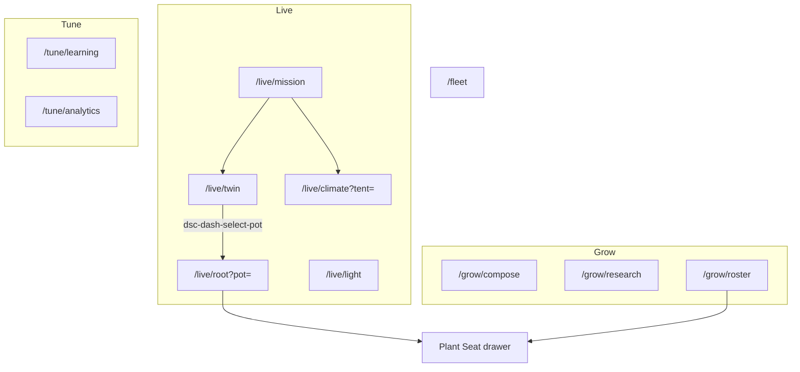
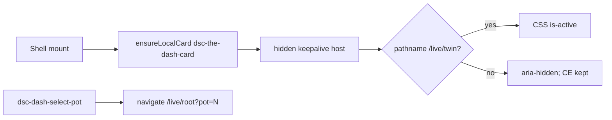
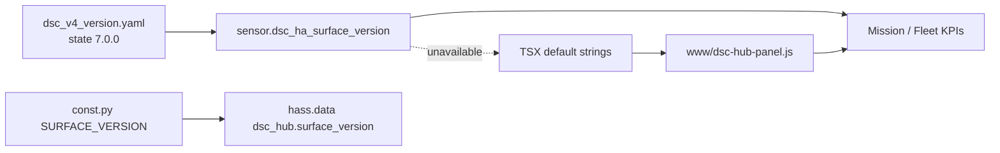
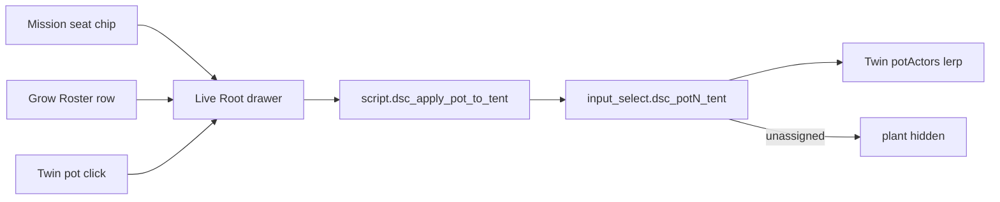

# LIVE-UI — DSC-HUB custom panel (surface 7.0.0)

React + Vite product panel hosted inside Home Assistant (WashData pattern).

| Surface | Role |
|---|---|
| Sidebar | **DSC-HUB** → `/dsc-hub` (custom panel) |
| Deep routes | Hash routes: `/dsc-hub#/live/mission`, `#/grow/compose`, `#/fleet`, … |
| Legacy redirects | `#/ops/*`, `#/plant/*`, `#/advanced/*`, `#/system` → Live/Grow/Tune/Fleet |
| Lovelace fallback | `dsc-hub-pro` YAML — `show_in_sidebar: false` |
| Surface version | `sensor.dsc_ha_surface_version` **7.0.0** |
| Integration | `homeassistant/custom_components/dsc_hub/` |
| Enable | `dsc_hub:` in configuration.yaml (see snippet) |
| Pot → tent SoT | `packages/dsc_v4_pot_tent.yaml` → `input_select.dsc_potN_tent` |

Firmware train stays **5.2.0**. Do **not** put `7.0.0` into `input_text.dsc_expected_release`.
Version-train rules: [`VERSION-TRAINS.md`](VERSION-TRAINS.md).

## Intent (7.0)

Ship a **guided** product shell: Live / Grow / Tune / Fleet primary IA, honesty
rail + **Do this next**, Twin keep-alive (Three.js CE persisted), Climate tent
segment (Main | Clone | Compare), Plant Seat as drawers, and a modern full-colour
dark theme — without inventing climate math, NPK, or tank sensors in the browser.

Verified tip: product `335ddc9` (Dashboard 7.0). Operable charts / Want / Full Auto
from 6.3 remain under Live · Climate + Mission.

## Route map (7.0)



| Primary | Default land | Secondary |
|---|---|---|
| **Live** | `/live/mission` | Mission · Twin · Climate · Root · Light |
| **Grow** | `/grow/compose` | Compose → Research → Roster |
| **Tune** | `/tune/learning` | Learning · Analytics |
| **Fleet** | `/fleet` | Overview only (no secondary strip) |

### Legacy redirects (`routes.ts`)

| Old path | New path |
|---|---|
| `/ops/home`, `/ops` | `/live/mission` |
| `/ops/dash` | `/live/twin` |
| `/ops/climate` | `/live/climate` |
| `/ops/main-4x8` | `/live/climate?tent=main` |
| `/ops/clone-2x4` | `/live/climate?tent=clone` |
| `/ops/root-zone`, `/ops/plant-seat` | `/live/root` |
| `/ops/tank` | `/fleet` |
| `/ops/lighting` | `/live/light` |
| `/plant/build` | `/grow/compose` |
| `/plant/catalog` | `/grow/research` |
| `/plant`, `/plant/seat`, `/plant/strains` | `/grow/roster` |
| `/advanced`, `/advanced/learning` | `/tune/learning` |
| `/advanced/trends`, `/advanced/history` | `/tune/analytics` |
| `/system` | `/fleet` |

Climate tent focus is query-driven: `?tent=main|clone|compare|room`
(`useZoneFocus`; legacy `?zone=` still parsed).

## Guided chrome

| Piece | Path | Role |
|---|---|---|
| Honesty rail | `components/Honesty.tsx` + `lib/sensorHonesty.ts` | Top chips for hub-dark / failsafe / climate fault / reduced kit / keep-up / dark viol / POT3 OOS |
| Next recommended | `NextRecommendedCard` on Mission | Highest-priority gap → CTA href; empty → Open Twin / Climate Want |
| PageHeader | `components/ui.tsx` | Title + primary CTA + overflow actions |
| Twin keep-alive | `components/TwinKeepAlive.tsx` | Persists `dsc-the-dash-card` across routes; CSS-shown only on `/live/twin` |
| Plant Seat drawer | `PlantSeatPanel` in Grow/Root | No standalone seat route; `?pot=N` opens drawer |

### Honesty gap sources (verified)

| Gap id | Trigger | CTA |
|---|---|---|
| `failsafe` | `binary_sensor.dsc_hub_emergency_failsafe` on | Mission |
| `hub-dark` | `sensor.dsc_hub_uptime` unavailable | Fleet |
| `climate-fault` | `binary_sensor.dsc_hub_climate_sensor_fault` on | Climate |
| `dark-viol` | `binary_sensor.dsc_clone_dark_period_violation` on | Light |
| `reduced-kit` | `binary_sensor.dsc_reduced_kit` on | Fleet |
| `keepup` | Full Auto on + `sensor.dsc_keepup_gaps` attr `full_auto_honesty` | Climate |
| `pot3-oos` | `input_boolean.dsc_pot3_in_service` off | Root `?pot=3` |

### Twin keep-alive



**Constraint:** remount only if the host is lost. Leaving Twin must **not** cold-dispose
WebGL. Missing card → deploy `/local/DSC-HUB.js` (or HACS) and hard-refresh.
R3F rewrite deferred — see FOLLOWUPS Surface 7.0.

## Build

Prefer the local-disk script (NAS shares stall `npm`):

```powershell
powershell -ExecutionPolicy Bypass -File scripts/build-dsc-hub-panel.ps1
```

This copies `frontend/` → `%TEMP%`, runs `npm ci` + `npm run build`, then copies
`dsc-hub-panel.js` (+ map/assets) back to `homeassistant/custom_components/dsc_hub/www/`.

Manual equivalent:

```bash
cd homeassistant/custom_components/dsc_hub/frontend
npm install
npm run build   # emits www/dsc-hub-panel.js (CSS inlined)
```

## Deploy (two paths — do not conflate)


| Artifact | Source of truth | How it lands |
|---|---|---|
| Panel JS (`dsc-hub-panel.js`) | `custom_components/dsc_hub/frontend/` → Vite build | Sync / `ha-sync` copies `custom_components/dsc_hub` |
| Lit cards (Twin / Build / maps) | `homeassistant/www/*.js` | Sync www concat **or** HACS `dist/DSC-HUB.js` |
| HACS `dist/` | Built from `www/` by `scripts/sync-hacs-dist.sh` | CI [`.github/workflows/hacs-dist.yml`](../../.github/workflows/hacs-dist.yml) on `master` pushes that touch `homeassistant/www/**` |
| Pot → tent helpers | `packages/dsc_v4_pot_tent.yaml` | Sync packages; **Core restart once** for new `input_select` |
| Surface string | `packages/dsc_v4_version.yaml` | Sync packages; Core restart / template reload |

**Note:** the `dsc-hub-sync` add-on image still needs a rebuild to pick up
`custom_components` staging from git. Panel JS under integration `www`
updates on sync after the Python package is present. Sync does **not** compile Vite.

Plant Seat remains **panel-only** (not in the HACS bundle). Twin CE still comes from Lit.

## Surface version lockstep (`335ddc9`)

Three strings must stay equal when shipping a surface bump. They are **not**
automatically linked.

| Layer | Path | Role |
|---|---|---|
| Package sensor (operator SoT) | `packages/dsc_v4_version.yaml` → `sensor.dsc_ha_surface_version` | What ops read; fleet chip attributes report it but do **not** score it |
| Integration constant | `custom_components/dsc_hub/const.py` → `SURFACE_VERSION` | Written to `hass.data["dsc_hub"]["surface_version"]` on `async_setup` — bookkeeping only; **not** the sensor |
| Panel UI fallbacks | `frontend/src/**` (`state(…, "7.0.0")`, App shell `SURFACE 7.0.0`) + rebuilt `www/dsc-hub-panel.js` | Shown when the sensor is missing / unavailable |



### Constraints

- `SURFACE_VERSION` does **not** create or update `sensor.dsc_ha_surface_version`.
  Changing only `const.py` leaves the package sensor and KPI fallbacks stale.
- UI `state("sensor.dsc_ha_surface_version", "7.0.0")` uses the second arg only
  when HA has no state — a live sensor still wins after Sync packages.
- `manifest.json` `version` (`0.1.0`) is the integration package version, **not**
  the product surface string.
- Firmware train / `input_text.dsc_expected_release` stay on **5.2.0**.

### Bump procedure

1. Set `state: "X.Y.Z"` (+ attributes) in `packages/dsc_v4_version.yaml`.
2. Set `SURFACE_VERSION = "X.Y.Z"` in `custom_components/dsc_hub/const.py`.
3. Grep/update hardcoded `"X.Y.Z"` / `SURFACE X.Y.Z` under
   `custom_components/dsc_hub/frontend/src/`.
4. Rebuild panel: `powershell -ExecutionPolicy Bypass -File scripts/build-dsc-hub-panel.ps1`.
5. Sync `packages/` + `custom_components/dsc_hub` → **Core restart** (Python
   constant + template sensor) → hard-refresh `/dsc-hub`.
6. If Twin/Build Lit cards changed under `homeassistant/www/`, ensure `dist/`
   sync (`hacs-dist.yml` or `./scripts/sync-hacs-dist.sh`) then HACS Redownload.
7. Smoke: sensor = `X.Y.Z`; Fleet Surface KPI matches; App shell shows `SURFACE X.Y.Z`.

### Operator smoke (lockstep)

1. After Sync + Core restart, `sensor.dsc_ha_surface_version` = **7.0.0**.
2. `/dsc-hub#/fleet` Surface KPI = **7.0.0**.
3. App chrome shows `SURFACE 7.0.0`.
4. Confirm `input_text.dsc_expected_release` is still **5.2.0** (firmware).

## Architecture — operable charts + controls (still Live · Climate)


### Want entities (`TentTargets.tsx`)

| Tent | Temp | RH min/max | VPD min/max | Got sensors |
|---|---|---|---|---|
| Main | `number.dsc_hub_target_temp` | `number.dsc_hub_rh_target_min` / `_max` | `number.dsc_hub_vpd_target_min` / `_max` | `sensor.dsc_hub_tent_temperature` / `_humidity` / `_vpd_kpa` |
| Clone | `number.dsc_hub_clone_target_temp` | `number.dsc_hub_clone_rh_min` / `_max` | `number.dsc_hub_clone_vpd_min` / `_max` | `sensor.dsc_hub_clone_temperature` / `_humidity` / `_vpd_kpa` |

Editors commit on blur / Enter via `number.set_value` (clamped to entity min/max/step).
Charts overlay Want T (left axis) and RH band (right axis) from the **same** tent numbers.
Mission intentionally omits the full Climate chart wall — charts live on Climate.

### Full Auto / mode / kit (Mission + Climate + Fleet)

| Control | Entity | Service |
|---|---|---|
| Full Auto | `switch.dsc_hub_tent_full_auto_mode` | toggle |
| Manual / master takeover | `switch.dsc_hub_manual_takeover` | toggle |
| Fan override | `switch.dsc_hub_tent_manual_override` | toggle |
| Hum intake routing | `switch.dsc_hub_humidifier_intake_routing` | toggle |
| RECIRC de-strat | `switch.dsc_hub_recirc_de_strat_pulse` | toggle |
| Strategy | `select.dsc_hub_control_strategy` | `select.select_option` |
| Priority tent | `select.dsc_hub_priority_tent` | `select.select_option` |
| AC / mister / pots in service | `input_boolean.dsc_ac_in_service`, `dsc_clone_humidifier_in_service`, `dsc_pot{1..4}_in_service` | toggle |
| Honesty chip | `sensor.dsc_keepup_gaps` attr `full_auto_honesty` + `binary_sensor.dsc_reduced_kit` | read-only |

Fan % sliders (when Fan override is meaningful):

- `fan.dsc_hub_4_inch_intake_fan_main`
- `fan.dsc_hub_4_inch_intake_fan_2x4`
- `fan.dsc_hub_6_inch_exhaust_room`
- `fan.dsc_hub_6_inch_exhaust_outside`

via `fan.set_percentage`. Hub firmware still reasserts the curve while Full Auto owns fans.

### Chart data path

`useEntitySeries(entityId)` seeds from HA history (~6 h / 96 points default) then
appends live points on `state_changed`. Empty charts usually mean recorder denied
to the panel user — not a missing Want overlay.

## Visual system (7.0)

Modern dark + **full colour** (blues / purples / greens / teal / amber by role) —
not dank neon-green-only, not grey monochrome. Glass HUD · Live/Grow/Tune/Fleet
primary tabs · guided PageHeader + NextRecommended · honesty rail · Twin keep-alive
· tent segment on Climate · Plant Seat drawers.

Inspiration north star: [`docs/assets/README.md`](../assets/README.md).

## Plant Seat + pot → tent placement

**Intent:** per-pot detail (soil / age / recipe / live Got) and digital-twin tent
placement. Moves the plant on Twin. Does **not** rewrite climate Want, ESP IDs,
or invent feed schedules / PPFD.

| Piece | Path / entity |
|---|---|
| Routes (7.0) | `/dsc-hub#/live/root?pot=1..4` or `/grow/roster?pot=N` (drawer) |
| Model | `frontend/src/lib/seatModel.ts` |
| Panel | `PlantSeatPanel` in `GrowPages.tsx` |
| Tent SoT | `input_select.dsc_pot{1..4}_tent` ∈ `{unassigned, clone, main}` |
| Apply script | `script.dsc_apply_pot_to_tent` (`pot`, `tent`) |
| Twin consumer | `homeassistant/www/dsc-the-dash-card.js` → `readPotTent` + ~0.8s lerp |

Defaults (package initial): pots **1–2 → clone**, **3–4 → main**.



### Constraints (verified)

- Blend / recipe come from `sensor.dsc_plant_roster_summary` slots — empty when no roster join.
- Live Got reads pot soil sensors; unavailable / unknown → `—` (never invented NPK).
- Recipe text is catalog / roster only — no invented dose schedule.
- Apply tent validates pot `1–4` and tent ∈ `{unassigned, clone, main}`; invalid → persistent notification + stop.
- Twin falls back to card `cfg.pots[].tent` only when the `input_select` is missing / unavailable.

### Operator smoke

1. Sync packages + panel; restart Core once if `input_select.dsc_pot1_tent` is new.
2. Open `/dsc-hub#/live/root?pot=1` — soil cross-section + identity chips render in drawer.
3. Apply **Main 4×8** → `input_select.dsc_pot1_tent` = `main` + notify `POT1 → main`.
4. Open Live · Twin — pot1 lerps to main pad (~0.8s). Leave Twin and return — no cold WebGL rebuild.
5. Apply **Unassigned** → plant actor hidden on Twin.
6. Confirm `sensor.dsc_ha_surface_version` = **7.0.0**.

## Pass 7.0 acceptance

- [ ] Primary tabs = **Live / Grow / Tune / Fleet** (not Ops/Plant/Advanced/System)
- [ ] Default land `#/live/mission`; Mission has **Do this next** + no full Climate chart wall
- [ ] Climate tent segment Main | Clone | Compare; no Main/Clone sibling pages
- [ ] Twin keep-alive: leave Twin and return without cold WebGL rebuild
- [ ] Root/Roster open seat as drawer; dual seat routes gone (redirect)
- [ ] Grow order Compose → Research → Roster
- [ ] Fleet shows kit + map (+ tank note); Learning/Analytics under Tune
- [ ] Honesty rail + reduced-kit / keepup / OOS chips
- [ ] Colour tokens: blue/purple/green/teal live (not #39ff14 brand wash)
- [ ] `sensor.dsc_ha_surface_version` reads **7.0.0**
- [ ] Legacy `#/ops/home` etc. redirect cleanly

## Pass 3 acceptance (6.3 — still relevant)

- [ ] Live climate: dual axes readable; X times present; hover shows time + T + RH
- [ ] Charts use that tent’s Want overlays; edit Want → HA numbers update
- [ ] Gauges show band ticks, target, extrema; VPD in real kPa
- [ ] Full Auto + strategy + priority write HA; honesty chip on reduced kit
- [ ] Fan override ON → four fan % sliders write
- [ ] In-service toggles on Climate + Fleet
- [ ] Search icon opens slide-out; drawer close ≠ more
- [ ] Twin callouts both tents with RH band + VPD mini

## Pass 2 / 1 (still true)

- [ ] Cold open `/dsc-hub#/live/mission` — status strip reflects hub / panel / beat / alerts / fleet
- [ ] Demand toggles call HA; pot ESP-NOW chips visible
- [ ] Grow Compose / Research load without visiting Lovelace first (`/local` inject)
- [ ] Twin pot pick → Root seat drawer; Apply to tent lerps plant on Twin
- [ ] WashData / Overview / Frigate / other non-DSC panels unchanged
- [ ] Narrow viewport usable; reduced-motion safe
- [ ] Sidebar **DSC-HUB** opens `/dsc-hub`
