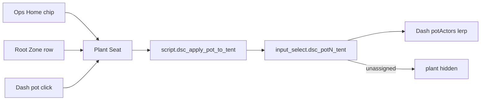

# LIVE-UI — DSC-HUB custom panel (surface 6.2.0)

React + Vite product panel hosted inside Home Assistant (WashData pattern).

| Surface | Role |
|---|---|
| Sidebar | **DSC-HUB** → `/dsc-hub` (custom panel) |
| Deep routes | Hash routes: `/dsc-hub#/ops/home`, `#/ops/plant-seat?pot=N`, `#/plant/catalog`, … |
| Lovelace fallback | `dsc-hub-pro` YAML — `show_in_sidebar: false` |
| Surface version | `sensor.dsc_ha_surface_version` **6.2.0** |
| Integration | `homeassistant/custom_components/dsc_hub/` |
| Enable | `dsc_hub:` in configuration.yaml (see snippet) |
| Pot → tent SoT | `packages/dsc_v4_pot_tent.yaml` → `input_select.dsc_potN_tent` |

Firmware train stays **5.2.0**. Do **not** put `6.2.0` into `input_text.dsc_expected_release`.

## Build

Prefer the local-disk script (NAS shares stall `npm`):

```powershell
pwsh -File scripts/build-dsc-hub-panel.ps1
```

This copies `frontend/` → `%TEMP%`, runs `npm ci` + `npm run build`, then copies
`dsc-hub-panel.js` (+ map/assets) back to `homeassistant/custom_components/dsc_hub/www/`.

Manual equivalent:

```bash
cd homeassistant/custom_components/dsc_hub/frontend
npm install
npm run build   # emits www/dsc-hub-panel.js (CSS inlined)
```

## Deploy (two paths — do not conflate)


| Artifact | Source of truth | How it lands |
|---|---|---|
| Panel JS (`dsc-hub-panel.js`) | `custom_components/dsc_hub/frontend/` → Vite build | Sync / `ha-sync` copies `custom_components/dsc_hub` |
| Lit cards (Dash / Build / maps) | `homeassistant/www/*.js` | Sync www concat **or** HACS `dist/DSC-HUB.js` |
| HACS `dist/` | Built from `www/` by `scripts/sync-hacs-dist.sh` | CI [`.github/workflows/hacs-dist.yml`](../../.github/workflows/hacs-dist.yml) on `master` pushes that touch `homeassistant/www/**` |
| Pot → tent helpers | `packages/dsc_v4_pot_tent.yaml` | Sync packages; **Core restart once** for new `input_select` |

**Note:** the `dsc-hub-sync` add-on image still needs a rebuild to pick up
`custom_components` staging from git. Panel JS under integration `www`
updates on sync after the Python package is present. Sync does **not** compile Vite.

After editing Dash / Build under `homeassistant/www/`, either wait for the
`HACS dist` workflow commit (`chore(hacs): sync dist/ from homeassistant/www`)
or run `./scripts/sync-hacs-dist.sh` locally before expecting HACS Redownload
to pick up the change.

## Visual system (6.2.0)

Black / gray / neon green / teal / white · glass HUD · tabbed primary+secondary ·
slide-out search drawers · overflow ⋯ / gear actions · press feedback · soft shadows ·
history-seeded glowing charts · demand toggles with neon ON edge · desktop-first grid
with narrow tile reflow · Plant Seat (soil / age / tent apply) · Dash pot pick + lerp.

Inspiration north star: [`docs/assets/README.md`](../assets/README.md)
(`inspiration/ops-dash-*.png`, `build-a-plant-flow.png`).

## Plant Seat + pot → tent placement

**Intent:** per-pot detail (soil / age / recipe / live Got) and digital-twin tent
placement. Moves the plant on The Dash. Does **not** rewrite climate Want, ESP IDs,
or invent feed schedules / PPFD.

| Piece | Path / entity |
|---|---|
| Route | `/dsc-hub#/ops/plant-seat?pot=1..4` |
| Model | `frontend/src/lib/seatModel.ts` |
| Page | `frontend/src/pages/PlantSeatPage.tsx` |
| Tent SoT | `input_select.dsc_pot{1..4}_tent` ∈ `{unassigned, clone, main}` |
| Apply script | `script.dsc_apply_pot_to_tent` (`pot`, `tent`) |
| Dash consumer | `homeassistant/www/dsc-the-dash-card.js` → `readPotTent` + ~0.8s lerp |

Defaults (package initial): pots **1–2 → clone**, **3–4 → main**.



### Constraints (verified)

- Blend / recipe come from `sensor.dsc_plant_roster_summary` slots — empty when no roster join.
- Live Got reads pot soil sensors; unavailable / unknown → `—` (never invented NPK).
- Recipe text is catalog / roster only — no invented dose schedule.
- Apply tent validates pot `1–4` and tent ∈ `{unassigned, clone, main}`; invalid → persistent notification + stop.
- Dash falls back to card `cfg.pots[].tent` only when the `input_select` is missing / unavailable.

### Operator smoke

1. Sync packages + panel; restart Core once if `input_select.dsc_pot1_tent` is new.
2. Open `/dsc-hub#/ops/plant-seat?pot=1` — soil cross-section + identity chips render.
3. Apply **Main 4×8** → `input_select.dsc_pot1_tent` = `main` + notify `POT1 → main`.
4. Open Ops · Dash — pot1 lerps to main pad (~0.8s). Hard-refresh if Lit card is stale.
5. Apply **Unassigned** → plant actor hidden on Dash.
6. Confirm `sensor.dsc_ha_surface_version` = **6.2.0**.

## Pass 2 / 6.2 acceptance

- [ ] Cold open `/dsc-hub#/ops/home` — tent T/RH charts populate from history within seconds
- [ ] Status strip reflects hub / panel / beat / alerts / fleet
- [ ] Plant seat chips on Home open `/ops/plant-seat?pot=N`
- [ ] Demand toggles (Heat/Cool/Hum/Dehum/Mat) call HA and match tent reality
- [ ] Pot ESP-NOW chips + manual takeover / fan override visible
- [ ] Ops · Climate shows VPD gauges + CFM / fan % KPIs and sparklines
- [ ] Ops · Dash / Plant · Catalog load without visiting Lovelace first (auto `/local` inject)
- [ ] Ops · Dash pot click / chip → Plant Seat; Apply to tent lerps plant on Dash
- [ ] Plant · Build result chips + slide-out search; soil cross-section; Commit+assign
- [ ] `sensor.dsc_ha_surface_version` reads **6.2.0**
- [ ] `input_select.dsc_potN_tent` exists after package sync + Core restart
- [ ] HACS Redownload (or Sync www) lands post-`d6beefd` Dash/Build glass cards
- [ ] WashData / Overview / Frigate / other non-DSC panels unchanged
- [ ] Narrow viewport tiles columns without breaking desktop layout

## Pass 1 (still true)

- [ ] Sidebar **DSC-HUB** opens `/dsc-hub` (not Lovelace YAML title)
- [ ] Primary tabs Ops · Plant · Advanced · System
- [ ] Secondary tabs navigate hash routes

## Pitfalls

- Blank panel → missing built `dsc-hub-panel.js` (Vite not run / Sync image too old).
- Charts empty → recorder/history denied to the panel user.
- Dash plant stuck / no lerp → stale Lit card (HACS Redownload or Sync www + hard-refresh); or pot-tent package not loaded.
- Apply tent no-ops → script/helpers absent until Core restart after first package land.
- Stale HACS after www edit → wait for `chore(hacs): sync dist/…` on master, then Redownload.
- Do not conflate surface **6.2.0** with firmware **5.2.0**.
