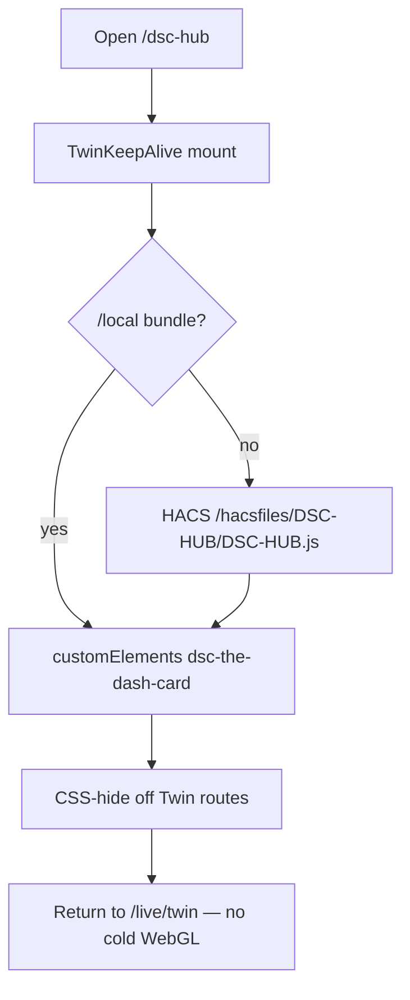

# LIVE-UI — DSC-HUB custom panel (surface 7.0.0)

React + Vite product panel hosted inside Home Assistant (WashData pattern).

| Surface | Role |
|---|---|
| Sidebar | **DSC-HUB** → `/dsc-hub` (custom panel) |
| Deep routes | Hash routes: `/dsc-hub#/live/mission`, `#/grow/compose`, `#/fleet`, … |
| Legacy redirects | `#/ops/*`, `#/plant/*`, `#/advanced/*`, `#/system` → Live/Grow/Tune/Fleet |
| Lovelace fallback | `dsc-hub-pro` YAML — `show_in_sidebar: false` |
| Surface version | `sensor.dsc_ha_surface_version` **7.0.0** |
| Integration | `homeassistant/custom_components/dsc_hub/` |
| Enable | `dsc_hub:` in configuration.yaml (see snippet) |

## Build

Prefer the local-disk script (NAS shares stall `npm`):

```powershell
powershell -ExecutionPolicy Bypass -File scripts/build-dsc-hub-panel.ps1
```

This copies `frontend/` → `%TEMP%`, runs `npm ci` + `npm run build`, then copies
`dsc-hub-panel.js` (+ map/assets) back to `homeassistant/custom_components/dsc_hub/www/`.

Manual equivalent:

```bash
cd homeassistant/custom_components/dsc_hub/frontend
npm install
npm run build   # emits www/dsc-hub-panel.js (CSS inlined)
```

## Deploy

`scripts/ha-sync.sh` syncs `custom_components/dsc_hub` (Python + www + assets).
Then: HA **Developer Tools → YAML → Check configuration** → restart Core
(or reload custom integrations if supported) so the panel registers.

**Note:** the `dsc-hub-sync` add-on image still needs a rebuild to pick up
`custom_components` staging from git. Panel JS under `/local` / integration
`www` updates on sync after the Python package is present.

### Dual path (React shell vs Lit Twin)

| Path | Artifact | Delivery |
|---|---|---|
| React product shell | `www/dsc-hub-panel.js` (Vite) | Sync `custom_components/dsc_hub` |
| Lit Twin / maps / Build | `homeassistant/www/*.js` → `/local` **or** HACS `dist/DSC-HUB.js` | Sync www concat **or** HACS Redownload |

Plant Seat drawers + honesty rail are **panel-only** (not in the HACS bundle).

### Twin keep-alive

`components/TwinKeepAlive.tsx` mounts once and persists `dsc-the-dash-card`
across hash routes (CSS-shown on `/live/twin`; legacy `/ops/dash` still active).
`ensureLocalCards.ts` injects, in order: `/local/DSC-HUB.js` →
`/local/dsc-system-map-card.js` → `/hacsfiles/DSC-HUB/DSC-HUB.js`.



**Constraints**

- Remount only if the host is lost. Leaving Twin must **not** cold-dispose WebGL.
- Missing card → deploy Sync www or HACS Redownload, then hard-refresh.
- Prefer `/local` when HACS and Sync disagree — load order tries `/local` first.
- After Lit edits under `homeassistant/www/`, run `./scripts/sync-hacs-dist.sh`
  (or wait for `hacs-dist.yml`) and confirm `git diff -- dist/` is empty before
  treating HACS as current. See [`scripts/HACS-FRONTEND.md`](../../scripts/HACS-FRONTEND.md).

## Visual system (7.0)

Modern dark + **full colour** (blues / purples / greens / teal / amber by role) —
not dank neon-green-only, not grey monochrome. Glass HUD · Live/Grow/Tune/Fleet
primary tabs · guided PageHeader + NextRecommended · honesty rail · Twin keep-alive
(Three.js CE persisted) · tent segment on Climate · Plant Seat drawers.

## Pass 7.0 acceptance

- [ ] Primary tabs = **Live / Grow / Tune / Fleet** (not Ops/Plant/Advanced/System)
- [ ] Default land `#/live/mission`; Mission has **Do this next** + no full Climate chart wall
- [ ] Climate tent segment Main | Clone | Compare; no Main/Clone sibling pages
- [ ] Twin keep-alive: leave Twin and return without cold WebGL rebuild
- [ ] Root/Roster open seat as drawer; dual seat routes gone (redirect)
- [ ] Grow order Compose → Research → Roster
- [ ] Fleet shows kit + map (+ tank note); Learning/Analytics under Tune
- [ ] Honesty rail + reduced-kit / keepup / OOS chips
- [ ] Colour tokens: blue/purple/green/teal live (not #39ff14 brand wash)
- [ ] `sensor.dsc_ha_surface_version` reads **7.0.0**
- [ ] Legacy `#/ops/home` etc. redirect cleanly

## Pass 3 acceptance (6.3 — still relevant)

- [ ] Live climate: dual axes readable; X times present; hover shows time + T + RH
- [ ] Charts use that tent’s Want overlays; edit Want → HA numbers update
- [ ] Gauges show band ticks, target, extrema; VPD in real kPa
- [ ] Full Auto + strategy + priority write HA; honesty chip on reduced kit
- [ ] Fan override ON → four fan % sliders write
- [ ] In-service toggles on Climate + Fleet
- [ ] Search icon opens slide-out; drawer close ≠ more
- [ ] Dash/Twin callouts both tents with RH band + VPD mini

## Pass 2 / 1 (still true)

- [ ] Cold open `/dsc-hub#/live/mission` — status strip reflects hub / panel / beat / alerts / fleet
- [ ] Demand toggles call HA; pot ESP-NOW chips visible
- [ ] Grow Compose / Research load without visiting Lovelace first (`/local` inject)
- [ ] Twin pot pick → Root seat drawer; Apply to tent lerps plant on Twin
- [ ] WashData / Overview / Frigate / other non-DSC panels unchanged
- [ ] Narrow viewport usable; reduced-motion safe
- [ ] Sidebar **DSC-HUB** opens `/dsc-hub`
