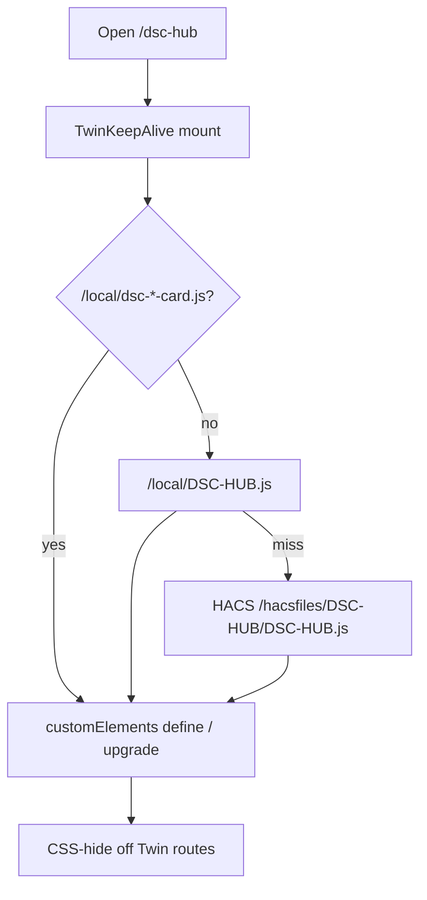

# LIVE-UI — DSC-HUB custom panel (surface 7.1.x)

React + Vite product panel hosted inside Home Assistant (WashData pattern).

| Surface | Role |
|---|---|
| Sidebar | **DSC-HUB** → `/dsc-hub` (custom panel) |
| Deep routes | Hash routes: `/dsc-hub#/live/mission`, `#/grow/compose`, `#/fleet`, … |
| Legacy redirects | `#/ops/*`, `#/plant/*`, `#/advanced/*`, `#/system` → Live/Grow/Tune/Fleet |
| Lovelace fallback | `dsc-hub-pro` YAML — `show_in_sidebar: false` |
| Surface version (operator SoT) | `sensor.dsc_ha_surface_version` from `packages/dsc_v4_version.yaml` (**7.1.3** on tip) |
| Integration bookkeeping | `SURFACE_VERSION` in `const.py` (**7.1.4** on tip — does **not** create the sensor) |
| Integration | `homeassistant/custom_components/dsc_hub/` |
| Enable | `dsc_hub:` in configuration.yaml (see snippet) |

**Lockstep pitfall:** package sensor, `SURFACE_VERSION`, and some TSX fallbacks can
drift (tip also has `7.1.1` fallbacks in Live/Tune pages while App chrome shows
`7.1.4`). Treat the **package template sensor** as operator truth; bump all three
when shipping a surface string.

## Dual path (React shell vs Lit Twin)

| Surface | Ships via | Notes |
|---|---|---|
| React `/dsc-hub` shell | Sync → `custom_components/dsc_hub` | Plant Seat + honesty rail are panel-only |
| Lit Twin / maps / Build | `homeassistant/www/*.js` → `/local` **or** HACS `dist/` | Prefer dedicated `/local/dsc-*-card.js` |

### Twin keep-alive + card inject

`TwinKeepAlive` mounts once and persists `dsc-the-dash-card` across routes.
`ensureLocalCards.ts` injects **dedicated** `/local/dsc-*-card.js` first, then
umbrella `/local/DSC-HUB.js`, then HACS `/hacsfiles/DSC-HUB/DSC-HUB.js`
(cache-bust `BUNDLE_V`, tip `7.1.4-corpus-chip2`).



- Remount only if the host is lost. Leaving Twin must **not** cold-dispose WebGL.
- Missing card → deploy Sync www or HACS Redownload, then hard-refresh.
- Prefer `/local` when HACS and Sync disagree — dedicated `/local` wins first.
- After www edits: `bash scripts/sync-hacs-dist.sh && git diff --stat -- dist/`
  must be empty. See [`scripts/HACS-FRONTEND.md`](../../scripts/HACS-FRONTEND.md).
- Main tent LIGHT / amber glow: window binary until GPIO5 lamp — 
  [`AIRFLOW-MAP-LIGHT-ENTITIES.md`](AIRFLOW-MAP-LIGHT-ENTITIES.md).

## Build

Prefer the local-disk script (NAS shares stall `npm`):

```powershell
powershell -ExecutionPolicy Bypass -File scripts/build-dsc-hub-panel.ps1
```

Manual:

```bash
cd homeassistant/custom_components/dsc_hub/frontend
npm install
npm run build   # emits www/dsc-hub-panel.js (CSS inlined)
```

After Twin/Dash edits, concat the HACS/Sync umbrella from `homeassistant/www/`
(`system-map` → `airflow` → three → dash-fx → dash → build → **app-nav** →
**catalog-browse**), keep dedicated `dsc-*-card.js` in sync, and hard-reload
Lovelace/panel.

## Visual system (7.1)

Sharper contrast: lifted indigo-slate · **blue/cyan** active chrome · green = live/ON only ·
amber HELD/stale · Twin leaders + cyan Got markers / cyan intake piping (no dank `#39ff14` brand wash).

## Pass 7.1.1 finish gaps (this patch)

- [x] Panel/beat OFF duration chips (`PANEL OFF Xm` / `BEAT OFF Xm`) when dark
- [x] Root Rate column (`sensor.dsc_pot{N}_soil_moisture_rate`)
- [x] Learned-EC honesty subtitle on seat Got history + Analytics P1 EC (attrs only; never invent)
- [x] Twin on-scene pot glass chips + cyan intake/path bias; Node-concat `DSC-HUB.js` (~1.0MB)
- [x] Research/Compose empty honesty + Use-in-Compose / Open Seat CTAs
- [ ] Live blip soak (HELD + OFF timer + reconnect) — **needs logged-in HA after sync** (agent browser hit auth/loading wall)
- [ ] Climate airflow-map after `/local/DSC-HUB.js` hard reload — **needs deploy**; bundle includes `dsc-airflow-map-card` define

## Pass 7.1 acceptance

- [x] Hub/API blip: KPIs/gauges **hold last good** + HELD; chips **HUB OFFLINE** + **OFF Xm** (no `0.0` wipe) — code path shipped; live flap soak operator
- [ ] Reconnect: chips green; values snap live; charts reseed — operator after sync
- [x] Click Tent T gauge → History drawer; 1h|6h|24h|48h reloads series
- [x] Apply Main/Clone/Unassigned from seat — no Invalid option
- [x] Live tabs include **Main** + **Clone** cockpits
- [x] Root fleet matrix dryback/EC/Need/**Rate**; seat edits name/sprout/stage without Compose
- [x] Climate hosts airflow-map + allocated CFM honesty
- [x] Learning shows learn status / CFM alloc vs nameplate
- [x] Active chrome blue/cyan
- [x] `sensor.dsc_ha_surface_version` ships from package (tip **7.1.3**; live HA after package reload) — keep lockstep with `SURFACE_VERSION` / App chrome when bumping

## Pass 7.0 acceptance (still)

- [x] Primary tabs Live / Grow / Tune / Fleet
- [x] Default `#/live/mission` + NextRecommended
- [x] Twin keep-alive across tabs
- [x] Grow Compose → Research → Roster
- [x] Honesty rail + reduced-kit / keepup / OOS
- [x] Legacy `#/ops/*` redirects

## Pass 3 / prior

- [x] Dual-axis charts, Want overlays, gauges, Full Auto / fans / in-service still work
- [x] Twin HUD callouts both tents with RH band + VPD mini + leaders
