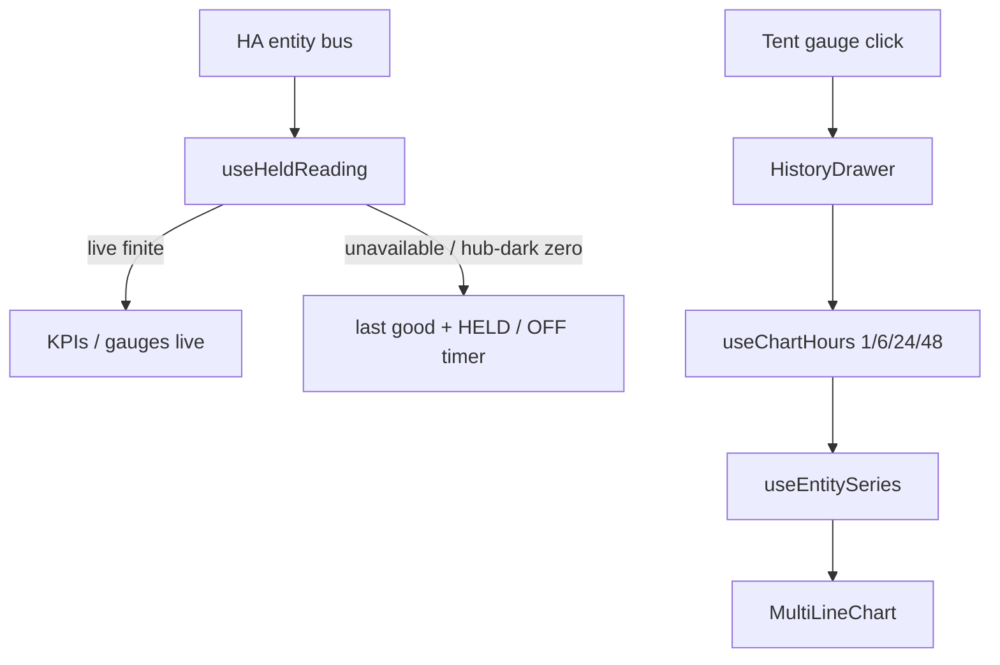

# LIVE-UI — DSC-HUB custom panel (surface 7.1.0)

React + Vite product panel hosted inside Home Assistant (WashData pattern).

| Surface | Role |
|---|---|
| Sidebar | **DSC-HUB** → `/dsc-hub` (custom panel) |
| Deep routes | Hash routes: `/dsc-hub#/live/mission`, `#/grow/compose`, `#/fleet`, … |
| Legacy redirects | `#/ops/*`, `#/plant/*`, `#/advanced/*`, `#/system` → Live/Grow/Tune/Fleet |
| Lovelace fallback | `dsc-hub-pro` YAML — `show_in_sidebar: false` |
| Surface version | `sensor.dsc_ha_surface_version` **7.1.0** |
| Integration | `homeassistant/custom_components/dsc_hub/` |
| Enable | `dsc_hub:` in configuration.yaml (see snippet) |
| Version trains | [`VERSION-TRAINS.md`](VERSION-TRAINS.md) — do not conflate with firmware **5.2.0** |

## Architecture (7.1 hold-last + history)



| Piece | Path | Behavior (verified) |
|---|---|---|
| Hold-last vitals | `frontend/src/hooks/useHeldReading.ts` | UI-only last-known-good; never writes fake HA states; never maps unavailable → `0`. Hub-dark + suspicious `0` keeps prior hold. |
| Offline timer | `useHubOfflineMs()` | Uses `sensor.dsc_hub_uptime` `last_changed` when hub uptime unavailable. |
| History drawer | `frontend/src/components/HistoryDrawer.tsx` | Slide drawer + `1h\|6h\|24h\|48h` timespan (`sessionStorage` key `dsc_chart_hours`). |
| Tent cockpits | Live pages Main/Clone | Climate cockpits restored under Live; seat Apply Main/Clone/Unassigned. |

## Build

Prefer the local-disk script (NAS shares stall `npm`):

```powershell
powershell -ExecutionPolicy Bypass -File scripts/build-dsc-hub-panel.ps1
```

Manual:

```bash
cd homeassistant/custom_components/dsc_hub/frontend
npm install
npm run build   # emits www/dsc-hub-panel.js (CSS inlined)
```

After Twin/Dash edits, concat `/local/DSC-HUB.js` from `homeassistant/www/` card order
(`dsc-system-map` → `dsc-airflow-map` → three → dash-fx → dash → build → catalog → app-nav)
and hard-reload Lovelace/panel.

## Visual system (7.1)

Sharper contrast: lifted indigo-slate · **blue/cyan** active chrome · green = live/ON only ·
amber HELD/stale · Twin leaders + cyan Got markers (no dank `#39ff14` brand wash).

## Pass 7.1 acceptance

- [ ] Hub/API blip: KPIs/gauges **hold last good** + HELD; chips **HUB OFFLINE** + **OFF Xm** (no `0.0` wipe)
- [ ] Reconnect: chips green; values snap live; charts reseed
- [ ] Click Tent T gauge → History drawer; 1h|6h|24h|48h reloads series
- [ ] Apply Main/Clone/Unassigned from seat — no Invalid option
- [ ] Live tabs include **Main** + **Clone** cockpits
- [ ] Root fleet matrix dryback/EC/Need; seat edits name/sprout/stage without Compose
- [ ] Climate hosts airflow-map + allocated CFM honesty
- [ ] Learning shows learn status / CFM alloc vs nameplate
- [ ] Active chrome blue/cyan
- [ ] `sensor.dsc_ha_surface_version` = **7.1.0**

## Pass 7.0 acceptance (still)

- [ ] Primary tabs Live / Grow / Tune / Fleet
- [ ] Default `#/live/mission` + NextRecommended
- [ ] Twin keep-alive across tabs
- [ ] Grow Compose → Research → Roster
- [ ] Honesty rail + reduced-kit / keepup / OOS
- [ ] Legacy `#/ops/*` redirects

## Pass 3 / prior

- [ ] Dual-axis charts, Want overlays, gauges, Full Auto / fans / in-service still work
- [ ] Twin HUD callouts both tents with RH band + VPD mini + leaders
