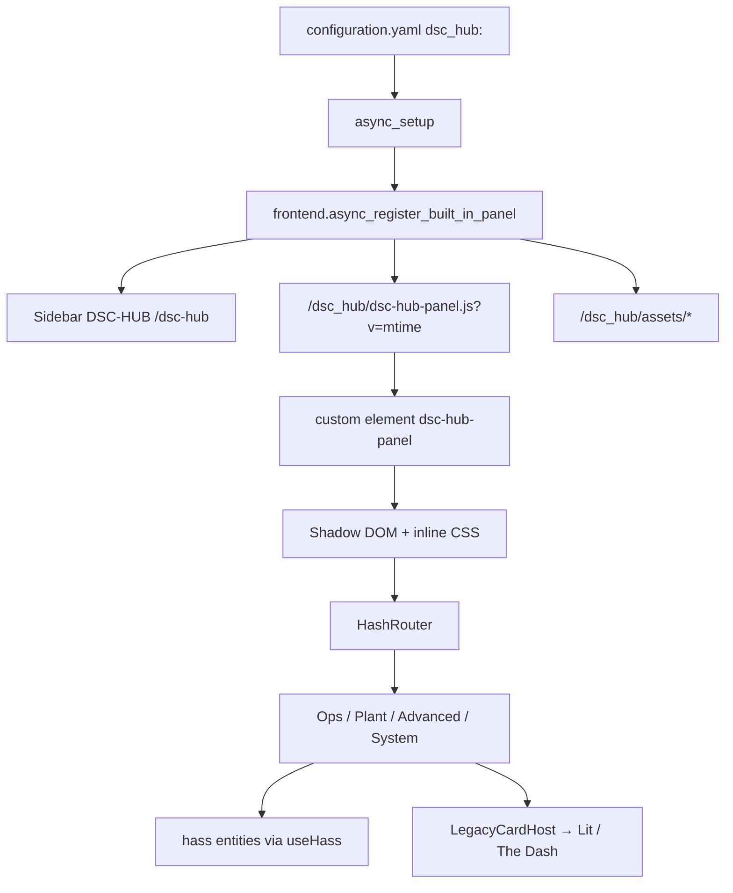

# LIVE-UI — DSC-HUB custom panel (surface 6.0.0)

Operator / developer runbook for the **React + Vite** Home Assistant custom
panel that owns the sidebar product shell (WashData-style built-in panel).

HA remains the **lab scaffold** ([`docs/HA-SCAFFOLD.md`](../HA-SCAFFOLD.md)).
Section jobs still match [`docs/brain/WEBUI.md`](../brain/WEBUI.md) /
N-086; this surface moves the chrome from Lovelace YAML to a registered panel.

| Surface | Role |
|---|---|
| Sidebar | **DSC-HUB** → `/dsc-hub` (integration `dsc_hub`) |
| Deep routes | HashRouter: `/dsc-hub#/ops/home`, `#/plant/catalog`, … |
| Lovelace fallback | `dsc-hub-pro` YAML — `show_in_sidebar: false` |
| Surface version | `sensor.dsc_ha_surface_version` **6.0.0** |
| Integration version | `manifest.json` **0.1.0** (`const.SURFACE_VERSION` **6.0.0**) |
| Enable | `dsc_hub:` in `configuration.yaml` (see snippet) |
| Fleet expected | `input_text.dsc_expected_release` initial **5.2.0** |
| Prior shell | [`LIVE-UI-PRODUCT-SHELL.md`](LIVE-UI-PRODUCT-SHELL.md) (Lovelace N-086) |

## Intent

- One sidebar entry that opens a dedicated product UI, not a Lovelace title.
- Keep Ops · Plant · Advanced · System primary tabs + secondary page tabs.
- Native React pages for live KPIs / charts; host heavy Lit/Three cards via
  `LegacyCardHost` until those views are rewritten.
- Sync ships Python + built `www/` assets; developers rebuild the JS bundle
  when frontend sources change.

## Architecture



| Path | Job |
|---|---|
| `custom_components/dsc_hub/__init__.py` | YAML domain setup; register panel |
| `frontend.py` | Static paths + `async_register_built_in_panel` (cache-bust mtime) |
| `const.py` | `PANEL_URL_PATH=dsc-hub`, `PANEL_ELEMENT=dsc-hub-panel`, URLs |
| `frontend/` | Vite React app (`panel-element.tsx` → lib build) |
| `www/dsc-hub-panel.js` | Built ES module (CSS inlined into shadow) |
| `www/assets/` | Brand / icons / gauges served at `/dsc_hub/assets` |

Constraints verified in code:

- `config_flow: false` — enable only via YAML `dsc_hub:`.
- Panel JS **must exist** at setup or registration fails (logged error).
- `embed_iframe: false`, `trust_external: false`, `require_admin: false`.
- Hash routing (not path routing) so HA keeps `/dsc-hub` as the panel URL.
- `LegacyCardHost` needs the tag already in `customElements` (usually from
  `/local` / HACS `DSC-HUB.js` bundle). Otherwise it shows a muted “not loaded”
  message — open once from Lovelace or ensure the www bundle is registered.

## Route map

Default landing: `/dsc-hub#/ops/home` (`/` and unknown paths redirect there).

| Section | Hash path | Implementation notes |
|---|---|---|
| Ops Home | `#/ops/home` | Native KPIs + live tent temp chart |
| Ops Dash | `#/ops/dash` | `LegacyCardHost` → `dsc-the-dash-card` |
| Ops Climate | `#/ops/climate` | Native KPIs + temp/RH series |
| Ops tents | `#/ops/main-4x8`, `#/ops/clone-2x4` | Zone boards |
| Ops Root zone | `#/ops/root-zone` | Native + coldest-root helper |
| Ops Tank | `#/ops/tank` | Hosts `dsc-system-map-card` |
| Ops Lighting | `#/ops/lighting` | Expected light hours sensor |
| Plant hub | `#/plant` | Links to Build / Catalog / seats |
| Plant Build | `#/plant/build` | `dsc-build-plant-card` |
| Plant Catalog | `#/plant/catalog` | `dsc-catalog-browse-card` |
| Plant Strains / Nutrient | `#/plant/strains`, `#/plant/nutrient` | Scaffold links (helpers still HA) |
| Advanced | `#/advanced/learning\|trends\|history` | Status / live trends / honesty note |
| System | `#/system` | Hub link, surface, fleet chip, alerts |

HA ↔ future web section jobs remain as in N-086 / WEBUI; only the HA URL
prefix changed from `/dsc-hub-pro/…` to `/dsc-hub#/…`.

## Build

Committed tree includes a prebuilt `www/dsc-hub-panel.js`. Rebuild after
editing `frontend/src`:

```bash
cd homeassistant/custom_components/dsc_hub/frontend
npm install
npm run build   # Vite lib → ../www/dsc-hub-panel.js (+ .map); CSS inlined
```

Vite notes (`vite.config.ts`):

- `emptyOutDir: false` — does not wipe `www/assets/`
- `inlineDynamicImports: true` — single ES module
- Prefer a **local disk** checkout if the NAS share stalls `npm`

Do **not** sync `frontend/node_modules` to HA (Sync strips it).

## Deploy

### Config once

1. Merge [`homeassistant/configuration.snippet.yaml`](../../homeassistant/configuration.snippet.yaml):
   - `dsc_hub:`
   - packages include
   - Lovelace `dsc-hub-pro` with `show_in_sidebar: false` (title **DSC-HUB (YAML)**)
2. Ensure www / HACS bundle still registers Lit cards used by `LegacyCardHost`.
3. **Check configuration** → **Restart HA Core** so the custom component loads
   and the sidebar panel registers. Package reload alone does not register panels.

### Ongoing sync

| Path | Copies `custom_components/dsc_hub` |
|---|---|
| `scripts/ha-sync.sh` | Python + `www/dsc-hub-panel.js` + `www/assets/` |
| Sync add-on `dsc-hub-sync.sh` | Full tree minus `frontend/node_modules` |

After JS rebuild: sync → hard-reload the browser (mtime query param busts
module cache). After Python/`dsc_hub:` changes: restart Core.

### Version markers

| Marker | Value in tree |
|---|---|
| `sensor.dsc_ha_surface_version` | **6.0.0** |
| Package attribute `dashboard` | custom panel `/dsc-hub` React+Vite |
| Package attribute `lovelace_fallback` | `dsc-hub-pro` YAML (sidebar hidden) |
| `input_text.dsc_expected_release` initial | **5.2.0** |
| Fleet chip | optional `sensor.dsc_bridge_esphome_version` — missing does not fail fleet |

## Troubleshooting

| Symptom | Likely cause | Fix |
|---|---|---|
| No **DSC-HUB** sidebar entry | `dsc_hub:` missing or Core not restarted | Merge snippet; restart Core |
| Panel blank / console 404 on JS | `www/dsc-hub-panel.js` not synced | Rebuild + sync; check `/dsc_hub/dsc-hub-panel.js` |
| Setup log: panel did not register | Missing built JS at integration path | Run `npm run build`; sync `www/` |
| Dash / Build / Catalog muted “not loaded” | Lit tag not in `customElements` | Register `/local` HACS bundle; open Lovelace once |
| Two DSC-HUB entries | Old snippet still `show_in_sidebar: true` on YAML dash | Merge current snippet (YAML sidebar false) |
| Stale UI after sync | Browser cached old module | Hard reload; confirm `?v=` mtime changed |
| Icons / brand missing | Assets path not synced | Sync `www/assets/` → `/dsc_hub/assets` |

## Acceptance

- [ ] Sidebar **DSC-HUB** opens `/dsc-hub` (not Lovelace YAML title)
- [ ] `sensor.dsc_ha_surface_version` = **6.0.0**
- [ ] Primary tabs Ops · Plant · Advanced · System
- [ ] Secondary tabs update hash routes
- [ ] Ops Home shows hub/climate KPIs when entities are live
- [ ] `#/ops/dash` mounts The Dash when www bundle is loaded
- [ ] `#/plant/build` + `#/plant/catalog` mount legacy cards when registered
- [ ] Graphs pulse on live series; buttons depress on press
- [ ] WashData / Overview / Frigate unchanged
- [ ] Narrow viewport reflows tiles without breaking desktop layout
- [ ] YAML `dsc-hub-pro` still reachable but hidden from sidebar

Related: [`LIVE-UI-PRODUCT-SHELL.md`](LIVE-UI-PRODUCT-SHELL.md) ·
[`LIVE-UI-BUILD-A-PLANT.md`](LIVE-UI-BUILD-A-PLANT.md) ·
[`CATALOG-RESEARCH-CORPUS.md`](CATALOG-RESEARCH-CORPUS.md) · FOLLOWUPS custom panel **6.0.0**
