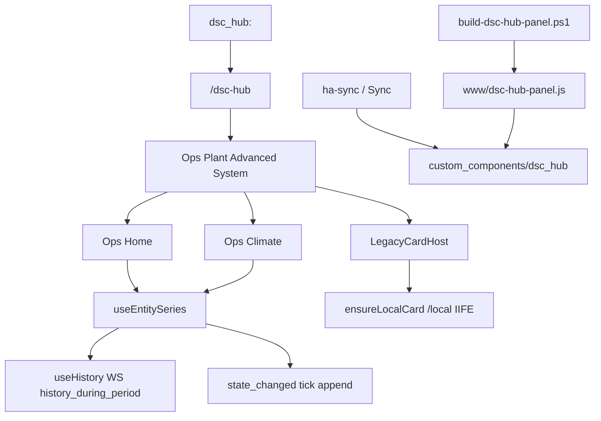

# LIVE-UI — DSC-HUB custom panel (surface 6.1.0)

React + Vite product panel hosted inside Home Assistant (WashData pattern).

| Surface | Role |
|---|---|
| Sidebar | **DSC-HUB** → `/dsc-hub` (custom panel) |
| Deep routes | Hash routes: `/dsc-hub#/ops/home`, `#/plant/catalog`, … |
| Lovelace fallback | `dsc-hub-pro` YAML — `show_in_sidebar: false` |
| Surface version | `sensor.dsc_ha_surface_version` **6.1.0** |
| Integration | `homeassistant/custom_components/dsc_hub/` |
| Enable | `dsc_hub:` in configuration.yaml (see snippet) |

## Intent

Replace the Lovelace sidebar product shell with a built-in HA panel while keeping
YAML `dsc-hub-pro` as a hidden fallback. **6.1.0** (Pass 2) adds history-seeded
Ops charts, denser Ops Home / Climate KPIs, demand-toggle polish, and automatic
`/local` IIFE inject so Dash / Catalog / Build cards work without visiting Lovelace first.

## Build

Prefer the local-disk script (NAS shares stall `npm`):

```powershell
pwsh -File scripts/build-dsc-hub-panel.ps1
```

This copies `frontend/` → `%TEMP%`, runs `npm ci` + `npm run build`, then copies
`dsc-hub-panel.js` (+ map/assets) back to `homeassistant/custom_components/dsc_hub/www/`.

Manual equivalent:

```bash
cd homeassistant/custom_components/dsc_hub/frontend
npm install
npm run build   # emits www/dsc-hub-panel.js (CSS inlined)
```

**Constraint:** Sync / `ha-sync.sh` copy the built `www/` bundle — they do **not**
compile the Vite frontend. Ship `dsc-hub-panel.js` in git (or build before deploy).

## Deploy

`scripts/ha-sync.sh` syncs `custom_components/dsc_hub` (Python + www + assets).
Then: HA **Developer Tools → YAML → Check configuration** → restart Core
(or reload custom integrations if supported) so the panel registers.

**Note:** the `dsc-hub-sync` add-on image still needs a rebuild to pick up
`custom_components` staging from git. Panel JS under `/local` / integration
`www` updates on sync after the Python package is present.

## Configuration snippet

```yaml
# configuration.yaml
dsc_hub:
```

Panel registration lives in `custom_components/dsc_hub/` (`PANEL_URL_PATH = dsc-hub`,
element `dsc-hub-panel`). Surface string is dual-sourced:

| Location | Value |
|---|---|
| `custom_components/dsc_hub/const.py` → `SURFACE_VERSION` | `6.1.0` |
| `packages/dsc_v4_version.yaml` → `sensor.dsc_ha_surface_version` | `6.1.0` |

Do **not** conflate with firmware train **5.2.0** (`input_text.dsc_expected_release`).

## Architecture (Pass 2)



### History-seeded charts

| Piece | Path | Behavior |
|---|---|---|
| `useHistory` | `frontend/src/hooks/useHistory.ts` | One-shot WS `history/history_during_period` (default **6h**, downsample ≤**96** pts) |
| `useEntitySeries` | `frontend/src/hooks/useEntitySeries.ts` | Merges history seed + live appends on DSC `state_changed` |
| `HassProvider` | `frontend/src/hooks/useHass.tsx` | Subscribes `state_changed`; `tick` bumps only for DSC / `input_*` entities |

Cold open of `/dsc-hub#/ops/home` should paint tent T/RH sparklines from history within seconds even before the next live sample. Live appends throttle same-value updates to ≥4s.

**Consumers:** `OpsHomePage`, `OpsPages` (Climate CFM / fan %), `AdvancedSystemPages`.

### Legacy card autoload

`LegacyCardHost` calls `ensureLocalCard(tag)` (`frontend/src/lib/ensureLocalCards.ts`)
when a Lit/Three custom element is not defined. Script candidates (first success wins):

1. `/local/DSC-HUB.js`
2. `/local/dsc-system-map-card.js`
3. `/hacsfiles/DSC-HUB/DSC-HUB.js`

Timeout **12s**. Missing tag → empty-state message; deploy the IIFE bundle or add a Lovelace resource, then hard-refresh. Operators no longer need to open Lovelace first for Dash / Catalog / Build embeds.

## Visual system

Black / gray / neon green / white · tabbed primary+secondary · press feedback ·
soft shadows · history-seeded glowing charts · demand toggles with neon ON edge ·
desktop-first grid with narrow tile reflow.

## Pass 2 acceptance

- [ ] Cold open `/dsc-hub#/ops/home` — tent T/RH charts populate from history within seconds
- [ ] Status strip reflects hub / panel / beat / alerts / fleet
- [ ] Demand toggles (Heat/Cool/Hum/Dehum/Mat) call HA and match tent reality
- [ ] Pot ESP-NOW chips + manual takeover / fan override visible
- [ ] Ops · Climate shows VPD gauges + CFM / fan % KPIs and sparklines
- [ ] Ops · Dash / Plant · Catalog load without visiting Lovelace first (auto `/local` inject)
- [ ] `sensor.dsc_ha_surface_version` reads **6.1.0**
- [ ] WashData / Overview / Frigate / other non-DSC panels unchanged
- [ ] Narrow viewport tiles columns without breaking desktop layout

## Pass 1 (still true)

- [ ] Sidebar **DSC-HUB** opens `/dsc-hub` (not Lovelace YAML title)
- [ ] Primary tabs Ops · Plant · Advanced · System
- [ ] Secondary tabs navigate hash routes

## Troubleshooting

| Symptom | Likely cause | Fix |
|---|---|---|
| Sidebar missing / panel blank | Built JS not deployed or Core not restarted | Sync `custom_components/dsc_hub`, confirm `www/dsc-hub-panel.js`, restart Core |
| Charts empty on cold open | History WS denied / entity unavailable | Check recorder history for tent sensors; confirm API user can call `history/history_during_period` |
| Charts seed then freeze | `state_changed` filter miss | Entity id must match DSC / `input_*` patterns in `useHass` |
| Dash / Catalog / Build empty host | IIFE not under `/local` or HACS | Deploy `DSC-HUB.js` (or system-map card); hard-refresh after Sync |
| `npm` hangs on NAS | SMB latency | Use `scripts/build-dsc-hub-panel.ps1` (local `%TEMP%`) |
| Surface still shows 6.0.0 | Stale package / no Core restart | Confirm `dsc_v4_version.yaml` synced; restart Core |
| Dual sidebar | Old YAML still `show_in_sidebar: true` | Keep Lovelace Pro hidden; React panel owns sidebar |

## Deferred (Pass 3+)

- Native React Catalog / Build (retire `LegacyCardHost` dependency)
- Brain HTTP client in the panel
- Lovelace YAML removal once parity is proven

See also: [`LIVE-UI-PRODUCT-SHELL.md`](LIVE-UI-PRODUCT-SHELL.md), FOLLOWUPS **Custom panel surface 6.1.0**.
