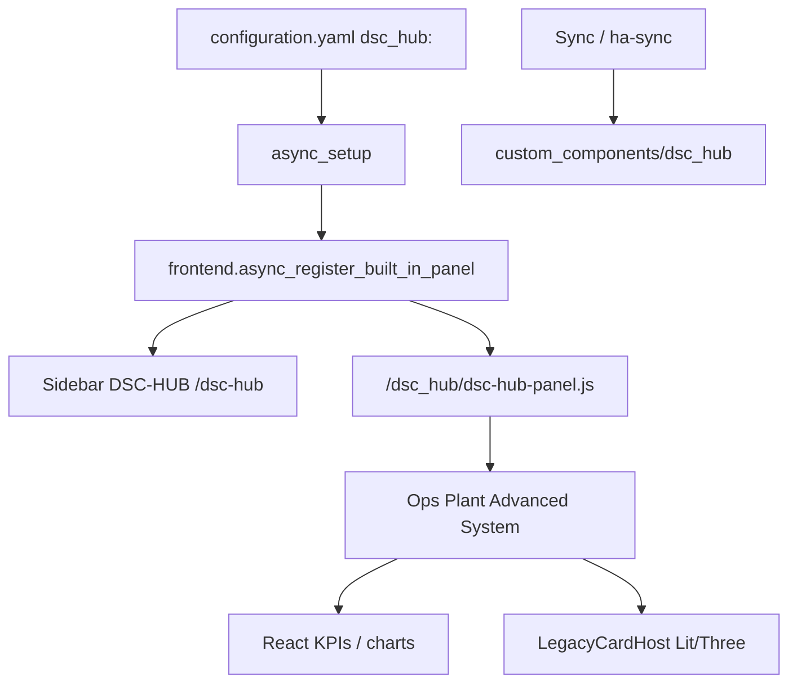

# LIVE-UI — DSC-HUB custom panel (surface 6.0.0)

Operator / developer runbook for the **React + Vite** Home Assistant custom
panel that owns the sidebar product shell (WashData-style built-in panel).

HA remains the **lab scaffold** ([`docs/HA-SCAFFOLD.md`](../HA-SCAFFOLD.md)).
Section jobs still match [`docs/brain/WEBUI.md`](../brain/WEBUI.md) /
N-086; this surface moves the chrome from Lovelace YAML to a registered panel.

| Surface | Role |
|---|---|
| Sidebar | **DSC-HUB** → `/dsc-hub` (integration `dsc_hub`) |
| Deep routes | HashRouter: `/dsc-hub#/ops/home`, `#/plant/catalog`, … |
| Lovelace fallback | `dsc-hub-pro` YAML — `show_in_sidebar: false` |
| Surface version | `sensor.dsc_ha_surface_version` **6.0.0** (`const.SURFACE_VERSION`) |
| Fleet expected | `input_text.dsc_expected_release` initial **5.2.0** (firmware train) |
| Integration | `homeassistant/custom_components/dsc_hub/` |
| Enable | `dsc_hub:` in `configuration.yaml` (see snippet) |
| Prior shell | [`LIVE-UI-PRODUCT-SHELL.md`](LIVE-UI-PRODUCT-SHELL.md) (Lovelace N-086) |

## Intent

- One sidebar entry that opens a dedicated product UI, not a Lovelace title.
- Keep Ops · Plant · Advanced · System primary tabs + secondary page tabs.
- Native React pages for live KPIs / charts; host heavy Lit/Three cards via
  `LegacyCardHost` until those views are rewritten.
- Sync ships Python + built `www/` assets; developers rebuild the JS bundle
  when frontend sources change.

## Architecture



## Build

```bash
cd homeassistant/custom_components/dsc_hub/frontend
npm install
npm run build   # emits www/dsc-hub-panel.js (CSS inlined)
```

Prefer building on a local disk if the NAS share stalls `npm`.
**Sync does not compile the Vite frontend** — commit / stage the built JS.

## Deploy

`scripts/ha-sync.sh` and Sync **5.1.4** copy `custom_components/dsc_hub`
(Python + `www/` + assets; not `frontend/node_modules`).
Then: HA **Developer Tools → YAML → Check configuration** → **restart Core**
so the panel registers (reload alone is not enough for built-in panels).

## Visual system

Black / gray / neon green / white · tabbed primary+secondary · press feedback ·
soft shadows · glowing live charts · desktop-first grid with narrow tile reflow.

## Pitfalls

| Symptom | Fix |
|---|---|
| No sidebar DSC-HUB | Missing `dsc_hub:` / built JS / Core restart |
| Lit cards muted | Stage www/HACS bundle (`DSC-HUB.js` concat); hard-refresh |
| Dual sidebar | Merge current `configuration.snippet.yaml` (`show_in_sidebar: false` on YAML Pro) |
| Surface vs firmware confusion | HA **6.0.0** ≠ hub firmware **5.2.0**; fleet expected tracks firmware |

## Acceptance

- [ ] Sidebar **DSC-HUB** opens `/dsc-hub` (not Lovelace YAML title)
- [ ] Primary tabs Ops · Plant · Advanced · System
- [ ] Secondary tabs navigate hash routes
- [ ] Ops Home shows hub/climate KPIs when entities are live
- [ ] Graphs pulse on live series; buttons depress on press
- [ ] WashData / Overview / Frigate unchanged
- [ ] Narrow viewport tiles columns without breaking desktop layout
- [ ] `sensor.dsc_ha_surface_version` = **6.0.0**
