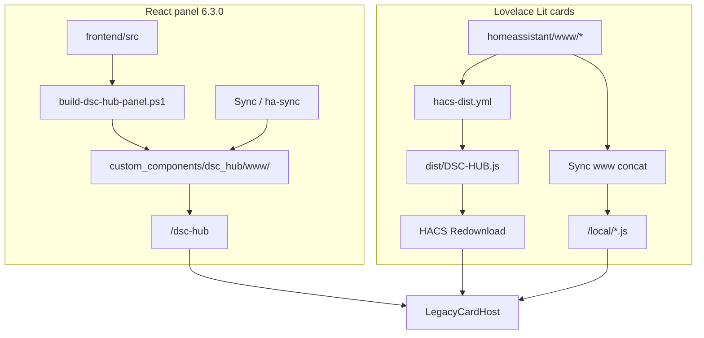
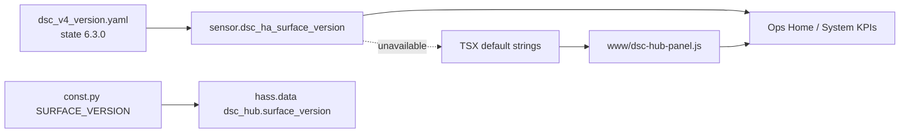
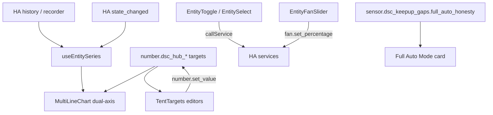
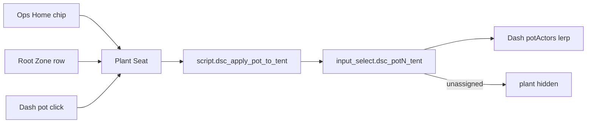

# LIVE-UI — DSC-HUB custom panel (surface 6.3.0)

React + Vite product panel hosted inside Home Assistant (WashData pattern).

| Surface | Role |
|---|---|
| Sidebar | **DSC-HUB** → `/dsc-hub` (custom panel) |
| Deep routes | Hash routes: `/dsc-hub#/ops/home`, `#/ops/climate`, `#/ops/plant-seat?pot=N`, `#/plant/catalog`, … |
| Lovelace fallback | `dsc-hub-pro` YAML — `show_in_sidebar: false` |
| Surface version | `sensor.dsc_ha_surface_version` **6.3.0** |
| Integration | `homeassistant/custom_components/dsc_hub/` |
| Enable | `dsc_hub:` in configuration.yaml (see snippet) |
| Pot → tent SoT | `packages/dsc_v4_pot_tent.yaml` → `input_select.dsc_potN_tent` |

Firmware train stays **5.2.0**. Do **not** put `6.3.0` into `input_text.dsc_expected_release`.
Version-train rules: [`VERSION-TRAINS.md`](VERSION-TRAINS.md).

## Intent (6.3)

Ship an **operable** Ops shell: dual-axis Want-aware charts, per-tent Want editors,
Full Auto / strategy / priority / fan / kit controls, consistent glass icons, and
stronger Dash/Build glow — without inventing climate math in the browser.

Verified tip: product `c0d9ebe` + HACS dist sync `dae4522`.

## Build

Prefer the local-disk script (NAS shares stall `npm`):

```powershell
powershell -ExecutionPolicy Bypass -File scripts/build-dsc-hub-panel.ps1
```

This copies `frontend/` → `%TEMP%`, runs `npm ci` + `npm run build`, then copies
`dsc-hub-panel.js` (+ map/assets) back to `homeassistant/custom_components/dsc_hub/www/`.

Manual equivalent:

```bash
cd homeassistant/custom_components/dsc_hub/frontend
npm install
npm run build   # emits www/dsc-hub-panel.js (CSS inlined)
```

## Deploy (two paths — do not conflate)



| Artifact | Source of truth | How it lands |
|---|---|---|
| Panel JS (`dsc-hub-panel.js`) | `custom_components/dsc_hub/frontend/` → Vite build | Sync / `ha-sync` copies `custom_components/dsc_hub` |
| Lit cards (Dash / Build / maps) | `homeassistant/www/*.js` | Sync www concat **or** HACS `dist/DSC-HUB.js` |
| HACS `dist/` | Built from `www/` by `scripts/sync-hacs-dist.sh` | CI [`.github/workflows/hacs-dist.yml`](../../.github/workflows/hacs-dist.yml) on `master` pushes that touch `homeassistant/www/**` |
| Pot → tent helpers | `packages/dsc_v4_pot_tent.yaml` | Sync packages; **Core restart once** for new `input_select` |
| Surface string | `packages/dsc_v4_version.yaml` | Sync packages; Core restart / template reload |

**Note:** the `dsc-hub-sync` add-on image still needs a rebuild to pick up
`custom_components` staging from git. Panel JS under integration `www`
updates on sync after the Python package is present. Sync does **not** compile Vite.

After editing Dash / Build under `homeassistant/www/`, either wait for the
`HACS dist` workflow commit (`chore(hacs): sync dist/ from homeassistant/www`)
or run `./scripts/sync-hacs-dist.sh` locally before expecting HACS Redownload
to pick up the change. Plant Seat remains **panel-only** (not in the HACS bundle).

## Surface version lockstep (`c0d9ebe`)

Three strings must stay equal when shipping a surface bump. They are **not**
automatically linked.

| Layer | Path | Role |
|---|---|---|
| Package sensor (operator SoT) | `packages/dsc_v4_version.yaml` → `sensor.dsc_ha_surface_version` | What ops read; fleet chip attributes report it but do **not** score it |
| Integration constant | `custom_components/dsc_hub/const.py` → `SURFACE_VERSION` | Written to `hass.data["dsc_hub"]["surface_version"]` on `async_setup` — bookkeeping only; **not** the sensor |
| Panel UI fallbacks | `frontend/src/**` (`state(…, "6.3.0")`, App shell `SURFACE 6.3.0`) + rebuilt `www/dsc-hub-panel.js` | Shown when the sensor is missing / unavailable |



### Constraints

- `SURFACE_VERSION` does **not** create or update `sensor.dsc_ha_surface_version`.
  Changing only `const.py` leaves the package sensor and KPI fallbacks stale.
- UI `state("sensor.dsc_ha_surface_version", "6.3.0")` uses the second arg only
  when HA has no state — a live sensor still wins after Sync packages.
- `manifest.json` `version` (`0.1.0`) is the integration package version, **not**
  the product surface string.
- Firmware train / `input_text.dsc_expected_release` stay on **5.2.0**.

### Bump procedure

1. Set `state: "X.Y.Z"` (+ attributes) in `packages/dsc_v4_version.yaml`.
2. Set `SURFACE_VERSION = "X.Y.Z"` in `custom_components/dsc_hub/const.py`.
3. Grep/update hardcoded `"X.Y.Z"` / `SURFACE X.Y.Z` under
   `custom_components/dsc_hub/frontend/src/`.
4. Rebuild panel: `powershell -ExecutionPolicy Bypass -File scripts/build-dsc-hub-panel.ps1`.
5. Sync `packages/` + `custom_components/dsc_hub` → **Core restart** (Python
   constant + template sensor) → hard-refresh `/dsc-hub`.
6. If Dash/Build Lit cards changed under `homeassistant/www/`, ensure `dist/`
   sync (`hacs-dist.yml` or `./scripts/sync-hacs-dist.sh`) then HACS Redownload.
7. Smoke: sensor = `X.Y.Z`; System Overview Surface KPI matches; App shell
   shows `SURFACE X.Y.Z` even if you temporarily disable the template sensor.

### Operator smoke (lockstep)

1. After Sync + Core restart, `sensor.dsc_ha_surface_version` = **6.3.0**.
2. `/dsc-hub#/system/overview` Surface KPI = **6.3.0** (same as Ops Home).
3. App chrome shows `SURFACE 6.3.0` (bundled fallback / label).
4. Confirm `input_text.dsc_expected_release` is still **5.2.0** (firmware).

## Architecture — operable charts + controls



### Want entities (`TentTargets.tsx`)

| Tent | Temp | RH min/max | VPD min/max | Got sensors |
|---|---|---|---|---|
| Main | `number.dsc_hub_target_temp` | `number.dsc_hub_rh_target_min` / `_max` | `number.dsc_hub_vpd_target_min` / `_max` | `sensor.dsc_hub_tent_temperature` / `_humidity` / `_vpd_kpa` |
| Clone | `number.dsc_hub_clone_target_temp` | `number.dsc_hub_clone_rh_min` / `_max` | `number.dsc_hub_clone_vpd_min` / `_max` | `sensor.dsc_hub_clone_temperature` / `_humidity` / `_vpd_kpa` |

Editors commit on blur / Enter via `number.set_value` (clamped to entity min/max/step).
Charts overlay Want T (left axis) and RH band (right axis) from the **same** tent numbers.

### Full Auto / mode / kit (Ops Home + Climate)

| Control | Entity | Service |
|---|---|---|
| Full Auto | `switch.dsc_hub_tent_full_auto_mode` | toggle |
| Manual / master takeover | `switch.dsc_hub_manual_takeover` | toggle |
| Fan override | `switch.dsc_hub_tent_manual_override` | toggle |
| Hum intake routing | `switch.dsc_hub_humidifier_intake_routing` | toggle |
| RECIRC de-strat | `switch.dsc_hub_recirc_de_strat_pulse` | toggle |
| Strategy | `select.dsc_hub_control_strategy` | `select.select_option` |
| Priority tent | `select.dsc_hub_priority_tent` | `select.select_option` |
| AC / mister / pots in service | `input_boolean.dsc_ac_in_service`, `dsc_clone_humidifier_in_service`, `dsc_pot{1..4}_in_service` | toggle |
| Honesty chip | `sensor.dsc_keepup_gaps` attr `full_auto_honesty` + `binary_sensor.dsc_reduced_kit` | read-only |

Fan % sliders (when Fan override is meaningful):

- `fan.dsc_hub_4_inch_intake_fan_main`
- `fan.dsc_hub_4_inch_intake_fan_2x4`
- `fan.dsc_hub_6_inch_exhaust_room`
- `fan.dsc_hub_6_inch_exhaust_outside`

via `fan.set_percentage`. Hub firmware still reasserts the curve while Full Auto owns fans — override is the unlock path (see HA README ownership table).

### Chart data path

`useEntitySeries(entityId)` seeds from HA history (~6 h / 96 points default) then
appends live points on `state_changed`. Empty charts usually mean recorder denied
to the panel user — not a missing Want overlay.

## Visual system (6.3.0)

Black / gray / neon green / teal / amber / white · glass HUD · tabbed primary+secondary ·
slide-out search drawers · overflow ⋯ / gear actions · press feedback · soft shadows ·
dual-axis glowing charts with time axis + hover + Want bands · Full Auto Mode card ·
per-tent Want editors · demand toggles with neon ON edge · desktop-first grid
with narrow tile reflow · Plant Seat (soil / age / tent apply) · Dash world HUD callouts.

Inspiration north star: [`docs/assets/README.md`](../assets/README.md)
(`inspiration/ops-dash-*.png`, `build-a-plant-flow.png`).

## Plant Seat + pot → tent placement

**Intent:** per-pot detail (soil / age / recipe / live Got) and digital-twin tent
placement. Moves the plant on The Dash. Does **not** rewrite climate Want, ESP IDs,
or invent feed schedules / PPFD.

| Piece | Path / entity |
|---|---|
| Route | `/dsc-hub#/ops/plant-seat?pot=1..4` |
| Model | `frontend/src/lib/seatModel.ts` |
| Page | `frontend/src/pages/PlantSeatPage.tsx` |
| Tent SoT | `input_select.dsc_pot{1..4}_tent` ∈ `{unassigned, clone, main}` |
| Apply script | `script.dsc_apply_pot_to_tent` (`pot`, `tent`) |
| Dash consumer | `homeassistant/www/dsc-the-dash-card.js` → `readPotTent` + ~0.8s lerp |

Defaults (package initial): pots **1–2 → clone**, **3–4 → main**.



### Constraints (verified)

- Blend / recipe come from `sensor.dsc_plant_roster_summary` slots — empty when no roster join.
- Live Got reads pot soil sensors; unavailable / unknown → `—` (never invented NPK).
- Recipe text is catalog / roster only — no invented dose schedule.
- Apply tent validates pot `1–4` and tent ∈ `{unassigned, clone, main}`; invalid → persistent notification + stop.
- Dash falls back to card `cfg.pots[].tent` only when the `input_select` is missing / unavailable.

### Operator smoke

1. Sync packages + panel; restart Core once if `input_select.dsc_pot1_tent` is new.
2. Open `/dsc-hub#/ops/plant-seat?pot=1` — soil cross-section + identity chips render.
3. Apply **Main 4×8** → `input_select.dsc_pot1_tent` = `main` + notify `POT1 → main`.
4. Open Ops · Dash — pot1 lerps to main pad (~0.8s). Hard-refresh if Lit card is stale.
5. Apply **Unassigned** → plant actor hidden on Dash.
6. Confirm `sensor.dsc_ha_surface_version` = **6.3.0**.

## Pass 3 acceptance (6.3)

- [ ] Live climate: dual axes readable; X times present; hover shows time + T + RH
- [ ] Main/Clone charts use that tent’s Want overlays; edit Want → HA numbers update
- [ ] Gauges show band ticks, target, extrema; VPD in real kPa
- [ ] Full Auto + strategy + priority write HA; honesty chip on reduced kit
- [ ] Fan override ON → four fan % sliders write
- [ ] In-service toggles (AC / mister / pots) on Climate + System
- [ ] Seat tab icon ≠ Root; page headers + chips have icons; wordmark in brand row
- [ ] Search icon opens slide-out; settings/gear reachable; drawer close ≠ more
- [ ] Dash callouts both tents with RH band + VPD mini; bloom stronger
- [ ] `sensor.dsc_ha_surface_version` reads **6.3.0**
- [ ] `const.py` / panel fallbacks / package sensor all say **6.3.0** (no 6.2.0 drift)
- [ ] HACS Redownload (or Sync www) lands post-`dae4522` Dash/Build cards

## Pass 2 acceptance (still true)

- [ ] Cold open `/dsc-hub#/ops/home` — tent T/RH charts populate from history within seconds
- [ ] Status strip reflects hub / panel / beat / alerts / fleet
- [ ] Plant seat chips on Home open `/ops/plant-seat?pot=N`
- [ ] Demand toggles (Heat/Cool/Hum/Dehum/Mat) call HA and match tent reality
- [ ] Pot ESP-NOW chips + manual takeover / fan override visible
- [ ] Ops · Climate shows VPD gauges + CFM / fan % KPIs and sparklines
- [ ] Ops · Dash / Plant · Catalog load without visiting Lovelace first (auto `/local` inject)
- [ ] Ops · Dash pot click / chip → Plant Seat; Apply to tent lerps plant on Dash
- [ ] Plant · Build result chips + slide-out search; soil cross-section; Commit+assign
- [ ] `input_select.dsc_potN_tent` exists after package sync + Core restart
- [ ] WashData / Overview / Frigate / other non-DSC panels unchanged
- [ ] Narrow viewport tiles columns without breaking desktop layout

## Pass 1 (still true)

- [ ] Sidebar **DSC-HUB** opens `/dsc-hub` (not Lovelace YAML title)
- [ ] Primary tabs Ops · Plant · Advanced · System
- [ ] Secondary tabs navigate hash routes

## Pitfalls

- Blank panel → missing built `dsc-hub-panel.js` (Vite not run / Sync image too old).
- Charts empty → recorder/history denied to the panel user.
- Want edit no-ops → entity unavailable / wrong domain (must be `number.*`).
- Fan sliders fight the curve → Full Auto still owns fans until Fan override / Takeover.
- Dash plant stuck / no lerp → stale Lit card (HACS Redownload or Sync www + hard-refresh); or pot-tent package not loaded.
- Apply tent no-ops → script/helpers absent until Core restart after first package land.
- Stale HACS after www edit → wait for `chore(hacs): sync dist/…` on master, then Redownload.
- Surface string drift → package bumped but `SURFACE_VERSION` / TSX fallbacks left on
  an older `6.x` — always bump all three + rebuild `www/`.
- Do not conflate surface **6.3.0** with firmware **5.2.0**, or with
  `manifest.json` / Sync add-on versions.

## Related

- [`VERSION-TRAINS.md`](VERSION-TRAINS.md) — firmware vs surface
- [`scripts/HACS-FRONTEND.md`](../../scripts/HACS-FRONTEND.md) — Lovelace card install / dist sync
- [`LIVE-UI-BUILD-A-PLANT.md`](LIVE-UI-BUILD-A-PLANT.md) — composition card + catalog
- [`docs/FOLLOWUPS.md`](../FOLLOWUPS.md) — 2026-08-11 Dashboard 6.3 soak notes
