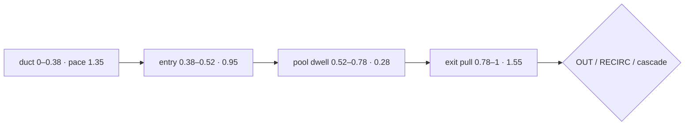
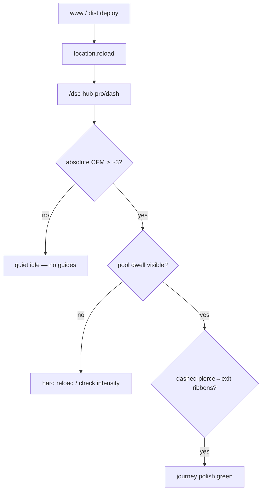

# Live UI — The Dash air journey polish

Operator / developer runbook for master commit `6d8e42e`: **phase-paced**
particle journeys (fast duct → slow mid-tent pool dwell → accelerating exhaust)
and **CFM-gated in-tent dashed guide ribbons** (pierce → exit). Verified against
`homeassistant/www/dsc-the-dash-card.js` (+ concatenated `dist/DSC-HUB.js` /
`dist/dsc-system-map-card.js`, ~914 KB).

**Prefer** this runbook for “why do particles linger in the tent?” and “what are
the dashed cyan/coral/violet lines inside the tents?”. Pair with FOLLOWUPS
**2026-08-06 — Air journey polish**.

Complements (does **not** replace) open cinematic draft
[`LIVE-UI-DASH-CINEMATIC-AIRFLOW.md`](LIVE-UI-DASH-CINEMATIC-AIRFLOW.md) when
merged (`3bed316` shafts/jets/streaks/lit room) and Pass B CFM honesty
([`LIVE-UI-DASH-PASS-BC-CFM.md`](LIVE-UI-DASH-PASS-BC-CFM.md) when merged).

## Intent

Make the HVAC story **feel** like a journey, not a constant-speed conveyor:

- Particles travel **fast on ducts**, **dwell in the mid-tent pool**, then
  **accelerate** toward the exhaust handoff
- Dashed **guide ribbons** show pierce → exit legs when that leg has CFM
- Intake **port jets** sit at the tent pierce (suck-in); exhaust jets stay at
  the port (suction)

## Codepaths

| Piece | Path | Role |
|---|---|---|
| Journey mapper + pace | `dsc-the-dash-card.js` → `journeyThroughTent`, `journeyPace` | Phase geometry + `speedAt` multiplier |
| Stream tick | `updateSystem(..., mapper, speedAt)` | Advances `phase` with `baseSpeed * pace` |
| Tent guides | `mkTentGuide` / `updateTentGuide` | 3 MeshLine ribbons via `fx.makeFlowRibbon` |
| Port jets | `mkFlowShaft` / `portJet` | Intake jet at curve `t≈0.92`; exhaust at `t≈0.04` |
| FX bridge | `vendor/dsc-dash-fx.js` → `makeFlowRibbon` | Dashed screen-space ribbons (`dashArray`) |
| Backlog stamp | `docs/FOLLOWUPS.md` | Air journey polish closeout |

## Journey contract (verified)

### Phase map (`journeyThroughTent`)

| Phase | `t` range | Geometry | Pace (`journeyPace`) |
|---|---|---|---|
| Duct | 0 – 0.38 | Sample intake curve | **1.35** (fast suck) |
| Entry | 0.38 – 0.52 | Pierce → just inside tent | **0.95** |
| Pool | 0.52 – 0.78 | Mid-lower settle / swirl | **0.28** (dwell) |
| Exit | 0.78 – 1 | Ease toward weighted exit | **1.55** (pull) |

`flowClone` exits to cascade; `flowMain` exits to OUT vs RECIRC by
`outShare` / `recircShare` (seed-weighted). Alias: `flowThroughTent = journeyThroughTent`.

### Other paced legs

| System | Pace note |
|---|---|
| `intakeClone` / `intakeMain` | Constant pace **1.2** (duct-only streaks, intensity soft-capped) |
| `cascade` | Duct **1.25** → pool **0.32** → exit **1.5** |
| `out` / `recirc` | Inside gather **0.55** → duct ride **1.45** |

Motion still uses Pass B: `intensity >= 0.04` after `cfmNorm(cfm, 80)`
(≈ **~3.2 CFM**). Idle shells OK at 0 CFM; particles / shafts / jets / guides off.

### In-tent guide ribbons

Built with `fx.makeFlowRibbon` (`radius: 0.03`, `dashArray: [0.09, 0.07]`),
opacity 0 until CFM gates them on:

| Key | Path | Color | Gate |
|---|---|---|---|
| `clone` | 2×4 pierce → pool → cascade port | cyan `0x81d4fa` | `intakeClone` |
| `mainOut` | 4×8 pierce → pool → OUT port | coral `0xff8a65` | `mainFlow * outShare + outVis*0.5` |
| `mainRec` | 4×8 pierce → pool → RECIRC port | violet `0xce93d8` | `mainFlow * recShare + recVis*0.5` |

Guides are **story cues**, not mass-balance sensors. Particle exits still follow
weighted shares; ribbon opacity follows the gate above.

### Port jets

- **Intakes:** cone at curve `t ≈ 0.92` (front-wall pierce), pointed along flow into tent
- **Exhaust:** cone at `t ≈ 0.04`, just inside the port (suction cue)
- Shaft / jet opacity bumped vs cinematic pass; jets pulse slightly with CFM

## Deploy + verify

1. Rebuild: `bash scripts/sync-hacs-dist.sh`
2. Land www via Sync poll **or** HACS **Redownload DSC-HUB System Map**
3. Bump Lovelace `?v=…` if sticky, then **hard-reload** (`location.reload()`)
4. Open `/dsc-hub-pro/dash` with absolute CFM &gt; ~3 (live or held)
5. Visual checks:
   - Particles **slow visibly** in mid-tent, then accelerate to exits
   - Dashed guide ribbons appear for active legs (clone cyan; main coral/violet)
   - Intake jets at pierce; OUT/RECIRC jets at ports
6. At 0 CFM: **no** particles / shafts / jets / guides; idle shells OK
7. Bundle stays cinematic band (~900–920 KB; this pass ~914 KB). Resource type classic **`js`**.

## Pitfalls

- **Pool looks “stuck”** — dwell pace **0.28** is intentional. Do not “fix” by
  flattening `journeyPace` to 1.0; that undoes the smoke-test story.
- **Missing guides with streams present** — guides need `DSCDashFX.makeFlowRibbon`
  (MeshLine path). If `FEATURES.tubeRibbonFallback` / FX bridge failed, guides
  silently stay null; streaks may still run.
- **Expecting guides at 0 CFM** — same honesty gate as particles (`intensity ≥ 0.04`).
- **Misreading coral/violet guides as OUT/RECIRC absolute CFM** — gates blend
  through-flow share with exhaust visual intensity; Pass B absolute CFM still
  owns motion truth.
- **SPA navigate after deploy** — hard-reload (black-canvas sticky custom element).
- **Do not** re-mount confined curl / ACH blue boxes, or fan-% fake motion at 0 CFM.

## Related

- Cinematic shafts / lit room (when merged): [`LIVE-UI-DASH-CINEMATIC-AIRFLOW.md`](LIVE-UI-DASH-CINEMATIC-AIRFLOW.md)
- Pass B/C CFM honesty (when merged): [`LIVE-UI-DASH-PASS-BC-CFM.md`](LIVE-UI-DASH-PASS-BC-CFM.md)
- FX API: [`../../homeassistant/www/vendor/dsc-dash-fx.md`](../../homeassistant/www/vendor/dsc-dash-fx.md)
- FOLLOWUPS: [`../FOLLOWUPS.md`](../FOLLOWUPS.md)
