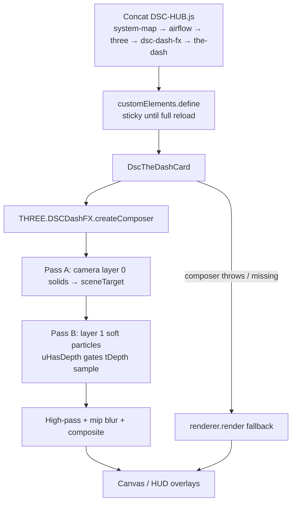

# The Dash — black-canvas triage + www reload discipline

Operator / developer runbook for **black 3D viewport** on
`/dsc-hub-pro/dash` (tents/ducts “gone”) while overlays / CFM chips still look
nominal — and the **hard-reload** rule after every Dash `www` deploy.

**Live incident (2026-08-05):** recorded in
[`docs/FOLLOWUPS.md`](../FOLLOWUPS.md) (*Dash tents black-canvas recovery* +
*Next Pass Full Inclusion closeout*). This page is the durable triage path.

**Does not replace:** allocated CFM / glTF accents (#21), ops-debt Home IDs
(#22), Sync cinematic guards (#19), light-quota (#27). Use those for their
subsystems.

| Surface | Expect |
|---|---|
| HA surface | **5.1.8**+ (Dash FX + allocated CFM consumers) |
| Bundle | Healthy concat **~855 KB+** (`DSC-HUB.js` / `dsc-system-map-card.js`) |
| Lovelace resource | Classic **`js`** (not module); cache-bust via `?v=` / `resources/update` |
| Operator | After any Dash `www` deploy → **hard-refresh** the Dash tab |

Sources (verify before changing guidance):

- [`homeassistant/www/dsc-the-dash-card.js`](../../homeassistant/www/dsc-the-dash-card.js)
- [`homeassistant/www/vendor/dsc-dash-fx.js`](../../homeassistant/www/vendor/dsc-dash-fx.js)
- [`homeassistant/www/vendor/dsc-dash-fx.md`](../../homeassistant/www/vendor/dsc-dash-fx.md)
- [`scripts/sync-hacs-dist.sh`](../../scripts/sync-hacs-dist.sh)

## Intent

The Dash is a cinematic Three.js scene inside a Lovelace custom card. Bloom /
soft-particle / curl paths go through a local `createComposer` FBO pipeline.
When that path mis-clears depth (or the browser keeps a stale
`customElements.define` class after a SPA cache-bust), **solids can fail while
HUD overlays keep updating** — operators read “climate OK, tents vanished.”

## Architecture (verified in tree)



### Composer + depth (source truth)

In `dsc-dash-fx.js` `createComposer`:

1. Allocates `sceneTarget` with `depthBuffer: true`.
2. **When `THREE.DepthTexture` exists**, constructs a `DepthTexture` and assigns
   `sceneTarget.depthTexture = depthTexture` (current tree **does attach**).
3. Render split:
   - **Pass A** — `camera.layers.set(0)` solids into the color+depth target
   - **Pass B** — `camera.layers.set(1)` soft materials; `syncSoftParticleUniforms`
     sets `uHasDepth` from whether `depthTexture` is non-null
4. Soft / curl shaders only sample `tDepth` when `uHasDepth > 0.5`; otherwise
   they keep the view-Z / opacity fade path.

`dsc-the-dash-card.js` wraps `createComposer` in try/catch — on throw, `post`
stays `null` and the tick falls back to `renderer.render(scene, camera)`
(bloom/soft FBO path skipped).

### Ops note vs tree (do not invent)

FOLLOWUPS closeout text says DepthTexture was **“safely detached by default”**
after the black-canvas incident. **Current `master` source still attaches**
`DepthTexture` inside `createComposer` whenever Three exposes the class. Treat
“default off” as an **ops residual to reconcile**, not as verified tree
behavior. Prefer these operator checks:

1. Are tents / ducts **solid and lit** (not haze-only / pure black)?
2. Did you **hard-reload** after the last `www` deploy?
3. Is the Lovelace resource still classic **`js`** and a healthy bundle size?

Do **not** use “soft particles soften against ducts” alone as a green check —
that path can look “alive” while opaques are broken.

## Sticky custom element (why navigate ≠ reload)

```js
if (!customElements.get(CARD_TYPE)) customElements.define(CARD_TYPE, DscTheDashCard);
```

HA SPA navigations and `location.href` cache-bust tricks **reuse the already
defined class**. New `www` bytes are ignored until a full document reload
(`location.reload()` / browser hard-refresh). That is why overlays can update
from hass state while the 3D class is still yesterday’s compositor.

## Operator triage

| Symptom | Likely cause | Action |
|---|---|---|
| Full black canvas; CFM/HUD OK | Stale custom element **or** composer/depth FBO failure | **Hard-refresh** Dash tab; if still black, check browser console + bundle size |
| Haze / particles only, tents missing | Depth+color FBO clear bug (WebKit/Chromium class of issue from 5 Aug) | Hard-refresh; if reproducible on current tree, file against `createComposer` DepthTexture attach — do not “fix” by re-enabling more depth features |
| Configuration error / blank card | Bundle stub / Sync demotion / wrong `res_type` | See Sync guards (#19); expect ≥500 KB; `res_type: js` |
| Fans/muffler stay primitives | Missing `/local/assets/dash/*.gltf` (N-035 Sync gap) | Expected; primitives are fallback — not a black-canvas failure |
| Works after reload, breaks after Sync push | Cache-bust without reload | Always `location.reload()` after Dash `www` lands |

### Checklist after every Dash www deploy

1. [ ] Sync / HACS / `ha-sync` finished; bundle bytes look healthy
2. [ ] Lovelace resource URL bumped (`?v=…`) **and** type is **`js`**
3. [ ] Open `/dsc-hub-pro/dash`
4. [ ] **Hard-refresh** (reload), do not only navigate from Home
5. [ ] Confirm tents + ducts solid, particles present, no Configuration error
6. [ ] Optional: muffler/fan glTF accents only after assets exist under
      `/config/www/assets/dash/`

## Bundle rebuild

From repo root:

```bash
bash scripts/sync-hacs-dist.sh
```

Concat order (must stay): `dsc-system-map-card.js` → `dsc-airflow-map-card.js`
→ `vendor/three.min.js` → `vendor/dsc-dash-fx.js` → `dsc-the-dash-card.js`
→ `dist/DSC-HUB.js` (+ mirrored `dist/dsc-system-map-card.js`).

`dsc-hub-sync` stages the same order into `/config/www` when guards pass.

## Pitfalls

| Pitfall | Why | Fix |
|---|---|---|
| “I navigated back to Dash” | Sticky `customElements.define` | Hard-refresh / `location.reload()` |
| Module resource type | Breaks classic IIFE concat | Keep `res_type: js` |
| Treating missing glTF as black-canvas | Accents are optional | Check solids first; copy assets manually until N-035 |
| Assuming DepthTexture is off in tree | FOLLOWUPS wording ≠ current attach | Verify `createComposer` before changing depth policy |
| Core restart to bust cache | Racey; not required for www-only | Prefer `lovelace/resources/update` + reload (F-010) |

## Residual

| ID / topic | Notes |
|---|---|
| DepthTexture default policy | Reconcile FOLLOWUPS “detached by default” with tree attach — either detach behind a FEATURES flag or update ops wording |
| True soft-intersect opt-in | Only after a browser that clears color+depth FBO correctly |
| N-035 | Sync/HACS still do not stage `www/assets/dash/*.gltf` |
| F-010 | Prefer WS resource update + reload over core restart |
