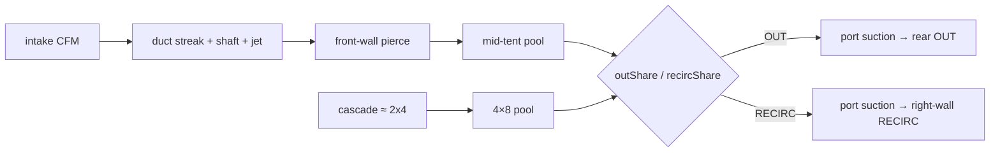
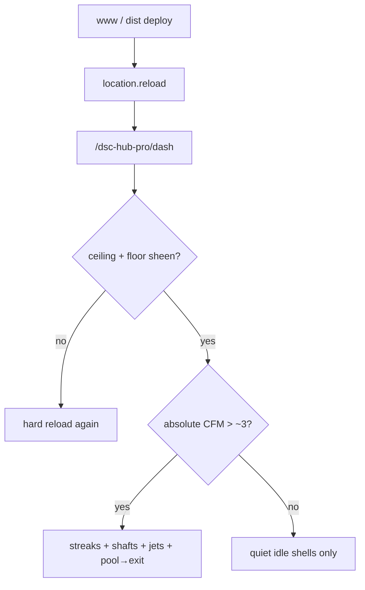

# Live UI — The Dash cinematic airflow + lit room

Operator / developer runbook for master commit `3bed316`: HVAC **pathline**
streams (smoke-test shafts, port jets, elongated streak particles), ceiling
practicals / lit room, and photoreal surface helpers. Verified against
`homeassistant/www/dsc-the-dash-card.js` + `vendor/dsc-dash-fx.js` (+ concatenated
`dist/DSC-HUB.js` / `dist/dsc-system-map-card.js`).

**Prefer** this runbook for “why did the blur-box / confined mix disappear?” and
“what should I see when CFM > 0?”. Pair with FOLLOWUPS **2026-08-06 — Cinematic
airflow + room light** (and the prior **Air flow rewrite (kill blur-box)** /
**Photoreal surfaces** stamps).

Does **not** replace Pass B CFM honesty
([`LIVE-UI-DASH-PASS-BC-CFM.md`](LIVE-UI-DASH-PASS-BC-CFM.md) when merged) —
absolute CFM still drives motion. Supersedes the **scene** expectation that
`mixClone` / `mixMain` confined GPU curl or ACH blue volume boxes are live on
The Dash (those were retired as “bouncing blur balls”; FX APIs remain exported).

## Intent

Make airflow read as a **duct → tent pool → exhaust** story (HVAC smoke-test
cinema), in a **lit room**, without inventing CFM or reintroducing mid-volume
blur boxes:

- Soft additive **smoke-test shafts** + **port jet** flares along ducts (CFM-gated)
- **Elongated streak** particles (not round blur balls)
- Stronger MeshLine ribbons with CFM-scaled dash speed / width
- Through-tent legs `flowClone` / `flowMain` (pierce → pool → exits by share)
- Exhaust streams start **inside** the tent at the port (suction cue)
- Ceiling fixtures + wash / spots / floor bounce so the room is not a black void

## Codepaths

| Piece | Path | Role |
|---|---|---|
| Scene + tick | `homeassistant/www/dsc-the-dash-card.js` | Lights, shafts/jets, streak `mkAir`, `flowThroughTent`, `exhaustFromInside`, ACH hide |
| FX bridge | `homeassistant/www/vendor/dsc-dash-fx.js` | MeshLine ribbons, bloom, photoreal textures (`createPhotorealSurfaces`) |
| FX notes | `homeassistant/www/vendor/dsc-dash-fx.md` | Public API + FEATURES + photoreal helpers |
| Bundle | `dist/DSC-HUB.js` / `dist/dsc-system-map-card.js` | Node-concat (~911 KB post-cinematic; Sync refuses &lt; 500000) |
| Backlog stamp | `docs/FOLLOWUPS.md` | Kill blur-box + cinematic + photoreal closeouts |

## Scene contract (verified)

### Retired (do not expect on `/dsc-hub-pro/dash`)

| Former cue | Status |
|---|---|
| Ambient room `createCurlHaze` | Not mounted (`curl = null`) |
| Confined `mixClone` / `mixMain` GPU curl | `confinedMix` stays empty; API kept on FX bridge |
| Tent ACH blue volume boxes | Forced `opacity = 0` / `visible = false` |
| Mid-room lung bob | Ceiling wash planes only — Y fixed; no sine bob |

### Live air systems

| System | Drive | Story |
|---|---|---|
| `intakeClone` / `intakeMain` | absolute intake CFM | Tight duct streaks |
| `cascade` | cascade CFM + share bias | Duct → 4×8 pool → OUT/RECIRC ports |
| `flowClone` | intake clone CFM | Pierce → pool → cascade exit |
| `flowMain` | `intakeMain*0.55 + cascade*0.45` | Pierce → pool → OUT/RECIRC by share |
| `out` / `recirc` | absolute OUT/RECIRC CFM | Inside-port suction → duct ride |
| Path shaft + `portJet` | same intensity as path | Soft tube wash + cone flare |
| MeshLine ribbon | same | Dash offset / width ∝ CFM |

Motion still uses Pass B threshold: `intensity >= 0.04` after `cfmNorm(cfm, 80)`
(≈ **~3.2 CFM**). Idle OUT/RECIRC shells stay faintly visible at 0 CFM; particles /
shafts / jets stay off.

### Lit room

- Ceiling plane + 3 practical fixtures; PointLight wash; twin SpotLights over tents
- Floor sheen card + warmer key / cooler fill
- `tentFillClone` reacts to clone light; `tentFillMain` to intake/cascade CFM
- Soft ceiling volumetric slices (not mid-room blue boxes)

### Photoreal surfaces (procedural)

When `createPhotorealSurfaces()` is present: Oxford fabric / mylar lining maps on
tents, leaf albedo+alpha on leaflets, soil texture on media. Still **canvas
procedural** cues — not authored multi-mesh GLTF packs (N-035 glTF staging still
open for offline accents).

## Deploy + verify

1. Rebuild: `bash scripts/sync-hacs-dist.sh`
2. Land www via Sync poll **or** HACS **Redownload DSC-HUB System Map**
3. Bump Lovelace `?v=…` if sticky, then **hard-reload** (`location.reload()`)
4. Open `/dsc-hub-pro/dash`
5. Visual (room): ceiling fixtures lit; floor sheen; tents not in a black void
6. With hub live / held CFM &gt; 0:
   - Intake streaks ride ducts; shafts + port jets visible
   - Through-tent pool then pull to exits; OUT/RECIRC start inside ports
   - Cascade bias matches OUT%/RECIRC%
7. At 0 CFM (or held 0): **no** particle streams / shafts / jets / lung bob;
   idle coral/violet shells OK
8. Bundle size stay in cinematic band (~900–920 KB after this pass; healthy floor
   ≥ ~855 KB). Lovelace resource type classic **`js`**.

## Pitfalls

- **Missing streams with hub offline** — need live or **held** CFM &gt; 0. Zero-CFM
  quiet is intentional honesty (Pass B), not a broken FX bridge.
- **Expecting confined curl / ACH boxes** — removed on purpose after blur-box
  rewrite. Prefer pathline systems above; do not re-mount mid-volume blue boxes.
- **SPA navigate after deploy** — sticky `customElements.define` → black 3D while
  HUD updates. Always hard-reload (same as black-canvas / deferred FX runbooks).
- **Re-enabling `depthSoftParticles`** — still blocked (WebKit/Chromium color+depth
  FBO clear). Streak soft fade uses view-Z; DepthTexture stays opt-in.
- **Tiny bundle overwrite** — Sync 5.1.3 refuses demoting a healthy cinematic
  bundle below 500000 bytes (F-013).
- **Fan-% theater** — do not restore fan-% fake motion at 0 CFM; share still comes
  from fan % for OUT/RECIRC split only.

## Related

- FX API: [`../../homeassistant/www/vendor/dsc-dash-fx.md`](../../homeassistant/www/vendor/dsc-dash-fx.md)
- Pass B/C CFM honesty (when merged): [`LIVE-UI-DASH-PASS-BC-CFM.md`](LIVE-UI-DASH-PASS-BC-CFM.md)
- Deferred FX / depth opt-in (when merged): [`LIVE-UI-DASH-DEFERRED-FX.md`](LIVE-UI-DASH-DEFERRED-FX.md)
- FOLLOWUPS: [`../FOLLOWUPS.md`](../FOLLOWUPS.md)
