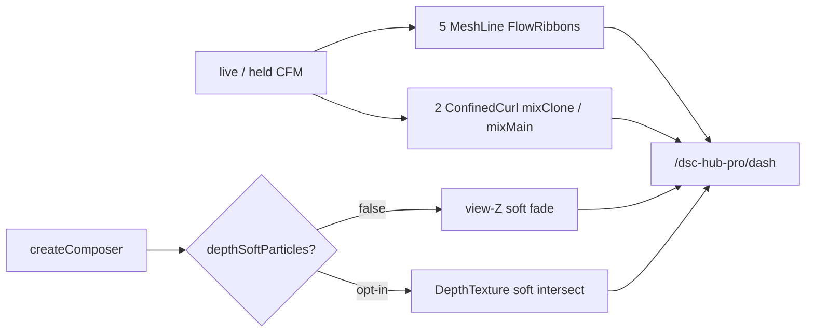
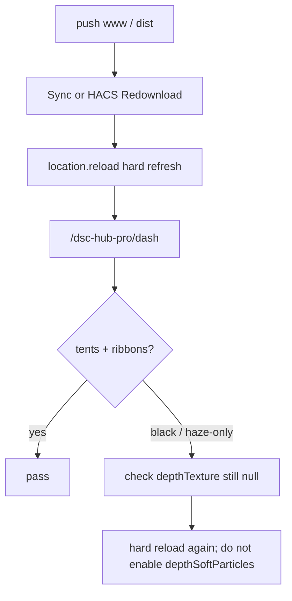

# Live UI — The Dash deferred FX closeout (2026-08-06)

Operator / developer runbook for master commit `e86b5a1`: screen-space MeshLine
ribbons, in-tent confined GPU curl, DepthTexture **opt-in**, incremental plant/fan
primitives. Verified against `homeassistant/www/vendor/dsc-dash-fx.js` +
`dsc-the-dash-card.js`.

**Prefer** over older “DepthTexture still attaches” wording. Pair with
[`homeassistant/www/vendor/dsc-dash-fx.md`](../../homeassistant/www/vendor/dsc-dash-fx.md)
and FOLLOWUPS **2026-08-06 Deferred FX closeout**.

## Intent

Make CFM flow read as **duct ribbons + tent mix**, not ambient fog balls, while
keeping the bloom composer safe on WebKit/Chromium (no default DepthTexture).



## Codepaths

| Piece | Path | Role |
|---|---|---|
| FX bridge | `homeassistant/www/vendor/dsc-dash-fx.js` | MeshLine, confined curl, composer depth opt-in |
| Scene card | `homeassistant/www/dsc-the-dash-card.js` | Mounts 5 ribbons + `mixClone`/`mixMain`; retires room curl |
| Bundle | `dist/DSC-HUB.js` / `dist/dsc-system-map-card.js` | Node-concat (system-map → airflow → three → fx → dash) |
| Staging | `homeassistant/www/vendor/dsc-dash-fx.js` + Sync / HACS | Same concat order into `/config/www` |
| Backlog stamp | `docs/FOLLOWUPS.md` | Closeout audit + remaining deferred |

## FEATURES + depth contract

Console on `/dsc-hub-pro/dash` after hard reload:

```js
const fx = THREE.DSCDashFX;
fx.FEATURES;
// expect: meshLineRibbon true, gpuCurlHaze true, depthSoftParticles false
//         tubeRibbonFallback false, cpuCurlHazeFallback false
```

Depth:

- Default create: composer attaches DepthTexture then **detaches** →
  `post.depthTexture` falsy.
- Opt-in: `post.enableDepthTexture(true)` (or set `FEATURES.depthSoftParticles`
  before create). Soft shaders sample `tDepth` only when `uHasDepth` is set.
- **Do not** ship `depthSoftParticles: true` as default — opaque tents go black
  while particles still draw (see earlier black-canvas incident).

## Scene expectations

| Check | Expected |
|---|---|
| Flow ribbons | 5 × `DSCDashFX.FlowRibbon` with `previous` attribute |
| Tent mix | 2 × confined curl (`mixClone`, `mixMain`) — `userData`/air systems mark `confined: true` |
| Room curl | Not mounted (`createCurlHaze` unused on Dash) |
| Depth | Off unless opt-in |
| Bundle size | ~898 KB post-closeout (healthy floor ≥ ~855 KB; Sync rejects &lt; 500000) |
| Resource type | Lovelace classic **`js`** (not module) |

## Deploy + verify

1. Rebuild: `bash scripts/sync-hacs-dist.sh`
2. Land www via Sync poll **or** HACS **Redownload DSC-HUB System Map**
3. Bump Lovelace resource query (`?v=…`) if sticky, then **hard-reload** the browser
4. Open `/dsc-hub-pro/dash`
5. Confirm tents + ducts + ribbons visible (not haze-only / full black)
6. Optional console audit: FEATURES + scene object counts above



## Pitfalls

- **SPA navigate after deploy** — `customElements.define` stays sticky; HUD/CFM
  overlays update while the 3D viewport stays black. Always hard-reload.
- **Enabling depth “to look better”** — reintroduces the color+depth FBO clear bug.
  Keep opt-in only until a proven WebKit path exists.
- **Expecting room fog** — ambient curl was removed on purpose; mix lives in tents.
- **Missing glTF accents** — Sync does not stage `www/assets/dash/*.gltf` (**N-035**).
  Primitive plants/fans are the expected fallback, not a broken deploy.
- **Tiny bundle overwrite** — Sync 5.1.3 refuses &lt; 500000-byte demotion of a healthy
  cinematic bundle; if Dash looks stubby, check staging size before chasing shaders.
- **CFM honesty** — ribbons/mix intensity follow live or held CFM; hub offline with
  zero CFM means intentional idle motion, not a missing FX bug.

## Residual (not this closeout)

- Full authored photoreal tent/plant GLTF packs
- DepthTexture default-on (blocked on browser FBO bug)
- N-035 Sync staging for `www/assets/dash/`
- Hub online soak for live CFM stream animation (separate from FX ship)

## Related

- Vendor API: [`homeassistant/www/vendor/dsc-dash-fx.md`](../../homeassistant/www/vendor/dsc-dash-fx.md)
- FOLLOWUPS closeout: [`docs/FOLLOWUPS.md`](../FOLLOWUPS.md)
- HACS / concat: [`scripts/HACS-FRONTEND.md`](../../scripts/HACS-FRONTEND.md)
- Sync www guards: [`dsc-hub-sync/DOCS.md`](../../dsc-hub-sync/DOCS.md)
