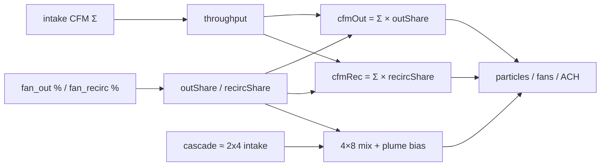
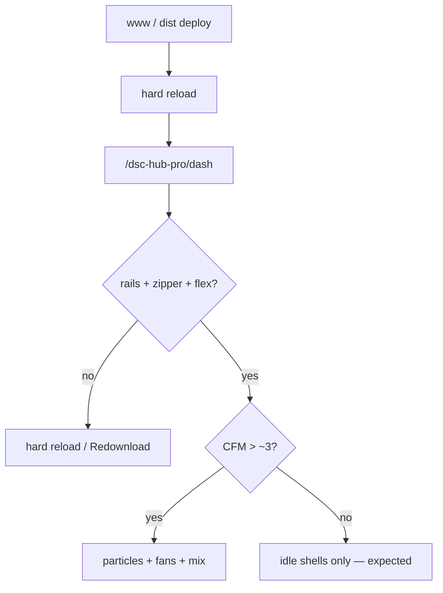

# Live UI — The Dash Pass B/C (CFM honesty + denser models)

Operator / developer runbook for master commit `7bce2f4`: absolute-CFM air
motion, OUT/RECIRC share bias, denser tent frame / cinch ports / Al flex.
Verified against `homeassistant/www/dsc-the-dash-card.js` (+ concatenated
`dist/DSC-HUB.js` / `dist/dsc-system-map-card.js`).

**Does not replace** MeshLine / confined curl / DepthTexture opt-in
([`LIVE-UI-DASH-DEFERRED-FX.md`](LIVE-UI-DASH-DEFERRED-FX.md) when merged /
FOLLOWUPS **Deferred FX closeout**). This pass is the **scene motion + model
fidelity** layer on top of that FX bridge.

Pair with FOLLOWUPS **2026-08-06 — Pass B/C deepen**.

## Intent

Make The Dash **read mass balance**, not fan duty theater:

- Particles, duct ribbons, fans, ACH fog, and room lung bob only move when
  **absolute CFM** (normalized) is live.
- Cascade air mixes inside the 4×8, then drifts toward OUT vs RECIRC by
  `outShare` / `recircShare`.
- Tent / duct geometry looks like a grow kit (frame rails, door zipper, cinch
  collars, denser flex rings) without inventing CFM curves.



## Codepaths

| Piece | Path | Role |
|---|---|---|
| Live mass balance | `dsc-the-dash-card.js` → `_buildLive()` | Intake Σ × dump/recirc split → absolute OUT/RECIRC CFM |
| Motion tick | same → animation loop | `cfmNorm` → path/plume/mix/ACH/lung/fan speeds |
| Cascade plume | `updateCascadePlume(dt, intensity, outShare, recShare)` | Mix in tent, then bias to exhaust ports |
| Tent mix pull | `updateTentMix(..., pullTarget)` | Confined curl / CPU mix center toward weighted ports |
| Tent / duct models | `mkTent` + `curves` + `addFlexRings` / `mkCinchPort` | Rails, door/zipper, pierces, denser Al flex |
| Bundle | `dist/DSC-HUB.js` / `dist/dsc-system-map-card.js` | Node-concat (~897 KB post-pass) |
| Backlog stamp | `docs/FOLLOWUPS.md` | Pass B/C closeout + soak |

## Pass B — CFM-honest air (verified)

### Absolute CFM only for motion

In the tick loop, duct/fan/particle intensity uses:

```js
const outVis = cfmNorm(live.cfmOut, 80);
const recVis = cfmNorm(live.cfmRecirc, 80);
```

The previous **fan-% fallback** (`outVis = exhaustFan * outShare` when CFM held
at 0) is **removed**. Idle shells stay visible; particles and fan spin stay off
when absolute CFM &lt; threshold (`intensity >= 0.04` after `/80` normalize ≈
**~3.2 CFM**).

| Consumer | Drive | Dead / idle behavior |
|---|---|---|
| Intake / cascade / OUT / RECIRC particles | absolute CFM | `points.visible = false`, opacity 0 |
| Path ribbons / shells | same norms | Idle coral/violet shells remain readable |
| Exhaust / recirc fan blades | `outVis` / `recVis` | Speed 0 when dead |
| Tent ACH fog | floors to **0** when dead | No residual haze bob |
| Room lung slices | `recVis >= 0.04` | Opacity near-flat; **no** sine bob at 0 CFM |
| `mixMain` intensity | `intakeMain*0.55 + cascade*0.45` | **No** `outVis` double-count |

### Share bias (not absolute exhaust sensors)

`_buildLive()` still:

1. Prefers **fan %** for OUT/RECIRC **share** (`fan_out` / `fan_recirc`).
2. Falls back to exhaust sensor ratio only if fans are ~0.
3. Sets **absolute** Dash OUT/RECIRC CFM = `intakeSum × share`.

Do **not** treat `sensor.dsc_cfm_exhaust_*` nameplate proxies as absolute duct
flow on The Dash (capacity proxies until Learning curves exist).

Cascade plume after tent entry (~t ≥ 0.72) swirls, then pulls toward
`curves.out` / `curves.recirc` ports weighted by `outShare`/`recircShare`.
`mixMain` confined-curl `uCenter` (and CPU mix positions) lerp toward the same
weighted pull target when any of OUT/RECIRC/cascade is live.

## Pass C — denser tent / duct models (verified)

| Cue | Implementation |
|---|---|
| Tent frame | Corner poles + eave/ridge/base rails (`addRail`) |
| Front door | Opaque door plane + zipper box + accent seam (replaces flat veil) |
| Intake pierce | Curves end at front-wall Z; cinch at room-side **and** ~t `0.72` pierce |
| Cascade flex | `addFlexRings(cascade, 36, …)` (was missing) |
| Al flex density | Intake 48 / OUT+RECIRC 52 rings (was ~26–28) |
| Soft particles | Duct particle material `depthTest: true` (still `depthWrite: false`) |

Topology unchanged from Pass A/B ducts: OUT exits **rear** of 4×8; RECIRC exits
**front/right-wall** toward room — no shared Y-stub.

## Deploy + verify

1. Rebuild: `bash scripts/sync-hacs-dist.sh`
2. Land www via Sync poll **or** HACS **Redownload DSC-HUB System Map**
3. Bump Lovelace `?v=…` if sticky, then **hard-reload** (not SPA navigate)
4. Open `/dsc-hub-pro/dash`
5. Visual: tent rails + door zipper; denser flex; intake cinch at wall pierce;
   right-wall RECIRC + rear OUT
6. With hub live / held CFM:
   - Non-zero intake → particles + mix move; cascade bias matches OUT%/RECIRC%
   - Force 0 CFM (or hub offline with held 0) → **no** particle streams, **no**
     lung bob; idle shells OK
7. Bundle size stay in healthy cinematic band (~855–900 KB; Sync refuses
   demotion below 500000)



## Pitfalls

- **Fan spinning at 0 CFM** after this pass = bug (or stale bundle). Do not
  reintroduce fan-% fake motion.
- **Exhaust nameplate CFM ≠ Dash absolute** — HUD OUT/RECIRC absolute = intake ×
  split; Climate/Learning may still show capacity proxies elsewhere.
- **Zero-CFM idle is honesty** — not a missing FX bug; ambient room curl stays
  retired (separate deferred-FX closeout).
- **Sticky custom element** after SPA navigate can leave an old motion contract
  in memory — always hard-reload after www deploy.
- **DepthTexture default-on** remains blocked; Pass C `depthTest: true` on soft
  particles is **not** the same as enabling bloom DepthTexture.
- Hub offline still blocks live climate/CFM soak — use held CFM for visual
  checks when needed.

## Residual (not this pass)

- Full photoreal tent/plant GLTF packs; Sync staging for `www/assets/dash/`
  (**N-035**)
- DepthTexture default-on (**N-036**)
- Hardware / hub soak items in FOLLOWUPS (flash 5.1.10, ListEntities N-040, …)

## Related

- FOLLOWUPS stamp: [`docs/FOLLOWUPS.md`](../FOLLOWUPS.md)
- FX bridge / depth: [`homeassistant/www/vendor/dsc-dash-fx.md`](../../homeassistant/www/vendor/dsc-dash-fx.md)
- Deferred FX QA (when merged): [`LIVE-UI-DASH-DEFERRED-FX.md`](LIVE-UI-DASH-DEFERRED-FX.md)
- Anemometer / Learning curves: [`docs/ANEMOMETER-CFM.md`](../ANEMOMETER-CFM.md)
- HACS / concat: [`scripts/HACS-FRONTEND.md`](../../scripts/HACS-FRONTEND.md)
