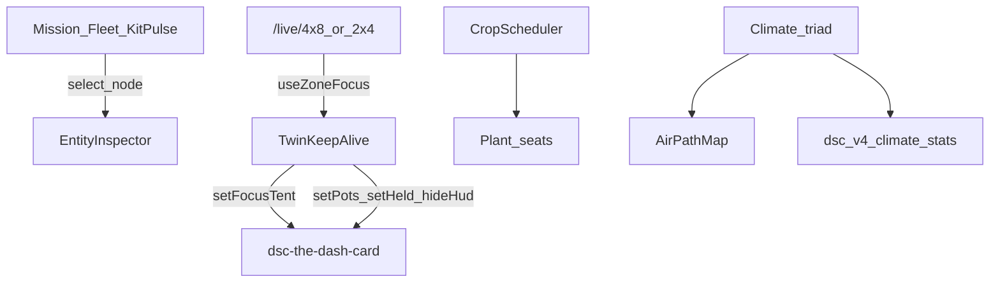

# LIVE-UI — Kit Pulse, Twin orbit, Crop Scheduler (`e6539b0`)

Operator / developer runbook for the panel raise that wires **kit honesty**,
**entity inspector**, **Twin orbit / focus**, **Crop Scheduler**, **spatial air
path**, **Climate Room+2×4+4×8 triad**, **Root cards**, and **Light** so the UI
matches the kit that is actually there.

Trigger packaging on tip: `chore(hacs): sync dist/ from homeassistant/www`
(`d051439`) after raise `e6539b0`.

| Surface | Role |
|---|---|
| Panel | `/dsc-hub` React product shell |
| Mission / Fleet | Clickable **Kit Pulse** constellation |
| Twin / cockpits | `/live/twin`, `/live/4x8`, `/live/2x4` (aliases `/live/main`, `/live/clone`) |
| Climate | Room + 2×4 + 4×8 triad · Want bands · air path |
| Grow Roster | Compact **Crop Scheduler** |
| Packages | `dsc_v4_core_helpers.yaml`, `dsc_v4_climate_stats.yaml`, `dsc_v4_sensor_trust.yaml` |
| Twin IIFE | `homeassistant/www/dsc-the-dash-card.js` (+ `dist/` after HACS sync) |

Related: [`LIVE-UI-CUSTOM-PANEL.md`](LIVE-UI-CUSTOM-PANEL.md) · FOLLOWUPS
**2026-08-16 — Kit Pulse…** · soft Twin APIs in
`frontend/src/lib/dsc-twin-api.ts`.

## Intent

- Show the **full kit** (heater, mat, AC, humidifier, dehumidifier, clone
  mister, pots, tank) without painting planned inventory holes as faults.
- Keep Twin **orbit stable** across hass ticks; steer camera/visibility only on
  focus-mode change.
- Give operators one **Crop Scheduler** for stage / photoperiod / seat lanes.
- Keep Climate honest: T/RH/VPD together, statistics means when present, no
  invented CFM.

## Kit Pulse

Source: `KitPulse.tsx` + `kitInventory.ts` (`KIT_DEFS` / `resolveKitNode`).

| Status | Meaning | UI |
|---|---|---|
| `ok` | Demand or relay on | Filled teal node |
| `idle` | In service, not running | Hollow muted |
| `oos` | `in_service` off | **Dashed** ring — inventory, not red |
| `missing` | Entity unknown | Dashed muted |
| `dark` | Known entity unsettled / offline | Bad tone (unexpected) |
| `held` | Reserved in type union | Amber chip label |

**Planned OOS** (`plannedWhenOff: true`): AC, clone mister, **POT3**, tank.
These stay dashed inventory when off — they must **not** alone trip
`binary_sensor.dsc_reduced_kit`.

**Reduced kit** (`dsc_v4_core_helpers.yaml`): `on` only for unexpected loss —
humidifier/dehumidifier temp OOS or operator lockout, clone mister temp/lock,
or POT1/2/4 out of service. Attributes:

- `planned_oos` — AC / Clone mister / POT3 / Tank when parked
- `offline` — the unexpected list that drives the binary

Lovelace Home + honesty rail read the same sensor. Mission Kit Pulse opens the
inspector on node click.

## Entity inspector

`EntityInspector` + `InspectorHost` + `alertPlaybook.ts` + `useAlertSnooze`.

- Runtime / cycles chips when kit defs supply today sensors
- **DutyStrip** for demand/relay history
- Playbook copy per known alert entity
- **Snooze until hub reboot** — keyed by `sensor.dsc_hub_uptime` `last_changed`
  in `localStorage` (`dsc-hub-snooze:…`). Clears on next hub boot, not on a
  wall-clock timer.

## Twin orbit and focus

Still the Dash **IIFE** (`dsc-the-dash-card`), not R3F. Soft APIs React already
calls:

| Method | Role |
|---|---|
| `setFocusTent(main\|clone\|null)` | Camera + tent visibility — **never** `setConfig` for focus |
| `setPots(VesselLive[])` | React-owned moisture / Need / OOS / silhouette |
| `setHeld(bool)` | Freeze wisps when hub link is down |
| `setUiChrome({hideHud})` | Canvas-only on Twin / cockpit routes |
| `pause(bool)` | Stop rAF when host inactive or tab hidden |

Orbit framing updates on **focus-mode change** only — pointer drag/zoom stay;
hass ticks must not snap the camera home.

| Route | Focus | Visibility (verified intent) |
|---|---|---|
| `/live/twin` | `null` | Both tents; HUD off |
| `/live/4x8` (`/live/main`) | `main` | One tent + “from 2×4” port; hide 2×4 body + clone pots |
| `/live/2x4` (`/live/clone`) | `clone` | One tent + “to 4×8” stub; cascade wisps when CFM > 0 |

Hard-reload panel + Lovelace after www / `dist/` updates so the IIFE cache-busts
(`BUNDLE_V` still `7.1.7-bar-raise` on tip unless bumped).

## Crop Scheduler

`CropScheduler.tsx` — full on Twin / Light; `compact` on Grow Roster, Climate,
tent cockpits.

- Stage track from `STAGE_ORDER` / seat stage
- Mixed-stage warn chip when live pots disagree
- 4×8 / 2×4 window + Want hours chips; catch-up / 2×4 dark violation
- Per-pot lanes → `dsc-dash-select-pot` custom event
- OOS pots disabled (not deleted from the lane list)

## Air path + CFM

`AirPathMap` + `resolveCfm` (allocated-first, then nameplate). Ribbon count
scales with CFM; dashed stroke when not allocated/mass-balance. Tent cockpits
pass `focus` so the map shows that tent + room + cascade stub; Twin/Climate keep
the four-zone map. Trust line stays one sentence — intake `*_allocated` sensors
are still sparse in packages (exhaust allocated exists).

## Climate triad + stats

`ClimatePage.tsx` + `dsc_v4_climate_stats.yaml`.

- Room umbrella lung; 2×4 and 4×8 as grow rooms
- T / RH / VPD held readings + MultiLineCharts with **prior-window ghost**
  (`useEntitySeries({ withGhost: true })`)
- Room VPD prefers `sensor.dsc_hub_room_vpd_kpa`, falls back to
  `sensor.dsc_hub_room_vpd` if the locked id is missing
- Statistics means slug to `sensor.dsc_hub_*_mean_24h` / `_48h` — reload
  templates/packages before 24h Want bars light up
- Unavailable must not plot as `0`

## Light + Root (this raise)

- Light: two equal hero cards; 4×8 **Got** remains **window-proxy** until GPIO
  `entities.main_light` exists — do **not** point Main at SF1000
- Min-dark / Independent 2×4 hours score typed drafts; 4×8 hours chip uses
  implied photoperiod `24 − min-dark` (no 4×8 hours number entity; stage still
  owns `sensor.dsc_expected_light_hours`)
- Root: per-pot cards + human mat duration

## Surface string drift (tip)

Do not treat these as one locked string yet:

1. Package SoT `sensor.dsc_ha_surface_version` = **7.1.3**
2. `SURFACE_VERSION` / App chrome fallback = **7.1.4**
3. `BUNDLE_V` cache-bust = **`7.1.7-bar-raise`**

HACS tip `dist/DSC-HUB.js` ≈ **1.05 MB** after `d051439` (verify with empty
`git diff -- dist/` after sync).

## Operator soak

1. Reload HA templates/stats so Room VPD kPa + climate means exist.
2. Hard-reload `/dsc-hub` and Lovelace Dash (cache-bust www / HACS).
3. Confirm Kit Pulse: AC / mister / POT3 dashed OOS does **not** pulse REDUCED KIT.
4. Confirm `/live/twin` orbit does not snap on hass ticks; `/live/4x8` has no
   clone pots; `/live/2x4` cascade wisps move when CFM > 0 and freeze at 0.
5. Type min-dark / Independent 2×4 hours — extrema chips update before commit.
6. If Lovelace serves repo `dist/dsc-the-dash-card.js` instead of
   `homeassistant/www/`, copy the www IIFE — they can drift.

## Constraints (do not invent)

- No fabricated height / chem / PPFD / NPK
- Twin is still Dash IIFE — **not** R3F
- Planned OOS ≠ reduced kit
- No CFM invented; prefer allocated when present
- Do not paste live cannalib keys into docs / Wiki
