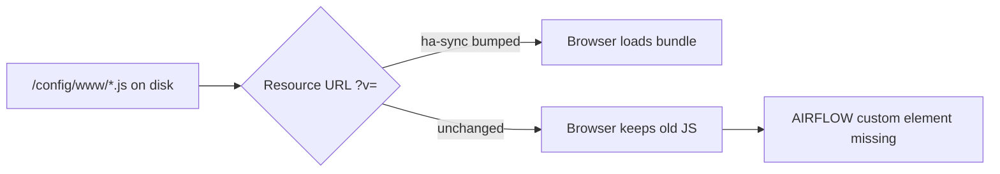

# LIVE-UI — Lovelace card cache after www deploy

Smoke / triage for stale browser JS after publishing the SYSTEM MAP + AIRFLOW
**bundle** to `/local/dsc-system-map-card.js`. Verified against
`scripts/ha-sync.sh` (`0fafe8a` cache-bust + `521ac11` bundle).

Durable runbook: [`scripts/HA-SYNC-BOOTSTRAP.md`](../../scripts/HA-SYNC-BOOTSTRAP.md) §5.

## Intent

Same Lovelace resource URL must load **new** bytes when the published file
changes meaning (system-map-only → concat bundle). Browsers key cache on the
full URL including `?v=`.

## Preconditions

- [ ] Resource type **JavaScript** (IIFE), not Module
- [ ] Prefer **one** path: HACS **or** `/local` (not both)
- [ ] `/local` resource includes a `?v=` query (required for ha-sync sed)

## After Unraid HA sync (ha-sync)

- [ ] Job log contains `Bumping Lovelace resource cache-buster to 5.1.6-airflow-…`
- [ ] Resources URL ends with `?v=5.1.6-airflow-<UTC stamp>` (not an old `5.1.0`)
- [ ] `/config/www/dsc-system-map-card.js` ~33 KB and defines both cards
- [ ] Climate Engine: `custom:dsc-airflow-map-card` renders (hard-refresh once)

## After Sync add-on only

- [ ] www file updated (mtime / size ~33 KB)
- [ ] **Manual:** bump `?v=` in Resources (add-on does not rewrite `.storage/`)
- [ ] Hard-refresh browser

## Failure triage

| Symptom | Check |
|---|---|
| Custom element missing, file ~33 KB | Stale `?v=` / browser cache |
| Custom element missing, file ~10 KB | Pre-bundle publish — re-run ha-sync / Sync ≥5.1.3 / HACS Redownload |
| ha-sync green, `?v=` unchanged | Resource lacked `?v=` (sed no-op) or Sync path used instead of ha-sync |
| HACS path stale | Redownload Dashboard plugin — ha-sync does not touch `/hacsfiles/…` |

