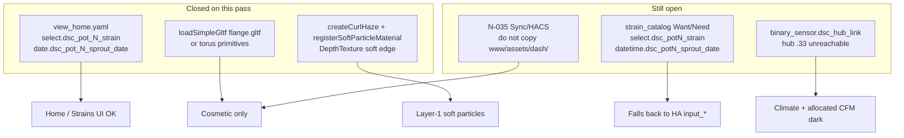

# Live UI — ops debt closeout (post-`52367b5`)

Ops runbook for the residual-debt pass on master (`52367b5` — Home pot
Strain/Sprout IDs, flange glTF accents, curl haze DepthTexture soft particles,
FOLLOWUPS hub-offline red flag).

Does **not** re-document allocated CFM (draft PR #21), sensor-cal Push/SoT
(draft PR #20), Sync cinematic guards (draft PR #19), or The Dash shell base
(draft PR #17). This page covers what that pass **closed**, what still bites
operators, and how to recover when the hub is dark.

Verified against:

- `homeassistant/dashboards/modules/view_home.yaml` — pot Strain/Sprout entity IDs
- `homeassistant/dashboards/modules/view_strains.yaml` — matching `dsc_pot_N_*` IDs
- `homeassistant/packages/dsc_v4_strain_catalog.yaml` — Want/Need + migrate still probe old forms
- `homeassistant/www/dsc-the-dash-card.js` — flange accent load + curl soft register
- `homeassistant/www/vendor/dsc-dash-fx.js` — curl haze DepthTexture uniforms
- `homeassistant/packages/dsc_v4_core_helpers.yaml` — `binary_sensor.dsc_hub_link`
- `docs/FOLLOWUPS.md` — Ops + residual debt closeout stamp

## Intent

| Item | Status after `52367b5` | Operator meaning |
|---|---|---|
| **N-032 Home UI** | **Closed** | Home plant consoles resolve pot Strain/Sprout |
| **N-032 catalog/migrate** | **Residual** | Want/Need templates + migrate script still probe `dsc_potN_*` / `datetime.*` |
| **N-034 helpers** | **Closed (live)** | Package-named Confirm/Force helpers; orphan UI rows purged |
| **Flange glTF** | **Wired** | Optional accent; torus primitives remain if asset missing |
| **Curl haze soft** | **Wired** | Curl particles sample DepthTexture soft-intersect |
| **Hub offline** | **Red flag (ops)** | Not caused by www; blocks climate + allocated CFM |



## N-032 — pot Strain / Sprout entity IDs

Live ESPHome entities slug from friendly name `DSC-POT#N` → **`dsc_pot_N_*`**
(underscore before the number). Domain for sprout is **`date`**, not `datetime`.

| Surface | Correct pot entities | HA helpers (unchanged) |
|---|---|---|
| Home + Strains UI | `select.dsc_pot_N_strain` | `input_select.dsc_potN_strain` |
| Home + Strains UI | `date.dsc_pot_N_sprout_date` | `input_datetime.dsc_potN_sprout_date` |

**Closed:** `view_home.yaml` now matches `view_strains.yaml` for all four pots.

**Residual (code, not this docs PR):** `dsc_v4_strain_catalog.yaml` Want/Need
templates and `script.dsc_migrate_strain_sprout_ha_to_pot` still probe:

- `select.dsc_potN_strain` (no underscore)
- `datetime.dsc_potN_sprout_date` (wrong domain + slug)

Those templates fall back to HA `input_*`, so bands usually work via helpers,
but pot-native preference can miss the live ESP entities. Prefer fixing the
package next — do not “fix” Home/Strains IDs back to the old form.

```mermaid
sequenceDiagram
  participant UI as Home / Strains
  participant Pot as ESP pot entities
  participant HA as HA input_* helpers
  participant Cat as Want/Need templates
  UI->>Pot: dsc_pot_N_strain / date.dsc_pot_N_sprout_date
  Cat->>Pot: probes dsc_potN_* / datetime.* first
  Pot-->>Cat: unknown / unavailable
  Cat->>HA: fallback input_select / input_datetime
  Note over Cat,HA: Bands work via helpers; pot-native miss until catalog aligns
```

## Dash residuals — flange glTF + curl soft particles

### Flange accents

`dsc-the-dash-card.js` builds torus flange primitives on every duct end, then
optionally replaces them:

```text
/local/assets/dash/flange.gltf  →  loadSimpleGltf → clone per flange
scale = 0.15 / 0.208
onError → keep torus primitives (silent)
```

Same pattern already existed for `muffler.gltf` and `fan_housing.gltf`. Accents
are cosmetic — ops does not depend on them.

### Curl haze DepthTexture soft-intersect

| Piece | Behavior |
|---|---|
| `createCurlHaze` | Returns `{ points, material, update, dispose }`; material carries `tDepth` / `uHasDepth` / softness uniforms |
| Card wiring | `post.registerSoftParticleMaterial(curl.material)` + `curl.points.layers.set(1)` |
| Composer | Pass A renders solids (layer 0) → color+depth; soft materials sample DepthTexture vs particle view-Z |

If FX composer is absent, curl still mounts on layer 1 without soft uniforms —
degraded but non-fatal.

### Bundle / cache

| Check | Expected |
|---|---|
| `wc -c dist/DSC-HUB.js` | **~854599** after this pass (~855 KB) |
| Lovelace resource | classic `js` (`res_type: js`), not `module` |
| Cache-bust | `lovelace/resources/update` with `?v=ops-debt-*` (F-010) — avoid core restart races |

### Sync pitfall (unchanged — N-035)

Sync / ha-sync / HACS still publish the JS bundle only. They do **not** copy
`homeassistant/www/assets/dash/*.gltf`. Missing glTF → primitives. Soft particles
and bloom still work from the JS path. Manual copy to `/config/www/assets/dash/`
enables accents until sync coverage lands.

## Hub offline red flag

At closeout: `binary_sensor.dsc_hub_link=off`, hub `.33` not pinging. This was
**not** introduced by Dash/www changes.

`dsc_hub_link` mirrors `binary_sensor.dsc_hub_ha_link_status` (connectivity).

| Dark while hub down | Why |
|---|---|
| Climate ladder / hub sensors | Hub API entities unavailable |
| Allocated CFM | Needs hub fan-% (+ intake) entities |
| Fleet / hub FW chips | Hub text sensors unavailable |

**Recovery order**

1. Power / WiFi / API on DSC-HUB (`.33`) — restore `dsc_hub_link` **before** any
   HA core restart if possible.
2. Confirm fan-% + intake sensors return → allocated CFM consumers light again.
3. Only then chase dashboard/www cache issues (F-010).

Do not treat allocated CFM `unavailable` as a package regression while the hub
is offline.

## Related closed live items (same stamp)

| Item | Note |
|---|---|
| **N-034** | Active helpers = package names `dsc_peer_sync_require_confirm` + `dsc_peer_push_force`; orphan `*_non_1_scale*` / `*_require_confirm_2` purged |
| **POT2 OTA** | Re-flashed to FW **5.1.5**; Mark Peer Median present. POT1/4 already 5.1.5; POT3 still USB/F-003 |
| **Control** | **5.1.14** matches tree — no flash |
| **Accepted approximations** | MeshLine/Line2 still Tube ribbons; GPUComputation still CPU curl — not rewritten |

## Operator quick checks

Home plant consoles (`/dsc-hub-pro/home`):

1. Strain (pot) / Sprout (pot) rows resolve for POT1–4 — no Entity not found
2. HA helper rows remain `input_*` without underscore

The Dash (`/dsc-hub-pro/dash`):

1. Bundle ~855 KB; soft particles soften against ducts
2. Optional: after manual `assets/dash/` copy, flanges/fans/muffler pick up glTF
3. Without assets: torus flanges + primitive fans — still healthy

System / climate:

1. `binary_sensor.dsc_hub_link` **on** before trusting climate or allocated CFM
2. If link off: recover hub first; skip core restart

## Triage

| Symptom | Likely cause | Fix |
|---|---|---|
| Home Strain/Sprout Entity not found | Stale dashboard module pre-`52367b5` | Sync dashboard; hard-refresh |
| Want bands ignore pot strain | Catalog still probes `dsc_potN_*` | Confirm HA `input_select` is set; track package ID align |
| Migrate HA→pot no-ops | Script targets wrong pot entity ids | Same residual — package fix |
| Flanges look primitive | `/local/assets/dash/flange.gltf` 404 | Manual copy or wait for N-035 |
| Curl haze hard edges | Stale FX without soft uniforms | Redeploy www/dist; cache-bust F-010 |
| Allocated CFM unavailable | Hub offline / fan entities dark | Restore `dsc_hub_link`; see red flag |
| Climate dark after www deploy | Hub was already down | Not a Dash regression — recover hub |

## Soak checklist

- [ ] Dashboard sync includes Home `dsc_pot_N_*` / `date.*` Strain/Sprout rows
- [ ] Home + Strains: no Entity not found on pot Strain/Sprout
- [ ] `wc -c /config/www/dsc-system-map-card.js` ≈ repo `dist/DSC-HUB.js` (~854599)
- [ ] Lovelace resource stays `js`; cache-bust via `resources/update` only
- [ ] `binary_sensor.dsc_hub_link` recovered **on** before climate soak
- [ ] Optional: `/config/www/assets/dash/{flange,fan_housing,muffler}.gltf` present for accents

## Related

| Doc | Role |
|---|---|
| Draft PR #21 `LIVE-UI-CFM-ALLOCATED` | Capacity vs allocated + depth/glTF base + N-035 |
| Draft PR #20 `SENSOR-CAL-5.1.7` | Peer sync / Push / hold-reset (N-032 Strains note predates Home fix) |
| Draft PR #19 `LIVE-UI-WWW-BUNDLE-GUARDS` | Sync 5.1.3 concat guards / size floor |
| Draft PR #17 `LIVE-UI-THE-DASH` | Shell/modules + rail topology |
| [`../FOLLOWUPS.md`](../FOLLOWUPS.md) | Ops + residual debt closeout stamp |
| [`../../homeassistant/README.md`](../../homeassistant/README.md) | Package / entity map |
