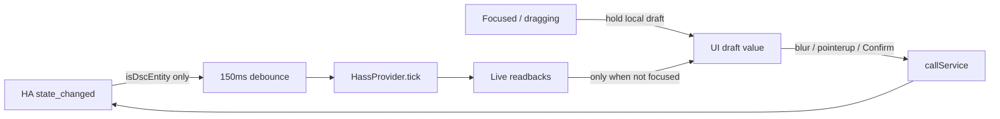

# LIVE-UI — Panel drafts vs climate ticks (bar-raise)

Operator / developer runbook for the React `/dsc-hub` panel after
`bc311d5` (“Raise DSC-HUB panel drafts so operator inputs survive climate ticks”).

## Intent

Climate sensors and helpers fire `state_changed` often. Controlled inputs that
re-bind every tick fight the operator mid-type / mid-drag. The panel keeps a
**local draft** while the control is active, then commits to HA on blur /
pointer-up / DecisionLayer confirm.

## Tick filter (Wave 0)

Source: `frontend/src/hooks/useHass.tsx`.

| Rule | Behavior |
|---|---|
| Event filter | `state_changed` bumps `tick` only when `isDscEntity(entity_id)` |
| DSC match | `dsc_` / `dsc-` object ids, helper domains with `dsc_`, plus `sensor|switch|binary_sensor|number|light|fan|select|text|datetime|time.dsc*` |
| Debounce | `TICK_DEBOUNCE_MS = 150` — coalesces bursts |
| Non-DSC house traffic | Ignored (does not re-render the panel) |

Constraint: helpers without `dsc` in the id still do not drive the panel tick.
Do not “fix” that by widening `isDscEntity` without measuring focus fight.

## Draft primitives

| Control | File | Hold while | Commit |
|---|---|---|---|
| `TargetNumber` | `TentTargets.tsx` | focused | blur / Enter → `number` or `input_number.set_value` (clamped) |
| `EntityText` | `ui.tsx` | focused | blur → `input_text.set_value` |
| `EntityTime` | `ui.tsx` | focused | blur → `time.set_value` (`HH:MM` → `HH:MM:00`) |
| `EntitySelect` | `ui.tsx` | open | option change → `select` / `input_select.select_option` |
| `EntityFanSlider` | `ui.tsx` | pointer capture / dragging | pointerup → `fan.set_percentage` |
| Coupled mix % | `CoupledMix.tsx` | `drafts` map while dragging | pointerup → three `input_number.dsc_blend_pct_N` |

While focused/dragging, live HA values do **not** overwrite the draft
(`if (!focused.current)` / `if (!dragging)` / `drafts ?? live`).

## DecisionLayer (progressive write)

Source: `frontend/src/components/DecisionLayer.tsx`.

- Fade overlay (`role="dialog"`, Escape dismiss, focus restore).
- Confirm required only when `onConfirm` is set.
- Help slot stays empty until real copy exists (do not invent help text).
- z-index above `.dsc-drawer-root` (80).

### Where it gates writes

| Surface | Confirm writes |
|---|---|
| Grow · Compose | `script.dsc_build_plant_commit` · commit+assign (+ vessel copy to `input_select.dsc_potN_vessel`) · accept mix · apply climate Want |
| Live · Light | Schedule editors (`time.dsc_hub_lights_on_time`, sunrise/sunset mins, min dark, clone Independent start/hours) — draft-backed fields inside the overlay |
| Tune · Learning | Finish → `script.dsc_cal_finish` only (no invented accept-curve script) |
| Catalog / vessel pickers | Search drawers; vessel chip writes `input_select.dsc_build_vessel` + volume |

Compose honesty line: confirm overlay writes HA scripts; coupled mix stays on
`input_number.dsc_blend_pct_N`.

## Twin chrome (related bar-raise)

Source: `TwinKeepAlive.tsx` + `lib/dsc-twin-api.ts`.

| Route | Twin IIFE HUD |
|---|---|
| `/live/twin`, `/ops/dash`, `/live/main`, `/live/clone` | `setUiChrome({ hideHud: true })` — canvas only; React owns nav |
| Tab away / `document.hidden` | `pause(true)` — rAF stopped (no GPU spin) |

Do not rewrite Twin as R3F until soft APIs on the IIFE + `dsc-twin-api.ts` are honest.

## Soak checklist (operator)

After HA hard-reload of the panel:

- [ ] Type a seat note / Compose nickname while climate ticks — caret stays; value commits on blur
- [ ] Open a tent target number, wait for ticks, blur — Want writes once
- [ ] Drag a fan % or blend layer — live % does not yank the thumb; commits on release
- [ ] Light schedule times stay put while ticks; Independent unlocks clone fields
- [ ] `/live/twin` shows canvas only (no IIFE HUD/charts/rail)
- [ ] Leave Twin tab — GPU idle; return without cold WebGL rebuild
- [ ] Vessel helper: reload packages so `input_select.dsc_build_vessel` exists (`dsc_v4_vessel.yaml`)

## Honesty / do not invent

- Only Wave 0 (tick + drafts) was acceptance-tested in-tree; later waves need soak.
- Learning finish calls `script.dsc_cal_finish` — no fake curve-accept service.
- 4×8 schedule Got remains the window binary until `entities.main_light` exists.
- Surface strings still drift on tip (package **7.1.3** · `SURFACE_VERSION` **7.1.4** · some TSX fallbacks **7.1.1** · bundle tag `7.1.5-bar-raise`). Operator SoT = `sensor.dsc_ha_surface_version`.

## Related

- Panel overview: [`LIVE-UI-CUSTOM-PANEL.md`](LIVE-UI-CUSTOM-PANEL.md)
- Assist opt-in only: [`../ASSIST-MCP.md`](../ASSIST-MCP.md)
- FOLLOWUPS: **2026-08-16 — DSC-HUB panel bar-raise (waves 0–8)**
