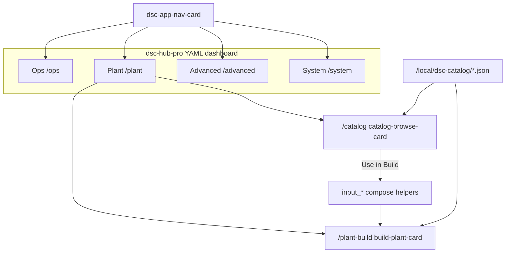
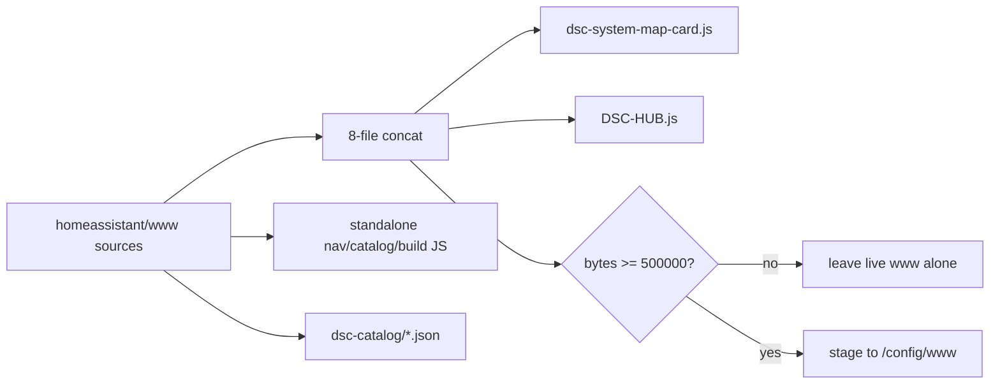

# LIVE-UI — Unified HA product shell (N-086)

Operator / developer runbook for the single **DSC-HUB** Lovelace product:
four primary sections aligned to [`docs/brain/WEBUI.md`](../brain/WEBUI.md).

| Surface | Role |
|---|---|
| Dashboard URL | **`/dsc-hub-pro/ops`** (default landing) |
| Sidebar | One entry: **DSC-HUB** |
| Primary tabs | Ops · Plant · Advanced · System |
| Surface version | `sensor.dsc_ha_surface_version` **5.1.12** |
| Shared chrome | `custom:dsc-app-nav-card` |
| Catalog Explorer | `custom:dsc-catalog-browse-card` @ `/dsc-hub-pro/catalog` |
| Compose | `custom:dsc-build-plant-card` @ `/dsc-hub-pro/plant-build` |

HA is the **lab scaffold / wireframe** for the later Pi webserver. Do not treat
`input_*` coupling as durable product SoT — see [`docs/HA-SCAFFOLD.md`](../HA-SCAFFOLD.md).

## Intent

Collapse the old **Pro** + separate **Build a Plant** sidebars into one product
shell so operators see Ops / Plant / Advanced / System — the same section jobs
the Pi web UI will own later. Catalog research (browse / filter / compare) sits
beside Compose under Plant; The Dash stays Ops cinema, not the home page.

## Architecture



| Source | Path |
|---|---|
| Dashboard shell | `homeassistant/dashboards/dsc-hub-v4-dashboard.yaml` |
| Primary views | `modules/view_{ops,plant,advanced,system}.yaml` |
| Nav card | `homeassistant/www/dsc-app-nav-card.js` |
| Catalog card | `homeassistant/www/dsc-catalog-browse-card.js` |
| Surface marker | `homeassistant/packages/dsc_v4_version.yaml` → **5.1.12** |
| Config snippet | `homeassistant/configuration.snippet.yaml` (sidebar title **DSC-HUB**) |

## Route map (HA ↔ future web)

| Product section | HA path | Future web (WEBUI) |
|---|---|---|
| Ops | `/dsc-hub-pro/ops` | `/` |
| Plant (hub) | `/dsc-hub-pro/plant` | `/plant` |
| Compose | `/dsc-hub-pro/plant-build` | `/plant` compose mode |
| Catalog browse | `/dsc-hub-pro/catalog` | `/plant` research / browse mode |
| Fleet seats | `/dsc-hub-pro/strains` | roster / Want–Need–Got |
| Mix lab | `/dsc-hub-pro/nutrient-science` | plant / mix tools |
| Advanced | `/dsc-hub-pro/advanced` | `/advanced` |
| System | `/dsc-hub-pro/system` | `/updates` (+ diagnostics) |

### Ops subviews

`home` · `dash` (The Dash cinema) · `climate` · `main-4x8` · `clone-2x4` ·
`root-zone` · `tank` · `lighting`

### Advanced subviews

`learning` · `trends` · `history`

### Nav active-tab rules

`dsc-app-nav-card` derives the active section from `location.pathname`:

| Path contains | Active tab |
|---|---|
| `/plant`, `/catalog`, `/strains`, `/nutrient` | Plant |
| `/advanced`, `/learning`, `/trends`, `/history` | Advanced |
| `/system` | System |
| everything else (incl. `/ops`, `/home`, `/dash`, …) | Ops |

Clicks use `history.pushState` + `location-changed` (same pattern as Catalog → Compose).

## Catalog Explorer

Indexes: `/local/dsc-catalog/*.json` (**schema_version 2**). Rebuild:

```bash
python scripts/build_catalog_search_indexes.py
scripts/sync-hacs-dist.sh   # or Sync / ha-sync.sh
```

| Domain | File | Honesty chips when missing |
|---|---|---|
| Strains | `dsc_strains_search_index.json` | no chem / no climate / no height |
| Nutrients | `dsc_nutrients_search_index.json` | dose / stage when absent |
| Mediums | `dsc_mediums_search_index.json` | composition when absent |
| Lights | `dsc_lights_search_index.json` | no PPFD |

### Acceptance

1. Open **Plant → Catalog** (`/dsc-hub-pro/catalog`).
2. Domain tabs: Strains · Nutrients · Mediums · Lights.
3. Filter strains by text; Want temp band overlap when indexed; height only when
   present (`with_height` may be **0** — UI shows **not in catalog**, never invents).
4. Open detail: chem / Want bands / missing honesty line.
5. Compare up to **3** rows side-by-side.
6. **Use in Build** navigates to `plant-build` **first**, then seeds helpers.
7. Nutrients show dose / stage when indexed; lights show PPFD URL when present
   (URL helpers capped at **255** chars).

### Use in Build seeds (verified)

| Domain | Helpers written |
|---|---|
| Strains | `input_text.dsc_build_strain` (+ nickname if empty); optional Fill Custom → `script.dsc_custom_fill_from_catalog` |
| Nutrients | `input_text.dsc_nutrient_1_name` + `input_number.dsc_nutrient_1_dose_ml_l` when dose present |
| Mediums | `input_text.dsc_blend_component_1_name` |
| Lights | match `input_select.dsc_light_fixture` or **Custom / other** + custom name; `input_text.dsc_light_ppfd_map_url` when present |

## Sync / HACS bundle parity

www concat order (HACS `sync-hacs-dist.sh`, Sync add-on, `ha-sync.sh`):

`system-map` → `airflow` → `three.min` → `dsc-dash-fx` → `the-dash` →
`build-plant` → **`app-nav`** → **`catalog-browse`**



| Constraint | Value |
|---|---|
| F-013 minimum | **500000** bytes |
| Healthy bundle after N-086 | **~979 KB** (`dist/DSC-HUB.js`) |
| Catalog fallback | `www/dsc-catalog/` else `dist/dsc-catalog/` (warn) |
| Missing nav/catalog inputs | Sync falls back to `dist/` concat or skips www with warn |

Standalone `/local/dsc-app-nav-card.js` and `/local/dsc-catalog-browse-card.js`
are also staged for debugging; Lovelace normally loads the HACS / map bundle.

## Cutover notes

- Old `/dsc-build-plant/build` dashboard stub redirects operators to Plant;
  `show_in_sidebar: false` in `configuration.snippet.yaml`.
- Deep-links in Strains / Nutrient Science point at `/dsc-hub-pro/plant-build`
  and `/dsc-hub-pro/catalog`.
- Remove the `dsc-build-plant` lovelace entry entirely only after redirect soak
  (FOLLOWUPS honesty note under N-086).

## Developer pitfalls

| Symptom | Likely cause | Fix |
|---|---|---|
| Sidebar shows Pro + Build | Pre-N-086 snippet / storage dash | Merge current `configuration.snippet.yaml`; hard-refresh |
| Nav / Catalog custom element missing | Stale HACS / Sync ≤ Dash-only concat | Redownload HACS; confirm Sync www has 8 inputs; Ctrl+F5 |
| Catalog empty + Network **404** | Indexes not staged | Sync / `ha-sync.sh` / copy `www/dsc-catalog/` |
| Catalog empty + Network **200** | Wrong path or empty `items` | Confirm `/local/dsc-catalog/dsc_strains_search_index.json` `schema_version: 2` |
| Height filter yields zero | Dump has no height (`with_height: 0`) | Expected — do not invent; clear height filters |
| Use in Build stuck on Catalog | Pre-N-086 card order | Redeploy catalog card (navigate-first) |
| Surface still **5.1.11** | Packages not synced / Core not restarted | Sync + confirm `dsc_v4_version.yaml`; restart if helpers stale |
| Bundle demoted / Dash black | Tiny concat (&lt; 500k) refused or SPA sticky define | Keep F-013; hard `location.reload()` after www deploy |

## Browser smoke checklist

- [ ] Sidebar: one **DSC-HUB** entry
- [ ] Four primary tabs only
- [ ] Ops → Plant → Catalog compare → Use in Build
- [ ] Compose typeahead / assign still live (`/dsc-hub-pro/plant-build`)
- [ ] Advanced · System · Lighting PPFD subview reachable
- [ ] Surface **5.1.12**; Sync **boot=auto** / started; JSON `schema_version: 2` + `want` / light rows intact

Live non-DSC regression log: [`N-086-REGRESSION-SMOKE.md`](N-086-REGRESSION-SMOKE.md).

Related: [`LIVE-UI-BUILD-A-PLANT.md`](LIVE-UI-BUILD-A-PLANT.md) · FOLLOWUPS **N-086**
