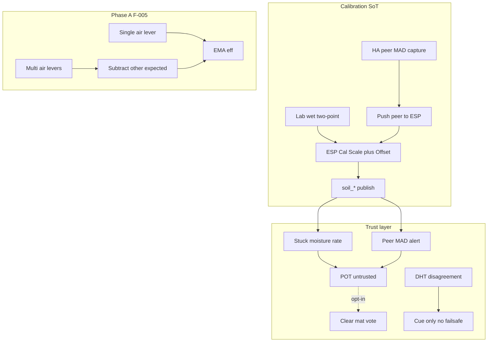

# Live UI / ops — HA 5.1.8 sensing + learn debt

Operator runbook for the **2026-08-04** sensing/learn debt pass (`a9fe2f3`) and the
follow-on HACS `dist/` sync (`7d0a9f2`). Verified against packages + firmware in tree.

**Does not replace:** Sync cinematic guards (#19), Cal SoT push (#20), allocated CFM
(#21), or ops-debt Home/flange (#22). Use those for their subsystems.

| Surface | Expect |
|---|---|
| HA | `sensor.dsc_ha_surface_version` = **5.1.8** |
| Sync | **5.1.3** (www guards already live) |
| Pots | FW **5.1.6** for lab wet raw + `lab_buffer` stamp |
| Hub | FW **5.1.4** for F-006 API/handshake diagnostics |
| Control | FW **5.1.15** for VPD editor / Pulse sparkline / power detail |
| Fleet chip | Compares **major.minor** — mixed `5.1.x` stays `ok` |

---

## 1. Lab wet (N-016)

**Intent:** Buffer-truth two-point → ESP Cal Scale/Offset. Peer-median is alignment,
not lab truth — do not stack both.

| Piece | Path |
|---|---|
| Script | `script.dsc_pots_apply_lab_wet_to_esp` |
| Package | `homeassistant/packages/dsc_v4_sensor_cal.yaml` |
| UI | Root Zone → Lab wet two-point |
| Procedure | [`docs/LAB-WET-CAL.md`](../LAB-WET-CAL.md) |
| Pot stamp | `button.dsc_potN_mark_soil_cal_lab_buffer` / `dsc_pot_N_*` (FW **5.1.6+**) |

### Abort conditions (script)

| Condition | Status text |
|---|---|
| HA peer offsets still set and Force off | `Lab wet aborted — HA peer offsets still set…` |
| Measured hi ≈ lo (`|span| < 0.001`) | `Lab wet aborted — measured span too small…` |

Force (`input_boolean.dsc_lab_wet_force`) is turned **off** after a successful apply.

### UI pitfall — moisture channel

Package helpers `input_number.dsc_lab_wet_m_{lo,hi}_{meas,exp}` exist and the script
reads them when Channel = `moisture`, but **Root Zone entities card only lists pH/EC
helpers**. For moisture lab wet, set the `dsc_lab_wet_m_*` numbers via Developer Tools
→ States (or expand the card) before Apply.

### Checklist

- [ ] Pot FW ≥ 5.1.6; `Soil * Raw` entities present
- [ ] HA peers ~0 (or Force on knowingly)
- [ ] Apply → `input_text.dsc_peer_sync_status` shows scale/offset + `lab_buffer`
- [ ] Dual-stack warn stays off; Got ≈ buffer expectation

---

## 2. Sensor trust (N-020 / N-022) + keep-up (F-009)

**Package:** `homeassistant/packages/dsc_v4_sensor_trust.yaml`

| Entity | Role | Default / notes |
|---|---|---|
| `binary_sensor.dsc_potN_sensor_stuck` | Moisture rate ≈ flat ≥ stuck window | Window helper `dsc_trust_stuck_minutes` (45); `delay_on` 45 min |
| `binary_sensor.dsc_peer_mad_alert` | Peer divergence ≥ MAD thresholds | pH 0.6 / EC 250 / moist 12; `delay_on` 20 min |
| `binary_sensor.dsc_potN_untrusted` | Stuck **or** fleet MAD | Problem class |
| `binary_sensor.dsc_dht_disagreement` | Tent/Room/Clone ΔT or ΔRH span | Cue only — **not** failsafe |
| `sensor.dsc_keepup_gaps` | Reduced-kit honesty strings | Home markdown uses `gaps` + `full_auto_honesty` |
| `counter.dsc_ha_link_flaps_24h` / `sensor.dsc_ha_link_flap_count_24h` | F-006 HA-side flap evidence | Increments on `dsc_hub_link` → off; resets 00:05 |
| `input_boolean.dsc_trust_auto_clear_mat_vote` | Opt-in: untrusted → mat vote OFF | **Default off** — soak before enabling |

### Checklist

- [ ] After Core restart once (new helpers/counters), entities exist
- [ ] Home shows keep-up gaps when AC / mister / POT3 out of service
- [ ] Peer MAD / stuck notify creates persistent_notification (no climate trip)
- [ ] Leave auto-clear mat vote **off** until soak proves thresholds

---

## 3. Multi-lever learn (F-005) + fleet coherence (N-015)

**Packages:** `dsc_v4_climate_learn.yaml`, `dsc_v4_pots_coherence.yaml`

**Old rule (stale docs):** Phase A only when exactly one air appliance ON.  
**5.1.8 rule:** Air appliances **may co-run**. When ≥2 are ON, Phase A attributes by
subtracting the other levers’ expected ΔAH/ΔT (`nameplate × current EMA`). Fans + mat
may always co-run. Mat/vent still require zero air appliances.

| Signal | What to read |
|---|---|
| `sensor.dsc_learn_activity` | `Multi-lever (N) — attributing via baseline subtract…` or single-lever `Learning …` |
| Activity attrs `lever_mix` / `multi_lever` | Which air levers + boolean |
| `sensor.dsc_fleet_coherence_score` | % of in-service pots without coherence flag (0–100 or `none`) |

Phase B remains wait-only; do not enable until multi-lever Phase A soaks clean.

### Checklist

- [ ] Learning card Activity no longer stuck on “Waiting — 2 air appliances…” solely because two air levers co-run
- [ ] Sample counts still climb under multi-lever when residual ΔAH/ΔT is in band
- [ ] `dsc_fleet_coherence_score` present after package sync

---

## 4. Hub link diagnostics (F-006) + recovery

**Hub FW 5.1.4** exposes diagnostic sensors (ESPHome slugs after flash):

| Friendly name | Typical entity |
|---|---|
| API Down Age | `sensor.dsc_hub_api_down_age` |
| HA Handshake Age | `sensor.dsc_hub_ha_handshake_age` |
| Link Recovery Last Reason | `sensor.dsc_hub_link_recovery_last_reason` |
| Link Recovery Bounces | `sensor.dsc_hub_link_recovery_bounces` |

HA-side: `counter.dsc_ha_link_flaps_24h` counts `binary_sensor.dsc_hub_link` drops.

**Recovery order** (from FOLLOWUPS soak):

1. Physical power cycle if hub IP (lab `.33`) is dead — no smart-plug path.
2. Confirm `dsc_hub_link` on; ping OK.
3. Flash hub **5.1.4** for diagnostics if still on older train.
4. Prefer `lovelace/resources/update` cache-bust over Core restart (F-010).

Climate + allocated CFM stay dark while hub_link is off — do not chase www/Core first.

---

## 5. Tank bias (N-023)

`input_number.dsc_tank_ec_bias` / `dsc_tank_ph_bias` in `dsc_v4_tank.yaml`.  
Normalized EC = raw × multiplier **+ bias**; calibrated pH = raw + bias. Defaults 0.

---

## 6. Control 5.1.15 + Dash FX (index only)

| Change | Where | Note |
|---|---|---|
| VPD curve editor | Control `page_set_vpd` | Flash Control **5.1.15** |
| Pulse 1h VPD ASCII sparkline | `lbl_spark` ring | No `lv_chart` |
| Per-device power detail | Control UI | Heap discipline unchanged |
| MeshLine ribbons + GPU curl | `www/vendor/dsc-dash-fx.js` | `FEATURES.tubeRibbonFallback` / `cpuCurlHazeFallback`; see `dsc-dash-fx.md` |

HACS sync after this pass refreshed `dist/DSC-HUB.js` + `dist/dsc-system-map-card.js`.
Bundle still must stay classic `js` resource and ≥500KB (F-013).

---

## 7. Promote customs (N-011)

| Path | Role |
|---|---|
| `script.dsc_promote_customs_yaml_preview` | Persistent notification YAML (no file write) |
| `scripts/promote_customs_to_yaml.py` | Offline: `python scripts/promote_customs_to_yaml.py states.json` |

Merge output into `homeassistant/data/dsc_*_catalog.yaml` by hand; commit separately.

---

## 8. Explicitly not done this pass

| ID | Status |
|---|---|
| N-005 / N-026 | No wait/settle retune — insufficient soak while hub was dark |
| N-013 | Skipped — track-only dryback remains |
| N-035 | Sync/HACS still do not stage `www/assets/dash/*.gltf` |
| F-001/002/003/004/008 | Hardware / site deferred |

---

## Deploy / soak checklist

1. Sync packages + dashboard + www (add-on or Actions) → Core restart **once** for new helpers/counters.
2. Confirm surface **5.1.8**; Learning Activity; Home keep-up gaps; Root Zone lab wet card.
3. Operator flash: hub **5.1.4**, pots **5.1.6**, Control **5.1.15** (manual Install).
4. Cache-bust Lovelace `?v=` via `resources/update` if Dash FX looks stale.
5. On site: lab buffers + anemometer curves ([`ANEMOMETER-CFM.md`](../ANEMOMETER-CFM.md)); watch `sensor.dsc_cfm_curves_status`.

## Sign-off

| Operator | Host | Date | Surface / hub / pots / panel | Notes |
|---|---|---|---|---|
| | | | | |
