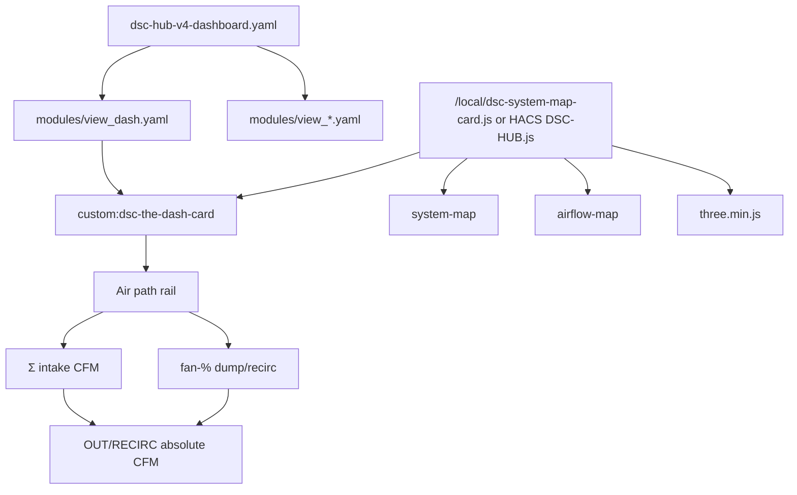
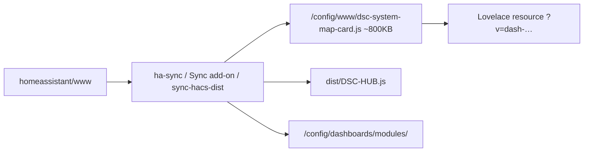

# LIVE UI — The Dash + modular Lovelace (post-`8bf7334` / `6c557df`)

Ops surface for the cinematic **The Dash** view (`path: dash`) and the
shell/modules dashboard layout that shipped with it.

Verified against:

- `homeassistant/www/dsc-the-dash-card.js` (`custom:dsc-the-dash-card`)
- `homeassistant/www/vendor/three.min.js` (must precede Dash in the bundle)
- `homeassistant/dashboards/dsc-hub-v4-dashboard.yaml` + `modules/view_*.yaml`
- `scripts/ha-sync.sh`, `scripts/sync-hacs-dist.sh`, `dsc-hub-sync/rootfs/usr/bin/dsc-hub-sync.sh`

## Intent

| Piece | Job |
|---|---|
| **The Dash** | Full-bleed Three.js tents/ducts + air-path rail + pot charts + timeline |
| **Modular views** | Keep the Pro shell thin; each view lives in `modules/view_*.yaml` |
| **Mass-balanced exhaust** | Dash rail OUT/RECIRC CFM = Σ intake × dump/recirc split (not raw exhaust sensors) |



## Dashboard layout

Shell (`homeassistant/dashboards/dsc-hub-v4-dashboard.yaml`):

```yaml
title: DSC-HUB Pro
views:
  - !include modules/view_dash.yaml
  - !include modules/view_home.yaml
  # … climate, tents, root zone, history, tank, strains, …
```

**Constraints (F-012):**

- Modules must land under `/config/dashboards/modules/` **with** the shell.
- Wrong indent / missing module → empty or “Unnamed” views.
- Sync paths that copy only the shell (pre-`8bf7334` add-on) break Pro.

| Module | Path | Notes |
|---|---|---|
| `view_dash.yaml` | `/dsc-hub-pro/dash` | Panel view; single The Dash card |
| `view_home.yaml` … `view_system.yaml` | other Pro tabs | Full YAML bodies |

## Publish contract (www / HACS)

**Sources** (edit here):

| File | Role | Approx size |
|---|---|---|
| `www/dsc-system-map-card.js` | SYSTEM MAP | ~10 KB |
| `www/dsc-airflow-map-card.js` | AIRFLOW STATUS | ~50 KB |
| `www/vendor/three.min.js` | THREE global | ~670 KB |
| `www/dsc-the-dash-card.js` | The Dash | ~72 KB |

**Published bundle** (`dist/DSC-HUB.js` ≡ `/local/dsc-system-map-card.js`):

concat order = system → airflow → **three.min.js** → **dsc-the-dash-card.js**  
Expect **~800 KB** after The Dash ship (was ~33–61 KB for system+airflow only).

Standalone copies also ship for debug: `dsc-airflow-map-card.js`, `dsc-the-dash-card.js`, `vendor/three.min.js`.



**ha-sync** also bumps `/local/dsc-system-map-card.js?v=` to `dash-<UTC>` in
`.storage/lovelace_resources` (requires an existing `?v=`). Sync add-on does
**not** edit `.storage/` — HACS Redownload or manual resource bump after Sync-only www.

## Mass-balance honesty

The Dash air-path rail:

1. Intake CFM from `sensor.dsc_cfm_intake_main` + `sensor.dsc_cfm_intake_2x4`
2. Dump/recirc **share** from live fan %
   (`sensor.dsc_fan_exhaust_outside_pct` / `sensor.dsc_fan_exhaust_room_pct`);
   exhaust CFM sensors are **ratio fallback only**
3. Absolute OUT/RECIRC on the rail = `throughput × share`

**Do not treat** `sensor.dsc_cfm_exhaust_*` as mass-balanced duct flow.
Those stay **% × nameplate** (6″ 440 CFM max each) until Learning fan cal
curves are set (`dsc_v4_device_cal`). Climate/Learning charts may still show
~300+ CFM open-air capacity proxies.

Other Dash topology rules (code-verified):

- No central filter-machine duct hub
- Cascade 2×4 → 4×8; 4×8 owns DUMP/RECIRC
- Heat mat attributed to **2×4 only**
- Topology fixed in card; editor lists entity ids, not on-glass duct edits

## Triage

| Symptom | Likely cause | Fix |
|---|---|---|
| `Custom element doesn't exist: dsc-the-dash-card` | Bundle missing Three+Dash, or stale `?v=` | Size-check www file (~800 KB); Update Sync / re-run ha-sync / HACS Redownload; bump `?v=` |
| Bundle ~10 KB | Old Sync copied system-map source only (F-011) | Update Sync image from current master; or prefer ha-sync for www |
| Bundle ~33–61 KB | Pre-Dash concat (system+airflow only) | Same — need Three+Dash in concat |
| Empty / Unnamed Pro views | Modules not synced (F-012) | Confirm `/config/dashboards/modules/view_*.yaml` exist |
| Dash CFM ≠ Climate exhaust sensors | Expected | Dash mass-balances to intake; sensors are nameplate proxies |
| PowerShell-corrupted JS on Windows | `Get-Content` Unicode mangling | Use Node / `sync-hacs-dist.sh` binary concat |

Size check on HAOS:

```bash
wc -c /config/www/dsc-system-map-card.js /config/www/DSC-HUB.js
ls /config/dashboards/modules/view_*.yaml | wc -l
```

Expect bundle bytes near repo `dist/DSC-HUB.js` (~803000) and **14** module files.

## Soak checklist (UI)

1. Open `/dsc-hub-pro/dash` — 3D scene + flow rail render (no custom-element error)
2. Intake / cascade / OUT%+CFM / RECIRC%+CFM readable; OUT+RECIRC CFM ≈ Σ intake
3. Other Pro tabs (Home, Climate, …) still populate (modules present)
4. Hard-refresh after deploy; if file size OK but UI stale, bump Lovelace `?v=`
5. Prefer `hass.callWS({ type: 'lovelace/resources/update' })` over repeated
   `ha core restart` during iteration (FOLLOWUPS The Dash open notes)

## Related

- [`homeassistant/README.md`](../../homeassistant/README.md) — cards + modules layout
- [`scripts/HACS-FRONTEND.md`](../../scripts/HACS-FRONTEND.md) — HACS install
- [`scripts/HA-SYNC-BOOTSTRAP.md`](../../scripts/HA-SYNC-BOOTSTRAP.md) — Actions sync
- [`docs/FOLLOWUPS.md`](../FOLLOWUPS.md) — F-011 / F-012 / The Dash open work
