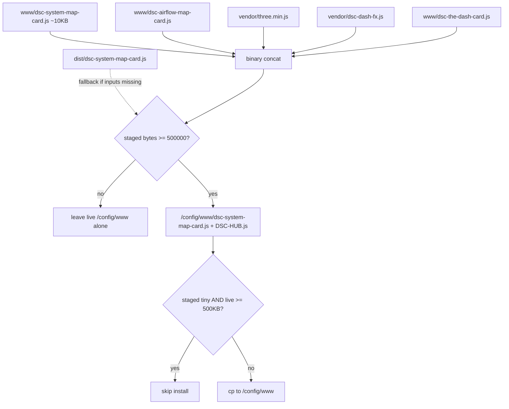

# Live UI — www cinematic bundle guards (F-013)

Ops runbook for **DSC-HUB Sync 5.1.3** after the cinematic The Dash pass.
Prevents Sync from wiping `/config/www/dsc-system-map-card.js` back to a
~10 KB system-map-only stub (missing airflow / THREE / Dash FX / The Dash).

**Closed on HA 2026-08-04:** add-on rebuilt to **5.1.3**; sync staged an
**845901**-byte bundle + `vendor/three.min.js` + `vendor/dsc-dash-fx.js`.

## Intent

| Layer | Owns |
|---|---|
| `homeassistant/www/*` sources | Editable card / FX sources (not what Lovelace loads) |
| Publishers | Concat → one classic JS resource Lovelace loads |
| Guards | Refuse tiny bundles; never demote a live cinematic file |

Lovelace loads **one** resource (`/local/dsc-system-map-card.js` or HACS
`DSC-HUB.js`). That file must register:

- `custom:dsc-system-map-card`
- `custom:dsc-airflow-map-card`
- `custom:dsc-the-dash-card` (needs global `THREE` + `THREE.DSCDashFX`)

## Publish contract

**Concat order** (Sync, `ha-sync.sh`, `sync-hacs-dist.sh` — keep lockstep):

1. `dsc-system-map-card.js`
2. `dsc-airflow-map-card.js`
3. `vendor/three.min.js`
4. `vendor/dsc-dash-fx.js`
5. `dsc-the-dash-card.js`

Expected healthy size: **~846 KB** (845901 observed after cinematic FX).
Minimum accepted by Sync: **500000** bytes.

## Guards (Sync 5.1.3)

Verified in `dsc-hub-sync/rootfs/usr/bin/dsc-hub-sync.sh`:

| Guard | Behavior |
|---|---|
| Full input set | Concat only when map + airflow + three + dash-fx + dash are all present |
| Dist fallback | If inputs incomplete, copy `dist/dsc-system-map-card.js` and warn |
| Stage size | If staged `< 500000`, delete staged card — do not promote |
| Install demotion | If staged `< 500000` **and** live `>= 500000`, skip overwrite |
| Modules | Also stages `dashboards/modules/view_*.yaml` (F-012 empty views) |

`ha-sync.sh` / HACS dist always concat the five inputs (no size gate there —
operators should still `wc -c` after publish).

## Lovelace resource constraint

| Requirement | Why |
|---|---|
| Resource **type `js`** (classic), not `module` | THREE / Dash FX / cards are IIFE globals |
| Prefer `/local/dsc-system-map-card.js?v=…` | Sync path + ha-sync cache-bust |
| Do not hand-copy `www/dsc-system-map-card.js` alone | That is the ~10 KB source stub |

Cache-bust: `ha-sync.sh` rewrites `?v=` to `dash-<UTC>`. Sync add-on does
**not** edit `.storage/lovelace_resources` — bump `?v=` via
`hass.callWS({ type: 'lovelace/resources/update' })` or Settings → Resources.
Avoid `ha core restart` races that wiped resources (F-010).

## Smoke checklist

- [ ] Supervisor add-on version **5.1.3** (not 5.1.2)
- [ ] After sync log: staged bundle bytes **≥ 500000** (expect ~846 KB)
- [ ] `wc -c /config/www/dsc-system-map-card.js` ≈ `wc -c` of `DSC-HUB.js`
- [ ] `/config/www/vendor/three.min.js` and `dsc-dash-fx.js` present
- [ ] Resource type **JavaScript** for the bundle URL
- [ ] `/dsc-hub-pro/home` → system map renders
- [ ] Climate → AIRFLOW STATUS element exists
- [ ] `/dsc-hub-pro/dash` → The Dash 3D scene (bloom/ribbons OK)

## Triage

| Symptom | Likely cause | Fix |
|---|---|---|
| Bundle ~10 KB; Dash/airflow missing | Old Sync image copying source only | **Update** add-on to **5.1.3**; or `ha-sync.sh` / HACS Redownload |
| Bundle ~33–61 KB; Dash missing | Airflow-only era concat (no THREE) | Rebuild/republish five-part concat; Update Sync |
| Bundle ~789–800 KB; FX flat | Missing `dsc-dash-fx.js` in concat | Ensure FX between three and the-dash; redeploy |
| Custom element missing after “good” sync | Stale browser / `?v=` / wrong `module` type | Cache-bust; set type `js`; hard-refresh |
| Empty / Unnamed Pro views | Modules not under `/config/dashboards/modules/` | Confirm Sync copies `view_*.yaml` (F-012) |
| Sync log “Refusing tiny www bundle” | Incomplete clone or broken concat | Check www + vendor inputs; dist fallback should warn |

## Related

| Doc | Role |
|---|---|
| [`../../dsc-hub-sync/DOCS.md`](../../dsc-hub-sync/DOCS.md) | Add-on contract |
| [`../../scripts/ADDON.md`](../../scripts/ADDON.md) | Install / architecture |
| [`../../scripts/HACS-FRONTEND.md`](../../scripts/HACS-FRONTEND.md) | HACS dual-path |
| [`../../docs/FOLLOWUPS.md`](../../docs/FOLLOWUPS.md) | F-010 / F-011 / F-012 / F-013 narrative |
| Draft PR #17 `LIVE-UI-THE-DASH` | Scene/topology ops (complement; not a substitute for guards) |
