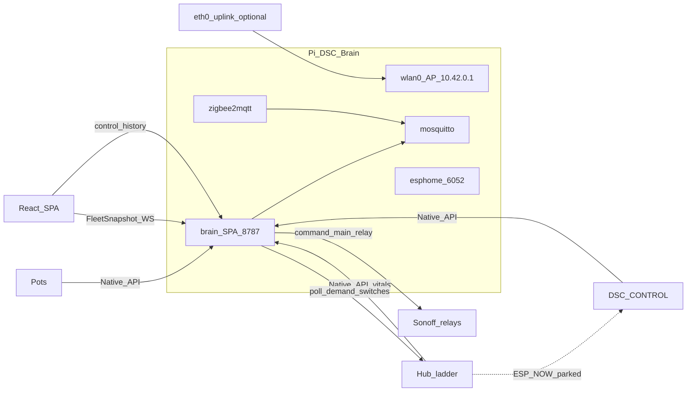
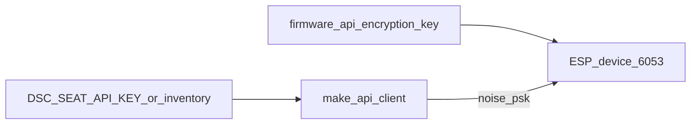
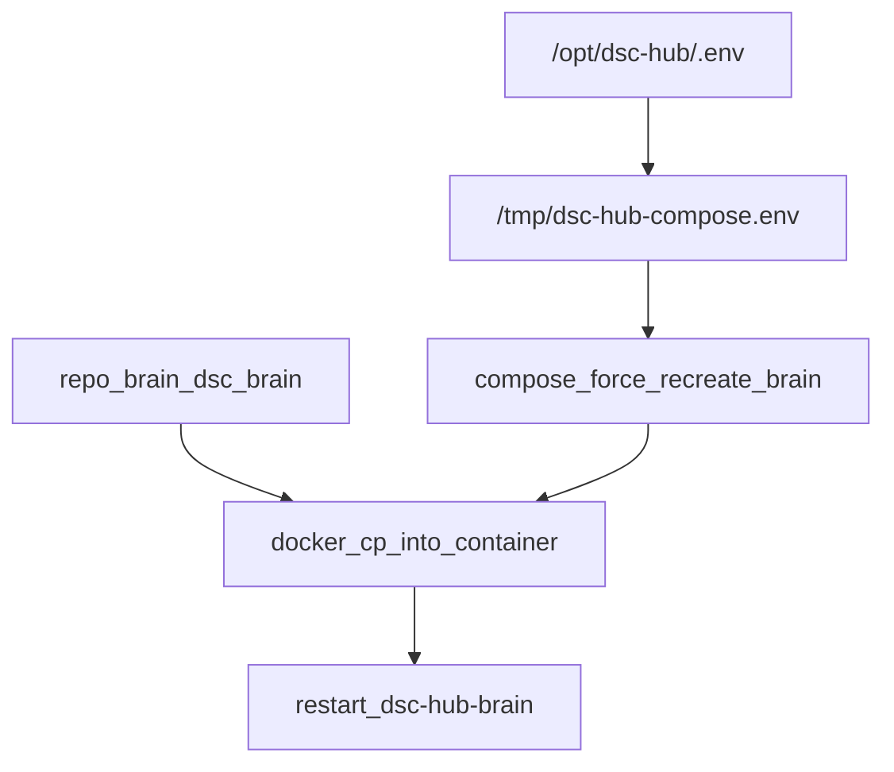
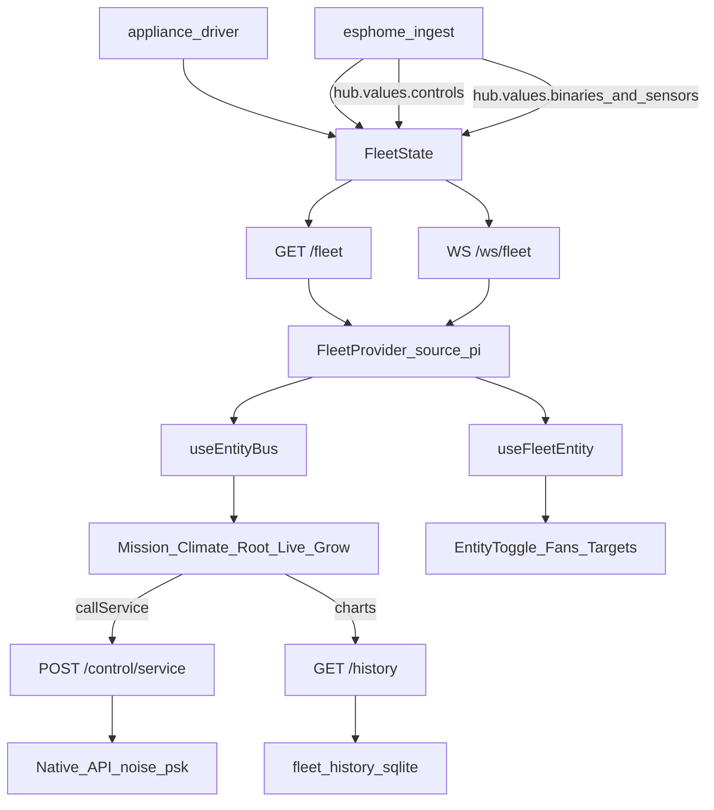
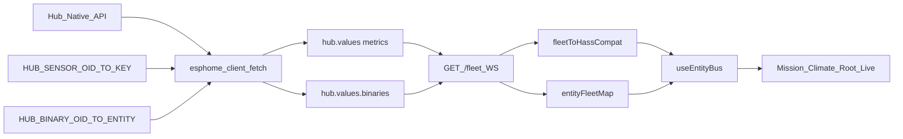
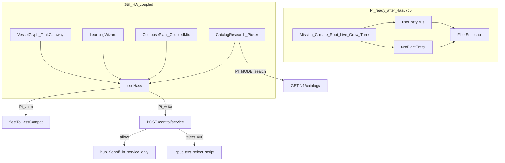
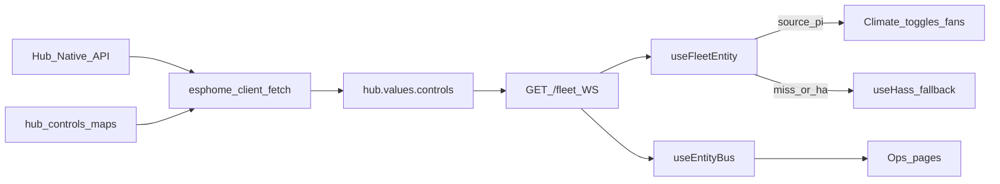
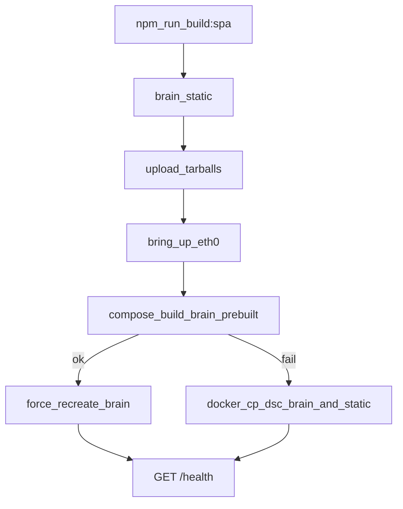

# DSC-HUB 7.0 — Pi appliance ops

**Intent:** Product path is a Raspberry Pi 4 island (`DSC-Brain` AP) running brain + SPA + MQTT/Zigbee + ESPHome dashboard. Hub keeps ladder safety. Brain polls hub demand switches and drives Sonoff `main_relay` over Native API. ETH01 bridge and hub ESP-NOW are **parked** on this path.

**Tip commit:** `4aa67c5` · **Firmware:** `7.0.0.0` · **Brain/SPA:** `7.0.0-dev` until island soak + tag `v7.0.0`.

Prior tips still apply: Pi appliance ship (`c4eb97f`), AP PSK alignment (`8867b33`), Native API **noise_psk** + WiFi-pref clear + env recreate (`db85cbc`), FleetSnapshot SPA + `/control` + `/history` + **Dockerfile.prebuilt** (`47f6622`), hub **`hub.values.controls`** + Climate `useFleetEntity` (`c1a451a`). This tip **completes native fleet reads** for all live operational pages: room/clone hub sensors + photoperiod binaries into FleetSnapshot, **`useEntityBus`** across Mission/Climate/Root/Live/Grow/Tune, expanded `fleetToHassCompat`, SPA bundle `index-DdObn-6b`.

Compose quick start: [`services/dsc-hub/README.md`](../../services/dsc-hub/README.md) · Cutover checklist: [`docs/ops/DSC-HUB-DOCKER.md`](../ops/DSC-HUB-DOCKER.md) · Architecture: [`docs/DSC-BRAIN.md`](../DSC-BRAIN.md) · SPA contract: [`docs/brain/WEBUI.md`](../brain/WEBUI.md)

---

## Architecture



| Layer | Owns | Does not own |
|---|---|---|
| Hub | Ladder, failsafes, min-off, PWM | Catalog SoT, Sonoff drive on Pi path |
| Brain | Inventory, fleet ingest, appliance driver, Want/decision, SPA API | Hard safety if Pi power dies |
| SPA | Presentation + HA-shaped control/history proxies | Catalog SoT / Want math |
| Sonoffs | Local `main_relay` + API-loss grace | Climate policy |
| eth0 | Optional Ollama / remote CannaLib / Docker Hub pulls | Climate island (AP alone is enough) |

---

## Version trains (do not conflate)

| Train | SoT | Notes |
|---|---|---|
| **Pi product** | FW **7.0.0.0**, brain/SPA **7.0.0(-dev)** | `*-wifi-pi.yaml`, `10.42.0.0/24` |
| HA lab soak | Surface **7.2.0**, prior studio FW **6.1.0.0** | Still valid for Unraid/HA; not the Pi island |
| Kit SoftAP | `*-kit.yaml` | Product unbox without Pi; separate path |

---

## Pi subnet map

Defaults from `brain/dsc_brain/settings.py` + `firmware/v4/dsc-*.yaml` stubs + bootstrap `dnsmasq.conf`:

| Seat | Host | Stub / package |
|---|---|---|
| Pi AP | `10.42.0.1` (`dsc-brain.local`) | `pi-bootstrap.sh` hostapd/dnsmasq |
| Hub | `10.42.0.10` | `dsc-hub.yaml` → `dsc-hub-wifi-pi.yaml` + parked ESP-NOW |
| Control | `10.42.0.11` | `dsc-control.yaml` → `dsc-control-wifi-pi.yaml` |
| Pot1–4 | `10.42.0.21`–`.24` | `dsc-pot{N}.yaml` → `dsc-pot-wifi-pi.yaml` |
| Heater / heatmat | `.50` / `.51` | Sonoff stubs + `dsc-sonoff-wifi-pi.yaml` |
| Humidifier / dehumidifier | `.54` / `.55` | same |
| Bridge (lab only) | eth archaeology | **Not** on Pi product path |

After first flash, paste device MACs into Settings inventory / `/etc/dsc-hub/dnsmasq.conf` `dhcp-host=` lines so reservations stick.

---

## AP PSK alignment (fleet must match)

**Constraint:** Pi hostapd passphrase, brain `ap_psk` / `DSC_AP_PSK`, and firmware `wifi_password` (Pi stubs) must be the **same** shared secret. Mismatch → devices never join `DSC-Brain`.

Tip `8867b33` aligned code defaults to the fleet shared PSK (same value as `services/dsc-hub/README.md` / `env.example`). Canonical store: Notion **API Keys & Credentials** → *DSC-Brain Pi AP (fleet Wi-Fi)*. Do **not** paste the live PSK into Wiki or PR bodies.

| Path | Behavior |
|---|---|
| `brain/dsc_brain/settings.py` | `DEFAULT_SETTINGS["ap_psk"]` = fleet default; `init_settings_db` upgrades `''` or `changeme-dsc-brain` → fleet default |
| `brain/dsc_brain/network_apply.py` | `render_hostapd_conf` fallback when unset: fleet default (was placeholder) |
| `services/dsc-hub/pi/pi-bootstrap.sh` | `DSC_AP_PSK` default = fleet default |
| `services/dsc-hub/env.example` | `DSC_AP_PSK=` fleet default |
| `services/dsc-hub/pi/fix-ap-psk.sh` | One-shot: if live `/etc/dsc-hub/hostapd.conf` still has `wpa_passphrase=changeme-dsc-brain`, rewrite + restart `dsc-hub-ap.service` |

```mermaid
flowchart TD
  secrets[firmware_secrets_wifi_password] --> flash[wifi_pi_flash]
  env[DSC_AP_PSK_or_settings_ap_psk] --> apply[network_apply_hostapd]
  boot[pi_bootstrap_hostapd] --> live[/etc/dsc-hub/hostapd.conf]
  apply --> live
  live --> ap[DSC_Brain_AP]
  flash --> sta[Fleet_STA]
  ap --> sta
```

**Live Pi already bootstrapped before the tip:** run `bash services/dsc-hub/pi/fix-ap-psk.sh` on the Pi (or set Settings `ap_psk` + network apply, then copy rendered hostapd and restart AP). Confirm firmware secrets `wifi_password` matches before expecting STA joins.

---

## Native API auth (ESPHome 2026+)

Firmware exposes Noise encryption (`api.encryption.key` ← secret `dsc_*_api_key`). Brain clients must pass that key as **`noise_psk`**, not legacy password positional auth.

Factory: `brain/dsc_brain/native_api.py` → `make_api_client(host, api_key)`.

| Caller | Role |
|---|---|
| `esphome_client.py` | Fleet vitals ingest (hub / pots / Sonoffs / panel) |
| `appliance_driver.py` | Hub demand poll + Sonoff `main_relay` commands |
| `hub_native.py` | Proposal path connect (emit still mostly logged) |
| `brain/scripts/clear_hub_wifi_pref.py` | One-shot hub WiFi-pref clear |

Keys come from inventory `api_key`, else `DSC_<SEAT>_API_KEY` / settings / compose `.env` (`DSC_HUB_API_KEY`, …). Canonical store: Notion **API Keys & Credentials** — never paste live Noise keys into Wiki/PRs.



**Pitfall:** Passing the key as the third positional `password` argument to `APIClient` fails against ESPHome 2026 Noise-only devices (connect/login errors; ingest and appliance driver look “dead”).

### Async start (must have a running loop)

`EsphomeIngest.start()` and `start_appliance_driver()` use `asyncio.get_running_loop()` and create the background task only when called from a live loop. If started with no running loop they log a warning and **return without scheduling** (silent no-op is gone). Subscribe helpers that are sync in current `aioesphomeapi` are not `await`ed.

---

## Appliance driver (replaces ETH01)

Code: `brain/dsc_brain/appliance_driver.py` (via `make_api_client`).

| Constraint | Value |
|---|---|
| Poll | every **2 s** |
| Hub → seat map | `heater_demand`→`heater`, `humidifier_demand`→`humidifier`, `dehumidifier_demand`→`dehumidifier`, `growmat_demand`→`heatmat` |
| Sonoff switch | object_id `main_relay` |
| Stale failsafe | no successful hub demand read for **45 s** → all mapped relays **OFF** |
| Auth | inventory `api_key` else env/settings → **noise_psk** |

Hub ESP-NOW package on Pi stubs: `dsc-hub-espnow-parked.yaml` (no primary mesh). Bridge demand path is lab archaeology — see [`docs/brain/F010_APPLIANCE_BRIDGE.md`](../brain/F010_APPLIANCE_BRIDGE.md).

---

## Clear stale hub WiFi preference

**Intent:** After SoftAP/Nest → Pi AP moves, hub NVS may still hold **Preferred WiFi BSSID** and **Lock WiFi AP**. Lock + stale BSSID causes mismatch-bounce / refusal to stay on `DSC-Brain`.

Hub entities (firmware `dsc-hub-v4_0.yaml`): switch `lock_wifi_ap`, text `preferred_wifi_bssid`, button `clear_preferred_wifi_ap` (“Clear Preferred WiFi AP”).

| Script | Role |
|---|---|
| `brain/scripts/clear_hub_wifi_pref.py` | Native API: lock OFF → press clear button (else blank preferred text) |
| `services/dsc-hub/pi/clear-hub-wifi-pref.sh` | Pi wrapper: read `DSC_HUB_API_KEY` from `/opt/dsc-hub/.env`, run script in `dsc-hub-brain`, print `/fleet` hub online + link bits |

```bash
# On the Pi (hub at 10.42.0.10)
cp /opt/dsc-hub-repo/brain/scripts/clear_hub_wifi_pref.py /tmp/
bash /opt/dsc-hub-repo/services/dsc-hub/pi/clear-hub-wifi-pref.sh
```

Env overrides for the Python script: `HUB_HOST` (default `10.42.0.10`), `HUB_KEY` or `DSC_HUB_API_KEY` (or `/tmp/hub_key.txt` after the wrapper).

---

## Reload brain container env on deploy

Compose only picks up `.env` changes when the brain service is **recreated**. Tip `db85cbc` folds that into remote deploy and adds a one-shot helper.

| Script | Role |
|---|---|
| `services/dsc-hub/pi/deploy-brain-remote.sh` | After sync: copy `.env` → `/tmp/dsc-hub-compose.env`, remove accidental `.env\r` Windows duplicate, `docker compose … up -d --force-recreate brain`, then hot-patch `dsc_brain/` |
| `services/dsc-hub/pi/recreate-brain-env.sh` | Same recreate + hot-patch + `KEYLEN` / `/health` / `/fleet` checks (optional sudo password arg) |



**Pitfall:** Windows upload can leave a filename literally `.env\r` beside `.env`. Scripts delete that duplicate before recreate. Hot-patch alone does **not** refresh `DSC_HUB_API_KEY` inside the container — recreate does.

---

## Public HTTP / WS surface

Brain listens on **`:8787`** (`dsc_brain.api`). SPA is served from `/` when `brain/static/` (or image `/app/static`) is built.

| Method | Path | Role |
|---|---|---|
| GET | `/health` | version, surface, expected firmware |
| GET | `/fleet` | **FleetSnapshot** + inventory (`?include_hass=true` adds legacy hass-shaped map) |
| WS | `/ws/fleet` | FleetSnapshot + inventory ~2 s |
| POST | `/control/service` | HA-shaped `{domain, service, data}` → Native API / inventory |
| GET | `/history` | `entity_id` + `hours` (0.25–168) → `{t,v}` points from `fleet_history` |
| GET/PATCH | `/settings` | settings blob |
| PATCH | `/settings/inventory/{seat_id}` | host / mac / api_key / in_service |
| GET/PATCH | `/roster`, `/roster/{seat_id}` | plant seats |
| GET | `/learning` | learning log |
| POST | `/settings/integrations/test-ollama` | uplink probe |
| POST | `/settings/integrations/test-cannalib` | catalog probe |
| POST | `/settings/zigbee/permit-join` | z2m permit join |
| GET/POST | `/settings/network`, `/settings/network/apply` | AP/dnsmasq apply hooks |
| GET/POST | `/settings/esphome/devices`, `/settings/esphome/jobs` | OTA job queue |
| GET/POST | `/settings/backup/export`, `/settings/backup/import` | ops zip |
| GET | `/v1/catalogs/{kind}` | CannaLib prefer → local slim |
| GET | `/catalogs/{kind}`, `/want/{id}`, POST `/decision/tick` | local catalog / Want / dry-run |

OpenAPI: `http://dsc-brain.local:8787/docs`.

---

## FleetSnapshot SPA (native fleet state)

**Intent:** Pi UI reads typed fleet seats (`hub` / `panel` / `pots` / `sonoffs` / `system`), not HA `entity_id` strings. HA panel path stays dual-mode for lab soak.



| Path | Role |
|---|---|
| `brain/dsc_brain/fleet_state.py` | Product SoT snapshot (`to_dict`, optional `to_hass_states`) |
| `brain/dsc_brain/hub_controls.py` | Shared HA `entity_id` ↔ ESPHome `object_id` maps (controls + sensors + binaries) |
| `brain/dsc_brain/esphome_client.py` | Hub poll fills vitals / `controls` / `binaries` |
| `frontend/src/lib/fleetModel.ts` | `FleetSnapshot` / `parseFleetSnapshot` (mirrors brain) |
| `frontend/src/hooks/useFleet.tsx` | `FleetProvider` — `source: "pi" \| "ha"` |
| `frontend/src/hooks/useEntityBus.ts` | Drop-in `useHass` for ops pages — controls + live metrics + compat shim |
| `frontend/src/hooks/useFleetEntity.ts` | Per-entity control read (toggles / fans / targets) |
| `frontend/src/lib/entityFleetMap.ts` | HA `entity_id` → fleet seat metric (incl. room/clone) |
| `frontend/src/lib/fleetFromHass.ts` | `fleetToHassCompat` — Pi → synthetic HA states for pages still using entity ids |
| `frontend/src/lib/fleetControlMap.ts` | Control state / available / attributes helpers |
| `frontend/src/lib/fleetApi.ts` | `get_fleet_state`, `call_service`, `get_entity_history` |
| `frontend/src/hooks/useFleetActions.ts` | Pi → `/control/service`; HA → `hass.callService` |
| `frontend/src/hooks/useHistory.ts` | Pi → `/history`; HA → history WS |
| `frontend/src/main.tsx` | Pi boot: `BrainProvider` → `FleetProvider source="pi"` |

**Constraint:** Default `GET /fleet` does **not** include `hass_states` (tests assert this). Pass `?include_hass=true` only for legacy consumers.

### Hub sensors + binaries (tip `4aa67c5`)

**Intent:** Mission / Climate / Root / Live pages need room + clone tent vitals and photoperiod window / light-catchup binaries — not only main-tent temp/RH/VPD and control readback.

On each hub Native API poll (`esphome_client._fetch_device`):

| Map (`hub_controls.py`) | Destination | Notes |
|---|---|---|
| `HUB_SENSOR_OID_TO_KEY` | `hub.values.<metric>` | Exact `object_id` match: `temp_sensor`→`temp_c`, `humidity_sensor`→`rh_pct`, `vpd_sensor`→`vpd_kpa`, `room_temp`/`room_rh`, `clone_temp`/`clone_rh`/`clone_vpd` |
| `HUB_BINARY_OID_TO_ENTITY` | `hub.values.binaries[entity_id]` | `main_window_bs`→`binary_sensor.dsc_hub_4x8_window_open`, `clone_window_bs`→`…2x4_window_open`, `light_catchup_bs`→`…light_catchup_active` |



Frontend bridges:

| Layer | Role |
|---|---|
| `entityFleetMap.ts` | Maps room/clone HA sensor ids → fleet metrics for `num` / charts / held readings |
| `fleetToHassCompat` | Emits room/clone sensors, room VPD (computed from temp+RH), binaries, pot `got_*` / soil temp/EC/pH aliases, panel firmware, fleet version status |
| `history_ops.ENTITY_METRIC_MAP` | Charts for room/clone temperature / humidity / VPD entity ids |

**Verify:**

```bash
curl -s http://10.42.0.1:8787/fleet | jq '{room: .hub.values.room_temp_c, clone: .hub.values.clone_temp_c, bins: .hub.values.binaries}'
curl -s 'http://10.42.0.1:8787/history?entity_id=sensor.dsc_hub_clone_temperature&hours=6'
```

### `useEntityBus` (ops pages) vs `useFleetEntity` (controls)

| Hook | Job | Used by |
|---|---|---|
| **`useEntityBus`** | Drop-in for `useHass` on Pi: prefers `hub.values.controls`, then live metrics via `entityFleetMap`, else BrainProvider’s `fleetToHassCompat` shim | Mission, Climate, Root, Live, Grow, Light, Tune/Fleet pages + Honesty / DutyStrip / HubLinkLine / PlantExtra / EntityInspector / series / held-reading hooks |
| **`useFleetEntity(id)`** | Single control entity read (state / available / attributes) for widgets that write via `/control/service` | `EntityToggle`, fan/light widgets, TentTargets control rows, Climate Full Auto / fan-override chips |

On HA lab (`source !== "pi"`), `useEntityBus` returns plain `useHass`.

### HA-coupled SPA surfaces (not product-ready on Pi alone)

**Intent:** Tip `4aa67c5` finished **ops** pages on FleetSnapshot. Catalog browse / Build-a-Plant compose / Learning / Vessel / Tank still import raw `useHass` and talk to HA helpers + scripts. On Pi they ride BrainProvider’s `fleetToHassCompat` shim for a **thin** state set and `POST /control/service` for writes — which is **not** enough for those flows.



| Surface | Files | What works on Pi today | What does **not** |
|---|---|---|---|
| **Catalog search** | `lib/catalog.ts`, `CatalogResearch.tsx`, `CatalogPicker.tsx` | `VITE_DSC_PI=1` → `GET /v1/catalogs/{kind}` (CannaLib prefer → local slim); JSON `/local/dsc-catalog/*` fallback | Writing picked strain/medium/nutrient/light into HA `input_text` / helpers |
| **Compose / Build-a-Plant** | `ComposePlant.tsx`, `CoupledMix.tsx` | Catalog pick UI can list items via search above | Commit / assign / mix / apply-climate scripts; `input_text` / `input_select` / `input_number` blend slots; vessel select |
| **Learning / cal** | `LearningWizard.tsx` | — | `script.dsc_cal_*` / learn-gate helpers; CFM curve sensors |
| **Vessel / Tank** | `VesselGlyph.tsx`, `TankCutaway.tsx` | — | Vessel `input_select` + tank helper reads/writes |
| **Charts** | `useHistory.ts` | Already dual-mode: Pi → `GET /history` | Unmapped entity ids still empty |

**Control proxy allow-list** (`control_ops.call_service_proxy`) — only these domains succeed on Pi:

| Domain | Allowed entities / services |
|---|---|
| `input_boolean` | In-service seats only (`dsc_*_in_service` → inventory) |
| `switch` | Hub demand / mode switches + Sonoff `main_relay` |
| `number` / `input_number` | Hub target numbers in `HUB_NUMBER_ENTITY_TO_OID` |
| `fan` / `light` / `select` | Hub fan / SF1000 / strategy selects |

Everything Compose/Learning uses (`input_text`, `input_select`, `script`, `input_datetime`, `time`, `text`) → **`400 unsupported service`**. Do not treat a 400 from those pages as a fleet outage.

**Durable product path (when migrating):**

| Concern | Call brain, not HA helpers |
|---|---|
| Catalog browse | Already: `/v1/catalogs/{kind}` + `/catalogs/{kind}` local |
| Roster / seat assign | `GET/PATCH /roster/{seat_id}` |
| Want / decision | `GET /want/{id}`, `POST /decision/tick` |
| Learning log | `GET /learning` (read); cal write path still HA-script shaped |
| Reload indexes | `POST /admin/reload-catalogs` |

**Constraint:** Do **not** invent height/chem/PPFD/NPK in UI or docs. Migrate Catalog/Compose/Learning to brain APIs only when the Pi island must run those surfaces without HA — ops climate is already native.

**Red-flag (code, not docs):** `control_ops.py` imports `HUB_SWITCH_ENTITY_TO_OID` but hub switch write path still calls `_HUB_SWITCH_ENTITY_TO_OID` → likely `NameError` until aliased. Fan/light/select/number paths use the correct names.

### Hub control readback (`hub.values.controls`)

**Intent:** Climate UI and toggles need HA-shaped control **state**, not only vitals. On each hub Native API poll, brain builds `hub.values.controls` keyed by HA `entity_id` (tip `c1a451a`).



| Domain | Map (in `hub_controls.py`) | Entry shape |
|---|---|---|
| `switch` | demand + Full Auto / Manual Takeover / override / routing / recirc pulse | `{ state: "on"\|"off" }` |
| `number` | tent + clone temp / RH / VPD targets | `{ state: "<float string>" }` |
| `fan` | intake main/clone, exhaust recirc/out | `{ state, percentage }` |
| `light` | SF1000 dimmer | `{ state, brightness }` |
| `select` | control strategy, priority tent | `{ state, options[] }` |

**Consumers:** Control widgets via `useFleetEntity`; broader pages via `useEntityBus` (which also reads `controls` first). When `source === "pi"` and the entity is present under `controls`, UI uses that state; otherwise it falls back to the compat shim / HA.

**Verify:**

```bash
curl -s http://10.42.0.1:8787/fleet | jq '.hub.values.controls["number.dsc_hub_target_temp"]'
# expect: {"state":"24.5"} (or current setpoint)
```

### Control proxy (`control_ops.py`)

`POST /control/service` body: `{ "domain", "service", "data": { "entity_id", … } }`. Maps live in `hub_controls.py` (same allow-list as ingest).

| Domain | Allowed | Services | Effect |
|---|---|---|---|
| `input_boolean` | mapped in-service entities | `turn_on` / `turn_off` / `toggle` | `upsert_inventory(…, in_service=)` |
| `switch` | hub demand/mode switches + Sonoff `main_relay` | `turn_on` / `turn_off` (/ `toggle` on hub) | Native API `switch_command` |
| `number` / `input_number` | hub targets (temp/RH/VPD/clone bands) | `set_value` / `set` | Native API `number_command` |
| `fan` | 4 mapped hub fans | `turn_on` / `turn_off` / `set_percentage` | `fan_command` (speed_level 0–100) |
| `light` | `light.dsc_hub_sf1000_dimmer` | `turn_on` / `turn_off` | `light_command` (optional `brightness` 0–255) |
| `select` | strategy + priority tent | `select_option` | `select_command` (`option` required) |

Unsupported entity/service → **400**. Hub host missing / seat OOS / entity key not found → **503**. Sonoff writes require inventory `in_service`.

### History (`history_ops.py`)

Maps a fixed set of HA-shaped `entity_id`s → `(seat_id, metric)` in `fleet_history` (hub temp/RH/VPD, **room + clone** temp/RH/VPD, pot soil, Sonoff relay on). Unmapped ids return **empty** `points` (not 404). Hours clamp **0.25–168**.

Example:

```bash
curl -s 'http://10.42.0.1:8787/history?entity_id=sensor.dsc_hub_tent_temperature&hours=6'
curl -s -X POST http://10.42.0.1:8787/control/service \
  -H 'Content-Type: application/json' \
  -d '{"domain":"number","service":"set_value","data":{"entity_id":"number.dsc_hub_target_temp","value":24.5}}'
curl -s -X POST http://10.42.0.1:8787/control/service \
  -H 'Content-Type: application/json' \
  -d '{"domain":"fan","service":"set_percentage","data":{"entity_id":"fan.dsc_hub_4_inch_intake_fan_main","percentage":40}}'
```

---

## Prebuilt SPA image + eth0 bring-up

**Intent:** Pi should not compile Node on-device. Windows/dev builds the SPA; deploy packs static into `brain/static` and builds `Dockerfile.prebuilt` (Python-only). Image builds need house uplink (Docker Hub); eth0 bring-up runs before compose build.

| Artifact | Role |
|---|---|
| `services/dsc-hub/brain/Dockerfile.prebuilt` | `python:3.12-slim` + `dsc_brain` + prebuilt `static` + slim `homeassistant/data` — **no Node stage** |
| `services/dsc-hub/docker-compose.yml` | `build.dockerfile: …/Dockerfile.prebuilt`; compose systemd passes `--env-file /opt/dsc-hub/.env` |
| `services/dsc-hub/pi/deploy-brain.ps1` | `npm run build:spa` → tarball static + brain → pscp Dockerfile.prebuilt + `bring-up-eth0.sh` |
| `services/dsc-hub/pi/deploy-brain-remote.sh` | eth0 up → `compose build --pull brain` → `up -d --force-recreate`; else hot-patch `dsc_brain/` + `static/` |
| `services/dsc-hub/pi/bring-up-eth0.sh` | `ip link set eth0 up` + dhcpcd/dhclient/nmcli; may write Docker `daemon.json` DNS (IPv4) and restart docker |
| `services/dsc-hub/pi/dsc-hub-eth0.service` | Optional oneshot: `dhcpcd -b eth0` before docker |
| `pi-bootstrap.sh` | Symlinks `/opt/dsc-hub` (compose) and `/opt/dsc-hub-repo` (full tree for builds/hot-patch) |



**Deploy modes (logged):** `image-build` when compose build succeeds; `hot-patch` when offline / Hub pull fails (Python+static copied into running container after force-recreate).

```powershell
# From Windows when Pi is on DSC-Brain AP
services/dsc-hub/pi/deploy-brain.ps1
```

```bash
curl -s http://10.42.0.1:8787/health
curl -s http://10.42.0.1:8787/fleet | jq '.hub.online, .surface, (.inventory|length)'
# Hard-refresh SPA (Ctrl+Shift+R) — hashed assets under /assets/
```

**Pitfalls:** AP-only Pi often cannot pull `python:3.12-slim` → expect `hot-patch`. Broken IPv6 Docker DNS on island → `bring-up-eth0.sh` sets explicit IPv4 DNS. Windows `.env` CRLF → deploy still normalizes LF and deletes `.env\r` before recreate.

---

## Docker stack

Compose: `services/dsc-hub/docker-compose.yml` (Pi arm64 — **not** Unraid Compose Manager).

| Service | Port | Role |
|---|---|---|
| brain | 8787 | FastAPI + prebuilt SPA |
| cannalib | 127.0.0.1:8790 | read-only local catalog fallback |
| mosquitto | internal 1883 | z2m ↔ brain |
| zigbee2mqtt | — | SkyConnect; permit-join from Settings |
| esphome | 6052 | dashboard over `/firmware/v4` |

Env template: `services/dsc-hub/env.example`. Secrets live in Notion **API Keys & Credentials** and gitignored `.env` / `firmware/v4/secrets.yaml` — **never** paste live keys or AP PSKs into Wiki/PRs.

---

## Cutover (operator)

1. Flash Pi OS Lite 64-bit (hostname `dsc-brain`), clone repo to SSD, data under `/var/lib/dsc-hub`.
2. `sudo services/dsc-hub/pi/pi-bootstrap.sh` → edit `.env` (AP PSK from Notion credentials) → copy CannaLib checkpoint sqlite → set `ZIGBEE_DEVICE` by-id.
3. `systemctl start dsc-hub-ap.service` then `dsc-hub-compose.service`; `curl http://dsc-brain.local:8787/health`.
4. Build/flash FW **7.0.0.0** (`wifi-pi` packages) with `wifi_ssid`/`wifi_password` matching the Pi AP. Order: **hub → Pot2 canary → pots → Sonoffs → panel**.
5. Disable HA demand-follower automations / HA ESPHome integrations for the tent (keep packages until soak).
6. Island proof: Nest + HA off; tent on Pi AP; fleet chip / health `expected_firmware` **7.0.0.0**.
7. eth0 up: Settings → Test Ollama + Test CannaLib. eth0 down: integrations HELD; local cannalib fallback if present.
8. Tag `v7.0.0` only after soak.

---

## Troubleshooting / pitfalls

| Symptom | Likely cause | Fix |
|---|---|---|
| Fleet never joins `DSC-Brain` | AP PSK ≠ firmware `wifi_password` | Align secrets + `.env` / Settings; see **AP PSK alignment**; live placeholder → `fix-ap-psk.sh` |
| Hub joins then flaps / stays off preferred AP | Stale preferred BSSID + Lock WiFi AP | Run **Clear stale hub WiFi preference** scripts |
| Ingest/appliance silent; `:6053` connect fails | Key passed as password not `noise_psk` | Tip `db85cbc` factory; recreate brain so `.env` Noise keys load |
| “ESPHome ingest / appliance not started” in logs | `start()` called with no running event loop | Start from FastAPI lifespan / async context only |
| Relays stuck / all OFF | Hub API unreachable >45 s | Check inventory host/keys; `/health` + hub `:6053`; recreate brain env if key empty (`KEYLEN=0`) |
| Wrong Sonoff | seat not `in_service` or missing `main_relay` | Settings inventory; ESPHome entity list |
| Devices on Nest IPs | Flashed lab/studio stubs | Re-flash Pi stubs (`*-wifi-pi.yaml`); clear SoftAP/Nest statics + hub WiFi pref |
| SkyConnect missing | serial console stole ACM | Bootstrap strips `console=serial0`; use `/dev/serial/by-id/…` |
| SPA 503 / blank assets | static not uploaded / stale hash | `npm run build:spa` then `deploy-brain.ps1`; hard refresh |
| Deploy logs `hot-patch` always | eth0 down / Docker Hub unreachable | Plug cable; run `bring-up-eth0.sh`; retry build |
| `/control/service` 400 | entity not in allow-lists | Only mapped hub/Sonoff/in-service entities (see **Control proxy** / `hub_controls.py`) |
| `/control/service` 503 | hub host/key missing or seat OOS | Inventory + recreate brain env; confirm `noise_psk` |
| Climate toggles stuck unavailable on Pi | `hub.values.controls` missing entity / hub offline | Confirm hub online on `/fleet`; wait one ingest cycle; check map in `hub_controls.py` |
| Fan % / light brightness wrong in UI | reading HA while on Pi, or stale SPA | Use tip SPA (`useFleetEntity` / `useEntityBus`); hard-refresh; confirm `controls[…].percentage` / `.brightness` |
| Mission / Root / Live room or clone blank on Pi | room/clone not in `hub.values` / stale SPA | Confirm tip ingest maps; `jq '.hub.values \| {room_temp_c, clone_temp_c, binaries}'`; hard-refresh for `index-DdObn-6b` |
| Window / light-catchup binaries missing | `hub.values.binaries` empty | Check hub object_ids `main_window_bs` / `clone_window_bs` / `light_catchup_bs`; unit `test_hub_binaries_from_states` |
| Charts empty on Pi | unmapped `entity_id` or no samples | See `history_ops.ENTITY_METRIC_MAP` (incl. room/clone); wait for ingest |
| Catalog empty offline | no local sqlite + remote down | Place checkpoint under `/var/lib/dsc-hub/cannalib/` |
| Catalog search OK but Compose commit 400 on Pi | `input_text` / `script` not in control proxy | Expected — see **HA-coupled SPA surfaces**; use HA lab for Build-a-Plant until brain roster/Want UI lands |
| Learning / cal buttons 400 on Pi | `script.dsc_cal_*` unsupported | Expected — Learning stays HA-coupled; climate ops still work via FleetSnapshot |
| Hub Full Auto / demand toggle 500 on Pi | `_HUB_SWITCH_ENTITY_TO_OID` NameError in `control_ops` | Code fix: alias to `HUB_SWITCH_ENTITY_TO_OID`; fan/number/select still OK |
| Pi power loss | AP dies; relays failsafe OFF | Expected honesty boundary — hub ladder alone cannot reach Sonoffs |
| DHCP vs static Sonoffs | range starts at `.50` | Always set `dhcp-host=` MAC reservations after flash |
| HA panel still 7.2.0 | lab surface | OK — product appliance is **7.0.0** on Pi |
| Conflating `192.168.86.x` with `10.42.0.x` | Nest/studio vs Pi island | Use Pi map above for product path |

---

## Dev acceptance

```bash
pip install -r brain/requirements.txt pytest
pytest brain/tests -q
# includes test_hub_controls_from_states + test_hub_binaries_from_states

esphome config firmware/v4/dsc-hub.yaml
esphome config firmware/v4/dsc-control.yaml

cd homeassistant/custom_components/dsc_hub/frontend
npm install && npm run build:spa
# tip ships spa-dist assets/index-DdObn-6b.js
```

Monitoring: Uptime Kuma → `GET /health`; fleet WS → `ws://dsc-brain.local:8787/ws/fleet`. After deploy, hard-refresh SPA and confirm Mission/Climate/Root show room/clone when hub online.
