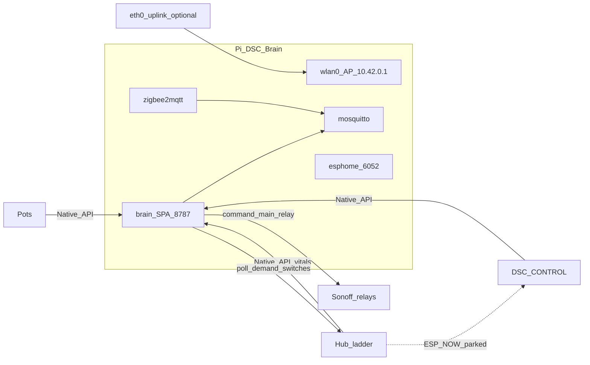

# DSC-HUB 7.0 — Pi appliance ops

**Intent:** Product path is a Raspberry Pi 4 island (`DSC-Brain` AP) running brain + SPA + MQTT/Zigbee + ESPHome dashboard. Hub keeps ladder safety. Brain polls hub demand switches and drives Sonoff `main_relay` over Native API. ETH01 bridge and hub ESP-NOW are **parked** on this path.

**Tip commit:** `c4eb97f` · **Firmware:** `7.0.0.0` · **Brain/SPA:** `7.0.0-dev` until island soak + tag `v7.0.0`.

Compose quick start: [`services/dsc-hub/README.md`](../../services/dsc-hub/README.md) · Cutover checklist: [`docs/ops/DSC-HUB-DOCKER.md`](../ops/DSC-HUB-DOCKER.md) · Architecture: [`docs/DSC-BRAIN.md`](../DSC-BRAIN.md)

---

## Architecture



| Layer | Owns | Does not own |
|---|---|---|
| Hub | Ladder, failsafes, min-off, PWM | Catalog SoT, Sonoff drive on Pi path |
| Brain | Inventory, fleet ingest, appliance driver, Want/decision, SPA | Hard safety if Pi power dies |
| Sonoffs | Local `main_relay` + API-loss grace | Climate policy |
| eth0 | Optional Ollama / remote CannaLib / house reach | Climate island (AP alone is enough) |

---

## Version trains (do not conflate)

| Train | SoT | Notes |
|---|---|---|
| **Pi product** | FW **7.0.0.0**, brain/SPA **7.0.0(-dev)** | `*-wifi-pi.yaml`, `10.42.0.0/24` |
| HA lab soak | Surface **7.2.0**, prior studio FW **6.1.0.0** | Still valid for Unraid/HA; not the Pi island |
| Kit SoftAP | `*-kit.yaml` | Product unbox without Pi; separate path |

---

## Pi subnet map

Defaults from `brain/dsc_brain/settings.py` + `firmware/v4/dsc-*.yaml` stubs + bootstrap `dnsmasq.conf`:

| Seat | Host | Stub / package |
|---|---|---|
| Pi AP | `10.42.0.1` (`dsc-brain.local`) | `pi-bootstrap.sh` hostapd/dnsmasq |
| Hub | `10.42.0.10` | `dsc-hub.yaml` → `dsc-hub-wifi-pi.yaml` + parked ESP-NOW |
| Control | `10.42.0.11` | `dsc-control.yaml` → `dsc-control-wifi-pi.yaml` |
| Pot1–4 | `10.42.0.21`–`.24` | `dsc-pot{N}.yaml` → `dsc-pot-wifi-pi.yaml` |
| Heater / heatmat | `.50` / `.51` | Sonoff stubs + `dsc-sonoff-wifi-pi.yaml` |
| Humidifier / dehumidifier | `.54` / `.55` | same |
| Bridge (lab only) | eth archaeology | **Not** on Pi product path |

After first flash, paste device MACs into Settings inventory / `/etc/dsc-hub/dnsmasq.conf` `dhcp-host=` lines so reservations stick.

---

## Appliance driver (replaces ETH01)

Code: `brain/dsc_brain/appliance_driver.py`.

| Constraint | Value |
|---|---|
| Poll | every **2 s** |
| Hub → seat map | `heater_demand`→`heater`, `humidifier_demand`→`humidifier`, `dehumidifier_demand`→`dehumidifier`, `growmat_demand`→`heatmat` |
| Sonoff switch | object_id `main_relay` |
| Stale failsafe | no successful hub demand read for **45 s** → all mapped relays **OFF** |
| Auth | inventory `api_key` else `DSC_<SEAT>_API_KEY` / settings |

Hub ESP-NOW package on Pi stubs: `dsc-hub-espnow-parked.yaml` (no primary mesh). Bridge demand path is lab archaeology — see [`docs/brain/F010_APPLIANCE_BRIDGE.md`](../brain/F010_APPLIANCE_BRIDGE.md).

---

## Public HTTP / WS surface

Brain listens on **`:8787`** (`dsc_brain.api`). SPA is served from `/` when `brain/static/` (or image `/app/static`) is built.

| Method | Path | Role |
|---|---|---|
| GET | `/health` | version, surface, expected firmware |
| GET | `/fleet` | fleet snapshot + hass-shaped states |
| WS | `/ws/fleet` | same payload ~2 s |
| GET/PATCH | `/settings` | settings blob |
| PATCH | `/settings/inventory/{seat_id}` | host / mac / api_key / in_service |
| GET/PATCH | `/roster`, `/roster/{seat_id}` | plant seats |
| GET | `/learning` | learning log |
| POST | `/settings/integrations/test-ollama` | uplink probe |
| POST | `/settings/integrations/test-cannalib` | catalog probe |
| POST | `/settings/zigbee/permit-join` | z2m permit join |
| GET/POST | `/settings/network`, `/settings/network/apply` | AP/dnsmasq apply hooks |
| GET/POST | `/settings/esphome/devices`, `/settings/esphome/jobs` | OTA job queue |
| GET/POST | `/settings/backup/export`, `/settings/backup/import` | ops zip |
| GET | `/v1/catalogs/{kind}` | CannaLib prefer → local slim |
| GET | `/catalogs/{kind}`, `/want/{id}`, POST `/decision/tick` | local catalog / Want / dry-run |

OpenAPI: `http://dsc-brain.local:8787/docs`.

---

## Docker stack

Compose: `services/dsc-hub/docker-compose.yml` (Pi arm64 — **not** Unraid Compose Manager).

| Service | Port | Role |
|---|---|---|
| brain | 8787 | FastAPI + SPA |
| cannalib | 127.0.0.1:8790 | read-only local catalog fallback |
| mosquitto | internal 1883 | z2m ↔ brain |
| zigbee2mqtt | — | SkyConnect; permit-join from Settings |
| esphome | 6052 | dashboard over `/firmware/v4` |

Env template: `services/dsc-hub/env.example`. Secrets live in Notion **API Keys & Credentials** and gitignored `.env` / `firmware/v4/secrets.yaml` — **never** paste live keys or AP PSKs into Wiki/PRs.

---

## Cutover (operator)

1. Flash Pi OS Lite 64-bit (hostname `dsc-brain`), clone repo to SSD, data under `/var/lib/dsc-hub`.
2. `sudo services/dsc-hub/pi/pi-bootstrap.sh` → edit `.env` → copy CannaLib checkpoint sqlite → set `ZIGBEE_DEVICE` by-id.
3. `systemctl start dsc-hub-ap.service` then `dsc-hub-compose.service`; `curl http://dsc-brain.local:8787/health`.
4. Build/flash FW **7.0.0.0** (`wifi-pi` packages). Order: **hub → Pot2 canary → pots → Sonoffs → panel**.
5. Disable HA demand-follower automations / HA ESPHome integrations for the tent (keep packages until soak).
6. Island proof: Nest + HA off; tent on Pi AP; fleet chip / health `expected_firmware` **7.0.0.0**.
7. eth0 up: Settings → Test Ollama + Test CannaLib. eth0 down: integrations HELD; local cannalib fallback if present.
8. Tag `v7.0.0` only after soak.

---

## Troubleshooting / pitfalls

| Symptom | Likely cause | Fix |
|---|---|---|
| Relays stuck / all OFF | Hub API unreachable >45 s | Check inventory host/keys; `/health` + hub `:6053` |
| Wrong Sonoff | seat not `in_service` or missing `main_relay` | Settings inventory; ESPHome entity list |
| Devices on Nest IPs | Flashed lab/studio stubs | Re-flash Pi stubs (`*-wifi-pi.yaml`); clear SoftAP/Nest statics |
| SkyConnect missing | serial console stole ACM | Bootstrap strips `console=serial0`; use `/dev/serial/by-id/…` |
| SPA 503 | static not built into image | `npm run build:spa` then rebuild brain image |
| Catalog empty offline | no local sqlite + remote down | Place checkpoint under `/var/lib/dsc-hub/cannalib/` |
| Pi power loss | AP dies; relays failsafe OFF | Expected honesty boundary — hub ladder alone cannot reach Sonoffs |
| DHCP vs static Sonoffs | range starts at `.50` | Always set `dhcp-host=` MAC reservations after flash |
| HA panel still 7.2.0 | lab surface | OK — product appliance is **7.0.0** on Pi |

---

## Dev acceptance

```bash
pip install -r brain/requirements.txt pytest
pytest brain/tests -q

esphome config firmware/v4/dsc-hub.yaml
esphome config firmware/v4/dsc-control.yaml

cd homeassistant/custom_components/dsc_hub/frontend
npm install && npm run build:spa
```

Monitoring: Uptime Kuma → `GET /health`; fleet WS → `ws://dsc-brain.local:8787/ws/fleet`.
