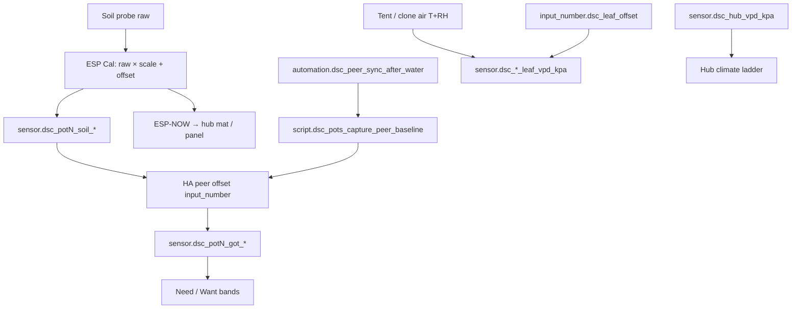

# Sensor calibration — peer sync v2 + pot provenance (HA 5.1.6 / pot 5.1.4)

Ops surface for the **2026-08-04** calibration first pass. Verified against:

- `firmware/v4/dsc-pot-common.yaml` (FW **5.1.4** provenance + Cal Offset/Scale)
- `homeassistant/packages/dsc_v4_sensor_cal.yaml` (auto-after-water + divergence)
- `homeassistant/packages/dsc_v4_strain_catalog.yaml` (`script.dsc_pots_capture_peer_baseline`)
- `homeassistant/packages/dsc_v4_core_helpers.yaml` (`sensor.dsc_leaf_vpd_kpa` / clone)
- Dashboard modules: `view_strains.yaml`, `view_root_zone.yaml`, `view_main_4x8.yaml`

## Intent

| Layer | Job | Feeds |
|---|---|---|
| **ESP Cal Offset/Scale** | Per-channel `raw * scale + offset` on the pot (NVS) | HA soil sensors **and** ESP-NOW (mat/panel) |
| **HA peer offsets** | Align Want/Need/**Got** across in-service pots | Dashboard Got / Need only — **not** ESP-NOW |
| **Leaf offset → leaf VPD** | Operator honesty for canopy VPD | Charts / Main 4x8 — **not** ladder control |



## Operator rule (N-024) — peer **or** ESP, not both

Got = `soil_* + peer offset`. If ESP Cal is already non-identity **and** peer
offsets are non-zero, Got **double-corrects** relative to what ESP-NOW sees.

| Mode | Use when | Clear the other |
|---|---|---|
| **Peer Got (HA-only)** | Relative pot alignment; no lab buffers yet | Keep ESP Cal at scale=1 / offset=0 (or Reset) |
| **ESP Cal (SoT)** | Manual / lab adjustment that must reach mat + panel | Zero HA peer offsets (`input_number.dsc_pot*_offset_*`) |
| **Neither** | Fresh probes / after Reset | Defaults on both stacks |

Push peer → ESP Cal is **deferred** (FOLLOWUPS **N-019**). Until then, mat and
panel continue to see ESP-calibrated (or uncalibrated) soil — never HA peer Got.

## Peer sync v2 (MAD-hardened)

**Script:** `script.dsc_pots_capture_peer_baseline`

1. Collect in-service pot raw pH / EC / moisture (`sensor.dsc_potN_soil_*`).
2. If ≥3 samples: median → MAD → keep points within **2.5 × MAD** → re-median.
3. If &lt;3 samples: plain median (no MAD filter).
4. Set each in-service pot’s `input_number.dsc_potN_offset_*` so Got ≈ that median.
5. Stamp `input_datetime.dsc_peer_sync_last`, `input_text.dsc_peer_sync_method`,
   `input_text.dsc_peer_sync_status`. **Does not write ESP Cal.**

**Optional field:** `sync_source` — `manual` | `peer_median` | `peer_median_auto`.

### Auto after shared watering

`automation.dsc_peer_sync_after_water` (`dsc_v4_sensor_cal.yaml`):

| Gate | Default / rule |
|---|---|
| Auto enabled | `input_boolean.dsc_peer_sync_auto` initial **on** |
| Moisture rate | Any pot rate **&gt; 1.5** for **10 min** |
| Coherent rise | ≥2 in-service pots with rate ≥ `dsc_coherence_moisture_event_pts / 6` |
| Cooldown | `input_number.dsc_peer_sync_cooldown_h` initial **6 h** since last sync |
| Settle | Delay `input_number.dsc_peer_sync_settle_min` initial **20 min**, then run script with `sync_source: peer_median_auto` |

**Pitfall (N-026):** moisture_rate spikes can be non-water. Cooldown + settle
mitigate; turn Auto **off** if false syncs appear, or raise settle/cooldown.

### Divergence (dashboard only)

`sensor.dsc_peer_divergence_{ph,ec,moisture}` = max \|raw − median\| among
in-service pots. Summary chip on Strains. **No alerts** (trust layer = **N-020**).

## Pot provenance (FW 5.1.4)

| Entity (per pot) | Values / behavior |
|---|---|
| `text.dsc_potN_soil_cal_method` | `none` \| `manual` \| (`peer_median` / `lab_buffer` reserved) |
| `text.dsc_potN_soil_cal_last` | ISO timestamp from HA time when stamped |
| `binary_sensor.dsc_potN_soil_calibrated` | **on** when method ≠ `none` |

- Changing any **Cal … Offset/Scale** stamps method=`manual` + now (muted during Reset).
- **Reset Sensor Calibration** → identity scale/offset + method=`none` + last cleared.
- Until pots OTA to **5.1.4**, Root Zone chips show **unavailable** (**N-025**).
  Flash canary **POT2** first.

## Leaf VPD (HA-only)

```
T_leaf = T_air − dsc_leaf_offset   (default 2 °C)
leaf_VPD = SVP(T_leaf) − AVP(air T, RH)
```

| Sensor | Air source | Control? |
|---|---|---|
| `sensor.dsc_leaf_vpd_kpa` | tent T/RH | **No** — ladder uses `sensor.dsc_hub_vpd_kpa` |
| `sensor.dsc_clone_leaf_vpd_kpa` | clone T/RH | **No** |

UI: Main 4x8 leaf ΔT + chart series (`view_main_4x8.yaml`).

## Deploy / soak checklist

- [ ] Sync packages + modules → `sensor.dsc_ha_surface_version` = **5.1.6**
- [ ] Strains: peer sync status, Auto, settle/cooldown, divergence summary
- [ ] Capture peer baseline (manual) with ≥2 in-service pots → Got moves; raw unchanged
- [ ] Confirm ESP Cal still identity if using peer path (N-024)
- [ ] Leaf VPD entities exist; air VPD still drives climate
- [ ] After pot **5.1.4** OTA: provenance chips + Reset clear stamps
- [ ] Do **not** treat peer Got as lab-calibrated until **N-016**

Soak / deferred IDs: [`../FOLLOWUPS.md`](../FOLLOWUPS.md) (Calibration first pass closeout).

## Triage

| Symptom | Likely cause | Fix |
|---|---|---|
| Got ≠ soil and mat/panel disagree | Dual-stack (N-024) | Zero peer **or** Reset ESP Cal |
| Provenance unavailable | Pot still &lt; 5.1.4 | OTA pot package 5.1.4 |
| Auto sync never fires | &lt;2 in-service, cooldown, Auto off, rate gate | Check Auto + cooldown + rates |
| Auto sync too often | Non-water rate events (N-026) | Raise settle/cooldown or disable Auto |
| Divergence `unavailable` | &lt;2 in-service with readings | Bring pots in-service |
| Leaf VPD missing | Packages not reloaded | Reload templates / restart after 5.1.6 sync |
| Expecting peer on ESP-NOW | Not shipped (N-019) | Use ESP Cal for mat/panel truth |
