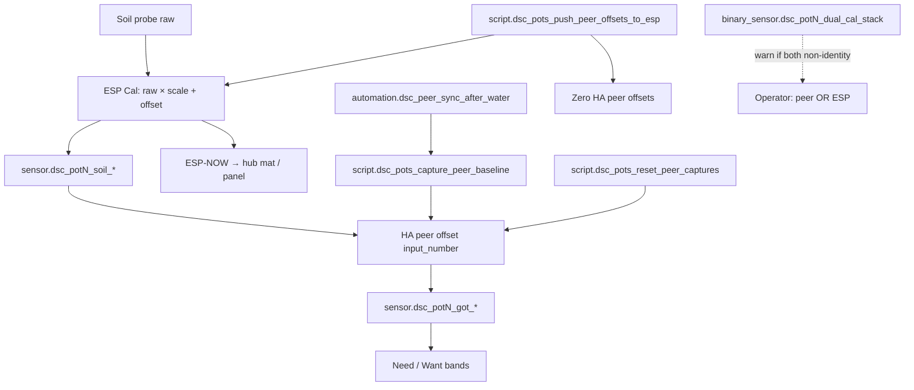
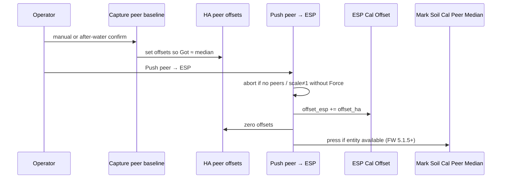

# Sensor calibration — peer sync + push-to-ESP SoT (HA 5.1.7)

Ops surface for dual-stack soil calibration and the Strains peer-sync workflow.
Verified against master `84c81aa` and:

- `homeassistant/packages/dsc_v4_sensor_cal.yaml` (dual-stack, push, reset, auto)
- `homeassistant/packages/dsc_v4_strain_catalog.yaml` (`script.dsc_pots_capture_peer_baseline`)
- `homeassistant/dashboards/modules/view_strains.yaml` (actions + pot entity IDs)
- `firmware/v4/dsc-pot-common.yaml` (ESP Cal + Mark Peer Median, FW **5.1.5**)

Supersedes the unmerged draft `SENSOR-CAL-5.1.6.md` (PR #18) for push-to-ESP,
Require Confirm, hold-to-reset, and Strains UI entity-ID pitfalls.

## Intent

| Layer | Job | Feeds |
|---|---|---|
| **ESP Cal Offset/Scale** | Per-channel `raw × scale + offset` on the pot (NVS) | HA `soil_*` **and** ESP-NOW (mat/panel) |
| **HA peer offsets** | Align Want/Need/**Got** across in-service pots | Dashboard Got / Need only — until Push |
| **Push peer → ESP** | Merge HA peers into ESP Cal Offset, zero HA peers | Single SoT on pot; ESP-NOW matches prior Got |
| **Leaf offset → leaf VPD** | Operator honesty for canopy VPD | Charts — **not** ladder control |



## Operator rule (N-024) — peer **or** ESP, not both

Got = `soil_* + peer offset`. If ESP Cal is already non-identity **and** peer
offsets are non-zero, Got **double-corrects** relative to ESP-NOW.

| Mode | Use when | Clear the other |
|---|---|---|
| **Peer Got (HA-only)** | Relative alignment before Push | Keep ESP Cal at scale=1 / offset≈0 |
| **ESP Cal (SoT)** | After Push, or manual/lab cal for mat+panel | HA peers must be **0** |
| **Neither** | Fresh probes / after Reset Sensor Calibration | Defaults on both stacks |

**Dual-stack warn:** `binary_sensor.dsc_potN_dual_cal_stack` + fleet
`binary_sensor.dsc_dual_cal_stack_fleet` + `sensor.dsc_dual_cal_stack_summary`.
Strains shows a conditional banner when fleet warn is on.

## Tonight workflow (Strains)

Path: `/dsc-hub-pro/strains` → Peer sync actions.

1. **Capture peer baseline** — MAD median → HA peer offsets (Got moves; ESP Cal unchanged).
2. Dual-stack may light if ESP Cal was already non-identity — expected before Push.
3. **Push peer → ESP (SoT)** — additive merge into ESP Cal Offset (pH/EC/moisture only),
   zero HA peers, optional Mark stamp (pot FW **5.1.5+**).
4. Confirm: dual-stack clears; `soil_*` ≈ prior Got; ESP-NOW matches.

**Hold to reset all captures** (mushroom card, hold — tap does nothing):
`script.dsc_pots_reset_peer_captures` zeros **all** HA peer Got offsets and sets
method=`none`. **Does not** touch ESP Cal Offset/Scale. Capture again after reset.



## Push peer → ESP (`script.dsc_pots_push_peer_offsets_to_esp`)

| Guard / step | Behavior |
|---|---|
| No non-zero HA peers on in-service pots | Abort + status/notify — Capture first |
| Any in-service Cal Scale ≠ 1 (±0.02) | Abort unless `input_boolean.dsc_peer_push_force` **on** |
| Per in-service pot | `cal_*_offset += ha_offset_*` (pH/EC/moisture); zero HA offsets |
| Mark button present | `button.dsc_potN_mark_soil_cal_peer_median` (skip if unavailable — **N-029**) |
| After success | method=`peer_median_pushed`; Force turned **off**; notify |

**Not pushed:** temp / NPK peer channels (**N-030** — intentional).

**Live pots on FW 5.1.4:** Push still merges offsets; Mark stamp no-ops until OTA **5.1.5** (**N-033**).

## Peer sync v2 (MAD-hardened)

**Script:** `script.dsc_pots_capture_peer_baseline` (in `dsc_v4_strain_catalog.yaml`)

1. Collect in-service pot raw pH / EC / moisture (`sensor.dsc_potN_soil_*`).
2. If ≥3 samples: median → MAD → keep within **2.5 × MAD** → re-median.
3. If &lt;3 samples: plain median.
4. Set each in-service pot’s `input_number.dsc_potN_offset_*` so Got ≈ that median.
5. Stamp last/method/status. **Does not write ESP Cal.**

### Auto after shared watering

`automation.dsc_peer_sync_after_water`:

| Gate | Default / rule |
|---|---|
| Auto enabled | `input_boolean.dsc_peer_sync_auto` initial **on** |
| Moisture rate | Any pot rate **&gt; 1.5** for **10 min** |
| Coherent rise | ≥2 in-service pots above coherence threshold |
| Cooldown | `dsc_peer_sync_cooldown_h` initial **6 h** |
| Settle | `dsc_peer_sync_settle_min` initial **20 min** |
| **Require Confirm** | `dsc_peer_sync_require_confirm` initial **on** — settle then status/notify; **no silent Capture** |

When Require Confirm is **off**, settle ends with Capture (`sync_source: peer_median_auto`).

### Divergence (dashboard only)

`sensor.dsc_peer_divergence_{ph,ec,moisture}` = max \|raw − median\| among
in-service pots. **No alerts** yet (**N-020**).

## Pot provenance (FW 5.1.4+) / Mark (FW 5.1.5+)

| Entity (per pot) | Values / behavior |
|---|---|
| `text.dsc_potN_soil_cal_method` | `none` \| `manual` \| `peer_median` \| `lab_buffer` |
| `text.dsc_potN_soil_cal_last` | ISO timestamp when stamped |
| `binary_sensor.dsc_potN_soil_calibrated` | **on** when method ≠ `none` |
| `button.dsc_potN_mark_soil_cal_peer_median` | Stamps `peer_median` after Push (FW **5.1.5+**) |

- Changing any **Cal … Offset/Scale** stamps method=`manual` (muted during Reset / Mark).
- **Reset Sensor Calibration** (Root Zone) → identity + method=`none` — ESP stack only.
- **Hold to reset captures** (Strains) → HA peers only — ESP stack untouched.

## Strains UI entity IDs (N-032)

Live pot Strain / Sprout entities use the **underscore** form from friendly-name
slug (`DSC-POT#N` → `dsc_pot_N_*`), not `dsc_potN_*`:

| Correct (Strains after `84c81aa`) | Wrong (still on Home) |
|---|---|
| `select.dsc_pot_N_strain` | `select.dsc_potN_strain` |
| `date.dsc_pot_N_sprout_date` | `datetime.dsc_potN_sprout_date` |

HA helpers stay `input_select.dsc_potN_strain` / `input_datetime.dsc_potN_sprout_date`
(no underscore). Want/Need templates in `dsc_v4_strain_catalog.yaml` still probe
`select.dsc_potN_strain` / `datetime.dsc_potN_sprout_date` and fall back to HA
`input_*` — so bands work via helpers, but pot-native preference may miss ESP
entities until templates align with live IDs.

## Helpers create-only pitfall (N-034)

Package `input_boolean` / `input_text` `initial:` applies **on create only**.
If package reload did not create `dsc_peer_sync_require_confirm` /
`dsc_peer_push_force`, UI Helpers may have been added manually. Prefer one Core
restart so packages own them; avoid duplicate UI helpers with the same entity_id.

## Leaf VPD (HA-only)

```
T_leaf = T_air − dsc_leaf_offset   (default 2 °C)
leaf_VPD = SVP(T_leaf) − AVP(air T, RH)
```

Ladder control still uses air `sensor.dsc_hub_vpd_kpa` — leaf VPD is honesty only.

## Deploy / soak checklist

- [ ] Sync packages + dashboard → `sensor.dsc_ha_surface_version` = **5.1.7**
- [ ] Strains: Capture, Push, Hold-to-reset, Confirm/Force, dual-stack, divergence
- [ ] Strain/Sprout rows resolve (`dsc_pot_N_*`) — no Entity not found
- [ ] Capture → non-zero HA peers; ESP scales 1.0 → Push → peers zero; dual-stack clear
- [ ] Optional pot OTA **5.1.5** (POT2 canary) → Mark button + `peer_median` stamp
- [ ] Do **not** treat peer Got as lab-calibrated until **N-016**

Soak / deferred IDs: [`../FOLLOWUPS.md`](../FOLLOWUPS.md)
(Calibration SoT closeout + Strains peer-sync UI preflight).

## Triage

| Symptom | Likely cause | Fix |
|---|---|---|
| Dual-stack warn on | HA peers + ESP Cal both non-identity | Push (preferred) or zero one layer |
| Push aborted — no peers | Capture not run / all peers 0 | Capture peer baseline |
| Push aborted — scale ≠ 1 | Lab two-point scales | Enable Force once, or reset scales to 1.0 |
| Mark missing / method stays manual | Pot FW &lt; 5.1.5 | OTA 5.1.5; offsets already merged |
| Strain/Sprout Entity not found | Wrong ID form (`dsc_potN_*`) | Use `dsc_pot_N_*` / `date.*` (N-032) |
| Confirm/Force Entity not found | Helpers never created | Create once or Core restart for packages |
| Hold reset cleared ESP Cal | Wrong control used | Hold-reset = HA only; Root Zone Reset = ESP |
| Auto never Captures | Require Confirm **on** (default) | Press Capture after notify, or turn Confirm off |
| Auto too chatty | Non-water rate events | Raise settle/cooldown or disable Auto |
| Got ≠ soil after Push | Expected ≈ equal | If not, check dual-stack / failed push |
| Want bands ignore pot Strain | Catalog still probes `dsc_potN_*` | Falls back to HA `input_*`; align templates later |
