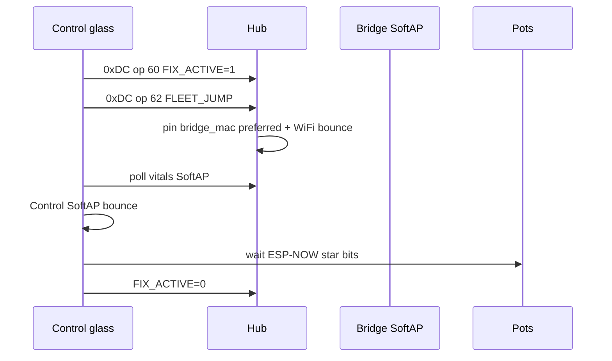

# SoftAP fleet home + Fleet Fix — ops runbook

**Trigger commit:** `bc2aa9b` (2026-08-10) — SoftAP is the Wi‑Fi home for Hub / Control / Sonoffs; pots stay on the ESP-NOW hub star.  
**Spec:** [`docs/superpowers/specs/2026-08-10-softap-fleet-star-design.md`](../superpowers/specs/2026-08-10-softap-fleet-star-design.md)  
**Architecture:** [`docs/brain/F010_APPLIANCE_BRIDGE.md`](../brain/F010_APPLIANCE_BRIDGE.md)

Supersedes the SoftAP-deferred (`6f198d1`) ops story: SoftAP/`APSTA` is back; ESP-NOW rebinds onto `WIFI_IF_AP`; NAPT gives SoftAP STAs a path to HA over Ethernet.

## Intent

Grow devices join `DSC-Anchor` on the WT32-ETH01. Bridge reaches HA on Ethernet and drives Sonoffs on `192.168.4.0/24`. Nest/home Wi‑Fi is emergency fallback only.

## Bring-up checklist

1. **Serial-flash the bridge** with SoftAP+NAPT (`dsc-bridge.yaml` / kit). Do **not** rely on broken Noise OTA for this cut — prior Nest-STA join soft-bricked remote Install.
2. Confirm SoftAP:
   - `binary_sensor.dsc_bridge_anchor_softap_up` = on
   - `sensor.dsc_bridge_anchor_bssid` = SoftAP AP MAC
   - `sensor.dsc_bridge_anchor_channel` matches intended RF (lab: 11)
3. On HA OS, add a persistent SoftAP route (lab ETH IP shown):

   ```bash
   ip route add 192.168.4.0/24 via 192.168.86.66
   ```

   Persist across reboot (HAOS network config / startup script — site-specific).
4. Update live HA `secrets.yaml` / stub hosts to SoftAP IPs (`.20`–`.23`). SCP `dsc_anchor_ap` + `dsc_api_client` under `/config/esphome/components/` until **F-015** closes.
5. Paste Anchor BSSID into hub `bridge_mac` (and Lock WiFi prefer). Keep kits/`wifi_bssid` as `00…` until the preferred path is learned via `0xD0` if desired.
6. OTA Hub / Control / Sonoffs onto SoftAP-primary packages (`dsc-*-wifi-lab.yaml`, `dsc-sonoff-common.yaml`).
7. Leave pots on Nest/home for OTA; do **not** prefer SoftAP on pots (star + SoftAP STA budget).

## Verify

| Check | Expect |
|---|---|
| Hub STA IP | `192.168.4.10` (`use_address`) |
| Control STA IP | `192.168.4.11` |
| Sonoff STA IPs | `.20`–`.23` |
| Bridge → Sonoff | Noise link True; toggle relay with HA followers off |
| Hub → HA API | Works via NAPT + SoftAP route |
| ESP-NOW | `binary_sensor.dsc_bridge_hub_esp_now_link` on |
| Glass Fleet Fix | Hold Connections ≥1.5s → ops 60 then 62 → ASCII walk |

## Fleet Fix walk (glass)



Pitfalls:

- `FLEET_JUMP` rate-limited (5 min) unless `FIX_ACTIVE` already on
- Jump needs `clock_valid` (else EVT `CLK_HOLD`)
- Unset `bridge_mac` (`00…`) → bounce without SoftAP prefer pin
- SoftAP DHCPS is **not** running — devices must use the static map or they will not get an IP on Anchor

## Common pitfalls

| Symptom | Likely cause |
|---|---|
| Hub ESP-NOW link false after SoftAP flash | Peers not rebound / wrong channel / USB flash incomplete |
| HA cannot reach `192.168.4.x` | Missing SoftAP host route on HA OS |
| Sonoff API down | Host still Nest IP; update `dsc_*_host` / `softap_ip` |
| Nest OTA to Control/Hub fails | They are SoftAP-primary — OTA via SoftAP `use_address` or temporary Nest fallback |
| Pot SoftAP join thrash | Pot wifi still preferring Anchor — demote SoftAP (lab pot package keeps Nest primary) |
| Docs still say SoftAP deferred | That was `6f198d1`; retired by `bc2aa9b` |

## Non-goals (v1)

- Pots as SoftAP STAs  
- L2 SoftAP↔Ethernet bridge  
- Nest channel lock as primary heal path (F-004 remains backup if SoftAP is down)
