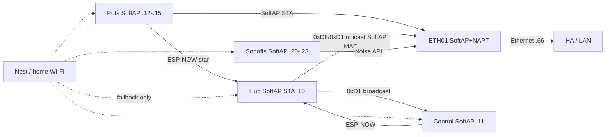
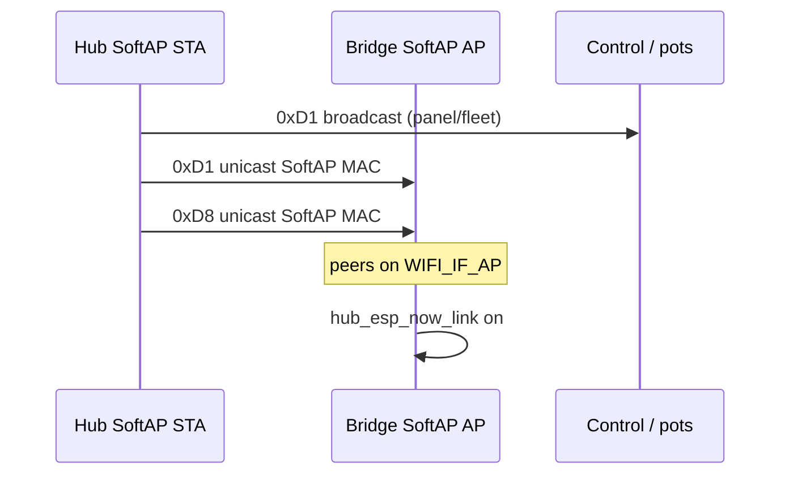
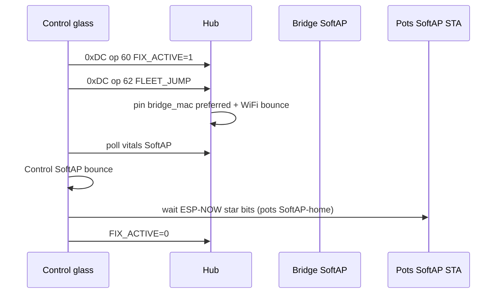
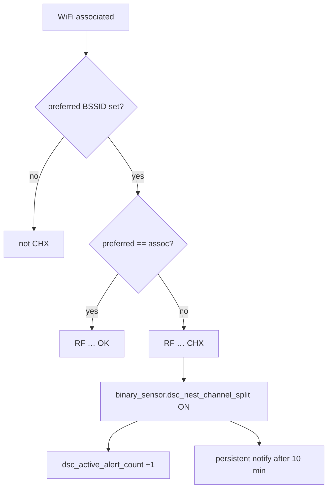

# SoftAP fleet home + Fleet Fix — ops runbook

**Trigger commits:** `c47f5f1` (SoftAP-primary pots + hub↔bridge ESP-NOW) · `4a4160c` (F-004 SoftAP orphan alerts retarget).  
**Builds on:** SoftAP-primary restore `21e34e5` (BSSID pin + max STA 10) and SoftAP L3 prove (same day).  
**Supersedes:** Nest-first pause `5893ea6` / docs that say “pots stay Nest-only”; SoftAP STA broadcast as the bridge path; F-004 “Nest channel lock” as the HA heal cue.  
**Spec:** [`docs/superpowers/specs/2026-08-10-softap-fleet-star-design.md`](../superpowers/specs/2026-08-10-softap-fleet-star-design.md)  
**Architecture:** [`docs/brain/F010_APPLIANCE_BRIDGE.md`](../brain/F010_APPLIANCE_BRIDGE.md)  
**Live ops log:** [`docs/FOLLOWUPS.md`](../FOLLOWUPS.md) SoftAP fleet home § · F-004 SoftAP retarget §

## Intent

Grow devices join SoftAP `DSC-Anchor` on the WT32-ETH01 so they **stop flapping across home APs** (that made ESP-NOW unusable). Bridge reaches HA on Ethernet and drives Sonoffs on `192.168.4.0/24`. Nest/home Wi‑Fi is **emergency fallback only**.

Pots are SoftAP STAs too: same-channel pin with the hub (ESP-NOW needs a shared channel). Pot data volume is tiny, so SoftAP STA cost is fine. Pot→hub ESP-NOW remains the soil/vitals star; SoftAP is membership + channel home, not a replacement for pot ESP-NOW payloads.

## Current membership (`c47f5f1`)

| Device | Primary | SoftAP IP / notes |
|---|---|---|
| Hub | SoftAP (prio 20) + BSSID pin | `192.168.4.10` · `use_address` SoftAP · STA MAC `84:1F:E8:16:E6:60` (lab) |
| Control | SoftAP + BSSID pin | `192.168.4.11` · `use_address` SoftAP |
| Pot1–4 | SoftAP + BSSID pin | `.12`–`.15` · `use_address` SoftAP · ESP-NOW still → hub |
| Sonoffs | SoftAP + BSSID pin | `.20`–`.23` · `use_address` SoftAP |
| Bridge | SoftAP AP + eth static `.66` | max STA **14**; `hub_mac` forced onto `WIFI_IF_AP` |



## Wifi YAML rules (verified)

- SoftAP SSID entry priority **>** home Wi‑Fi.
- SoftAP entry pins Anchor BSSID **`58:2A:BD:60:3C:1D`** via `wifi_bssid` / `softap_bssid`.
- Home Wi‑Fi entry has **no** BSSID pin.
- **Never** set SoftAP (or Nest) `bssid: 00:00:00:00:00:00` — the pin never matches → preferred nets fail → Fallback Hotspot.
- SoftAP clients use the **static map** (no SoftAP DHCPS in v1).
- Pot stubs: `firmware/v4/dsc-pot{1..4}.yaml` + `dsc-pot-wifi-lab.yaml`; HA stubs mirror SoftAP `use_address` `.12`–`.15`.

## SoftAP STA budget

| Role | Count |
|---|---|
| Hub + Control + 4 Sonoffs + 4 pots | **10** SoftAP STAs |
| Bridge `max_connections` | **14** |
| `CONFIG_ESP_WIFI_SOFTAP_MAX_NUM_STA` | **14** |

`dsc_anchor_ap` no longer runtime-caps at 4 — sdkconfig must stay ≥ configured `max_connections` or SoftAP set_config fails and the beacon dies. Headroom (14 − 10) covers transient rejoins after bridge power-cycle.

## Hub ↔ bridge ESP-NOW (why broadcast failed)

**Symptom (pre-fix):** SoftAP Wi‑Fi OK, pot→hub ESP-NOW OK, but `binary_sensor.dsc_bridge_hub_esp_now_link` stuck off / age ~600000 (no `0xD8`/`0xD1` on bridge).

**Root cause (verified in `dsc_anchor_ap` + hub scripts):**

1. SoftAP host often **misses STA broadcast** ESP-NOW frames.
2. After SoftAP bring-up (`esp_wifi_stop` → APSTA → config → start), peers can remain on `WIFI_IF_STA` or empty — SoftAP RX needs **`WIFI_IF_AP`**.

**Fix (`c47f5f1`):**

| Side | Change |
|---|---|
| Hub | `0xD8` demand unicasts `${bridge_mac}` (SoftAP AP MAC). `0xD1` still broadcasts for Control/pots **and** unicasts the same frame to `${bridge_mac}`. |
| Bridge | `dsc_anchor_ap.hub_mac` + `ensure_espnow_ap_peers_()` rebinds peers onto `WIFI_IF_AP` and forces hub + broadcast peers after SoftAP up. |

**Proved 2026-08-11:** hub OTA Nest `.55` → SoftAP `.4.10`; `hub_esp_now_link=true`, age ~1s.



## SoftAP L3 / HA reachability gate

SoftAP **preference** is the product (stop home-AP flap). HA/OTA to SoftAP clients still needs L3:

1. SoftAP SSID up; Anchor BSSID published (`sensor.dsc_bridge_anchor_bssid`).
2. Static SoftAP STA can ping SoftAP gw `192.168.4.1`.
3. Route `192.168.4.0/24 via 192.168.86.66` (bridge eth static `.66`).
4. Hub SoftAP-primary at `.4.10` answers HA API; then Control / pots / Sonoffs.

SoftAP L3 **proved** 2026-08-10 (LAN/HA ping `.4.1` + hub `.4.10`). If HA cannot reach `.4.x`, use USB Install / temporary Nest fallback — do **not** demote SoftAP preference fleet-wide as the steady state.

Bridge also needs `CONFIG_LWIP_L2_TO_L3_COPY` + `IP_FORWARD_ALLOW_TX_ON_RX_NETIF` (see `dsc-bridge-common.yaml`) for eth↔SoftAP forward.

## Bridge bring-up

1. **Serial-flash the bridge** with SoftAP+NAPT (`dsc-bridge.yaml` / kit) when Noise OTA is dead; OTA is fine once SoftAP L3 is up (lab: OTA `.66`).
2. Confirm SoftAP:
   - `binary_sensor.dsc_bridge_anchor_softap_up` = on
   - `sensor.dsc_bridge_anchor_bssid` = SoftAP AP MAC (lab: `58:2A:BD:60:3C:1D`)
   - `sensor.dsc_bridge_anchor_channel` matches intended RF (lab: 11)
3. Confirm eth static **`192.168.86.66`** (DHCP after power loss moved to `.17` and broke the SoftAP route).
4. Confirm stub `hub_mac` is the hub SoftAP **STA** MAC (lab: `84:1F:E8:16:E6:60`) — this is what `dsc_anchor_ap` forces onto `WIFI_IF_AP`.
5. On HA OS, SoftAP route:

   ```bash
   ip route add 192.168.4.0/24 via 192.168.86.66
   ```

   Persist across reboot (site-specific).
6. SCP `dsc_anchor_ap` + `dsc_api_client` under `/config/esphome/components/` until **F-015** closes.
7. Hub flash = **micro-USB** (`esp32dev`); bridge flash = USB-TTL + IO0/EN — do not conflate.

## Hub / Control / pot / Sonoff SoftAP join

1. Stubs pin SoftAP BSSID + SoftAP-primary wifi packages (`wifi_bssid` / `softap_bssid`).
2. Hub `bridge_mac` = SoftAP **AP** MAC (`58:2A:BD:60:3C:1D`) — destination for unicast `0xD8`/`0xD1`.
3. Secrets / bridge hosts use SoftAP IPs for Sonoffs (`.20`–`.23`).
4. OTA after SoftAP join targets SoftAP `use_address` (hub `.10`, Control `.11`, pots `.12`–`.15`, Sonoffs softap_ip).
5. After bridge power-cycle, Control/Sonoffs/pots SoftAP STAs may need rejoin time (or temporary Nest fallback OTA bounce).

## Verify

| Check | Expect |
|---|---|
| Hub STA IP | `192.168.4.10` |
| Control STA IP | `192.168.4.11` |
| Pot STA IPs | `.12`–`.15` (Pot3 may still be absent — F-003) |
| Sonoff STA IPs | `.20`–`.23` |
| Bridge ETH | `192.168.86.66` static |
| SoftAP up / BSSID / channel | on / Anchor MAC / lab 11 |
| Bridge → Sonoff | Noise link True; toggle relay with HA followers off |
| Hub → HA API | Works via NAPT + SoftAP route |
| Hub → bridge ESP-NOW | `binary_sensor.dsc_bridge_hub_esp_now_link` on; age ~seconds |
| Pot → hub ESP-NOW | pot link bits stay healthy on SoftAP channel |
| Glass Fleet Fix | Hold Connections ≥1.5s → ops 60 then 62 → ASCII walk |

## Fleet Fix walk (glass)



Pitfalls:

- `FLEET_JUMP` rate-limited (5 min) unless `FIX_ACTIVE` already on
- Jump needs `clock_valid` (else EVT `CLK_HOLD`)
- Unset `bridge_mac` (`00…`) → bounce without SoftAP prefer pin **and** no unicast path to bridge
- SoftAP DHCPS is **not** running — devices must use the static map

## F-004 SoftAP orphan / preferred-BSSID mismatch (`4a4160c`)

**Intent:** `CHX` on hub RF status means **preferred SoftAP BSSID ≠ associated AP** (SoftAP orphan / membership mismatch). SoftAP-primary rejoin is the heal path. Nest router channel lock is **out of scope** — do not treat the HA cue as a Nest lock reminder.

### How CHX is produced (hub)

Firmware RF shorthand (`dsc-hub-fleet-heal.yaml`) compares NVS preferred BSSID to the current STA association. Mismatch while connected → code `CHX` in `sensor.dsc_hub_rf_status` (`RF|H|assoc|pref|ch|rssi|CHX`).



### HA entities (stable IDs, SoftAP display names)

| Entity ID (stable) | Display name after `4a4160c` | Role |
|---|---|---|
| `binary_sensor.dsc_nest_channel_split` | **DSC SoftAP Preferred Mismatch** | `CHX` in hub RF status — Home alert chip source |
| `binary_sensor.dsc_wifi_preferred_ap_mismatch` | **DSC SoftAP Lock Mismatch** | Lock ON + preferred ≠ assoc — **not** in alert count |
| `sensor.dsc_active_alert_count` | DSC Active Alert Count | Counts CHX binary only (same class — no double-count) |
| Persistent notify `dsc_f004_chx` | DSC SoftAP orphan (F-004) | After CHX ON for **10 minutes** |
| EVT autofix notify | DSC SoftAP orphan (CHX) | Fresh EVT code `CHX` → SoftAP wording |

**Jinja pitfall:** do **not** put `#` comments inside the `dsc_active_alert_count` Jinja list — TemplateSyntaxError. Keep comments above the `state:` block (`dsc_v4_alert_count.yaml`).

### Operator heal path

1. Confirm SoftAP up: `binary_sensor.dsc_bridge_anchor_softap_up` on; `sensor.dsc_bridge_anchor_bssid` = SoftAP AP MAC (lab `58:2A:BD:60:3C:1D`).
2. Preferred SoftAP BSSID should match Anchor (`text.dsc_hub_preferred_wifi_bssid` / Lock → `sensor.dsc_bridge_anchor_bssid`).
3. Hub SoftAP join at `192.168.4.10`; HA ESPHome config entry host + stub `use_address` = `.4.10`.
4. Glass Fleet Fix (hold Connections ≥1.5s → ops 60/62) or hub WiFi bounce with SoftAP prefer pin.
5. Dismiss stale `dsc_f004_chx` after RF returns `OK` / no `CHX`.

### Nest-orphan OTA (temporary)

If the hub orphans onto Nest and SoftAP OTA is unreachable:

1. Temporarily set stub / HA ESPHome entry host to the Nest IP for OTA.
2. After SoftAP rejoin, restore both to `192.168.4.10`.
3. Package `dsc-hub-wifi-lab.yaml` and HA stub `homeassistant/esphome/dsc-hub.yaml` hardcode SoftAP `use_address: 192.168.4.10` — leave them SoftAP-home unless you are mid-orphan recovery.

### F-004 pitfalls

| Symptom | Wrong fix | Right fix |
|---|---|---|
| Persistent CHX / SoftAP orphan notify | Lock Nest channel in router | SoftAP up + preferred = Anchor BSSID + hub SoftAP join |
| Alert chip +2 for one SoftAP mismatch | Re-add `dsc_wifi_preferred_ap_mismatch` to alert list | Keep Lock Mismatch out of `dsc_active_alert_count` |
| OTA to SoftAP IP fails while hub on Nest | Leave `use_address` on Nest permanently | Temporary Nest host only; restore `.4.10` after SoftAP rejoin |
| Docs still say F-004 = Nest lock | Follow old FOLLOWUPS / FLEET-SELF-HEAL wording | This section + FOLLOWUPS 2026-08-11 F-004 retarget |

## Common pitfalls

| Symptom | Likely cause |
|---|---|
| Hub on Fallback Hotspot / offline | SoftAP BSSID pin `00…` or SoftAP L3 dark — fix pin + SoftAP IP gate; USB Install if needed |
| HA cannot reach `192.168.4.x` | Missing SoftAP host route; eth not `.66`; SoftAP/NAPT not up; missing `L2_TO_L3_COPY` |
| SoftAP SSID invisible | `max_connections` > sdkconfig SoftAP max STA — keep both at **14** |
| Nest-first / home-AP flap returns | SoftAP demoted as steady state — restore SoftAP-primary |
| SoftAP Wi‑Fi OK but `hub_esp_now_link` false | Hub still broadcasting only; bridge peers not on `WIFI_IF_AP`; hub missing SoftAP `bridge_mac` paste |
| Sonoff API down | Host still Nest IP; update `dsc_*_host` / `softap_ip` |
| Pot OTA to Nest IP fails after SoftAP join | Target SoftAP `.12`–`.15` (`use_address`); SoftAP route required |
| Pot3 absent | Known open (F-003) — do not block SoftAP-home validation on Pot3 |
| Docs say pots Nest-only / max STA 10 | Pre-`c47f5f1` — pots SoftAP + max STA **14** |
| CHX cue says “lock Nest” | Pre-`4a4160c` copy — SoftAP orphan / preferred mismatch is F-004 |

## Thrash history (do not revive)

| Commit | Story | Status |
|---|---|---|
| `6f198d1` | SoftAP deferred for ESP-NOW on `WIFI_IF_STA` | Retired by SoftAP restore |
| `bc2aa9b` | SoftAP+NAPT + SoftAP-primary | Design kept |
| `5893ea6` | Nest-first membership pause | **Wrong for product goal** — orphan was L3 + zero-BSSID, not SoftAP preference |
| `21e34e5` | SoftAP-primary + real BSSID pin + max STA 10 (pots Nest) | Superseded for pots / STA budget |
| SoftAP L3 prove (same day) | lwIP before start + `L2_TO_L3_COPY` + APSTA single start | Kept |
| `c47f5f1` | Pots SoftAP `.12`–`.15`; max STA 14; unicast SoftAP MAC; peers on `WIFI_IF_AP` | Kept |
| `4a4160c` | F-004 CHX / HA cues → SoftAP preferred mismatch; alert-count no double-count; hub stub SoftAP `use_address` | **Current alert semantics** |

## Non-goals (v1)

- L2 SoftAP↔Ethernet bridge (v1 = NAPT + host route)
- SoftAP DHCPS
- Nest router channel lock as a DSC heal path (F-004 = SoftAP preferred≠assoc; Nest lock remains OOS)
- Replacing pot→hub ESP-NOW soil/vitals with SoftAP IP payloads
