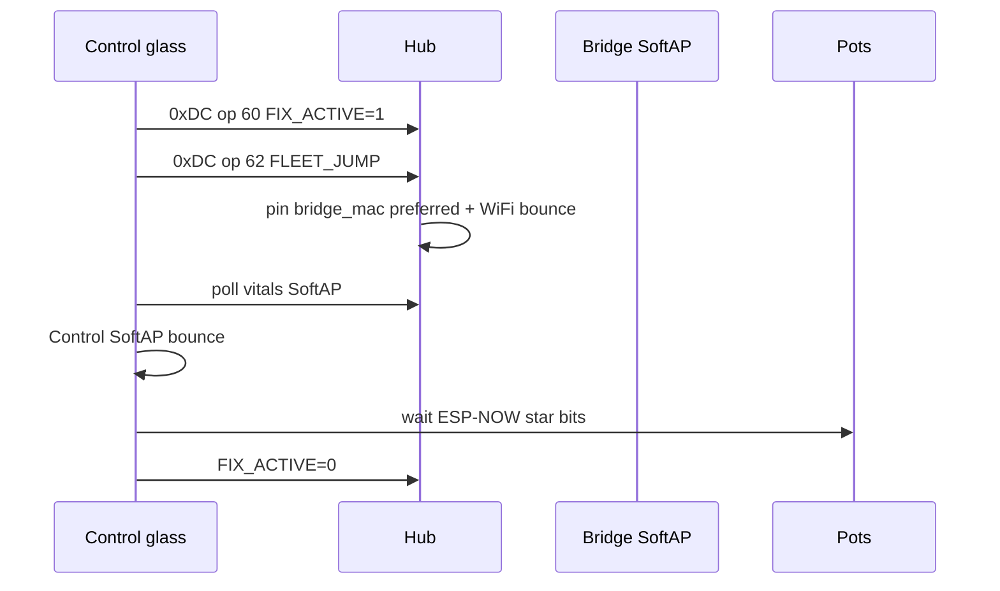

# SoftAP fleet home + Fleet Fix — ops runbook

**Trigger commit:** `5893ea6` (2026-08-10 evening) — SoftAP-home **membership paused**; Nest-first for Hub / Control / Sonoffs until SoftAP IP path is proven.  
**Prior cut:** `bc2aa9b` SoftAP+NAPT + Fleet Fix (design still stands; membership rolled back).  
**Spec:** [`docs/superpowers/specs/2026-08-10-softap-fleet-star-design.md`](../superpowers/specs/2026-08-10-softap-fleet-star-design.md)  
**Architecture:** [`docs/brain/F010_APPLIANCE_BRIDGE.md`](../brain/F010_APPLIANCE_BRIDGE.md)  
**Live ops log:** [`docs/FOLLOWUPS.md`](../FOLLOWUPS.md) SoftAP fleet home §

## Intent

**Goal (unchanged):** grow devices join `DSC-Anchor` on the WT32-ETH01; bridge reaches HA on Ethernet and drives Sonoffs on `192.168.4.0/24`; Nest is emergency fallback only.

**Current tree (`5893ea6`):** SoftAP-primary OTA orphaned the hub (Fallback Hotspot / offline) before SoftAP L3 was proven from LAN (`.4.1` dark via eth). Wi‑Fi packages are **Nest-first** again. Bridge still brings SoftAP up (`WIFI_MODE_APSTA`, NAPT, ESP-NOW on `WIFI_IF_AP`) and keeps SoftAP as a **secondary** STA network with static map reserved for later.

## Current membership (paused SoftAP-home)

| Device | Primary | SoftAP | Notes |
|---|---|---|---|
| Hub | Nest (`priority: 20`) | secondary + static `.10` | No `use_address` SoftAP; no zero-BSSID Nest pin |
| Control | Nest | secondary + static `.11` | Same pause |
| Sonoffs | Nest | secondary + static `.20`–`.23` | SoftAP map kept; do not prefer yet |
| Pots | Nest / home | not preferred | ESP-NOW → hub star |
| Bridge | SoftAP AP + eth static `.66` | — | Max STA **4**; no Nest STA in v1 |

## Hard gate before SoftAP-primary anyone again

Do **not** re-elevate SoftAP in wifi packages until all four pass:

1. SoftAP SSID up; Anchor BSSID published (`sensor.dsc_bridge_anchor_bssid`).
2. A static SoftAP STA (e.g. phone/laptop `192.168.4.50`) can ping SoftAP gw `192.168.4.1`.
3. Route `192.168.4.0/24 via 192.168.86.66` delivers SoftAP clients to HA.
4. SoftAP-primary **hub only** → HA API at `.4.10` works; then Control; then Sonoffs one at a time.

## Bridge bring-up (still required)

1. **Serial-flash the bridge** with SoftAP+NAPT (`dsc-bridge.yaml` / kit). Do **not** rely on broken Noise OTA for this cut.
2. Confirm SoftAP:
   - `binary_sensor.dsc_bridge_anchor_softap_up` = on
   - `sensor.dsc_bridge_anchor_bssid` = SoftAP AP MAC
   - `sensor.dsc_bridge_anchor_channel` matches intended RF (lab: 11)
3. Confirm eth static **`192.168.86.66`** (DHCP after power loss moved to `.17` and broke the SoftAP route).
4. On HA OS, SoftAP route (needed for gate #3 — not for Nest-first day-to-day):

   ```bash
   ip route add 192.168.4.0/24 via 192.168.86.66
   ```

   Persist across reboot (site-specific).
5. SCP `dsc_anchor_ap` + `dsc_api_client` under `/config/esphome/components/` until **F-015** closes.
6. Hub flash = **micro-USB** (`esp32dev`); bridge flash = USB-TTL + IO0/EN — do not conflate.

## Hub recovery (Nest-first)

If SoftAP-primary already orphaned the hub:

1. Flash Nest-first packages from `master` (`dsc-hub-wifi-lab.yaml` priority Nest first).
2. HA ESPHome Verify/Install over USB micro is fine.
3. Leave `wifi_bssid: "00:00:00:00:00:00"` until SoftAP IP gate + Nest recovery.
4. Do **not** set hub `use_address: 192.168.4.10` until gate #4 passes (orphans Install toward a dead path).

## Verify (while paused)

| Check | Expect |
|---|---|
| Hub / Control / Sonoffs STA | Nest / home LAN IPs |
| SoftAP SSID | Visible; SoftAP up sensor on |
| SoftAP gw from SoftAP STA | Ping `192.168.4.1` (gate #2) |
| Bridge ETH | `192.168.86.66` static |
| ESP-NOW | `binary_sensor.dsc_bridge_hub_esp_now_link` can go on (channel pin) |
| Sonoff drive | Bridge Noise still works when hosts match live STA IPs |

After SoftAP-home resumes, expect Hub `.10` / Control `.11` / Sonoffs `.20`–`.23` and HA API via NAPT + SoftAP route.

## Fleet Fix walk (glass)

Still implemented; SoftAP prefer pin only helps once SoftAP join + HA path work.



Pitfalls:

- `FLEET_JUMP` rate-limited (5 min) unless `FIX_ACTIVE` already on
- Jump needs `clock_valid` (else EVT `CLK_HOLD`)
- Unset `bridge_mac` (`00…`) → bounce without SoftAP prefer pin
- SoftAP DHCPS is **not** running — SoftAP STAs need the static map

## Common pitfalls

| Symptom | Likely cause |
|---|---|
| Hub on Fallback Hotspot / offline after SoftAP OTA | SoftAP-primary before gate — flash Nest-first |
| `.4.1` dark from LAN | SoftAP IP/NAPT not proven; eth not `.66`; missing HA SoftAP route |
| SoftAP SSID invisible | `max_connections` > sdkconfig SoftAP max STA (`ESP_ERR` on set_config) — tree caps at **4** |
| Hub ESP-NOW link false | Peers not rebound / wrong channel / USB flash incomplete |
| Docs / Notion say SoftAP-primary live | That was `bc2aa9b` membership; paused by `5893ea6` |
| Pot SoftAP join thrash | Pot wifi preferring Anchor — keep Nest primary |

## Non-goals (v1)

- Pots as SoftAP STAs  
- L2 SoftAP↔Ethernet bridge  
- SoftAP DHCPS  
- Nest channel lock as primary heal path (F-004 remains backup if SoftAP is down)
