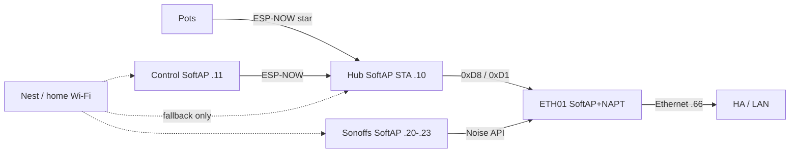
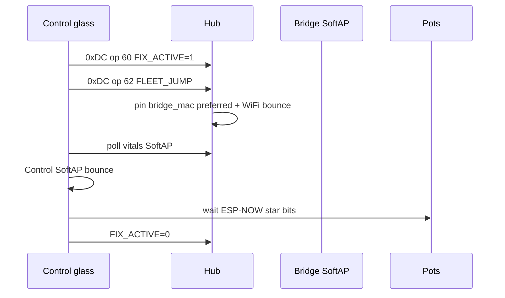

# SoftAP fleet home + Fleet Fix — ops runbook

**Trigger commit:** `21e34e5` (2026-08-10) — restore SoftAP-primary membership, pin Anchor BSSID `58:2A:BD:60:3C:1D` on SoftAP nets only, raise SoftAP max STA to **10**.  
**Supersedes:** Nest-first pause `5893ea6` / docs PR #60 (demotion was wrong for the design goal). SoftAP+NAPT/`APSTA` cut `bc2aa9b` still stands.  
**Spec:** [`docs/superpowers/specs/2026-08-10-softap-fleet-star-design.md`](../superpowers/specs/2026-08-10-softap-fleet-star-design.md)  
**Architecture:** [`docs/brain/F010_APPLIANCE_BRIDGE.md`](../brain/F010_APPLIANCE_BRIDGE.md)  
**Live ops log:** [`docs/FOLLOWUPS.md`](../FOLLOWUPS.md) SoftAP fleet home §

## Intent

Grow devices join SoftAP `DSC-Anchor` on the WT32-ETH01 so they **stop flapping across home APs** (that made ESP-NOW unusable). Bridge reaches HA on Ethernet and drives Sonoffs on `192.168.4.0/24`. Nest/home Wi‑Fi is **emergency fallback only**. Pots stay ESP-NOW→hub (not SoftAP STAs).

## Current membership (`21e34e5`)

| Device | Primary | SoftAP IP / notes |
|---|---|---|
| Hub | SoftAP (prio 20) + BSSID pin | `192.168.4.10` · `use_address` SoftAP |
| Control | SoftAP + BSSID pin | `192.168.4.11` · `use_address` SoftAP |
| Sonoffs | SoftAP + BSSID pin | `.20`–`.23` · `use_address` SoftAP |
| Pots | Nest / home | **not** SoftAP STAs — ESP-NOW star |
| Bridge | SoftAP AP + eth static `.66` | max STA **10**; no Nest STA in v1 |



## Wifi YAML rules (verified)

- SoftAP SSID entry priority **>** home Wi‑Fi.
- SoftAP entry pins Anchor BSSID **`58:2A:BD:60:3C:1D`** via `wifi_bssid` (hub/Control) or `softap_bssid` (Sonoffs).
- Home Wi‑Fi entry has **no** BSSID pin.
- **Never** set SoftAP (or Nest) `bssid: 00:00:00:00:00:00` — the pin never matches → preferred nets fail → Fallback Hotspot.
- SoftAP clients use the **static map** (no SoftAP DHCPS in v1).

Sources: `dsc-hub-wifi-lab.yaml`, `dsc-control-wifi-lab.yaml`, `dsc-sonoff-common.yaml`, device stubs.

## SoftAP STA budget

| Role | Count |
|---|---|
| Hub + Control + 4 Sonoffs | **6** SoftAP STAs |
| Bridge `max_connections` | **10** |
| `CONFIG_ESP_WIFI_SOFTAP_MAX_NUM_STA` | **10** |
| Pots | **0** (ESP-NOW only) |

`dsc_anchor_ap` no longer runtime-caps at 4 — sdkconfig must stay ≥ configured `max_connections` or SoftAP set_config fails and the beacon dies.

## SoftAP L3 / HA reachability gate

SoftAP **preference** is the product (stop home-AP flap). HA/OTA to SoftAP clients still needs L3:

1. SoftAP SSID up; Anchor BSSID published (`sensor.dsc_bridge_anchor_bssid`).
2. Static SoftAP STA can ping SoftAP gw `192.168.4.1`.
3. Route `192.168.4.0/24 via 192.168.86.66` (bridge eth static `.66`).
4. Hub SoftAP-primary at `.4.10` answers HA API; then Control; then Sonoffs.

If HA cannot reach `.4.x`, use USB Install / temporary Nest fallback — do **not** demote SoftAP preference fleet-wide as the steady state (that reintroduces flap).

## Bridge bring-up

1. **Serial-flash the bridge** with SoftAP+NAPT (`dsc-bridge.yaml` / kit) when Noise OTA is dead.
2. Confirm SoftAP:
   - `binary_sensor.dsc_bridge_anchor_softap_up` = on
   - `sensor.dsc_bridge_anchor_bssid` = SoftAP AP MAC (lab: `58:2A:BD:60:3C:1D`)
   - `sensor.dsc_bridge_anchor_channel` matches intended RF (lab: 11)
3. Confirm eth static **`192.168.86.66`** (DHCP after power loss moved to `.17` and broke the SoftAP route).
4. On HA OS, SoftAP route:

   ```bash
   ip route add 192.168.4.0/24 via 192.168.86.66
   ```

   Persist across reboot (site-specific).
5. SCP `dsc_anchor_ap` + `dsc_api_client` under `/config/esphome/components/` until **F-015** closes.
6. Hub flash = **micro-USB** (`esp32dev`); bridge flash = USB-TTL + IO0/EN — do not conflate.

## Hub / Control / Sonoff SoftAP join

1. Stubs pin SoftAP BSSID + SoftAP-primary wifi packages (`wifi_bssid` / `softap_bssid`).
2. Secrets / bridge hosts use SoftAP IPs (`.20`–`.23`).
3. OTA after SoftAP join targets SoftAP `use_address` (hub `.10`, Control `.11`, Sonoffs softap_ip).
4. Leave pots on Nest/home for OTA; do **not** prefer SoftAP on pots.

## Verify

| Check | Expect |
|---|---|
| Hub STA IP | `192.168.4.10` |
| Control STA IP | `192.168.4.11` |
| Sonoff STA IPs | `.20`–`.23` |
| Bridge ETH | `192.168.86.66` static |
| SoftAP up / BSSID / channel | on / Anchor MAC / lab 11 |
| Bridge → Sonoff | Noise link True; toggle relay with HA followers off |
| Hub → HA API | Works via NAPT + SoftAP route |
| ESP-NOW | `binary_sensor.dsc_bridge_hub_esp_now_link` on |
| Glass Fleet Fix | Hold Connections ≥1.5s → ops 60 then 62 → ASCII walk |

## Fleet Fix walk (glass)



Pitfalls:

- `FLEET_JUMP` rate-limited (5 min) unless `FIX_ACTIVE` already on
- Jump needs `clock_valid` (else EVT `CLK_HOLD`)
- Unset `bridge_mac` (`00…`) → bounce without SoftAP prefer pin
- SoftAP DHCPS is **not** running — devices must use the static map

## Common pitfalls

| Symptom | Likely cause |
|---|---|
| Hub on Fallback Hotspot / offline | SoftAP BSSID pin `00…` or SoftAP L3 dark — fix pin + SoftAP IP gate; USB Install if needed |
| HA cannot reach `192.168.4.x` | Missing SoftAP host route; eth not `.66`; SoftAP/NAPT not up |
| SoftAP SSID invisible | `max_connections` > sdkconfig SoftAP max STA (`ESP_ERR` on set_config) — keep both at **10** |
| Nest-first / home-AP flap returns | SoftAP demoted as steady state — restore SoftAP-primary |
| Hub ESP-NOW link false | Peers not rebound / wrong channel / USB flash incomplete |
| Sonoff API down | Host still Nest IP; update `dsc_*_host` / `softap_ip` |
| Pot SoftAP join thrash | Pot wifi preferring Anchor — keep Nest primary for pots |
| Docs say SoftAP-home paused | That was `5893ea6`; restored by `21e34e5` |

## Thrash history (do not revive)

| Commit | Story | Status |
|---|---|---|
| `6f198d1` | SoftAP deferred for ESP-NOW on `WIFI_IF_STA` | Retired by SoftAP restore |
| `bc2aa9b` | SoftAP+NAPT + SoftAP-primary | Design kept |
| `5893ea6` | Nest-first membership pause | **Wrong for product goal** — orphan was L3 + zero-BSSID, not SoftAP preference |
| `21e34e5` | SoftAP-primary + real BSSID pin + max STA 10 | **Current** |

## Non-goals (v1)

- Pots as SoftAP STAs  
- L2 SoftAP↔Ethernet bridge  
- SoftAP DHCPS  
- Nest channel lock as primary heal path (F-004 remains backup if SoftAP is down)
