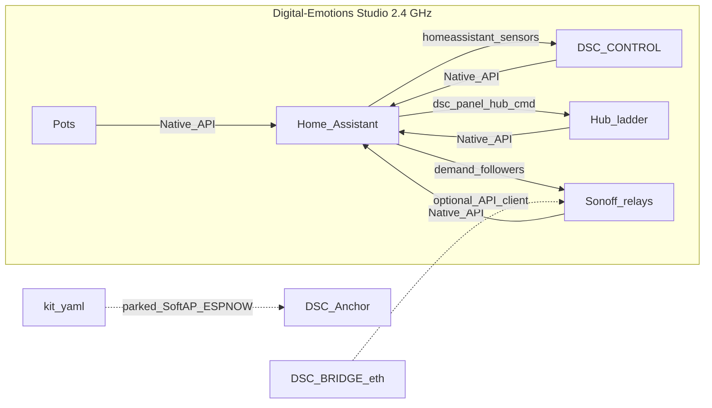

# Studio Wi-Fi + HA Native API bus (live lab · 6.1.0.0)

Ops runbook for tip `9cb577b` — live lab cutover off SoftAP/ESP-NOW onto
**Digital-Emotions Studio** (2.4 GHz) with **Home Assistant as the bus**.

Product kit SoftAP (`*-kit.yaml`) stays in tree. This page covers the **lab**
train only. Secrets (SSID password, API keys) live in Notion **API Keys &
Credentials** + gitignored `secrets.yaml` — never in FOLLOWUPS or PRs.

| | |
|---|---|
| **Firmware train** | **6.1.0.0** (`project.version` / `input_text.dsc_expected_release`) |
| **ESPHome** | **2026.8.0** (HA Device Builder + laptop CLI) |
| **HA surface** | **7.2.0** (`sensor.dsc_ha_surface_version`) |
| **Live bus** | HA Native API (plaintext panel; IP-only) |
| **Parked** | ESP-NOW TX/RX, SoftAP `DSC-Anchor`, SoftAP-local STA |
| **FOLLOWUPS** | `2026-08-20 — Studio Wi-Fi cutover` |

## Intent

- Keep climate safety on the hub (ladder, gates, failsafe, min-off).
- Move panel vitals/soil/commands and pot soil through HA so the glass works
  without ESP-NOW same-channel discipline.
- Leave kit SoftAP / ESP-NOW packages compilable for product unbox (`SETUP.md`).

## Architecture



| Path | Lab (this train) | Kit product |
|---|---|---|
| Wi-Fi | Studio STA + reserved LAN IPs | SoftAP portal / `DSC-Anchor` |
| Panel → hub cmds | `hub_cmd` → `esphome.dsc_panel_hub_cmd` → `dsc_v4_panel_ha_bus` | ESP-NOW 0xDC |
| Hub → panel vitals | HA `homeassistant` sensors → `gv_*` (`dsc-control-ha-bus`) | ESP-NOW 0xD1/0xD2/0xD3 |
| Hub ESP-NOW TX | `dsc-hub-espnow-parked.yaml` no-ops + API presence stamp | `dsc-hub-espnow-primary.yaml` |
| Appliances | HA demand followers (primary) | Bridge SoftAP + API client |

## Key files

| Layer | Path |
|---|---|
| Panel HA ingest | `firmware/v4/dsc-control-ha-bus.yaml` |
| Panel stub | `firmware/v4/dsc-control.yaml` (+ HA stub twin) |
| Panel command emit | `dsc-control-common.yaml` → `homeassistant.event` `esphome.dsc_panel_hub_cmd` |
| HA command map | `homeassistant/packages/dsc_v4_panel_ha_bus.yaml` |
| Hub parked radio | `firmware/v4/dsc-hub-espnow-parked.yaml` |
| Hub stub | `firmware/v4/dsc-hub.yaml` (no `espnow-primary`) |
| Bridge SoftAP off | `firmware/v4/dsc-bridge.yaml` `enable_anchor: false` |
| Fleet heal copy | `homeassistant/packages/dsc_v4_fleet_heal.yaml` (studio mismatch) |
| Expected release | `homeassistant/packages/dsc_v4_version.yaml` → **6.1.0.0** |
| Cutover log | `docs/FOLLOWUPS.md` § Studio Wi-Fi cutover |

## LAN map (do not reclaim occupied IPs)

| Device | IP | Notes |
|---|---|---|
| HA | 192.168.86.3 | same L2 as studio AP |
| Hub | `.180` | was SoftAP-era `.33` — **occupied**, do not reclaim |
| Control | `.177` | Nest reservation / `use_address` |
| Pot1–4 | `.181` / `.182` / `.183` / `.49` | |
| Heater / heatmat / humidifier / dehum | `.50` / `.51` / `.54` / `.184` | |
| Bridge eth | `.66` | unchanged; SoftAP parked |

Also leave `.39` / `.40` / `.47` / `.23` alone — other hosts answered at cutover.

## Operator checklist

1. pfSense DHCP reservations for the table; studio AP **2.4 GHz**, no client isolation.
2. Pin HA ESPHome Device Builder to **2026.8.0**.
3. USB flash order: **hub → Pot2 canary → pots → Sonoffs → panel → soak ≥30 min →
   prove OTA (one ESP32 + one Sonoff) → bridge SoftAP-off last**.
4. Re-add ESPHome integrations by **new IPs**; delete SoftAP hosts (`192.168.4.x`).
5. Sync packages so `dsc_v4_panel_ha_bus` lands; **restart HA Core once**.
6. Confirm Connections on glass shows ESP-NOW **PARKED** (expected).
7. Fleet chip: `input_text.dsc_expected_release` = **6.1.0.0**; status → `ok` after flash.

```bash
# Local compile gate (Windows: use local tree, not UNC — N-008)
cd C:\Users\cmgwe\esphome-dsc\v4
esphome version   # 2026.8.0
esphome config dsc-hub.yaml
esphome config dsc-control.yaml
esphome config dsc-pot1.yaml
esphome config dsc-heater.yaml
esphome config dsc-bridge.yaml
```

Tip session already compiled all 11 stubs PASS on 2026.8.0 (noise-c pin
`0.1.11 → 0.1.21` for bridge `dsc_api_client`).

## Command bus (panel → hub)

Glass `hub_cmd` script still paints optimistic UI, then fires:

```yaml
homeassistant.event:
  event: esphome.dsc_panel_hub_cmd
  data:
    op: "<int>"
    val: "<int>"
```

HA automation `dsc_panel_hub_cmd` (`mode: queued`, `max: 20`) maps the former
ESP-NOW **0xDC op table** onto hub entities (switches 1–19, selects 20–24,
fans/light 25–29, numbers ×0.01 30+, etc.). Event name must keep the
`esphome.` prefix.

## Presence / fleet-heal

- Parked hub stamps `panel_last_ms` every 15s while Native API is connected
  (replaces ESP-NOW 0xDC freshness).
- Panel HA-bus interval refreshes `gv_hub_last` while Wi-Fi is up.
- Fleet-heal CHX copy targets **not on Digital-Emotions Studio** (not SoftAP orphan).

## Pitfalls

| Symptom | Likely cause | Fix |
|---|---|---|
| Panel vitals frozen / silent | HA sensors missing or API not connected | Re-add panel by IP `.177`; blank encryption key |
| Tap does nothing on hub | `dsc_v4_panel_ha_bus` not loaded / Core not restarted | Sync packages; restart Core; listen for `esphome.dsc_panel_hub_cmd` |
| Fleet chip `warn` forever | Devices still SoftAP-era versions or wrong expected | Flash 6.1.0.0; expected = `6.1.0.0` |
| CHX / studio mismatch notify | STA on wrong SSID or SoftAP leftover | Confirm studio 2.4 GHz + reserved IP; delete `192.168.4.x` integrations |
| Bridge SoftAP still up | Flashed old body / `enable_anchor` true | Lab stub must keep `enable_anchor: false`; flash bridge last |
| Compile fails on hub TX scripts | Missing parked package | Lab stub must include `dsc-hub-espnow-parked.yaml`, not primary |
| Sonoffs dark with HA down | Expected on lab train | HA followers are primary; optional bridge API is secondary |
| Secrets in FOLLOWUPS | Process fail | Notion credentials DB + gitignored secrets only |

## Do not

- Deepen ESP-NOW / SoftAP as the default next lab task.
- Reclaim SoftAP-era IPs that other hosts occupy.
- Bake studio BSSID into YAML until soak proves pin is needed.
- Paste Wi-Fi passwords or live API keys into docs / Wiki / PRs.
- Flash kit stubs onto lab boards expecting SoftAP behavior.
- Claim Pi-brain hub-LAN bus works yet (deferred in FOLLOWUPS).

## Related

- Root overview: [`README.md`](../../README.md)
- Product SoftAP unbox: [`SETUP.md`](../../SETUP.md)
- Lab install: [`INSTALL.md`](../../INSTALL.md)
- Firmware notes: [`firmware/v4/README.md`](../../firmware/v4/README.md)
- HA scaffold rules: [`docs/HA-SCAFFOLD.md`](../HA-SCAFFOLD.md)
- Cutover soak list: [`docs/FOLLOWUPS.md`](../FOLLOWUPS.md)
- ESP-NOW product park (prior decision): prefer open docs PR **#84** until merged
