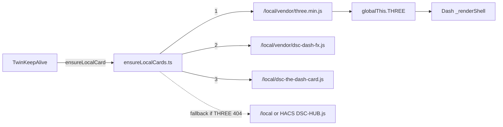

# Twin — Three.js prerequisite for `/live/twin`

Ops note for the React panel Twin host (`TwinKeepAlive` → `dsc-the-dash-card`).

**Trigger:** `b965e275` — *Load Three.js before the Twin dash card so /live/twin can render.*

## Intent

`/live/twin` (and Main/Clone/4×8/2×4 keep-alive hosts) mount the dedicated Lit
IIFE `dsc-the-dash-card`. That card is **not** the fat `DSC-HUB.js` umbrella: it
reads the global `THREE` at `_renderShell` time. If `THREE` is missing, the
canvas paints:

```text
THREE.js not loaded — redeploy DSC-HUB bundle
```

That message is easy to misread as “stale HACS / wrong surface.” After
`b965e275`, the real failure mode was: loader injected only
`/local/dsc-the-dash-card.js`, and `ha-sync.sh` concatenated Three into the
umbrella without publishing `/config/www/vendor/three.min.js`.

## Architecture



| Path | What it delivers | Enough for Twin alone? |
|---|---|---|
| Dedicated `/local/dsc-the-dash-card.js` | Dash IIFE only | **No** — needs `THREE` first |
| `/local/vendor/three.min.js` (+ optional `dsc-dash-fx.js`) | Global `THREE` (+ FX) | Required for dedicated path |
| Fat `/local/DSC-HUB.js` or HACS umbrella | Concat includes three → dash-fx → dash | Yes as **fallback** if standalone three 404s |

Cinematic FX (`dsc-dash-fx.js`) is optional; the scene still needs `THREE`.

## Current wiring (verified)

1. **Loader** — `ensureLocalCards.ts` (`BUNDLE_V` tip **7.2.0**):
   - `dsc-the-dash-card` script list: `THREE_JS` → `DASH_FX` → card IIFE
   - `ensureThree()` injects `/local/vendor/three.min.js`, then umbrella sources
   - Re-checks `hasThree()` after dedicated injects
2. **ha-sync** — `scripts/ha-sync.sh`:
   - `scp` → `/config/www/vendor/three.min.js` (and `dsc-dash-fx.js`)
   - Still concatenates three into `/config/www/DSC-HUB.js` / system-map bundle
3. **HACS dist** — `scripts/sync-hacs-dist.sh` copies `dist/vendor/three.min.js`
   and concatenates into `dist/DSC-HUB.js`
4. **Sync add-on** — `dsc-hub-sync.sh` also `cp`s `www/vendor/three.min.js` into
   staging when present
5. **Gate** — `python scripts/check_twin_three_prereq.py` fails if loader order or
   ha-sync publish line regresses

## Failure mode (pre-fix)

| Symptom | Misleading read | Actual cause |
|---|---|---|
| Red **THREE.js not loaded…** on `/live/twin` | Stale panel / wrong `BUNDLE_V` | Dedicated dash loaded without `THREE` on `globalThis` |
| Umbrella `/local/DSC-HUB.js` present | “Bundle is fine” | Twin prefers dedicated IIFE; umbrella only helps if `ensureThree` fallback runs and umbrella includes Three |
| `ha-sync` green | Assets must be current | Sync previously never published standalone `vendor/three.min.js` |

## Operator checks

1. Repo gate (no HA required):

```bash
python scripts/check_twin_three_prereq.py
# OK: Twin THREE prerequisite is wired in the loader and ha-sync.
```

2. After Sync / `ha-sync.sh` on HAOS:

```bash
ls /config/www/vendor/three.min.js /config/www/vendor/dsc-dash-fx.js \
   /config/www/dsc-the-dash-card.js
```

3. Hard-reload `/dsc-hub#/live/twin` (Ctrl+F5). DevTools → Network: scripts load
   in order `three.min.js` → `dsc-dash-fx.js` → `dsc-the-dash-card.js` (query
   `?v=` matches panel `BUNDLE_V`). Console: `typeof THREE` is `"object"`.

4. Scene paints (tents / wisps), not the red THREE banner. Twin is still the Dash
   IIFE — **not** R3F.

## Constraints

- Do **not** treat the dedicated dash IIFE as self-contained.
- Do **not** drop the `ha-sync` publish of `www/vendor/three.min.js` even though
  the umbrella still concatenates Three.
- Do **not** invent Twin as R3F / authored GLTF in docs.
- Surface / `BUNDLE_V` lockstep is separate; this note is only the THREE load
  order. Tip after the fix: `SURFACE_VERSION` / `BUNDLE_V` **7.2.0**.
- Soak still needed on the live box after HA sync + hard-reload.

## Related

- Panel host: [`LIVE-UI-CUSTOM-PANEL.md`](LIVE-UI-CUSTOM-PANEL.md)
- HACS / dist: [`scripts/HACS-FRONTEND.md`](../../scripts/HACS-FRONTEND.md)
- Sync bootstrap: [`scripts/HA-SYNC-BOOTSTRAP.md`](../../scripts/HA-SYNC-BOOTSTRAP.md)
- Twin soft APIs / Kit Pulse (open docs PR until merge): prefer **#83**
  `LIVE-UI-KIT-PULSE.md` when present
- FOLLOWUPS dated note: **2026-08-17 — Twin THREE.js missing on `/live/twin`**
