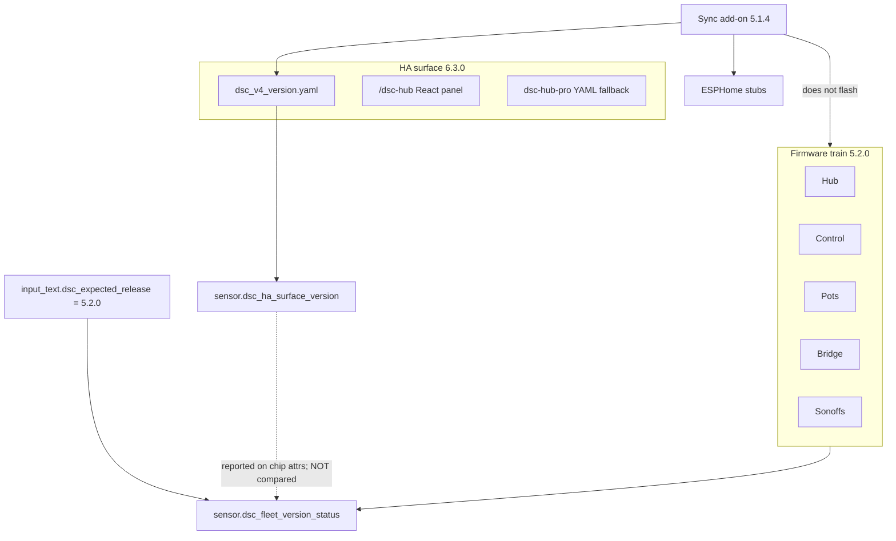

# Version trains — firmware vs HA surface

**Intent:** stop operators from treating the React/HA product surface string as a
firmware flash gate (or putting `6.x` into `input_text.dsc_expected_release`).

**Verified against:** `homeassistant/packages/dsc_v4_version.yaml`,
`homeassistant/custom_components/dsc_hub/const.py`,
`firmware/v4/dsc-{hub-v4_0,control-common,pot-common,bridge-common,sonoff-common}.yaml`,
`dsc-hub-sync/config.yaml` (tip `dae4522` / product `c0d9ebe`).

## Current live train (master tip)

| Train | Current | SoT |
|---|---|---|
| Firmware (hub / Control / pots / bridge / Sonoffs / kits) | **5.2.0** | `esphome.project.version` + text **Firmware Version** (dual-string lockstep) |
| HA product surface | **6.3.0** | `sensor.dsc_ha_surface_version` ← `packages/dsc_v4_version.yaml` |
| Integration bookkeeping | **6.3.0** | `SURFACE_VERSION` in `const.py` → `hass.data["dsc_hub"]["surface_version"]` only |
| Sync add-on | **5.1.4** | `dsc-hub-sync/config.yaml` |
| Last GitHub marketing tag | **v5.1.0** | GitHub Releases — in-tree train is ahead |

## Rules (do not violate)

1. **`dsc_expected_release` = firmware train only** (`5.2.0`). Never set it to the React surface (`6.3.0`).
2. **Fleet chip** (`sensor.dsc_fleet_version_status`) compares **major.minor firmware only**. Surface `6.x` beside firmware `5.2.0` is expected and must stay `ok` when devices report.
3. **`SURFACE_VERSION` does not create the template sensor.** Operator SoT is the package YAML; `const.py` is bookkeeping for the integration.
4. **Surface bump** needs three places in lockstep: package sensor, `const.py`, panel TSX fallbacks + rebuilt `www/dsc-hub-panel.js`. See [`LIVE-UI-CUSTOM-PANEL.md`](LIVE-UI-CUSTOM-PANEL.md).
5. **Firmware bump** needs `project.version` **and** the text Firmware Version / LVGL string on the same device body (Control/Sonoff dual-string).
6. **Sync does not Install firmware.** Push → packages / dashboard / www / stubs; ESPHome Install stays manual.

## Operator checks

| Check | Expect |
|---|---|
| `input_text.dsc_expected_release` | **5.2.0** |
| `sensor.dsc_ha_surface_version` | **6.3.0** |
| Device firmware sensors / ESPHome project | **5.2.0** (major.minor) |
| `sensor.dsc_fleet_version_status` | **ok** when reporting devices are on `5.2.x` |
| Sync `/config/dsc-hub-sync.version` | add-on **5.1.4** (or newer once cut) |

## Upgrade path (5.1.x site → live train)

1. Update **DSC-HUB Sync** to **5.1.4+** → Start → wait for “Synced to …”.
2. Restart HA Core once if new helpers / panel / pot-tent package landed.
3. Confirm surface **6.3.0** and expected release **5.2.0** (edit helper if still on an old initial).
4. ESPHome Validate/Install hub → Control → pots → bridge → Sonoffs to firmware **5.2.0**.
5. SoftAP / bridge ops: [`F010_APPLIANCE_BRIDGE.md`](../brain/F010_APPLIANCE_BRIDGE.md) · design [`2026-08-10-softap-fleet-star-design.md`](../superpowers/specs/2026-08-10-softap-fleet-star-design.md).
6. Panel rebuild (local disk): `powershell -ExecutionPolicy Bypass -File scripts/build-dsc-hub-panel.ps1` after surface TSX bumps.
7. If Dash/Build Lit cards changed: wait for `chore(hacs): sync dist/…` (or run `./scripts/sync-hacs-dist.sh`) then HACS Redownload.

## Pitfalls

- Root README / older RELEASE text that say HA surface **5.2.0** (or **6.2.0**) are stale — surface is **6.3.0**.
- Putting **6.3.0** into `dsc_expected_release` makes every firmware device look off-train.
- Assuming Sync OTA’d devices — it only stages stubs/packages.
- Conflating `manifest.json` `0.1.0` (integration package) with product surface **6.3.0**.
- SoftAP max STA **10** / Nest-only pots docs — superseded by SoftAP-primary pots (`c47f5f1`); prefer SoftAP ops that document max STA **14** + pot SoftAP `.12`–`.15`.

## Related

- [`RELEASE.md`](../../RELEASE.md) — tagged cut + live-train banner
- [`UPGRADE.md`](../../UPGRADE.md) — cutover checklists
- [`LIVE-UI-CUSTOM-PANEL.md`](LIVE-UI-CUSTOM-PANEL.md) — surface lockstep + operable charts / Full Auto
- [`scripts/HACS-FRONTEND.md`](../../scripts/HACS-FRONTEND.md) — Lovelace dist sync
- [`docs/FOLLOWUPS.md`](../FOLLOWUPS.md) — living ops log
