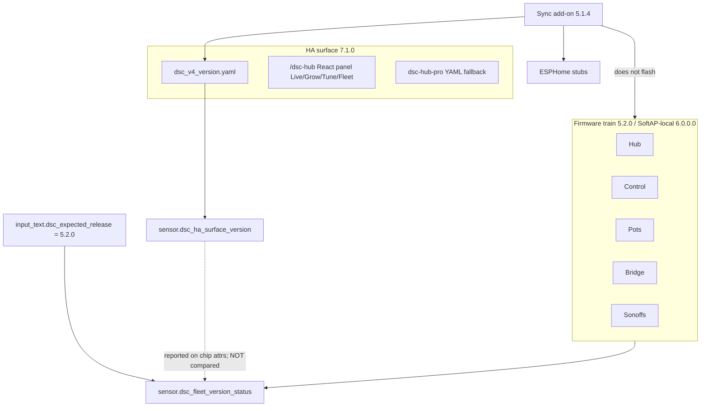

# Version trains — firmware vs HA surface

**Intent:** stop operators from treating the React/HA product surface string as a
firmware flash gate (or putting `7.x` into `input_text.dsc_expected_release`).

**Verified against:** `homeassistant/packages/dsc_v4_version.yaml`,
`homeassistant/custom_components/dsc_hub/const.py`,
`firmware/v4/dsc-{hub-v4_0,control-common,pot-common,bridge-common,sonoff-common}.yaml`,
`dsc-hub-sync/config.yaml` (tip after Dashboard **7.1.0** `68f00bc` + cannalib `68af9cd`).

## Current live train (master tip)

| Train | Current | SoT |
|---|---|---|
| Firmware (hub / Control / pots / bridge / Sonoffs / kits) | **5.2.0** identity / SoftAP-local **6.0.0.0** membership | `esphome.project.version` + text **Firmware Version** (dual-string lockstep). SoftAP-local cutover is membership/wifi, not a new HA surface. |
| HA product surface | **7.1.0** | `sensor.dsc_ha_surface_version` ← `packages/dsc_v4_version.yaml` |
| Integration bookkeeping | **7.1.0** | `SURFACE_VERSION` in `const.py` → `hass.data["dsc_hub"]["surface_version"]` only |
| Sync add-on | **5.1.4** | `dsc-hub-sync/config.yaml` |
| Last GitHub marketing tag | **v5.1.0** | GitHub Releases — in-tree train is ahead |

## Rules (do not violate)

1. **`dsc_expected_release` = firmware train only** (`5.2.0`). Never set it to the React surface (`7.1.0`).
2. **Fleet chip** (`sensor.dsc_fleet_version_status`) compares **major.minor firmware only**. Surface `7.x` beside firmware `5.2.0` is expected and must stay `ok` when devices report.
3. **`SURFACE_VERSION` does not create the template sensor.** Operator SoT is the package YAML; `const.py` is bookkeeping for the integration.
4. **Surface bump** needs three places in lockstep: package sensor, `const.py`, panel TSX fallbacks + rebuilt `www/dsc-hub-panel.js`. See [`LIVE-UI-CUSTOM-PANEL.md`](LIVE-UI-CUSTOM-PANEL.md).
5. **Firmware bump** needs `project.version` **and** the text Firmware Version / LVGL string on the same device body (Control/Sonoff dual-string).
6. **Sync does not Install firmware.** Push → packages / dashboard / www / stubs; ESPHome Install stays manual.
7. **FOLLOWUPS may mention 7.1.1 finish notes** — master tip strings are **7.1.0** until package/`const.py`/TSX all bump again. Document code, not aspirational FOLLOWUPS alone.

## Operator checks

| Check | Expect |
|---|---|
| `input_text.dsc_expected_release` | **5.2.0** |
| `sensor.dsc_ha_surface_version` | **7.1.0** |
| Device firmware sensors / ESPHome project | SoftAP-local fleet on **6.0.0.0** membership; identity train still **5.2.0** dual-string where unchanged |
| `sensor.dsc_fleet_version_status` | **ok** when reporting devices match expected major.minor |
| Sync `/config/dsc-hub-sync.version` | add-on **5.1.4** (or newer once cut) |
| Panel chrome | `SURFACE 7.1.0` · primary tabs Live/Grow/Tune/Fleet · hold-last vitals |

## Upgrade path (5.1.x / 6.x / 7.0 surface site → live train)

1. Update **DSC-HUB Sync** to **5.1.4+** → Start → wait for “Synced to …”.
2. Restart HA Core once if new helpers / panel / pot-tent / cannalib package landed.
3. Confirm surface **7.1.0** and expected release **5.2.0** (edit helper if still on an old initial).
4. SoftAP-local membership: [`SOFTAP-FLEET-HOME.md`](SOFTAP-FLEET-HOME.md) § SoftAP-local **6.0.0.0**. SoftAP NAPT OTA is **unproven** — Nest-hold OTA is gone after SoftAP-local; recovery = Fallback AP / USB.
5. Panel rebuild (local disk): `powershell -ExecutionPolicy Bypass -File scripts/build-dsc-hub-panel.ps1` after surface TSX bumps.
6. If Twin/Build/Catalog Lit cards changed: run `./scripts/sync-hacs-dist.sh` and confirm `git diff -- dist/` empty (or wait for CI `chore(hacs): sync dist/…`), then HACS Redownload. Prefer `/local` when HACS disagrees.
7. Smoke Pass **7.1** checklist in [`LIVE-UI-CUSTOM-PANEL.md`](LIVE-UI-CUSTOM-PANEL.md) — hold-last + History drawers + tent cockpits.

## Pitfalls

- Root README / older RELEASE text that say HA surface **5.2.0** or **6.x** or **7.0.0** are stale — surface is **7.1.0**.
- Putting **7.1.0** into `dsc_expected_release` makes every firmware device look off-train.
- Assuming Sync OTA’d devices — it only stages stubs/packages.
- Conflating `manifest.json` `0.1.0` (integration package) with product surface **7.1.0**.
- Documenting primary tabs as Ops · Plant · Advanced · System — retired in 7.0 (redirects remain).
- Trusting a `chore(hacs): sync dist/…` commit without local `sync-hacs-dist.sh` + empty `git diff -- dist/`.
- SoftAP max STA **10** / Nest-only pots / Nest STA after SoftAP-local — superseded; see SoftAP ops.
- Treating FOLLOWUPS **7.1.1** as live before package/`SURFACE_VERSION`/TSX all say **7.1.1**.

## Related

- [`RELEASE.md`](../../RELEASE.md) — tagged cut + live-train banner
- [`UPGRADE.md`](../../UPGRADE.md) — cutover checklists
- [`LIVE-UI-CUSTOM-PANEL.md`](LIVE-UI-CUSTOM-PANEL.md) — surface 7.1 hold-last + History drawers
- [`SOFTAP-FLEET-HOME.md`](SOFTAP-FLEET-HOME.md) — SoftAP-local membership
- [`../ops/CANNALIB-API.md`](../ops/CANNALIB-API.md) — full-corpus catalog API
- [`scripts/HACS-FRONTEND.md`](../../scripts/HACS-FRONTEND.md) — Lovelace dist sync
- [`docs/FOLLOWUPS.md`](../FOLLOWUPS.md) — living ops log
