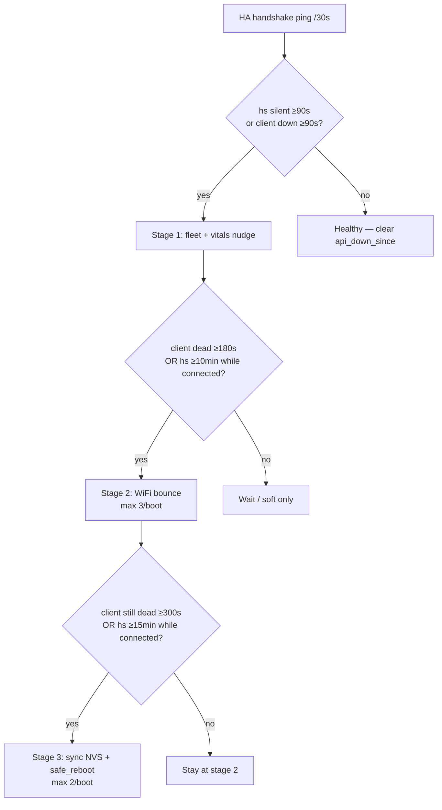

# DSC-HUB firmware v4

Working directory for ESPHome configs. Current fleet release string:
**`5.1.0`** (GitHub tag `v5.1.0`). See the repo
[README](../../README.md) and [INSTALL.md](../../INSTALL.md) for from-scratch HA setup.
Standalone SoftAP unboxing (no HA): [SETUP.md](../../SETUP.md).
Firmware QA: [docs/qa/FIRMWARE-QA-5.1.0.md](../../docs/qa/FIRMWARE-QA-5.1.0.md).

## Local vs HA

| Where | What |
|---|---|
| Here (`firmware/v4/`) | Stubs `!include` package bodies for Cursor edits + local flash. |
| [`homeassistant/esphome/`](../../homeassistant/esphome/) | Same stubs with **git-pull** packages from GitHub. |

Entry points (local lab): `dsc-hub.yaml`, `dsc-control.yaml`, `dsc-pot1.yaml`, …
Kit SoftAP setup: `dsc-hub-kit.yaml`, `dsc-control-kit.yaml`, `dsc-pot{1..4}-kit.yaml`

WiFi is split into `dsc-*-wifi-lab.yaml` / `dsc-*-wifi-kit.yaml` so kit builds omit compile-time SSIDs.
Fleet component: `components/dsc_fleet_setup/` (phone portal on hub; Control/pots join `DSC-Setup-*`).

Package bodies are remote-git safe (no `!secret`). Stubs pass credentials (and hub/panel MACs + `espnow_cmd_tag`) as substitutions.

Pots (`dsc-pot-common` **4.0.1+**): each soil channel has **Cal … Offset** / **Cal … Scale** config numbers (NVS). Formula `raw * scale + offset` applies before range/median and feeds HA + ESP-NOW. **Reset Sensor Calibration** restores defaults.

## Panel (DSC-CONTROL **4.0.11**)

Package body: [`dsc-control-common.yaml`](dsc-control-common.yaml).

| Feature | Notes |
|---|---|
| Soil cards + detail | 0xD3 vitals / 0xD4 names; tap pot → NPK drill-down |
| Hold-to-lock | Hold ~3 s on primary tabs; hold lock screen to unlock |
| Demand / takeover gate | Confirm → Engage (not one stray tap) |
| Connections | Wi‑Fi channel; ESP-NOW RX age + TX seq; silent → ping/WiFi bounce |
| AP pin | Optional `wifi_bssid` (hub `sensor.dsc_hub_wifi_bssid`) pins Nest point |
| Pulse VPD trend | 12×5 min ring → one label (no canvas charts) |
| HA API | **Plaintext** (no Noise); **mDNS off** — add by IP only |
| Stability | **4.0.10** page-gated `refresh_ui` @ 5 s |
| Snappiness | **4.0.11** `refresh_ui` reads `gv_*` live (template mirrors parked); 30 s Wi‑Fi channel poll |

After UI flashes: watch serial `boot` / `heap` lines. If the panel boot-loops, use **USB** not OTA until `DSC-CONTROL 4.0.11 up — free_heap=…` prints cleanly. See [`../_history/v4/crash-logs/`](../_history/v4/crash-logs/).

### Panel HA API reconnect

The `api:` block lives in [`dsc-control-common.yaml`](dsc-control-common.yaml). **v4.0.9+ has no Noise encryption** — LVGL RAM left the Noise handshake failing (`HANDSHAKESTATE_SETUP_FAILED`) and the teardown path double-freed the heap (reboot whenever HA probed). mDNS is **disabled** (setup OOM left it FAILED forever). ESPHome’s “Unable to connect… includes an `api` section” toast is **generic** — it does **not** mean the YAML is missing `api:`.

| Check | What to do |
|---|---|
| Panel boot-looping / no Wi‑Fi | USB flash; serial must show `DSC-CONTROL 4.0.11 up — free_heap=…`. OTA will not recover a looping board. |
| Host / mDNS | **IP only** — lab Nest reservation **`192.168.86.177`** (`use_address` in `dsc-control-wifi-lab.yaml`). Do not use `dsc-control.local`. |
| Encryption | Leave the key **blank** when adding/reconfiguring. If HA still has an old encrypted entry, **delete it** and re-add. |
| Stale `dsc-cyd1` | Delete old **dsc-cyd1** ESPHome device in HA Integrations if present. |
| Secrets on HA | Still need `dsc_control_ota_password` / `_ap_password` for Install/fallback AP (`dsc_control_api_key` unused by panel firmware). |
| Stub on HA | `/config/esphome/dsc-control.yaml` should match [`homeassistant/esphome/dsc-control.yaml`](../../homeassistant/esphome/dsc-control.yaml); Validate before Install. |
| Bundle fails: `… is not a valid YAML file` / `expected '<document start>'` | Almost always a **header comment** in the package body that lost its `#` (looks like `v4.0.x:` at column 2). ESPHome then treats the changelog line as YAML and dies before `substitutions:`. Fix on git, push, set stub `refresh: 0d`, Validate again. |

ESP-NOW (glass ↔ hub) does **not** need the HA API. Fix API only for OTA, diagnostics, and HA time backup.

**Package header rule:** changelog lines in `dsc-control-common.yaml` (and other bodies) must stay `#` comments. An uncommented `v4.0.11:`-style line breaks HA git-pull Install with `not a valid YAML file` at the first root key.

### Phase 1 fleet notes (stability + snappiness)

| Device | Change | Flash |
|---|---|---|
| Pots + Sonoffs | `power_save_mode: none` + `logger: INFO` | OTA fine |
| Hub | 30 s Wi‑Fi channel poll (silent Nest hops) | OTA fine |
| Panel 4.0.11 | Live `gv_*` UI + channel poll | **USB** if heap-sensitive / still looping |
| HA packages / automations / dashboard | Push sync (or copy) + reload | See [`../../RELEASE.md`](../../RELEASE.md) · [`../../scripts/HA-SYNC-BOOTSTRAP.md`](../../scripts/HA-SYNC-BOOTSTRAP.md) |

## Hub mat votes

In [`dsc-hub-v4_0.yaml`](dsc-hub-v4_0.yaml): `Mat Vote Pot 1`–`4` (`switch.dsc_hub_mat_vote_pot_N`). OFF pots are skipped by coldest/hottest root-zone voting (5–45 °C filter still applies). POT3 defaults OFF.

## Mode prefs → NVS (Full Auto / Takeover)

`preferences.flash_write_interval` is **60 s**. Restore-backed mode globals (`full_auto_mode`, `ha_takeover_active`) used to stay dirty until that window — an API-recovery reboot could resurrect a stale **Full Auto OFF** after an explicit ON (3 Aug 2026).

**Fix:** script `sync_mode_prefs` calls `global_preferences->sync()` immediately on:

| Transition | Where |
|---|---|
| Full Auto ON / OFF | `full_auto_switch` |
| Manual Takeover ON / OFF | `manual_takeover_switch` |
| Local Manual ON | `local_manual_mode` (OLED / panel path) |
| Panel fan live-adjust drops Full Auto | `dsc-hub-espnow-primary.yaml` (flush if Manual already on; else Manual ON syncs) |

Do **not** lower the global flash interval — only flush on mode ownership changes. Stack recovery reboot still syncs NVS before `App.safe_reboot()`.

## Hub link recovery + Lock WiFi AP (2026-08-03)

HA writes `number.dsc_hub_ha_handshake` every **30 s**. Soft nudge still watches handshake age; **bounce/reboot require a dead HA client** (or wedged-while-connected). Handshake lag alone with a live client must **not** bounce WiFi (overnight reboot storm).



| Stage | Trigger | Action |
|---|---|---|
| Soft | Handshake ≥**90 s** (or client down ≥90 s) | Fleet heartbeat + vitals nudge |
| Bounce | Client **dead** ≥**180 s**, **or** connected but hs ≥**10 min** | `link_wifi_bounce` (max 3/boot) |
| Reboot | Client **dead** ≥**300 s** after bounce, **or** connected but hs ≥**15 min** | Sync NVS + `safe_reboot` (max 2/boot) |

Constraints (verified in `dsc-hub-v4_0.yaml`):

- Panel-only silence never bounces or reboots the hub.
- Emergency / sensor-fault safety mode **defers** bounce + recovery reboot.
- Hub WiFi packages set `fast_connect: false` so bounce can scan onto the preferred Nest BSSID.
- **Lock WiFi AP** (`wifi_ap_learn_or_pin`): mismatch bounce backoff **120 s**, max **3**/boot; runs on every STA connect + delayed `on_boot` (5 s). If stuck on the wrong AP after 3 tries, use Remember Current AP or Clear Preferred.

## Quick validate

```bash
esphome config dsc-hub.yaml
esphome config dsc-control.yaml
esphome config dsc-heater.yaml
esphome config dsc-pot1.yaml
g++ -std=c++17 -Wall -Wextra -O2 -o verify_v4 verify_v4.cpp && ./verify_v4
```

Requires `secrets.yaml` in this folder (gitignored). Start from `secrets.yaml.template` if needed.

`espnow_cmd_tag` is **54727** (`0xD5C7`) on hub + panel — flash both after changing it.

Fleet bring-up / cutover: [`../../INSTALL.md`](../../INSTALL.md) · [`../../UPGRADE.md`](../../UPGRADE.md).
