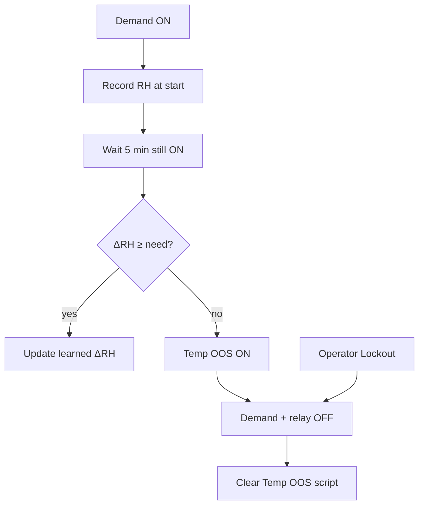

# Home Assistant — DSC-HUB v4

Canonical HA surface for firmware [`firmware/v4/`](../firmware/v4/).

## Layout

| Path | Role |
|---|---|
| `dashboards/dsc-hub-v4-dashboard.yaml` | Lovelace UX **v5.1.4** (`dsc-hub-pro`). Strains / Nutrient Science; Temp OOS; in-service kit; learn **Activity**. |
| `packages/dsc_v4_core_helpers.yaml` | Hub link, fan %, Sankey, runtimes, **in-service** + capacity-offline + vent-conflict / ineffective cues |
| `packages/dsc_v4_strain_catalog.yaml` | Strain catalog, sprout age, Want/Need/Got, peer offsets, Apply expected stage |
| `packages/dsc_v4_nutrient_catalog.yaml` | Nutrient stock, next-mix recipe, Accept mix QA (no pumps) |
| `packages/dsc_v4_pots_coherence.yaml` | Relative dryback + cross-pot EC/moisture coherence + learned ratios |
| `packages/dsc_v4_actuator_efficacy.yaml` | Command→effect; Temp OOS vs Operator Lockout; demand inhibit |
| `packages/dsc_v4_climate_physics.yaml` | Settable plant specs (CFM/volumes/L/day/W), ACH/AH/BTU/moisture sensors, spec verification |
| `packages/dsc_v4_device_cal.yaml` | Optional fan CFM / SF1000 PPFD multi-point curves + Learning wizard (unset = % × nameplate) |
| `packages/dsc_v4_climate_learn.yaml` | Phase A EMA (fans+mat may co-run) + `sensor.dsc_learn_activity` + Phase B waits |
| `packages/dsc_v4_light_helpers.yaml` | Lights-on today, clone dark-period, deviation |
| `packages/dsc_v4_tank.yaml` | Tank EC/pH/temp helpers + Tuya warn sync |
| `packages/dsc_v4_pots_stats.yaml` | Per-pot daily max/min + 7d baselines + rates |
| `packages/dsc_v4_pots_correlation.yaml` | EC vs tank + uptake slope |
| `packages/dsc_v4_pots_alerts.yaml` | Per-pot moisture/pH/temp/EC/N alert binaries |
| `packages/dsc_v4_alert_count.yaml` | `sensor.dsc_active_alert_count` for Home chip |
| `packages/dsc_v4_automations.yaml` | Demand followers, climate/safety alerts, grow-log scribe |
| `configuration.snippet.yaml` | Paste-once: packages include + YAML-mode `dsc-hub-pro` dashboard |
| `automations.yaml` | Deprecated stub — points at the package above |
| `www/dsc-system-map.*` | SYSTEM MAP Lovelace card + SVG → `/config/www/` |
| `esphome/` | Thin device stubs — pull firmware packages from GitHub |

## ESPHome (all devices)

Canonical edit path: Cursor → `firmware/v4/` → push.

On HA: copy `homeassistant/esphome/dsc-*.yaml` into `/config/esphome/`.
Stubs pull package bodies from `github.com/weddas/DSC-HUB` (`master`,
refresh daily). Secrets stay in HA `secrets.yaml` only.

Hub + panel: flash as a pair when `espnow_cmd_tag` / wire contract changes.

See [`esphome/README.md`](esphome/README.md).

## Install (from scratch)

Full file → destination map: [`../INSTALL.md`](../INSTALL.md).

Quick copy list:

| This folder | HA `/config/` |
|---|---|
| `packages/dsc_v4_*.yaml` | `packages/` (helpers, learn, automations) |
| `dashboards/dsc-hub-v4-dashboard.yaml` | `dashboards/` (YAML-mode URL **`dsc-hub-pro`**) |
| `esphome/dsc-*.yaml` | `esphome/` |
| `www/dsc-system-map.*` | `www/` + resource `/local/dsc-system-map-card.js` |

Merge [`configuration.snippet.yaml`](configuration.snippet.yaml) into HA `configuration.yaml`
(packages + YAML Lovelace). Filenames under `packages/` must use underscores.
Restart HA after the first copy / `configuration.yaml` change.

**Ongoing delivery (pick one path):**

| Path | When | Gate |
|---|---|---|
| **DSC-HUB Sync** add-on | HAOS polls `master` (~60s) | [`../scripts/ADDON.md`](../scripts/ADDON.md) |
| **HA sync** GHA workflow | Push → self-hosted `unraid-ha-deploy` runner → `ha-sync.sh` | [`../scripts/HA-SYNC-BOOTSTRAP.md`](../scripts/HA-SYNC-BOOTSTRAP.md) |

Firmware Install stays manual — see [`../RELEASE.md`](../RELEASE.md).
**Do not treat a new HA surface as live** until `sensor.dsc_ha_surface_version`
matches the commit (e.g. **5.1.4** after `e0ffeaf`). GitHub green ≠ HAOS
updated when the Unraid runner is offline (jobs stay `queued`).

## Fan entity_ids

Core helpers assume ESPHome default slugs from hub friendly names. If your registry differs, edit the four `fan.dsc_hub_*` ids in `dsc_v4_core_helpers.yaml` once.

## Notifier

Climate / safety automations in `dsc_v4_automations.yaml` use a mobile notify
target — edit those services to match your HA devices (`notify.mobile_app_…`).
Package pot/tank **push** notifiers are not shipped in **v5.0.0**
(alert binary sensors remain).

## HACS cards

mushroom · apexcharts-card · power-flow-card-plus · plotly-graph-card · mini-graph-card · gauge-card-pro · modern-circular-gauge · logbook-card · auto-entities · vertical-stack-in-card · card-mod · bar-card · ph-meter-temperature · **expander-card** · **browser_mod**

`browser_mod` (HACS **Integration**, not a card) powers the popup layer —
graph enlarge, appliance consoles, pot detail. Install from HACS →
Integrations, restart HA, then **Settings → Devices & Services →
Add Integration → Browser Mod**. Without it the popup taps silently no-op.

## Local custom card — SYSTEM MAP

Neon isometric live map (`custom:dsc-system-map-card`) on the Home view.

### Preferred — HACS Dashboard custom repository

1. HACS → ⋮ → **Custom repositories**
2. Repository: `https://github.com/weddas/DSC-HUB`
3. Category: **Dashboard**
4. Download **DSC-HUB System Map**, restart/reload when prompted, hard-refresh browser

HACS serves `/hacsfiles/DSC-HUB/DSC-HUB.js` (+ SVG beside it). Full steps:
[`../scripts/HACS-FRONTEND.md`](../scripts/HACS-FRONTEND.md).

### Manual fallback (`/config/www/`)

1. Copy both files into Home Assistant `/config/www/` (or rely on ha-sync):
   - [`www/dsc-system-map.svg`](www/dsc-system-map.svg)
   - [`www/dsc-system-map-card.js`](www/dsc-system-map-card.js)
2. **Settings → Dashboards → ⋮ → Resources → Add resource**
   - URL: `/local/dsc-system-map-card.js`
   - Type: **JavaScript** (not JavaScript Module — the card is a classic IIFE)
3. Ensure the dashboard includes the **SYSTEM MAP** card (YAML dashboard already does).
4. Hard-refresh the browser.

Optional entity overrides via card YAML:

```yaml
type: custom:dsc-system-map-card
title: DSC-HUB
entities:
  fan_out: sensor.dsc_fan_exhaust_outside_pct
  light: light.dsc_hub_sf1000_dimmer
```

## Climate capacity envelope

The **hub firmware** owns the escalation ladder (fans first → appliances →
>35°C failsafe). HA only mirrors four Sonoff relays and surfaces alerts —
it must not duplicate ladder logic.

**Energy rule:** do not buy heat or moisture then dump it outside. Heater
and humidifier demands clamp OUT exhaust to the fresh-air floor and route
RECIRC (RH overflow / emergency still win). If
`binary_sensor.dsc_humidifier_vent_conflict` or
`binary_sensor.dsc_heater_vent_conflict` lights up, the running firmware is
old or overflow is forcing a dump — check hub version ≥ 5.1.2.

## In service (single gate)

One operator switch per optional/removed device — **not** a separate “Wired”
flag. `input_boolean.dsc_*_in_service` (defaults: AC off, clone mister off,
POT1/2/4 on, POT3 off). Synced to hub NVS switches.

| State | Behavior |
|---|---|
| Off | Never demand, follow, alert, learn, or Full-Auto-arm that lever |
| Off (soft cue) | `binary_sensor.dsc_*_capacity_offline` / `dsc_reduced_kit` — not in `dsc_active_alert_count` |
| On | Normal ladder + follower (relay entity must exist for Sonoffs) |

**Next-best when OOS:** AC → OUT/RECIRC heat-dump (fans); emergency ≥35 °C
fans-only if AC OOS. Clone mister → no demand; intake/recirc hold moisture.
Pot OOS → excluded from mat vote + chemistry alerts silenced.

Carry-forward work: [`../docs/FOLLOWUPS.md`](../docs/FOLLOWUPS.md).

## Mode ownership (dashboard + hub)

Named modes own climate numbers. Switch to **Custom** (or Override / Hold)
before fine-tuning — otherwise the hub rejects the write and the dashboard
shows a locked readout.

| Owner | Unlock | Locked surface |
|---|---|---|
| Grow Stage | **Custom** | 4x8 target temp / RH / VPD |
| Clone Mode | **Custom** | Clone temp / RH / VPD |
| Full Auto | Manual Fan Override or Takeover | Fan % cards |
| Auto Photoperiod | Manual Light Hold or Takeover | SF1000 brightness (schedule cue) |
| Clone Photoperiod Follow | **Independent** | Clone light hours + lights-on time |

**Home** folds: **Now** (pulse + alerts) → **Operational now** (live vs band,
ladder prep, fans) → **SYSTEM MAP** + Running → **Bands** (Follow-aware gauges)
→ narrator expander. **Root Zone** above-fold is Pots + Mat; EC/moisture/NPK
charts live in History expanders.

After flashing Grow Stage **Custom**, either pick **Custom** to keep hand-tuned
4x8 bands or re-select a named stage to reload presets.

| Device | Owner | Role |
|---|---|---|
| OUT / RECIRC / intakes | Hub fans | First responder; heat reuse; negative-pressure budget |
| Humidifier / dehumidifier / heater / grow mat | Hub demand → HA follower → Sonoff | Wired actuators |
| AC | Hub `ac_demand` → **gated follower** | Only when `input_boolean.dsc_ac_in_service` is on and `switch.dsc_ac_main_relay` exists |
| Clone mister | Hub `clone_humidifier_demand` → **gated follower** | Same via `dsc_clone_humidifier_in_service` — off until mister hardware |
| Shared room appliances | Priority tent when both live | Non-priority tent is local levers only |

### Scenario keep-up matrix (code-walked)

| Scenario | Can tents keep up? |
|---|---|
| A. Warm room + lights dumping heat | **No if AC out of service** — fans exchange to room temp only |
| B. Cold dry night, 4x8 priority | **Yes** for air via heater/hum; clone RH needs intake plume |
| C. Clone overheat, 4x8 has priority | **Partial** — local flush helps; shared AC serves priority |
| D. High RH flower + dehum lag | **Yes** if dehum follower healthy; moisture wins over heat reuse |
| E. Root zone cold / POT3 faulted | **Yes** (voted pots); air-proxy if all probes die |
| F. Root runaway (≥ High+1) | **Yes** — mat OFF + fan flush |
| G. Emergency ≥35°C | Fans yes; **AC only if in service** |
| H. Opposite climates both tents | **Structural limit** — priority wins room appliances |
| I. Hub offline ≥30s | Appliances safe-off; fans continue if hub up |
| J. Clone dry, no mister | **No local RH lever** — room humidifier + routing only |

Capacity verdict: fan ladder + heat reuse + reality gates are strong.
Hard holes today are **AC actuation** and **clone mister actuation**.

### Plant specs (settable — not hardcoded)

Install [`packages/dsc_v4_climate_physics.yaml`](packages/dsc_v4_climate_physics.yaml).
Nameplate values live as `input_number.dsc_*` (fan max CFM, tent/room m³,
heater W, dehum L/day, hum mL/h, AC BTU/h, light watts). Change them when
hardware is swapped; Sankey + capacity sensors recompute from those helpers.

**Optional L×W×H (cm):** `input_number.dsc_dim_*_{l,w,h}_cm` plus Apply
scripts (`script.dsc_apply_dim_4x8` / `_2x4` / `_room`) write the matching
`dsc_vol_*_m3`. Leave dimensions at 0 to keep editing m³ directly. Packed
tents may need a free-air nudge after geometric apply.

Verification binaries (`binary_sensor.dsc_plant_specs_*`) flag incomplete
floors, intake CFM > exhaust CFM, AC in service with 0 BTU/h, and zeroed
appliance rates. Status: `sensor.dsc_plant_specs_status` (`ok` / `warn` / `error`).
Curves / dimensions are **not** required for spec completeness.

### ESP keep vs park / orphan helpers

| Keep | Park / demote |
|---|---|
| Hub tent SHT + room/clone aux | ADC “dynamic CO2” — informational only until a real CO₂ sensor |
| ESP-NOW pot probes that are **in service** | OOS pots (alerts off; mat vote excluded) |
| Sonoff followers for hum/dehum/heater/mat | AC / clone mister until hardware + In Service ON |
| `input_number.dsc_leaf_offset` (VPD leaf adj.) | Undefined `sensor.dsc_clone_temp_trend` (removed from dashboard) |

SCD41 / dedicated CO₂ remain deferred — see [`../docs/FOLLOWUPS.md`](../docs/FOLLOWUPS.md).

### Optional fan CFM / light PPFD curves

Install [`packages/dsc_v4_device_cal.yaml`](packages/dsc_v4_device_cal.yaml)
(auto-loaded with other `dsc_v4_*` packages).

Unset curve points (`input_number.dsc_cal_cfm_*_*` / `dsc_cal_ppfd_*` = 0)
keep live CFM as **commanded % × nameplate** — same as before. With **≥2**
measured points, `sensor.dsc_cfm_*` (and `sensor.dsc_sf1000_ppfd`)
piecewise-linear interpolate. Saving a 100% CFM point also updates the
matching `dsc_cfm_*_max` nameplate.

Dashboard wizard on **Learning**: pick target → Start (Tent Manual Override
or Manual Light Hold) → hold 25/50/75/100% → enter duct-outlet m/s (uses
`dsc_duct_*_cm`, default 6″/4″) or CFM / PPFD → Save. Skip / Abort restore
prior speeds. Reset scripts clear a curve back to linear %.

### Response-rate learning (Phase A — observe + predict)

Install [`packages/dsc_v4_climate_learn.yaml`](packages/dsc_v4_climate_learn.yaml)
alongside the physics package.

**Gate open ≠ actively learning.** `binary_sensor.dsc_learn_gate_open` only
means “allowed to sample.” Read **`sensor.dsc_learn_activity`** for plain
English: *Learning humidifier (2/5 samples)* vs *Waiting — 2 air appliances
on together* vs *Idle*.

Phase A samples when **exactly one air appliance** is ON (humidifier /
dehumidifier / heater / AC). **Fans and grow mat may co-run** — Full Auto
always has fans, and the mat often stays on; that no longer blocks learning.
Mat samples when mat is ON and no air appliance is ON. Vent samples when
OUT/intake is high and no air appliance is ON.

A 5-minute EMA stores effectiveness vs nameplate (`input_number.dsc_learn_eff_*`,
clamped 0.1–2.0×). Sample counts (`dsc_learn_samples_*`) are the automatic
**appliance results database**. When count ≥ `input_number.dsc_learn_min_samples`,
those coeffs scale **predictions only**:

| Sensor | Role |
|---|---|
| `sensor.dsc_learn_activity` | What learning is doing *right now* |
| `sensor.dsc_minutes_to_temp_target` | ETA to `number.dsc_hub_target_temp` |
| `sensor.dsc_minutes_to_rh_target` | ETA to RH band mid |
| `sensor.dsc_heat_balance_btu_learned` | Heat headroom with trusted scales |
| `sensor.dsc_moisture_net_rate_learned` | Moisture headroom with trusted scales |
| `sensor.dsc_learn_status` | `disabled` / `gated` / `warming` / `partial` / `ready` |

Phase A does **not** write hub persistence waits, fan curves, or failsafe.
**Phase B** (opt-in, default off): leave off until Activity shows appliance
samples climbing. Then `input_boolean.dsc_climate_learn_phase_b_enabled`
may clamp `number.dsc_hub_ladder_wait_*` only. Lock with
`input_boolean.dsc_learn_phase_b_locked` after manual edits.
Reset coeffs: `script.dsc_climate_learn_reset`. Reset waits: `script.dsc_climate_learn_reset_waits`.

Dashboard: **Learning** (`/dsc-hub-pro/learning`) — Activity card, device cal,
Phase A+B status, appliance effect cards, waits, ETA, efficiencies, charts.

## Crop-steering + response learning (HA surface 5.1.4)

**Intent:** turn probe noise and actuator non-response into usable steering
*before* probe replacement — genetics/age bands, peer-corrected Got, track-only
dryback/coherence, and humidity-appliance efficacy that can force demand off.

**HA-only cut** (`e0ffeaf`): no firmware flash required. Hub stays on the prior
5.1.3 train until a later hub bump. Strain/sprout still live in HA helpers today
(FOLLOWUPS **N-017** / **N-018** move them onto pot NVS).

Packages: `dsc_v4_strain_catalog`, `dsc_v4_nutrient_catalog`, `dsc_v4_pots_coherence`,
`dsc_v4_actuator_efficacy` (+ follower `*_available` gates in `dsc_v4_automations`).

### Want / Need / Got

| Layer | Meaning | Examples |
|---|---|---|
| **Want** | Strain catalog + sprout age → expected stage bands (pH / EC / moisture) | `sensor.dsc_pot1_want_*`, `sensor.dsc_pot1_expected_stage` |
| **Got** | Raw probe **+ peer offset** (soft cal vs peers) | `sensor.dsc_pot1_got_ph` / `_ec` / `_moisture` |
| **Need** | Plain-English gap vs Want | `sensor.dsc_pot1_need_summary`, `sensor.dsc_pot1_need_ec_delta` |

Scripts: Capture peer baseline; Apply expected stage (advisory — does not write
hub climate). Sprout dates: `input_datetime.dsc_pot*_sprout_date`.

### Nutrient Science

Tank volume × strength → `sensor.dsc_next_mix_recipe` + purchase list.
**Accept mix** (`script.dsc_accept_mix`) burns book stock only — **no pumps**
(FOLLOWUPS **N-012**). Data mirrors: `data/dsc_strain_catalog.yaml`,
`data/dsc_nutrient_catalog.yaml`.

### Fluctuations (track-only)

- Relative dryback: peak→now moisture (`sensor.dsc_pot*_dryback_pct`) — not closed-loop irrigation yet (**N-013**).
- Cross-pot coherence when moisture rises together but EC response disagrees;
  EWMA learns `input_number.dsc_pot*_learned_ec_per_moisture`.

### Temp OOS vs Operator Lockout

Applies to humidifier, dehumidifier, and clone mister (not AC/heater yet — **N-014**).

| Mode | Who sets | Who clears | Effect |
|---|---|---|---|
| **Temp OOS** | Efficacy check after demand ON **5 min** | Operator (`script.dsc_clear_*_temp_oos`) | Flashing UI; demand + relay forced off |
| **Operator Lockout** | Operator only | Operator only | Solid lock; system never auto-clears |

Efficacy: record tent/clone RH at demand start; after 5 min require
ΔRH ≥ max(learned×0.35, `dsc_efficacy_min_delta_rh` floor, default 0.5%).
Pass → EWMA update learned ΔRH. Fail → Temp OOS + notify.
`binary_sensor.dsc_*_available` is false while Temp OOS **or** Lockout (clone
also requires in-service). Followers and `dsc_efficacy_inhibit_demand_while_oos`
keep demand off while unavailable.



### Deploy gate (live vs GitHub)

Packages on `master` are **not** production until HAOS has them:

1. Confirm delivery path ran (Sync add-on log **or** Actions **HA sync** success).
2. Restart HA Core once after new `input_*` helpers (reload alone often misses them).
3. `sensor.dsc_ha_surface_version` = **`5.1.4`** (System versions table).
4. Views exist: **Strains** `/dsc-hub-pro/strains`, **Nutrient Science**, Climate Temp OOS / Lockout cards.
5. Spot-check `sensor.dsc_pot*_got_*`, `binary_sensor.dsc_*_available`.

**Incident 2026-08-03:** push `e0ffeaf` left HA sync **queued** with
`total_count: 0` self-hosted runners — surface stayed pre-5.1.4 until
`unraid-ha-deploy` came back (or manual `ha-sync.sh`). See FOLLOWUPS **N-009** /
**N-010** and [`../scripts/HA-SYNC-BOOTSTRAP.md`](../scripts/HA-SYNC-BOOTSTRAP.md).

### Pitfalls

- Treat crop-steering UI as live only after the surface-version gate — stale
  packages mean missing entities / broken views, not “empty catalog.”
- Temp OOS ≠ capacity OOS (`*_in_service` off) ≠ Operator Lockout — three different gates.
- Accept mix is bookkeeping; do not expect hardware dosing.
- Peer offsets are v1 soft cal (**N-016**); probe stays in pot until harvest — genetics should eventually travel with the node (**N-017**).

Dashboard: Strains + pot subviews, Nutrient Science, Climate Temp/Lockout UI.
Carry-forward: [`../docs/FOLLOWUPS.md`](../docs/FOLLOWUPS.md).

## Tank / Tuya entity map

Package [`packages/dsc_v4_tank.yaml`](packages/dsc_v4_tank.yaml) expects lab-style
water tester entities. Alias or rename in HA to match:

| DSC helper / sensor | Typical Tuya / integration id |
|---|---|
| Tank EC raw | `sensor.water_tester_ec` (or site-specific) |
| Tank pH | `sensor.water_tester_ph` |
| Tank temp | `sensor.water_tester_temperature` |
| EC scale | `input_number.dsc_tank_ec_multiplier` (`1` or `1000`) |

Door magnet (lab): `lock.4x8_humidifier_photo_lab_lock` = **room door release**,
not humidifier lock — entity id kept for compatibility.

## Still outside this folder (hardware / live site)

- Clone humidifier / AC physical actuators — demands live; followers gated by in-service + `*_available`
- Recorder `purge_keep_days: ~120` — HA config
- Fixed-channel AP — ops (root README)
- POT3 probe swap, SCD41, ETH01 — post-release hardware

## Firmware pairing (**v5.1.0**)

| Piece | Version |
|---|---|
| Hub / pots / Sonoffs / kits | **`5.1.0`** |
| Panel (DSC-CONTROL) | **`5.1.x`** lean-cut patch train |
| HA surface (packages + dashboard) | **`5.1.4`** |
| Dashboard | DSC-HUB Pro (4-col, browser_mod popups) |
| `espnow_cmd_tag` | `54727` (`0xD5C7`) on hub **and** panel |

Fleet drift chip (`sensor.dsc_fleet_version_status`) compares the
**major.minor** train, so mixed patch levels inside `5.1.x` stay `ok`.

**Mat votes:** `switch.dsc_hub_mat_vote_pot_1`…`4` — Root Zone is source of truth; Climate links there.

Bring-up: [`../INSTALL.md`](../INSTALL.md) · add-on: [`../scripts/ADDON.md`](../scripts/ADDON.md) · release: [`../RELEASE.md`](../RELEASE.md).
