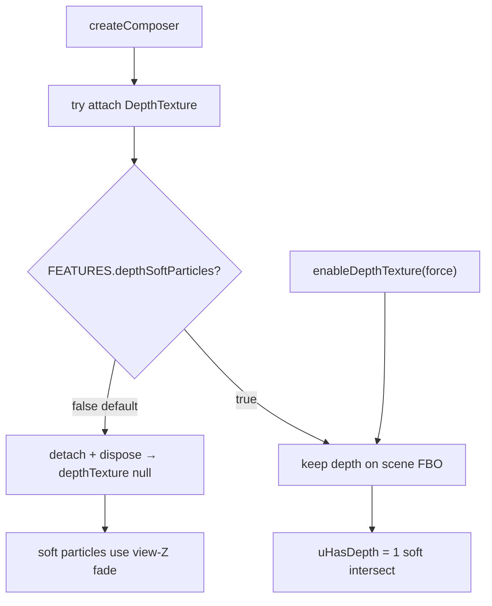

# DSC Dash FX

`dsc-dash-fx.js` is the dependency-free IIFE cinematic FX bridge for The Dash.
Once the vendored THREE r160 global is present, it installs soft sprites,
lightweight bloom composition, screen-space flow ribbons, confined curl haze,
and color-ramp / glTF accent helpers under `THREE.DSCDashFX`.

## Public surface

```js
THREE.DSCDashFX = {
  FEATURES,                 // mutable feature flags (see below)
  createComposer,           // bloom post + soft-particle registry
  makeFlowRibbon,           // MeshLine ribbon (TubeGeometry fallback)
  rebuildFlowRibbonGeometry,
  createCurlHaze,           // free GPU curl (legacy; Dash no longer mounts room fog)
  createConfinedCurlHaze,   // AABB-wrapped curl for in-tent mix
  createSoftSpriteTexture,
  createColorRamp,
  loadSimpleGltf,
};
```

Composer instances also expose `enableDepthTexture(force)`, `disableDepthTexture()`,
`registerSoftParticleMaterial(material)`, and a `depthTexture` getter.

## FEATURES flags

Set **before** first ribbon/haze construction (or rely on runtime auto-fallback):

| Flag | Default | Meaning |
|---|---|---|
| `meshLineRibbon` | `true` | Screen-space MeshLine attrs (`previous` / `next` / `side`) |
| `tubeRibbonFallback` | `false` | Force `THREE.TubeGeometry` ribbons |
| `gpuCurlHaze` | `true` | Vertex-shader curl advection |
| `cpuCurlHazeFallback` | `false` | CPU position loop if GPU path disabled / fails |
| `depthSoftParticles` | `false` | Keep DepthTexture on the bloom FBO for soft intersect |

**Do not** flip `depthSoftParticles` to `true` by default — WebKit/Chromium often
breaks opaque depth clears when a DepthTexture rides the color FBO (black tents /
haze-only scene). Soft shaders already gate on `uHasDepth`.

## 2026-08-06 — Deferred FX closeout

### MeshLine flow ribbons

- `buildMeshLineGeometry` emits triangle-strip ribbons with `previous`/`next`/`side`
  plus width/resolution uniforms (true screen-space MeshLine, not Tube).
- Same dashed additive shader; `vUv.x` is arc length along the curve.
- Width animation: `mesh.userData.rebuildFlowRibbon(radius)` or
  `THREE.DSCDashFX.rebuildFlowRibbonGeometry(mesh, curve, tubular, radius)`.
- Live Dash mounts **5** `DSCDashFX.FlowRibbon` objects with `previous` attrs.
- Fallback: set `FEATURES.tubeRibbonFallback = true` before first `makeFlowRibbon`,
  or let construction auto-fall back if MeshLine attrs are missing.

### Confined GPU curl (in-tent only)

- `createConfinedCurlHaze(renderer, { count, center, halfExtents, color })`
  advects in the vertex shader and wraps positions inside an AABB.
- CPU fallback re-confines after each free curl step.
- Wired from `dsc-the-dash-card.js` as `mixClone` / `mixMain` only
  (**2** live `DSCDashFX.ConfinedCurl` systems).
- **Ambient room curl is retired** — it read as flying blur balls, not CFM flow.
  `createCurlHaze` remains exported for fallback/debug but is not mounted on Dash.

### DepthTexture opt-in



- Composer always *attempts* attach (to prove Three support), then **detaches
  immediately** unless `FEATURES.depthSoftParticles` is already true.
- Opt in at runtime: `post.enableDepthTexture(true)` (forces the flag) or set
  `FEATURES.depthSoftParticles = true` before `createComposer`.
- Live verify: `post.depthTexture === false` / `null` after default create.
- Soft-particle materials still declare `tDepth` / `uHasDepth` so reattach works
  without shader rebuild.

### Models (incremental)

Leaflet-tier plant primitives (pot rim / soil / fan leaves) and denser Cloudline
fan accents (badge, flange bolts, blades). Offline muffler/housing/flange glTF
under `www/assets/dash/` still load via `loadSimpleGltf` with primitive fallback.
Sync does **not** stage those glTF files yet (**N-035**) — primitives are expected.

## Bundle rebuild

From repo root (Git Bash / WSL / Linux):

```bash
bash scripts/sync-hacs-dist.sh
```

Concat order: `dsc-system-map-card.js` → `dsc-airflow-map-card.js` →
`vendor/three.min.js` → `vendor/dsc-dash-fx.js` → `dsc-the-dash-card.js` →
`dist/DSC-HUB.js` and `dist/dsc-system-map-card.js`.

Healthy cinematic bundle is **~855–900 KB**. Sync refuses demoting a live healthy
bundle below 500000 bytes. Lovelace resource type must stay classic **`js`**.

After every www deploy: **hard-refresh** (`location.reload()`), not SPA navigate —
custom elements stay sticky until full reload.

## Operator / QA runbook

See [`docs/qa/LIVE-UI-DASH-DEFERRED-FX.md`](../../../docs/qa/LIVE-UI-DASH-DEFERRED-FX.md).
Follow-ups: [`docs/FOLLOWUPS.md`](../../../docs/FOLLOWUPS.md) — **2026-08-06 Deferred FX closeout**.
