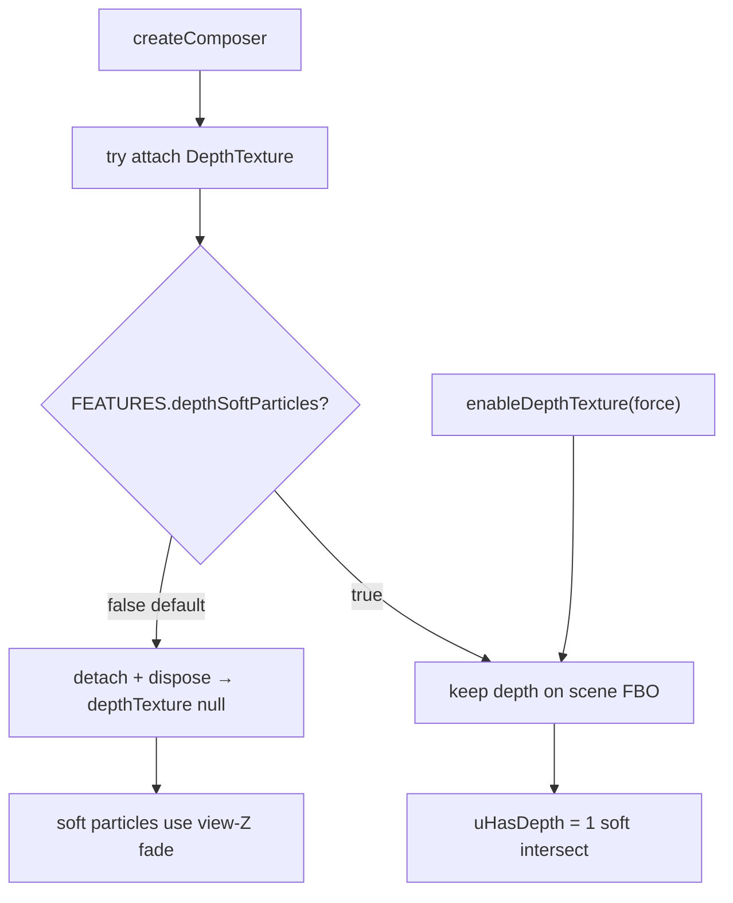

# DSC Dash FX

`dsc-dash-fx.js` is the dependency-free IIFE cinematic FX bridge for The Dash.
Once the vendored THREE r160 global is present, it installs soft sprites,
lightweight bloom composition, screen-space flow ribbons, curl helpers,
color-ramp / glTF accent helpers, and procedural photoreal surface textures under
`THREE.DSCDashFX`.

## Public surface

```js
THREE.DSCDashFX = {
  FEATURES,                 // mutable feature flags (see below)
  createComposer,           // bloom post + soft-particle registry
  makeFlowRibbon,           // MeshLine ribbon (TubeGeometry fallback)
  rebuildFlowRibbonGeometry,
  createCurlHaze,           // free GPU curl (legacy; Dash does not mount room fog)
  createConfinedCurlHaze,   // AABB-wrapped curl (exported; Dash scene no longer mounts)
  createSoftSpriteTexture,
  createColorRamp,
  createFabricTexture,
  createMylarTexture,
  createLeafTexture,
  createSoilTexture,
  createLeafGeometry,
  createPhotorealSurfaces,  // { fabric, mylar, leaf, soil } canvas maps
  loadSimpleGltf,
};
```

Composer instances also expose `enableDepthTexture(force)`, `disableDepthTexture()`,
`registerSoftParticleMaterial(material)`, and a `depthTexture` getter.

## FEATURES flags

Set **before** first ribbon/haze construction (or rely on runtime auto-fallback):

| Flag | Default | Meaning |
|---|---|---|
| `meshLineRibbon` | `true` | Screen-space MeshLine attrs (`previous` / `next` / `side`) |
| `tubeRibbonFallback` | `false` | Force `THREE.TubeGeometry` ribbons |
| `gpuCurlHaze` | `true` | Vertex-shader curl advection (for curl helpers) |
| `cpuCurlHazeFallback` | `false` | CPU position loop if GPU path disabled / fails |
| `depthSoftParticles` | `false` | Keep DepthTexture on the bloom FBO for soft intersect |

**Do not** flip `depthSoftParticles` to `true` by default — WebKit/Chromium often
breaks opaque depth clears when a DepthTexture rides the color FBO (black tents /
haze-only scene). Soft shaders already gate on `uHasDepth`.

## MeshLine flow ribbons

- `buildMeshLineGeometry` emits triangle-strip ribbons with `previous`/`next`/`side`
  plus width/resolution uniforms (true screen-space MeshLine, not Tube).
- Same dashed additive shader; `vUv.x` is arc length along the curve.
- Width animation: `mesh.userData.rebuildFlowRibbon(radius)` or
  `THREE.DSCDashFX.rebuildFlowRibbonGeometry(mesh, curve, tubular, radius)`.
- Live Dash mounts **5** `DSCDashFX.FlowRibbon` objects; dash offset / width scale
  with absolute CFM in `dsc-the-dash-card.js`.
- Fallback: set `FEATURES.tubeRibbonFallback = true` before first `makeFlowRibbon`,
  or let construction auto-fall back if MeshLine attrs are missing.

## Curl helpers (exported; scene pathline supersedes)

- `createCurlHaze` / `createConfinedCurlHaze` remain on the public surface for
  fallback/debug.
- **The Dash no longer mounts them** after the cinematic pathline rewrite
  (`3bed316` / kill-blur-box): ambient room curl and in-tent confined mix read as
  bouncing blur balls. Scene air is streak particles + shafts + port jets +
  `flowClone` / `flowMain` (see cinematic runbook).

## DepthTexture opt-in



- Composer always *attempts* attach (to prove Three support), then **detaches
  immediately** unless `FEATURES.depthSoftParticles` is already true.
- Opt in at runtime: `post.enableDepthTexture(true)` (forces the flag) or set
  `FEATURES.depthSoftParticles = true` before `createComposer`.
- Soft-particle materials still declare `tDepth` / `uHasDepth` so reattach works
  without shader rebuild.

## Photoreal surfaces (procedural)

- `createPhotorealSurfaces()` → `{ fabric, mylar, leaf, soil }` canvas textures.
- Also exported individually: `createFabricTexture`, `createMylarTexture`,
  `createLeafTexture`, `createSoilTexture`, plus optional `createLeafGeometry`.
- Dash uses these for tent Oxford/mylar maps, leaflet albedo+alpha, and soil
  media. Still **procedural** — not scanned/authored multi-mesh GLTF packs.
- Offline muffler/housing/flange glTF under `www/assets/dash/` still load via
  `loadSimpleGltf` with primitive fallback. Sync does **not** stage those glTF
  files yet (**N-035**) — primitives are expected.

## Scene motion (lives in the Dash card)

FX helpers supply ribbons / bloom / textures. **CFM honesty and pathline cinema
live in `dsc-the-dash-card.js`**, not this bridge:

- Particle / fan / shaft / jet motion → absolute CFM only (`cfmNorm`, threshold
  ≈ 0.04 after `/80`).
- Through-tent pool → OUT/RECIRC by `outShare` / `recircShare`.
- Lit room practicals + photoreal maps are card-side consumers of this API.

Operator runbook: [`docs/qa/LIVE-UI-DASH-CINEMATIC-AIRFLOW.md`](../../../docs/qa/LIVE-UI-DASH-CINEMATIC-AIRFLOW.md).

## Bundle rebuild

From repo root (Git Bash / WSL / Linux):

```bash
bash scripts/sync-hacs-dist.sh
```

Concat order: `dsc-system-map-card.js` → `dsc-airflow-map-card.js` →
`vendor/three.min.js` → `vendor/dsc-dash-fx.js` → `dsc-the-dash-card.js` →
`dist/DSC-HUB.js` and `dist/dsc-system-map-card.js`.

Healthy cinematic bundle is **~855–920 KB** (post-`3bed316` ~911 KB). Sync refuses
demoting a live healthy bundle below 500000 bytes. Lovelace resource type must
stay classic **`js`**.

After every www deploy: **hard-refresh** (`location.reload()`), not SPA navigate —
custom elements stay sticky until full reload.
