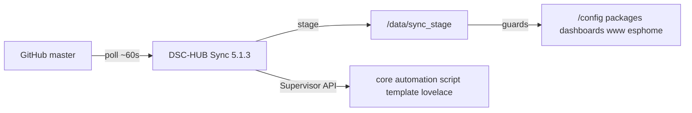

# DSC-HUB Sync — Home Assistant add-on

**Primary delivery** for packages, automations, Pro dashboard, www, and ESPHome
stubs on HAOS. **v5.1.3** concatenates the cinematic Lovelace bundle (system map
+ airflow + THREE + Dash FX + The Dash), copies dashboard modules, defaults
`sync_esphome: true`, and writes a version/SHA marker.

## Install (once)

1. Settings → Add-ons → Repositories → `https://github.com/weddas/DSC-HUB`
2. Install **DSC-HUB Sync** → **Start** (Update to **5.1.3** if an older image is installed)
3. Defaults: `ref: master`, `poll_seconds: 60`, `sync_esphome: true`, `sync_www: true`
4. Log shows “Synced to …” · `/config/dsc-hub-sync.version` present
5. Merge [`configuration.snippet.yaml`](../homeassistant/configuration.snippet.yaml)
   → **restart HA once**
6. Remove duplicate DSC automations from the UI if needed
7. Confirm `wc -c /config/www/dsc-system-map-card.js` is **≥ 500000** (~846 KB)

**Push to `master` → within ~60s** packages / dashboard / modules / www / stubs update.
Device firmware: **manual** ESPHome Install only.

## Architecture

Sources: [`dsc-hub-sync/`](../dsc-hub-sync/) · [`repository.yaml`](../repository.yaml).

### www guards (F-013)

Older Sync images could copy `www/dsc-system-map-card.js` (~10 KB source) and
wipe The Dash. **5.1.3** always concatenates five inputs (or falls back to
`dist/`), refuses staged bundles `< 500000` bytes, and will not demote a live
cinematic file. Details:
[`docs/qa/LIVE-UI-WWW-BUNDLE-GUARDS.md`](../docs/qa/LIVE-UI-WWW-BUNDLE-GUARDS.md).

Sync does **not** rewrite Lovelace `?v=` query strings (unlike `ha-sync.sh`).

## Related

| Channel | Role |
|---|---|
| **This add-on** | HA surfaces + stubs + www bundle |
| HACS Dashboard | Optional same bundle — [`HACS-FRONTEND.md`](HACS-FRONTEND.md) |
| [`ha-sync.sh`](ha-sync.sh) | Non-HAOS alternate (+ `dash-<UTC>` cache-bust) |
| ESPHome Install | Firmware only (manual) |

QA: [`docs/qa/ADDON-QA-5.1.0.md`](../docs/qa/ADDON-QA-5.1.0.md) ·
[`docs/qa/LIVE-UI-WWW-BUNDLE-GUARDS.md`](../docs/qa/LIVE-UI-WWW-BUNDLE-GUARDS.md)
