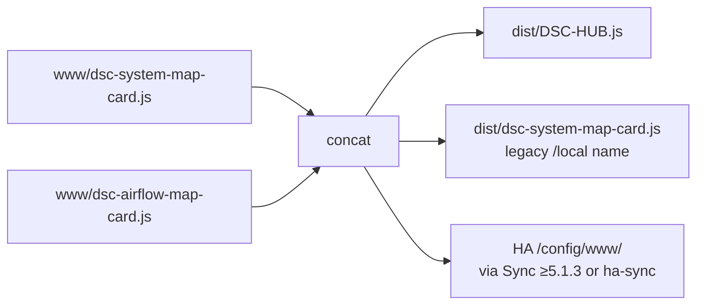

# HACS — DSC-HUB Lovelace cards (Dashboard)

Install the DSC-HUB Lovelace cards from this GitHub repo as a
**HACS custom repository** (category: **Dashboard**).

One resource (`DSC-HUB.js`) registers both:

- `custom:dsc-system-map-card` — neon isometric SYSTEM MAP
- `custom:dsc-airflow-map-card` — hybrid AIRFLOW STATUS map

## Add the custom repository

1. Open **HACS** in Home Assistant  
2. ⋮ (menu) → **Custom repositories**  
3. Repository: `https://github.com/weddas/DSC-HUB`  
4. Type / Category: **Dashboard** (plugin)  
5. **Add**

## Install / update

1. HACS → **Dashboard** (or search “DSC-HUB System Map”)  
2. **DSC-HUB System Map** → **Download** / **Redownload**  
3. Restart Home Assistant when HACS prompts (or reload resources)  
4. Hard-refresh the browser (Ctrl+F5)

HACS registers the resource automatically (typically
`/hacsfiles/DSC-HUB/DSC-HUB.js`). The system-map SVG ships beside it in `dist/`.

## Use in Lovelace

```yaml
type: custom:dsc-system-map-card
title: DSC-HUB
```

```yaml
type: custom:dsc-airflow-map-card
title: AIRFLOW STATUS
```

Optional entity overrides — see [`homeassistant/README.md`](../homeassistant/README.md)
(AIRFLOW STATUS topology, blend rules, publish pitfalls).

## Publish pipeline (source → bundle)

`homeassistant/www/` keeps **two separate source files**. Publishers concatenate
them so one Lovelace resource defines both custom elements:



| Publisher | Output |
|---|---|
| `scripts/sync-hacs-dist.sh` (+ CI `hacs-dist.yml`) | `dist/DSC-HUB.js` **and** `dist/dsc-system-map-card.js` (identical bundles) |
| `scripts/ha-sync.sh` | `/config/www/dsc-system-map-card.js` + `/config/www/DSC-HUB.js` |
| DSC-HUB Sync add-on **≥ 5.1.3** | Same as ha-sync when `sync_www: true` |

**Do not** copy `www/dsc-system-map-card.js` alone to `/local` — that source is
system-map only (~10 KB). The published bundle is ~33 KB and defines both cards.

### After a card / bundle change

1. Edit sources under `homeassistant/www/`
2. Run `./scripts/sync-hacs-dist.sh` (or push and let CI update `dist/`)
3. HACS: **Redownload** **DSC-HUB System Map** (HACS does not auto-pull every push)
4. Or rely on Sync ≥5.1.3 / ha-sync to refresh `/local`, then hard-refresh (Ctrl+F5)

| Symptom | Likely cause |
|---|---|
| Climate Engine blank / custom element missing | Stale HACS cache, or `/local/dsc-system-map-card.js` still system-map-only |
| SYSTEM MAP ok, AIRFLOW STATUS missing | Pre-bundle Sync (<5.1.3) or hand-copy of source — update Sync / redownload HACS |
| Two maps fight / odd double-register | Both `/hacsfiles/DSC-HUB/DSC-HUB.js` **and** `/local/dsc-*-map-card.js` loaded — keep one path |
| Ducts always idle | Packages / CFM helpers not live — see HA README AIRFLOW STATUS |

Dashboard YAML + packages still deploy via Sync add-on / HA sync runner, not
HACS. Card JS without `dsc_v4_climate_physics` CFM sensors will render but
show idle edges.

## Browser Mod (required for popups)

The dashboard's popup layer (graph enlarge, appliance consoles, pot
detail) fires `browser_mod.popup`. Unlike the cards above, **Browser Mod
is a HACS *Integration***, not a Dashboard plugin:

1. HACS → **Integrations** → search **Browser Mod** → **Download**
2. Restart Home Assistant
3. **Settings → Devices & Services → Add Integration → Browser Mod**
4. Hard-refresh the browser (Ctrl+F5)

Without it, popup `tap_action`s silently do nothing — no error is shown.

## Layout (what HACS downloads)

| Path | Role |
|---|---|
| [`hacs.json`](../hacs.json) | HACS manifest (repo root) |
| [`dist/DSC-HUB.js`](../dist/DSC-HUB.js) | Bundled cards (repo-name match) |
| [`dist/dsc-system-map-card.js`](../dist/dsc-system-map-card.js) | Same bundle (legacy `/local` filename) |
| [`dist/dsc-system-map.svg`](../dist/dsc-system-map.svg) | System map artwork |
| [`dist/dsc-airflow-map-card.js`](../dist/dsc-airflow-map-card.js) | Airflow card standalone source (optional second resource) |
| `homeassistant/www/*` | **Source of truth** — run `scripts/sync-hacs-dist.sh` after edits |

CI workflow [`.github/workflows/hacs-dist.yml`](../.github/workflows/hacs-dist.yml)
keeps `dist/` synced on pushes that touch `homeassistant/www/`.

## Packages / dashboard YAML (not HACS)

Helpers, automations, and the full Lovelace dashboard are **not** HACS
plugins — they deploy via [`ha-sync.sh`](ha-sync.sh) / Unraid runner
([`HA-SYNC-BOOTSTRAP.md`](HA-SYNC-BOOTSTRAP.md)) or the Sync add-on
([`ADDON.md`](ADDON.md)).

| Surface | Delivery |
|---|---|
| SYSTEM MAP + AIRFLOW STATUS cards | **HACS** `DSC-HUB.js` **or** Sync/ha-sync bundled `/local` |
| `packages/dsc_v4_*.yaml` + YAML dashboard | Git push → Sync / HA sync |
| ESPHome firmware | Validate/Install (manual) |
