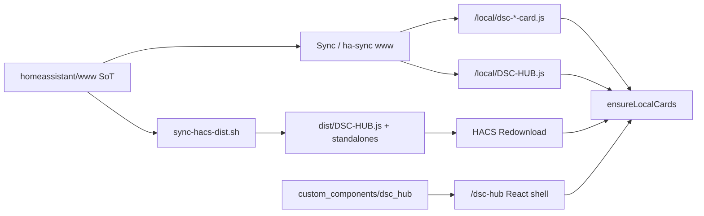

# HACS — DSC-HUB Lovelace cards (Dashboard)

Install the DSC-HUB Lovelace cards from this GitHub repo as a
**HACS custom repository** (category: **Dashboard**).

One resource (`DSC-HUB.js`) registers:

- `custom:dsc-system-map-card` — neon isometric SYSTEM MAP
- `custom:dsc-airflow-map-card` — GUI-first isometric **tent airflow scene**
  (room size, tents, wall ports, fans, carbon filters, exhaust into room or
  through wall). Open **Edit card** for the visual editor; Add card uses DSC defaults.
- `custom:dsc-the-dash-card` — The Dash / Twin 3D ops surface
- `custom:dsc-build-plant-card` — Build a Plant composition (separate dashboard)
- `custom:dsc-app-nav-card` — product-shell nav (Lovelace fallback)
- `custom:dsc-catalog-browse-card` — Catalog Explorer (Lovelace fallback)

Standalone `/local/dsc-*-card.js` + `/local/dsc-catalog/*.json` are also
published for sites that register cards separately. HACS alone registers the
custom elements; **search indexes** still need Sync / ha-sync (or manual copy of
`www/dsc-catalog/`) under `/config/www/dsc-catalog/`.

Ops runbooks:

- Build a Plant: [`docs/qa/LIVE-UI-BUILD-A-PLANT.md`](../docs/qa/LIVE-UI-BUILD-A-PLANT.md)
- Twin / panel dual-path: [`docs/qa/LIVE-UI-CUSTOM-PANEL.md`](../docs/qa/LIVE-UI-CUSTOM-PANEL.md)
- Airflow LIGHT entity honesty: [`docs/qa/AIRFLOW-MAP-LIGHT-ENTITIES.md`](../docs/qa/AIRFLOW-MAP-LIGHT-ENTITIES.md)

## Dual delivery (React panel vs Lit cards)

| Surface | Ships via | Not in HACS `dist/` |
|---|---|---|
| React `/dsc-hub` shell (Live/Grow/Tune/Fleet, honesty rail, Plant Seat drawers) | Sync → `custom_components/dsc_hub` | Correct — panel is Vite-built |
| Lit Twin / maps / Build / nav / catalog cards | Sync www **or** HACS `dist/DSC-HUB.js` | Plant Seat / honesty rail stay panel-only |
| Catalog JSON indexes | Sync / ha-sync → `/local/dsc-catalog/` | HACS path does not serve indexes |

### Card load order (panel `ensureLocalCards.ts`)

The React shell injects scripts **per tag**, preferring **dedicated** `/local`
IIFE files (so a stale umbrella cannot stick a CE prototype):

1. `/local/dsc-<card>-card.js?v=…` (dedicated; Sync / ha-sync copies these)
2. `/local/DSC-HUB.js?v=…` (umbrella fallback)
3. `/hacsfiles/DSC-HUB/DSC-HUB.js?v=…` (HACS fallback)

`dsc-system-map-card` also tries the legacy `/local/dsc-system-map-card.js`
filename (same bytes as the umbrella after `sync-hacs-dist.sh`).

Missing card → empty Twin / Research with “did not register”. Deploy Sync www
**or** HACS Redownload + hard-refresh. Prefer `/local` when HACS and Sync
disagree — dedicated `/local` wins first.



## Add the custom repository

1. Open **HACS** in Home Assistant  
2. ⋮ (menu) → **Custom repositories**  
3. Repository: `https://github.com/weddas/DSC-HUB`  
4. Type / Category: **Dashboard** (plugin)  
5. **Add**

## Install / update

1. HACS → **Dashboard** (or search “DSC-HUB System Map”)  
2. **DSC-HUB System Map** → **Download** / **Redownload**  
3. Restart Home Assistant when HACS prompts (or reload resources)  
4. Hard-refresh the browser (Ctrl+F5)

HACS registers the resource automatically (typically
`/hacsfiles/DSC-HUB/DSC-HUB.js`). The system-map SVG ships beside it in `dist/`.

**After every `chore(hacs): sync dist/ from homeassistant/www` on master:**
Redownload + hard-refresh if you rely on HACS (Sync sites already get www via
the add-on). Locally verify before trusting the commit:

```bash
bash scripts/sync-hacs-dist.sh   # script must be executable (+x)
git diff --stat -- dist/         # must be empty
```

Tip after `e0db778` (airflow tent-light remap): empty diff — dist matches www.

## Use in Lovelace

```yaml
type: custom:dsc-system-map-card
title: DSC-HUB
```

```yaml
type: custom:dsc-airflow-map-card
title: AIRFLOW STATUS
```

```yaml
type: custom:dsc-build-plant-card
title: Build a Plant
```

Edit the card in the Lovelace UI to configure room size, tents (1–4), routes
(wall → wall), fans, carbon filters, and whether exhaust goes **through the
wall (Outside)** or **into the room**. Advanced JSON is available in the editor
for dashboard-as-code workflows.

Default tent **LIGHT** marks (post–checkpoint #78 / `e0db778`):

| Tent | Default `light` entity | Why |
|---|---|---|
| Clone 2×4 | `light.dsc_hub_sf1000_dimmer` | Real SF1000 PWM |
| Main 4×8 | `binary_sensor.dsc_hub_4x8_window_open` | Photoperiod / heat proxy until GPIO5 lamp exists |

Do **not** point Main at SF1000 — that mis-lights the 4×8 mark. Details:
[`docs/qa/AIRFLOW-MAP-LIGHT-ENTITIES.md`](../docs/qa/AIRFLOW-MAP-LIGHT-ENTITIES.md).

Optional entity overrides — see [`homeassistant/README.md`](../homeassistant/README.md).

## Browser Mod (required for popups)

The dashboard's popup layer (graph enlarge, appliance consoles, pot
detail) fires `browser_mod.popup`. Unlike the cards above, **Browser Mod
is a HACS *Integration***, not a Dashboard plugin:

1. HACS → **Integrations** → search **Browser Mod** → **Download**
2. Restart Home Assistant
3. **Settings → Devices & Services → Add Integration → Browser Mod**
4. Hard-refresh the browser (Ctrl+F5)

Without it, popup `tap_action`s silently do nothing — no error is shown.

## Layout (what HACS downloads)

| Path | Role |
|---|---|
| [`hacs.json`](../hacs.json) | HACS manifest (repo root) |
| [`dist/DSC-HUB.js`](../dist/DSC-HUB.js) | Bundled cards (repo-name match; ~**1011 KB** / 1 035 171 B tip) |
| [`dist/dsc-system-map-card.js`](../dist/dsc-system-map-card.js) | Same bundle (legacy `/local` filename) |
| [`dist/dsc-system-map.svg`](../dist/dsc-system-map.svg) | System map artwork |
| [`dist/dsc-*-card.js`](../dist/) | Standalone sources (airflow / the-dash / build-plant / app-nav / catalog-browse) |
| [`dist/dsc-catalog/`](../dist/dsc-catalog/) | Slim search indexes (not auto-served by HACS path) |
| [`dist/vendor/`](../dist/vendor/) | `three.min.js` + `dsc-dash-fx.js` copies |

| `homeassistant/www/*` | **Source of truth** — run `scripts/sync-hacs-dist.sh` after edits |

### Bundle concat order (`scripts/sync-hacs-dist.sh`)

`system-map` → `airflow` → `three.min` → `dsc-dash-fx` → `the-dash` →
`build-plant` → `app-nav` → `catalog-browse`.

Sync add-on **5.1.4+** uses the same eight inputs for `/local` umbrella concat
(F-013 refuses demoting a live ≥500 KB bundle). Standalone card files are copied
alongside for dedicated `/local` loads.

### CI + verify

Workflow [`.github/workflows/hacs-dist.yml`](../.github/workflows/hacs-dist.yml):

- On `master` pushes that touch `homeassistant/www/**` (or the sync script /
  `hacs.json` / the workflow): rebuilds `dist/` and commits
  `chore(hacs): sync dist/ from homeassistant/www` when it drifts.
- On PRs that touch those paths (or `dist/**`): **fails** if `dist/` is stale.

**Pitfall:** a sync commit can land with `dist/` that does **not** match `www`
(historical Twin HUD drift on `60ccefb`). Treat www as SoT; re-run the script
and commit the restore. Prefer Sync `/local` when HACS and `/local` disagree.

Do **not** register both `/hacsfiles/DSC-HUB/DSC-HUB.js` and a second
`/local/dsc-*-map-card.js` Lovelace resource for the same elements
(double-define risk). The panel's script inject is fine; duplicate **resources**
are not.

## Packages / dashboard YAML (not HACS)

Helpers, automations, and the full Lovelace dashboard are **not** HACS
plugins — they deploy via [`ha-sync.sh`](ha-sync.sh) / Unraid runner
([`HA-SYNC-BOOTSTRAP.md`](HA-SYNC-BOOTSTRAP.md)).

| Surface | Delivery |
|---|---|
| SYSTEM MAP + AIRFLOW + The Dash + Build a Plant (+ nav/catalog) cards | **HACS Dashboard** (this doc) **or** Sync www |
| React `/dsc-hub` panel + Plant Seat + Want/Full Auto + honesty rail | Sync / `ha-sync` → `custom_components/dsc_hub` |
| Build a Plant catalog indexes + dashboard YAML | Sync add-on **5.1.4+** / `ha-sync.sh` |
| `packages/dsc_v4_*.yaml` + YAML dashboards + www fallback | Git push → HA sync |
| ESPHome firmware | Validate/Install (manual) |
