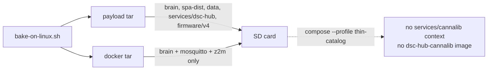

# DSC-HUB 8.1.0 — factory SD image

Build a Raspberry Pi OS Lite **aarch64** `.img.xz` for **Pi 4 and Pi 5** with brain, SPA, Mosquitto, Z2M, USB flash tooling, and Ethernet-first SoftAP policy baked in.

## Output

- `deploy/dsc-hub-8.1.0-arm64.img.xz` (name may vary)
- Kit firmware binaries under `/opt/dsc-hub/firmware/kit/` + `kit-manifest.json`
- Preloaded Docker images: `dsc-hub-brain:8.1.0`, `eclipse-mosquitto:2`, `koenkk/zigbee2mqtt:2`

## Build host

- Linux aarch64 with Docker (kit Pi is fine) — **no WSL/Docker on the Windows agent**
- Windows driver: `.audit/kit-linux-bake.ps1` (plink/pscp → Pi)
- **Caution:** full `docker build` + image pulls on the Pi can saturate CPU/IO and briefly drop the host off the network. Prefer off-peak; if ping dies, wait for recovery (or power-cycle) then resume — do not hammer plink.

## Commands

```bash
# On Linux builder / Pi (as root or docker-capable user):
export DSC_BAKE_OUT=/opt/dsc-hub-bake-out DSC_VERSION=8.1.0
bash services/dsc-hub/image/bake-on-linux.sh
# → deploy/dsc-hub-8.1.0-payload.tar.gz + dsc-hub-8.1.0-docker.tar.gz

# Optional SD inject (needs stock raspios lite .img + root):
sudo bash services/dsc-hub/image/bake-sd-image.sh /path/to/raspios-lite-arm64.img
# → deploy/dsc-hub-8.1.0-arm64.img.xz
```

```powershell
# From Windows (repo):
.\.audit\kit-linux-bake.ps1 -SkipSpaBuild            # payload + docker on Pi
.\.audit\kit-linux-bake.ps1 -SkipSpaBuild -MakeSdImage  # also download lite OS + inject (large)
```

## Stages (this tree)

| Path | Role |
|------|------|
| `stage-dsc/00-packages` | hostapd, dnsmasq, avahi, docker, esptool, python3-serial |
| `stage-dsc/01-dsc-hub` | copy `/opt/dsc-hub`, systemd units, net-policy |
| `stage-dsc/02-docker-preload` | `docker load` kit images |
| `bake-firmware.sh` | compile kit bins from `firmware/v4/*-kit.yaml` into `firmware/kit/` |

## First boot

1. `dsc-hub-net-policy` — SoftAP only if eth0 carrier down
2. `dsc-hub-compose` — brain `:8787`, mosquitto, z2m
3. Operator opens SPA (`dsc-brain.local:8787` or SoftAP `10.42.0.1:8787`) → `#/setup`

## Explicit non-goals on the card

- Fat CannaLib corpus (kit default = remote URL + slim Want YAML / on-Pi sqlite when present)
- Working `docker compose --profile thin-catalog` out of the box (see trap below)
- Compile-from-source as required first flash path
- WT32-ETH01 **bridge** firmware (retired; see trap below)

## Next

Wire docker preload + packages into a fuller pi-gen later if needed. Current path: **payload/docker bake on Pi** then **bake-sd-image.sh** inject into official Lite arm64.

**Bake history:** the 2026-09-06 8.0.0 bake completed (artifacts archived on the Pi at
`/opt/dsc-hub-bake-archive/2026-09-06/`). **2026-09-07:** rebaked as 8.1.0.

**Trap — kit secrets:** `bake-on-linux.sh` *generates* a fresh `firmware/v4/secrets.yaml`
when one is absent, and that file is gitignored so it is never in the repo or the upload
tar. A naive bake therefore mints a new key set and the baked firmware stops matching the
live fleet's OTA keys. Always copy the live set from `/opt/dsc-hub-repo/firmware/v4/secrets.yaml`
into `/opt/dsc-hub-bake-src/firmware/v4/secrets.yaml` before baking, and check the md5s match.

**Trap — hollow kit `.bin` files:** `bake-firmware.sh` writes **0-byte placeholders** when
the ESPHome CLI is missing, secrets are missing, or (historically) when
`dsc_fleet_setup` failed to compile on the pinned ESPHome. The live hub
(`dsc-hub-v4_0.yaml`) does **not** pull that SoftAP component, so fleet OTA can stay
green while the card cannot USB-flash a kit. Tip `0b06f58` restored SoftAP compile on
2026.6.5 and made `bake-on-linux.sh` abort under `DSC_RELEASE=1` if any staged
`firmware/kit/*.bin` is empty. For a shippable card:

```bash
export DSC_RELEASE=1 DSC_VERSION=8.1.0
bash services/dsc-hub/image/bake-on-linux.sh
# after bake:
find services/dsc-hub/firmware/kit -name '*.bin' -printf '%s %p\n' | awk '$1==0{bad=1;print} END{exit bad}'
```

`.audit/kit-linux-bake.ps1` does **not** set `DSC_RELEASE=1` today — set it on the
remote bake command, or verify sizes before flashing SD. Toolchain detail:
[`docs/ops/ESPHOME-TOOLCHAIN.md`](../../../docs/ops/ESPHOME-TOOLCHAIN.md) § Kit SoftAP.

**Trap — retired `bridge` role still in the USB-flash menu:**
`services/dsc-hub/firmware/kit-manifest.json` and `brain/dsc_brain/usb_flash.py`
`KIT_ROLES` still list **`bridge`** (WT32-ETH01). `bake-firmware.sh` deliberately
**excludes** bridge from both the `KIT` map and `ORDER` (source lives under
`firmware/_history`). A successful bake therefore produces eight real
`firmware/kit/*.bin` files and **no** `bridge.bin`. The SPA setup wizard still
offers the role; flash fails with `Missing firmware binary for bridge`. Product
fix (not a bake bug): drop the role from the manifest / wizard, or hide roles
whose binary is absent. Do not expect bridge SoftAP on an 8.1.0 card.

**Trap — `thin-catalog` profile cannot start on a fresh card:**



`docker-compose.yml` keeps `cannalib` behind `profiles: ["thin-catalog"]` with
`build.context: ../cannalib` and `image: dsc-hub-cannalib:8.1.0`. Neither lands
on the card today:

1. `.audit/kit-linux-bake.ps1` packs `brain frontend/spa-dist data services/dsc-hub firmware/v4` — **not** `services/cannalib`.
2. `bake-on-linux.sh` builds/saves only `dsc-hub-brain`, `eclipse-mosquitto:2`, and `koenkk/zigbee2mqtt:2`.

Default boot (brain + mosquitto + z2m) is fine; catalog stays remote URL / Want
YAML / optional sqlite mount. Enabling thin-catalog on a baked card needs a
product bake change (pack `services/cannalib` + `docker save dsc-hub-cannalib`).
Detail: [`docs/ops/CANNALIB-API.md`](../../../docs/ops/CANNALIB-API.md).
