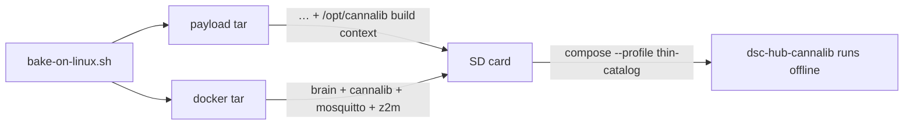

# DSC-HUB 8.1.0 — factory SD image

Build a Raspberry Pi OS Lite **aarch64** `.img.xz` for **Pi 4 and Pi 5** with brain, SPA, Mosquitto, Z2M, USB flash tooling, and Ethernet-first SoftAP policy baked in.

## Output

- `deploy/dsc-hub-8.1.0-arm64.img.xz` (name may vary)
- Kit firmware binaries under `/opt/dsc-hub/firmware/kit/` + `kit-manifest.json`
- Preloaded Docker images: `dsc-hub-brain:8.1.0`, `dsc-hub-cannalib:8.1.0` (thin-catalog), `eclipse-mosquitto:2`, `koenkk/zigbee2mqtt:2`
- Tracked provenance (gitignored large artifacts; manifests whitelisted):
  - `deploy/dsc-hub-8.1.0-bake-manifest.json`
  - `deploy/dsc-hub-8.1.0-sd-manifest.json`

## Build host

- Linux aarch64 with Docker (kit Pi is fine) — **no WSL/Docker on the Windows agent**
- Windows driver: `.audit/kit-linux-bake.ps1` (plink/pscp → Pi)
- **Caution:** full `docker build` + image pulls on the Pi can saturate CPU/IO and briefly drop the host off the network. Prefer off-peak; if ping dies, wait for recovery (or power-cycle) then resume — do not hammer plink.

## Commands

```bash
# On Linux builder / Pi (as root or docker-capable user):
export DSC_BAKE_OUT=/opt/dsc-hub-bake-out DSC_VERSION=8.1.0
bash services/dsc-hub/image/bake-on-linux.sh
# → deploy/dsc-hub-8.1.0-payload.tar.gz + dsc-hub-8.1.0-docker.tar.gz

# Optional SD inject (needs stock raspios lite .img + root):
sudo bash services/dsc-hub/image/bake-sd-image.sh /path/to/raspios-lite-arm64.img
# → deploy/dsc-hub-8.1.0-arm64.img.xz
```

```powershell
# From Windows (repo):
.\.audit\kit-linux-bake.ps1 -SkipSpaBuild            # payload + docker on Pi
.\.audit\kit-linux-bake.ps1 -SkipSpaBuild -MakeSdImage  # also download lite OS + inject (large)
```

## Stages (this tree)

| Path | Role |
|------|------|
| `stage-dsc/00-packages` | hostapd, dnsmasq, avahi, docker, esptool, python3-serial |
| `stage-dsc/01-dsc-hub` | copy `/opt/dsc-hub`, systemd units, net-policy |
| `stage-dsc/02-docker-preload` | `docker load` kit images |
| `bake-firmware.sh` | compile kit bins from `firmware/v4/*-kit.yaml` into `firmware/kit/` using declared `DEVDIR` build dirs |

### `bake-firmware.sh` — declared `DEVDIR`

ESPHome 2026.8 stopped printing `"Build path:"`, and a fully cached SUCCESS can
rewrite nothing — so tip `d25db41` picks images from a **declared** map:

| Role | YAML (kit) | `.esphome/build/<DEVDIR>` |
|---|---|---|
| hub | `dsc-hub-kit.yaml` | `dsc-hub` |
| control | `dsc-control-kit.yaml` | `dsc-control` |
| pot1 / pot2 | `dsc-pot{N}-kit.yaml` | `dsc_probe1` / `dsc_probe2` (underscores) |
| heater / heatmat / humidifier / dehumidifier | matching kit YAML | matching device name |

ESP32 → `firmware.factory.bin` (flash at 0x0); ESP8266 → `firmware.bin`.
`DSC_RELEASE=1` still refuses empty placeholders.

## First boot

1. `dsc-hub-net-policy` — SoftAP only if eth0 carrier down
2. `dsc-hub-compose` — brain `:8787`, mosquitto, z2m
3. Operator opens SPA (`dsc-brain.local:8787` or SoftAP `10.42.0.1:8787`) → `#/setup`

## Explicit non-goals on the card

- Fat CannaLib corpus (kit default = remote URL + slim Want YAML / on-Pi sqlite when present)
- Starting `thin-catalog` by default (opt-in profile; image + context **are** baked — see below)
- Compile-from-source as required first flash path
- WT32-ETH01 **bridge** firmware (retired; see trap below)

## Next

Wire docker preload + packages into a fuller pi-gen later if needed. Current path: **payload/docker bake on Pi** then **bake-sd-image.sh** inject into official Lite arm64.

## Provenance manifests (8.0.0 vs 8.1.0 honesty)

Large bake/SD artifacts stay gitignored; `.gitignore` whitelists `deploy/*-manifest.json`.
Compare tip `cce5c74` manifests:

| Cut | `payload_bytes` | Meaning |
|---|---|---|
| 8.0.0 | **38 069** | Hollow card — kit `.bin` placeholders / tiny payload |
| 8.1.0 | **4 798 652** | Real `DSC_RELEASE=1` bake on **dsc-brain** (`aarch64`), eight non-empty kit bins + staged payload |

Also committed: `deploy/dsc-hub-8.1.0-sd-manifest.json` (`built_at` 2026-09-08). Commit message on
`cce5c74` records the bake host and that 8.0.0 was **not** a real release firmware bake.

**Bake history:** 2026-09-06 8.0.0 hollow bake (archive on Pi); tip `4d73cfc` SoftAP compile restore;
tip `4ef6696` / `cce5c74` — kit firmware builds + card ships real bins + cannalib + provenance.
Tip `2d7bfca` — GitHub [`v8.1.0`](https://github.com/weddas/DSC-HUB/releases/tag/v8.1.0) published;
README / download links point at `dsc-hub-8.1.0-arm64.img.xz` (do **not** flash AlphaPi).

**Trap — kit secrets:** `bake-on-linux.sh` *generates* a fresh `firmware/v4/secrets.yaml`
when one is absent, and that file is gitignored so it is never in the repo or the upload
tar. A naive bake therefore mints a new key set and the baked firmware stops matching the
live fleet's OTA keys. Always copy the live set from `/opt/dsc-hub-repo/firmware/v4/secrets.yaml`
into `/opt/dsc-hub-bake-src/firmware/v4/secrets.yaml` before baking, and check the md5s match.

**Trap — hollow kit `.bin` files (fixed for 8.1.0 release bake):** `bake-firmware.sh` still
writes **0-byte placeholders** when the ESPHome CLI or secrets are missing — but only when
`DSC_RELEASE` is unset. Tip `0b06f58` restored SoftAP compile; tip `3676b87` pulls
`esp_http_client` into esp-idf SoftAP builds (panel/probes); tip `d25db41`
takes the image from the declared **`DEVDIR`** under `.esphome/build/` (cached
SUCCESS and missing `"Build path:"` no longer fail the bake). Tip `03743b8`
was the earlier Build-path scrape — superseded by declared dirs on tip `6f1b1fa`.
`bake-on-linux.sh` aborts under `DSC_RELEASE=1` if any staged `firmware/kit/*.bin` is empty.
The 8.1.0 card was proven with a real release bake (see manifests above). For a shippable card:

```bash
export DSC_RELEASE=1 DSC_VERSION=8.1.0
bash services/dsc-hub/image/bake-on-linux.sh
# after bake:
find services/dsc-hub/firmware/kit -name '*.bin' -printf '%s %p\n' | awk '$1==0{bad=1;print} END{exit bad}'
```

`.audit/kit-linux-bake.ps1` still does **not** export `DSC_RELEASE=1` — set it on the
remote bake command (as the 8.1.0 Pi bake did), or verify sizes / `payload_bytes` before
flashing SD. Toolchain detail:
[`docs/ops/ESPHOME-TOOLCHAIN.md`](../../../docs/ops/ESPHOME-TOOLCHAIN.md) § Kit SoftAP.

**Trap — retired `bridge` role still in the USB-flash menu:**
`services/dsc-hub/firmware/kit-manifest.json` and `brain/dsc_brain/usb_flash.py`
`KIT_ROLES` still list **`bridge`** (WT32-ETH01). `bake-firmware.sh` deliberately
**excludes** bridge from both the `KIT` map and `ORDER` (source lives under
`firmware/_history`). A successful bake therefore produces eight real
`firmware/kit/*.bin` files and **no** `bridge.bin`. The SPA setup wizard still
offers the role; flash fails with `Missing firmware binary for bridge`. Product
fix (not a bake bug): drop the role from the manifest / wizard, or hide roles
whose binary is absent. Do not expect bridge SoftAP on an 8.1.0 card.

**Thin-catalog CannaLib on the card (shipped tip `50ee584` / merge `4ef6696`):**



1. `.audit/kit-linux-bake.ps1` packs `services/cannalib` into the upload tar.
2. `bake-on-linux.sh` stages `/opt/cannalib` (compose `../cannalib`) and
   `docker save`s `dsc-hub-cannalib:<version>` with the brain image (`set -u`-safe
   empty-array expansion when the Dockerfile is absent).

Default boot remains brain + mosquitto + z2m; thin-catalog stays **opt-in**. Detail:
[`docs/ops/CANNALIB-API.md`](../../../docs/ops/CANNALIB-API.md).
